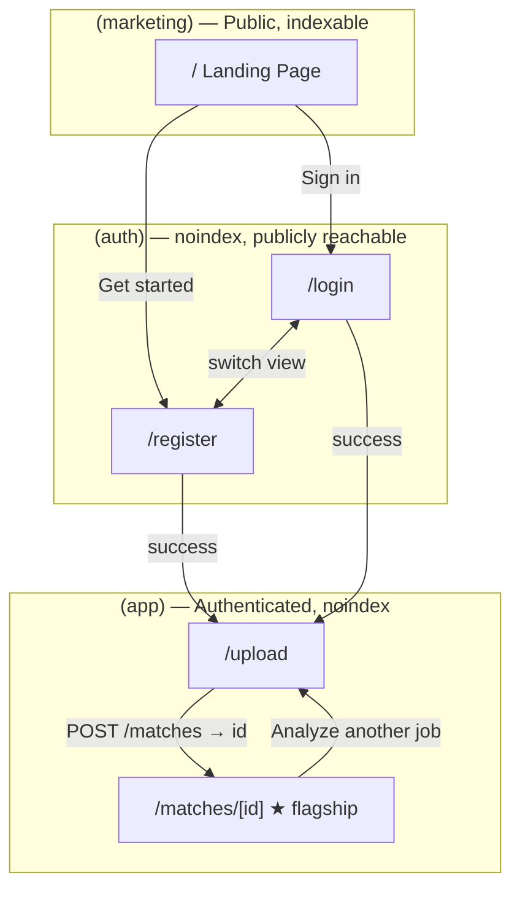
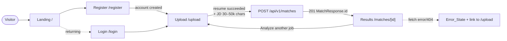
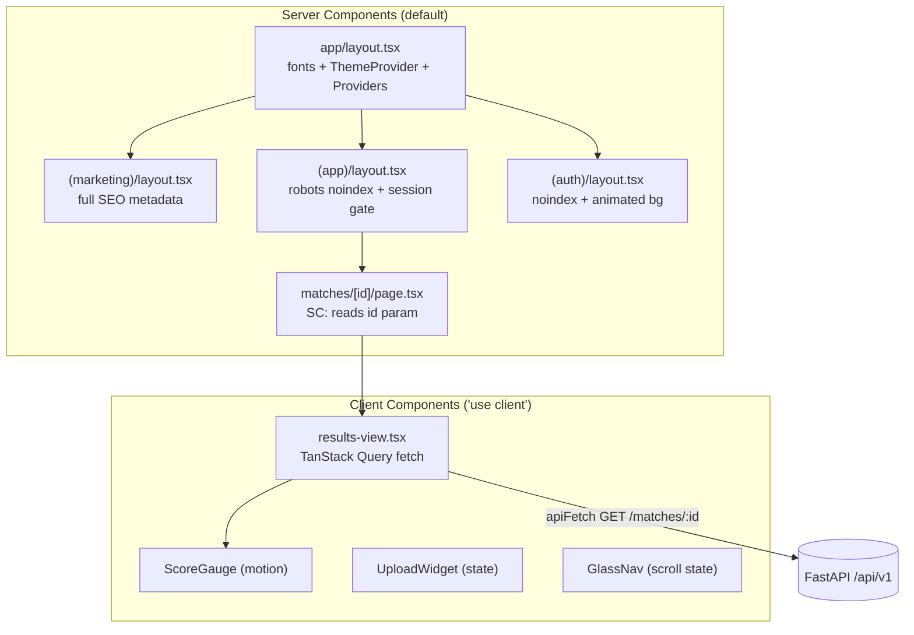
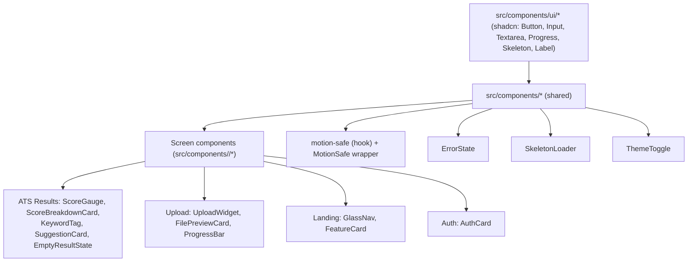
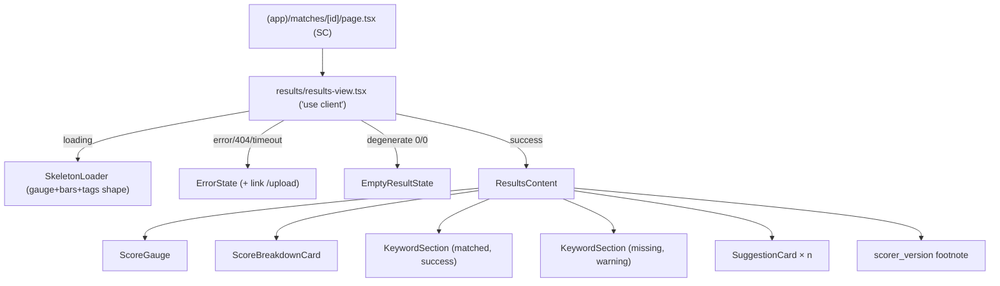

# Design Document — Frontend Redesign

## Status

This document is the **mandatory design-review-gate artifact** required by **Requirement 22**. It must be completed and explicitly approved before any implementation work begins (Req 22.6). It contains the information-architecture, UX-design, and visual-design artifacts that Req 22.1–22.4 enumerate. No implementation code is written as part of this phase.

A deliberate note on artifact form: the spec workflow produces **document artifacts**, not binary images. Every "high-fidelity mockup" in this document is a **text-based hi-fi layout specification** — explicit section composition, hierarchy, spacing, token usage, and motion — precise enough to implement against and to verify with the screenshot validation plan (Section 9). **Pixel-accurate browser screenshots are captured during implementation** as acceptance gates (Req 14, Req 22.7), not pre-rendered here.

---

## Overview

This redesign transforms the four Phase 1 MVP screens of MatchLayer from a developer-project aesthetic into a premium, venture-funded AI SaaS surface comparable to Linear, Mercury, Arc, Vercel, and Ashby. The guiding principle is **depth over breadth**: four screens, executed to portfolio quality, beats a sprawl of mediocre ones.

### Scope (exactly four screens — Req 22.5, MVP scope constraint)

| Screen          | Route           | Route group   | Classification                                           |
| --------------- | --------------- | ------------- | -------------------------------------------------------- |
| Landing Page    | `/`             | `(marketing)` | Public — indexable                                       |
| Auth (Login)    | `/login`        | `(auth)`      | Authenticated for indexing (noindex), publicly reachable |
| Auth (Register) | `/register`     | `(auth)`      | Authenticated for indexing (noindex), publicly reachable |
| Upload          | `/upload`       | `(app)`       | Authenticated — noindex                                  |
| ATS Results     | `/matches/[id]` | `(app)`       | Authenticated — noindex                                  |

**Explicitly out of scope** (no wireframes, mockups, components, or nav links): dashboard, match history, analytics, settings, pricing, notifications, admin. The repository currently contains `(app)/dashboard/` and `(app)/library/` route folders and `(auth)/forgot-password/`, `(auth)/reset-password/` from prior phases; this redesign **does not** design, link to, or expand those. Any nav or CTA that would imply non-existent functionality is prohibited (Req 5, Req 13.2).

### Flagship-first ordering (Req 14.8)

The **ATS Results page is the flagship** and is the single highest visual-design priority. Per the user's instruction and Req 14.8, this document designs ATS Results **first and in the greatest depth**, before Landing, Auth, and Upload. The per-screen design sections (Section 8) are ordered: **ATS Results → Landing → Auth → Upload**.

### Backend contract is fixed (Req 20)

Every screen is bound to the **existing** FastAPI response contract in `apps/api/src/matchlayer_api/api/matches/schemas.py` and `.../resumes/schemas.py`, surfaced to the frontend via generated `packages/shared-types`. The redesign introduces **no new fields**. In particular it never renders or assumes: suggestion `title`, suggestion `priority`, a third "experience relevance" / "semantic" score dimension, or `job_description_text`. The authoritative contract is reproduced in Section 5 (Fixture Data) and Section 6.4 (data model).

### Design pillars

1. **Dark mode first** — `next-themes` with `defaultTheme: "dark"`, `enableSystem: false` (Req 2.7, Req 21.5).
2. **Information hierarchy over decoration** — at most three levels of visual hierarchy per screen.
3. **Whitespace as a feature** — generous section/card padding on a 4px grid.
4. **Purposeful motion only** — Framer Motion, 200/400/600ms ceilings, `[0.16, 1, 0.3, 1]` easing, full `prefers-reduced-motion` respect.
5. **Token-only styling** — no hardcoded colors, no inline styles, no arbitrary Tailwind bracket values (Req 1.7, Req 21.2).
6. **WCAG AA minimum** — verified in both themes (Req 19).

### Research notes informing the design

- **Existing foundation is reused, not replaced.** `apps/web/src/app/globals.css` already declares the full token palette as space-separated `R G B` triplets on `:root`/`.dark` with a Tailwind v4 `@theme inline` re-export. The motion-safe hook (`src/components/motion-safe.tsx`), `ThemeToggle`, `AuthCard`, the TanStack Query `Providers`, the `apiFetch` wrapper, and the security-headers `proxy.ts` all exist and are consumed as-is. This design **finalizes** the token values and **adds** the `(marketing)` group, the ATS/upload components, and the blocking-theme/`enableSystem:false` correction.
- **Two deltas from current code are required and called out explicitly:**
  - `theme-provider.tsx` currently uses `defaultTheme="system"` + `enableSystem`. Req 2.7 / 21.5 require `defaultTheme="dark"` + `enableSystem={false}`. This is a tracked change (Section 6.6).
  - `globals.css` has no motion-duration or reduced-motion token (Req 1.5, 1.9) and no radius/shadow/spacing custom properties beyond color/font. This design adds them (Section 4).
- **Playwright is the designated E2E/visual tool** (`tech.md`: "Playwright for E2E from Phase 1 deploy"). It currently appears in `pnpm-lock.yaml` only as an optional peer of `next`, **not** as an installed dev dependency. The screenshot validation plan (Section 9) therefore specifies adding `@playwright/test` as a `devDependency` of `apps/web` as its first step.

---

## Architecture

### Route map (Req 22.2)



### Primary user flow (Landing → Auth → Upload → Results)



### Rendering & data architecture



- **Server Components by default** (Req 21.7, conventions.md). `'use client'` is used only where state, effects, browser APIs, or Framer Motion are required: the score gauge, breakdown/keyword/suggestion animated cards, upload widget, glass nav scroll state, theme toggle, and the results data-view wrapper.
- **App Router groups** follow `structure.md`: `(marketing)` for the public indexable Landing page, `(auth)` for login/register, `(app)` for upload/results. The `(app)` layout already exports `robots: { index: false, follow: false }` and runs the session gate — reused unchanged.
- **Security-headers proxy preserved** (Req 21.10). `src/proxy.ts` is untouched by the redesign; CSP, HSTS, `X-Frame-Options`, etc. continue to apply to every HTML response. No inline `<script>`/`<style>` is introduced that would require relaxing CSP beyond its current Phase 1 posture.
- **`X-Robots-Tag` for authenticated routes** continues to be set by the proxy/route classification; the redesign adds no sitemap/canonical/OG metadata to any `(app)` or `(auth)` route (Req 8.7–8.10, 9.13, 13.3; seo.md).

### Component hierarchy overview



---

## Components and Interfaces

This section describes the component architecture and module boundaries. The exhaustive, prop-level **Component Inventory** with backend-field citations is **Section 7**. Folder structure and route wiring are **Section 6**.

### Layering

1. **`src/components/ui/` — shadcn primitives.** Copied in, not depended on (Req 21.3, 16.8): `Button` (exists), `Input`, `Textarea`, `Label`, `Progress`, `Skeleton`. Styled exclusively via tokens; accept `className`.
2. **`src/components/` — shared, cross-screen components.** `ErrorState`, `SkeletonLoader`, `ThemeToggle` (exists), `MotionSafe` wrapper + `useMotionSafeProps` hook (exists), `providers`/`theme-provider` (exist).
3. **`src/components/<screen>/` — screen-specific components.** Grouped by screen: `results/`, `upload/`, `landing/`, `auth/` (the last exists).

### Key interface boundaries

- **Types flow one direction:** `packages/shared-types` (generated from OpenAPI) → component props. Components never declare their own copies of `MatchResponse`, `ScoreBreakdown`, `Keyword`, `Suggestion`, or `ResumeResponse` (Req 20.1, 21.11). Presentational sub-props (e.g., a `KeywordTag` taking a single `Keyword` + a `variant`) are derived from those types.
- **Data fetching is isolated** to a single client view component per authenticated screen (`results-view.tsx`, the upload page's widget), using TanStack Query over `apiFetch`. Pages stay Server Components that pass route params down.
- **Motion is centralized** through `useMotionSafeProps` / a `MotionSafe` wrapper so every animated component respects `prefers-reduced-motion` uniformly (Req 15.6).

---

## Section 4 — Design Tokens (final values)

All tokens are declared in `apps/web/src/app/globals.css` as CSS custom properties and consumed through Tailwind v4's `@theme inline` block. **No component may use a hardcoded hex value, inline style, or arbitrary bracket utility** (Req 1.7, 21.2). Colors are stored as space-separated `R G B` triplets so Tailwind's `<alpha-value>` template produces `rgb(var(--color-x) / <alpha-value>)` and opacity utilities (`bg-bg-glass/55`) work uniformly — this matches the existing `globals.css` and is retained.

### 4.1 Color palette — Dark mode (default)

| Token           | RGB triplet   | Hex                                     | Use                        |
| --------------- | ------------- | --------------------------------------- | -------------------------- |
| `bg`            | `10 10 11`    | `#0A0A0B`                               | Page background            |
| `bg-elevated`   | `17 17 20`    | `#111114`                               | Cards, panels, gauge well  |
| `bg-glass`      | `20 20 24`    | `#141418` (composited at 55% via `/55`) | Frosted nav/dialogs        |
| `border`        | `31 31 35`    | `#1F1F23`                               | Subtle dividers            |
| `border-strong` | `42 42 48`    | `#2A2A30`                               | Card/input borders         |
| `text`          | `244 244 245` | `#F4F4F5`                               | Primary text               |
| `text-muted`    | `161 161 170` | `#A1A1AA`                               | Secondary text             |
| `text-subtle`   | `113 113 122` | `#71717A`                               | Tertiary text, hints       |
| `brand`         | `139 92 246`  | `#8B5CF6`                               | Primary brand (violet)     |
| `brand-2`       | `34 211 238`  | `#22D3EE`                               | Secondary accent (cyan)    |
| `success`       | `52 211 153`  | `#34D399`                               | Matched keywords, positive |
| `warning`       | `251 191 36`  | `#FBBF24`                               | Missing keywords, caution  |
| `danger`        | `248 113 113` | `#F87171`                               | Errors, destructive        |

### 4.2 Color palette — Light mode

| Token           | RGB triplet   | Hex                                     | Use                        |
| --------------- | ------------- | --------------------------------------- | -------------------------- |
| `bg`            | `255 255 255` | `#FFFFFF`                               | Page background            |
| `bg-elevated`   | `248 249 251` | `#F8F9FB`                               | Cards, panels, gauge well  |
| `bg-glass`      | `255 255 255` | `#FFFFFF` (composited at 65% via `/65`) | Frosted nav/dialogs        |
| `border`        | `229 231 235` | `#E5E7EB`                               | Subtle dividers            |
| `border-strong` | `209 213 219` | `#D1D5DB`                               | Card/input borders         |
| `text`          | `10 10 11`    | `#0A0A0B`                               | Primary text               |
| `text-muted`    | `82 82 91`    | `#52525B`                               | Secondary text             |
| `text-subtle`   | `113 113 122` | `#71717A`                               | Tertiary text, hints       |
| `brand`         | `124 58 237`  | `#7C3AED`                               | Primary brand (violet)     |
| `brand-2`       | `6 182 212`   | `#06B6D4`                               | Secondary accent (cyan)    |
| `success`       | `16 185 129`  | `#10B981`                               | Matched keywords, positive |
| `warning`       | `245 158 11`  | `#F59E0B`                               | Missing keywords, caution  |
| `danger`        | `239 68 68`   | `#EF4444`                               | Errors, destructive        |

These finalize the steering `design.md` starting palette and exactly match the values already in `globals.css`. They are now **frozen** for this spec (Req 1.1, 2.5).

### 4.3 Signature gradient (Req 1.6, 10.3)

```
--gradient-signature: linear-gradient(135deg, rgb(var(--color-brand)) 0%, rgb(var(--color-brand-2)) 100%);
```

Used sparingly as punctuation only: the ATS score number (text gradient via `background-clip: text`), the score gauge stroke, primary CTA hover, and the brand mark. Never as section-background paint (design.md anti-pattern).

### 4.4 Typography (Req 1.2, 1.3)

- **Sans:** Geist Sans via `next/font/google` → `--font-geist-sans` → Tailwind `font-sans`. (Wired in `layout.tsx`, retained.)
- **Mono:** Geist Mono → `--font-geist-mono` → `font-mono`. Used for scores, identifiers, `scorer_version`.
- **Numeric:** `font-variant-numeric: tabular-nums` on all scores, percentages, character counts, file sizes, and weights.

| Role                     | Tailwind                      | Size / line-height         | Weight                | Tracking         |
| ------------------------ | ----------------------------- | -------------------------- | --------------------- | ---------------- |
| H1 (hero, score context) | `text-6xl` (cap) / `text-5xl` | 60px / 1.0; 48px / 1.05    | `font-semibold` (600) | `tracking-tight` |
| H2 (section headings)    | `text-4xl` / `text-3xl`       | 36–40px / 1.1; 32px / 1.15 | 600                   | `tracking-tight` |
| H3 (card titles)         | `text-2xl`                    | 24px / 1.25                | 600                   | default          |
| Body                     | `text-base`                   | 16px / 1.5                 | 400                   | default          |
| Small / hint             | `text-sm`                     | 14px / 1.45                | 400                   | default          |
| Score number             | `text-6xl` `font-mono`        | 60px / 1.0                 | 600                   | `tracking-tight` |

Font weight is **capped at 600** everywhere (design.md). Display text (H1/H2) uses `tracking-tight`; body stays default (Req 1.3).

### 4.5 Spacing system (Req 1.4, 18)

4px base grid (Tailwind default scale). No off-scale custom sizes (design.md anti-pattern).

| Token / usage                         | Value                                                              |
| ------------------------------------- | ------------------------------------------------------------------ |
| Section padding (desktop)             | `py-24` (96px)                                                     |
| Section padding (mobile, <768px)      | `py-16` (64px)                                                     |
| Card padding                          | `p-6` (24px) default; `p-8` (32px) for hero/auth/score cards       |
| Grid/stack gap                        | `gap-4` (16px) tight, `gap-6` (24px) default, `gap-8` (32px) loose |
| Keyword pill gap                      | `gap-2` (8px)                                                      |
| Max width — app/results/landing shell | `max-w-7xl` (1280px)                                               |
| Max width — prose                     | `max-w-3xl` (768px)                                                |
| Max width — auth card                 | `max-w-md` (448px)                                                 |
| Min touch target                      | 44×44px (Req 4.5, 18.2, 19.2)                                      |

### 4.6 Radius tokens (Req 1.4)

| Token           | Tailwind       | Value  | Use                                           |
| --------------- | -------------- | ------ | --------------------------------------------- |
| `--radius-card` | `rounded-xl`   | 12px   | Cards, buttons, inputs, dialogs               |
| `--radius-hero` | `rounded-2xl`  | 16px   | Hero surfaces, feature/score cards, auth card |
| `--radius-pill` | `rounded-full` | 9999px | Keyword tags, badges                          |

### 4.7 Shadow tokens (Req 1.4) — layered, multi-stop only

| Token               | Value                                                      | Use                                                   |
| ------------------- | ---------------------------------------------------------- | ----------------------------------------------------- |
| `--shadow-resting`  | `0 1px 2px rgba(0,0,0,0.04), 0 8px 24px rgba(0,0,0,0.08)`  | Resting cards                                         |
| `--shadow-elevated` | `0 2px 4px rgba(0,0,0,0.06), 0 16px 48px rgba(0,0,0,0.16)` | Hover/elevated cards, dialogs, glass nav after scroll |

No single-layer uniform-spread shadows; Tailwind's default `shadow-md` is banned (design.md). The resting value matches the stack already used in `auth-card.tsx`.

### 4.8 Motion tokens (Req 1.5, 1.9, 15)

| Token             | Value                           | Use                                                       |
| ----------------- | ------------------------------- | --------------------------------------------------------- |
| `--motion-micro`  | `200ms`                         | Hover, button press, toggle, nav background swap          |
| `--motion-layout` | `400ms`                         | Layout transitions, card stagger sequences (total ≤400ms) |
| `--motion-hero`   | `600ms`                         | Score reveal, hero entrance                               |
| `--motion-ease`   | `cubic-bezier(0.16, 1, 0.3, 1)` | Default easing for all of the above                       |
| `--motion-reduce` | `0ms`                           | Override applied under `prefers-reduced-motion`           |

Framer Motion is the **sole** animation library (Req 15.1, 21.4). For the reduced-motion override, a `@media (prefers-reduced-motion: reduce)` block in `globals.css` re-points `--motion-micro/layout/hero` to `0ms`, and the `useMotionSafeProps` hook neutralizes Framer transitions (Req 1.9, 15.4, 15.6). Loading/progress indicators and focus-ring transitions are exempt from suppression (Req 15.4, 19.6).

### 4.9 How tokens are declared in `globals.css`

The color and font tokens already exist exactly as below; this spec **adds** the radius, shadow, motion, and reduced-motion blocks. Illustrative structure:

```css
@import "tailwindcss";
@custom-variant dark (&:where(.dark, .dark *));

:root {
  /* Surfaces */
  --color-bg: 255 255 255;
  --color-bg-elevated: 248 249 251;
  --color-bg-glass: 255 255 255;
  /* Borders */
  --color-border: 229 231 235;
  --color-border-strong: 209 213 219;
  /* Text */
  --color-text: 10 10 11;
  --color-text-muted: 82 82 91;
  --color-text-subtle: 113 113 122;
  /* Brand + accents */
  --color-brand: 124 58 237;
  --color-brand-2: 6 182 212;
  /* Status */
  --color-success: 16 185 129;
  --color-warning: 245 158 11;
  --color-danger: 239 68 68;

  /* Radius */
  --radius-card: 0.75rem; /* 12px */
  --radius-hero: 1rem; /* 16px */
  --radius-pill: 9999px;

  /* Shadows (layered, multi-stop) */
  --shadow-resting:
    0 1px 2px rgba(0, 0, 0, 0.04), 0 8px 24px rgba(0, 0, 0, 0.08);
  --shadow-elevated:
    0 2px 4px rgba(0, 0, 0, 0.06), 0 16px 48px rgba(0, 0, 0, 0.16);

  /* Motion */
  --motion-micro: 200ms;
  --motion-layout: 400ms;
  --motion-hero: 600ms;
  --motion-ease: cubic-bezier(0.16, 1, 0.3, 1);
}

.dark {
  /* Surfaces */
  --color-bg: 10 10 11;
  --color-bg-elevated: 17 17 20;
  --color-bg-glass: 20 20 24;
  /* Borders */
  --color-border: 31 31 35;
  --color-border-strong: 42 42 48;
  /* Text */
  --color-text: 244 244 245;
  --color-text-muted: 161 161 170;
  --color-text-subtle: 113 113 122;
  /* Brand + accents */
  --color-brand: 139 92 246;
  --color-brand-2: 34 211 238;
  /* Status */
  --color-success: 52 211 153;
  --color-warning: 251 191 36;
  --color-danger: 248 113 113;
  /* Radius/shadow/motion inherit from :root (theme-invariant) */
}

@media (prefers-reduced-motion: reduce) {
  :root {
    --motion-micro: 0ms;
    --motion-layout: 0ms;
    --motion-hero: 0ms;
  }
}

@theme inline {
  /* Colors re-exported as rgb(var(--color-x) / <alpha-value>) — see existing file */
  --color-bg: rgb(var(--color-bg) / <alpha-value>);
  /* …all colors… */
  --radius-card: var(--radius-card);
  --radius-hero: var(--radius-hero);
  --radius-pill: var(--radius-pill);
  --shadow-resting: var(--shadow-resting);
  --shadow-elevated: var(--shadow-elevated);
  --font-sans: var(--font-geist-sans);
  --font-mono: var(--font-geist-mono);
}
```

Theme switching is achieved purely by the `.dark` class toggling the `:root` color triplets (Req 1.8, 2.5) — **no component-level conditional theme logic**. Radius/shadow/motion are theme-invariant and live only on `:root`.

---

## Section 5 — Realistic Fixture Data (Req 20.2, 14.7, 22.7)

These fixtures are the canonical sample data for every mockup, component story, and screenshot-validation run. They conform **exactly** to the backend contract: correct field names, types, and value ranges, and **no invented fields** (no suggestion `title`/`priority`, no third score dimension, no `job_description_text`). They live at `apps/web/src/components/results/__fixtures__/` (or a shared test-fixtures module) and are imported by tests and visual checks. Timestamps are ISO 8601 UTC with `Z`; ids are UUIDv7 strings.

### 5.1 `ResumeResponse` fixtures

```json
{
  "resumeSucceeded": {
    "id": "0192f1a2-7c3d-7e10-9b8a-4f2c1d6e7a01",
    "original_filename": "ada-lovelace-backend-engineer.pdf",
    "content_type": "application/pdf",
    "byte_size": 248913,
    "extraction_status": "succeeded",
    "created_at": "2025-02-18T14:32:07Z",
    "updated_at": "2025-02-18T14:32:09Z"
  },
  "resumePending": {
    "id": "0192f1a2-9d44-7a21-8c10-2b9e3f4a5c02",
    "original_filename": "resume-final-v3.docx",
    "content_type": "application/vnd.openxmlformats-officedocument.wordprocessingml.document",
    "byte_size": 91344,
    "extraction_status": "pending",
    "created_at": "2025-02-18T14:40:01Z",
    "updated_at": "2025-02-18T14:40:01Z"
  },
  "resumeFailed": {
    "id": "0192f1a2-b0c5-7f32-9d21-7a1c2e3b4d03",
    "original_filename": "scanned-resume-image.pdf",
    "content_type": "application/pdf",
    "byte_size": 4733120,
    "extraction_status": "failed",
    "created_at": "2025-02-18T15:02:55Z",
    "updated_at": "2025-02-18T15:03:10Z"
  }
}
```

### 5.2 ATS fixture A — Strong match (`score` ≈ 85)

```json
{
  "id": "0192f1b0-1a2b-7c3d-8e4f-5a6b7c8d9e10",
  "resume_id": "0192f1a2-7c3d-7e10-9b8a-4f2c1d6e7a01",
  "score": 85,
  "score_breakdown": {
    "similarity_component": 0.8123,
    "keyword_coverage_component": 0.9,
    "weight_similarity": 0.6,
    "weight_keyword": 0.4,
    "final_score": 85
  },
  "matched_keywords": [
    { "term": "python", "weight": 0.97 },
    { "term": "fastapi", "weight": 0.91 },
    { "term": "postgresql", "weight": 0.88 },
    { "term": "rest api", "weight": 0.82 },
    { "term": "docker", "weight": 0.78 },
    { "term": "sqlalchemy", "weight": 0.71 },
    { "term": "ci/cd", "weight": 0.64 },
    { "term": "pytest", "weight": 0.55 },
    { "term": "aws", "weight": 0.52 }
  ],
  "missing_keywords": [
    { "term": "kubernetes", "weight": 0.69 },
    { "term": "terraform", "weight": 0.41 }
  ],
  "suggestions": [
    {
      "keyword": "kubernetes",
      "text": "Mention any experience deploying or operating containers on Kubernetes, including local clusters or managed services."
    },
    {
      "keyword": "terraform",
      "text": "If you have provisioned infrastructure as code, name Terraform explicitly and describe the resources you managed."
    }
  ],
  "scorer_version": "tfidf-keyword@1.3.0+lexicon.2025-02-01",
  "created_at": "2025-02-18T14:33:12Z",
  "updated_at": "2025-02-18T14:33:12Z"
}
```

Recompute check: `round(100 × (0.6 × 0.8123 + 0.4 × 0.9000)) = round(100 × (0.48738 + 0.36)) = round(84.738) = 85` ✓ — `final_score` equals `score` (Req 11.2 explainability).

### 5.3 ATS fixture B — Partial match (`score` ≈ 52)

```json
{
  "id": "0192f1b0-3c4d-7e5f-9a6b-7c8d9e0f1a11",
  "resume_id": "0192f1a2-7c3d-7e10-9b8a-4f2c1d6e7a01",
  "score": 52,
  "score_breakdown": {
    "similarity_component": 0.48,
    "keyword_coverage_component": 0.5833,
    "weight_similarity": 0.6,
    "weight_keyword": 0.4,
    "final_score": 52
  },
  "matched_keywords": [
    { "term": "javascript", "weight": 0.84 },
    { "term": "react", "weight": 0.8 },
    { "term": "css", "weight": 0.61 },
    { "term": "git", "weight": 0.44 }
  ],
  "missing_keywords": [
    { "term": "typescript", "weight": 0.88 },
    { "term": "next.js", "weight": 0.79 },
    { "term": "graphql", "weight": 0.66 },
    { "term": "testing library", "weight": 0.49 },
    { "term": "accessibility", "weight": 0.38 }
  ],
  "suggestions": [
    {
      "keyword": "typescript",
      "text": "Add TypeScript to your skills if you have used it; convert a sample of your JavaScript bullet points to reference typed codebases."
    },
    {
      "keyword": "next.js",
      "text": "Reference Next.js by name if you have built React apps with server-side rendering or the App Router."
    },
    {
      "keyword": "graphql",
      "text": "If you have queried or built GraphQL APIs, describe the schemas or clients you worked with."
    },
    {
      "keyword": "testing library",
      "text": "Call out component testing experience with Testing Library or a comparable framework."
    },
    {
      "keyword": "accessibility",
      "text": "Note any work meeting WCAG or accessibility standards in your front-end roles."
    }
  ],
  "scorer_version": "tfidf-keyword@1.3.0+lexicon.2025-02-01",
  "created_at": "2025-02-18T16:10:44Z",
  "updated_at": "2025-02-18T16:10:44Z"
}
```

Recompute check: `round(100 × (0.6 × 0.48 + 0.4 × 0.5833)) = round(100 × (0.288 + 0.23332)) = round(52.132) = 52` ✓.

### 5.4 ATS fixture C — Degenerate / empty (`score` 0, both components 0, affirmative-only suggestion)

```json
{
  "id": "0192f1b0-5e6f-7a7b-9c8d-9e0f1a2b3c12",
  "resume_id": "0192f1a2-b0c5-7f32-9d21-7a1c2e3b4d03",
  "score": 0,
  "score_breakdown": {
    "similarity_component": 0.0,
    "keyword_coverage_component": 0.0,
    "weight_similarity": 0.6,
    "weight_keyword": 0.4,
    "final_score": 0
  },
  "matched_keywords": [],
  "missing_keywords": [],
  "suggestions": [
    {
      "keyword": "",
      "text": "We could not extract enough readable text to analyze this match. Try uploading a text-based PDF or DOCX rather than a scanned image, then run the analysis again."
    }
  ],
  "scorer_version": "tfidf-keyword@1.3.0+lexicon.2025-02-01",
  "created_at": "2025-02-18T15:03:30Z",
  "updated_at": "2025-02-18T15:03:30Z"
}
```

This is the trigger fixture for the **Empty_Result_State** (Req 12.5): both components are `0` and the single suggestion has an empty `keyword` (the affirmative/diagnostic form). It is a **valid result**, not an error (Req 12.6, 12.7) — it must never render with the `danger` token.

> Note: a "sparse but matched" variant (e.g. `score` 0 with a non-empty affirmative suggestion because the JD keywords are all covered) is handled by the per-section empty messages (Req 12.2–12.4) rather than the full Empty_Result_State; fixture C is the stricter degenerate case where there is nothing to show at all.

---

## Data Models

The frontend consumes these from `packages/shared-types` (generated from FastAPI's OpenAPI via `openapi-typescript` / `openapi-zod-client`), per Req 20 and 21.11. They are **never redefined** in component code. Reproduced here as the representative contract; **the generated types are authoritative** where they diverge (Req 20.7).

```typescript
// Source of truth: apps/api/src/matchlayer_api/api/matches/schemas.py + resumes/schemas.py
interface Keyword {
  term: string;
  weight: number;
} // ordered by descending weight
interface Suggestion {
  keyword: string;
  text: string;
} // "" keyword only for affirmative; NO title, NO priority
interface ScoreBreakdown {
  similarity_component: number; // TF-IDF cosine, [0,1]
  keyword_coverage_component: number; // fraction present, [0,1]
  weight_similarity: number; // ~0.6
  weight_keyword: number; // ~0.4
  final_score: number; // integer [0,100], equals score
}
interface MatchResponse {
  id: string;
  resume_id: string;
  score: number; // score: integer [0,100]
  score_breakdown: ScoreBreakdown;
  matched_keywords: Keyword[];
  missing_keywords: Keyword[];
  suggestions: Suggestion[];
  scorer_version: string;
  created_at: string;
  updated_at: string;
  // job_description_text intentionally NOT present (Restricted PII)
}
interface ResumeResponse {
  id: string;
  original_filename: string;
  content_type: string;
  byte_size: number;
  extraction_status: "pending" | "succeeded" | "failed";
  created_at: string;
  updated_at: string;
}
```

Client-enforced bounds for early failure (server remains authoritative): **JD 30–50,000 chars** (trimmed), **resume PDF/DOCX ≤ 5MB**. Concrete fixtures conforming to these models are in Section 5.

---

## Section 6 — Complete Implementation Plan

### 6.1 Data models (see the `## Data Models` section above)

The contract reproduced in the dedicated **Data Models** section is the single source for all screen and component props (Req 20.1, 21.11).

### 6.2 Folder structure (`apps/web/src` per structure.md)

```
apps/web/src/
├── app/
│   ├── layout.tsx                      # root: fonts, ThemeProvider, Providers (exists; theme defaults updated)
│   ├── globals.css                     # tokens (exists; radius/shadow/motion added)
│   ├── robots.ts                       # exists — disallows /api/ and (app) routes
│   ├── sitemap.ts                      # NEW — public routes only ("/")
│   ├── (marketing)/                    # NEW group — public, indexable
│   │   ├── layout.tsx                  # full SEO metadata (Metadata API)
│   │   └── page.tsx                    # Landing  ("/")  ← move/rebuild of app/page.tsx
│   ├── (auth)/
│   │   ├── layout.tsx                  # exists — noindex + animated bg
│   │   ├── login/page.tsx              # rebuilt to spec
│   │   └── register/page.tsx           # rebuilt to spec
│   └── (app)/
│       ├── layout.tsx                  # exists — robots noindex + session gate (reused)
│       ├── upload/page.tsx             # rebuilt to spec
│       └── matches/[id]/page.tsx       # ★ flagship (SC shell → results-view)
├── components/
│   ├── ui/                             # shadcn primitives
│   │   ├── button.tsx                  # exists
│   │   ├── input.tsx  textarea.tsx  label.tsx
│   │   ├── progress.tsx  skeleton.tsx
│   ├── motion-safe.tsx                 # exists (hook); + MotionSafe wrapper
│   ├── theme-provider.tsx              # exists (defaults updated)
│   ├── theme-toggle.tsx                # exists
│   ├── providers.tsx                   # exists (TanStack Query)
│   ├── error-state.tsx                 # shared ErrorState
│   ├── skeleton-loader.tsx             # shared SkeletonLoader compositions
│   ├── results/
│   │   ├── results-view.tsx            # 'use client' — TanStack Query fetch + states
│   │   ├── score-gauge.tsx
│   │   ├── score-breakdown-card.tsx
│   │   ├── keyword-tag.tsx
│   │   ├── keyword-section.tsx
│   │   ├── suggestion-card.tsx
│   │   ├── empty-result-state.tsx
│   │   └── __fixtures__/match-fixtures.ts
│   ├── upload/
│   │   ├── upload-widget.tsx
│   │   ├── file-preview-card.tsx
│   │   └── progress-bar.tsx            # (or compose ui/progress)
│   ├── landing/
│   │   ├── glass-nav.tsx
│   │   ├── hero.tsx
│   │   ├── feature-card.tsx
│   │   ├── how-it-works.tsx
│   │   ├── trust-signals.tsx
│   │   └── final-cta.tsx
│   └── auth/
│       ├── auth-card.tsx               # exists
│       └── form-error.tsx              # exists
└── lib/
    ├── api.ts                          # exists — apiFetch
    ├── auth.ts  auth-server.ts         # exist
    ├── utils.ts                        # exists — cn()
    ├── score-label.ts                  # NEW — score→qualitative label mapping
    └── seo/                            # NEW — shared metadata builders (marketing only)
```

Page-specific components live in `src/components/<screen>/`; shared primitives in `src/components/ui/` (Req 21.9).

### 6.3 Route structure & component hierarchy per screen



Route structure is **preserved** (Req 21.10): `/`, `/login`, `/register`, `/upload`, `/matches/[id]`. No new routes for non-existent functionality.

### 6.4 Theme architecture (Req 2, 21.5)

- **`next-themes`** configured with `defaultTheme="dark"`, `enableSystem={false}`, `attribute="class"`, `disableTransitionOnChange`. **This is a required change** to `theme-provider.tsx`, which currently sets `defaultTheme="system"` + `enableSystem` (tracked in 6.6). With `enableSystem={false}` there is no "System" option (Req 2.1, 2.7); OS `prefers-color-scheme` is ignored for the default (Req 2.2).
- **Blocking pre-paint script:** `next-themes` injects its theme-resolution script before first paint, applying the stored preference (or `dark`) to `<html class="dark">` before any content renders, so no wrong-theme frame is visible (Req 2.4, 2.6). `<html suppressHydrationWarning>` is already set in `layout.tsx`.
- **Token switching via `.dark`:** the only mechanism for theme change is the `.dark` class swapping `:root` color triplets (Req 1.8, 2.5). No component reads the theme to choose colors.
- **ThemeToggle** (exists) switches strictly between light/dark using `resolvedTheme`, with an `aria-label` reflecting state (Req 2.3, 2.8, 8 a11y). It is presented in the Glass_Nav (Landing) and at the top of authenticated screens.

### 6.5 Animation architecture (Req 15)

- **Framer Motion only** (Req 15.1, 21.4). No other animation library; no CSS keyframe animations except the skeleton shimmer and focus-ring transitions.
- **`useMotionSafeProps` hook + `MotionSafe` wrapper** (hook exists) centralize reduced-motion handling: when `prefers-reduced-motion: reduce`, `animate` is forced to `initial` and `transition` to `{ duration: 0 }` (Req 15.4, 15.6, 1.9).
- **Duration ceilings enforced** (Req 15.2): micro 200ms, layout 400ms, hero 600ms — and a stagger sequence's **total** elapsed time stays within its category ceiling (e.g., results card stagger uses 100ms delays but total ≤400ms; landing hero stagger total ≤600ms).
- **Easing** `[0.16, 1, 0.3, 1]` is the default (Req 15.3).
- **No bounce on enter**; overshoot only on success confirmation (Req 15.5).
- **Interrupt safety** (Req 15.7): animations are mounted with Framer's exit/`AnimatePresence` and keyed so a navigation/unmount mid-animation snaps to the final state within 50ms (we rely on Framer cancelling on unmount and never block navigation on animation completion).

### 6.6 API integration approach (Req 20, 21.11)

- **Types & schemas** are generated into `packages/shared-types` from the FastAPI OpenAPI spec (`pnpm codegen`) — `openapi-typescript` for TS types, `openapi-zod-client` for runtime Zod parsing. Components import the curated re-exports (`MatchResponse`, `ResumeResponse`, etc.). No hand-written API types (conventions.md, Req 21.11).
- **Fetching** uses **TanStack Query** (`Providers` already mounts a `QueryClient`) over the existing **`apiFetch`** wrapper, which attaches the Bearer token and performs the single 401→refresh→retry. The Results view:
  - `queryKey: ["match", id]`, `queryFn` → `apiFetch(\`/api/v1/matches/${id}\`)`, parsed with the generated Zod schema.
  - Maps outcomes to UI states: pending → SkeletonLoader; 5xx/network/timeout (10s for results per Req 13.5; 30s general ceiling per Req 17.7) → ErrorState with retry + `/upload` link; 404 → non-enumerable ErrorState + `/upload` link (Req 13.6); success → ResultsContent (including the degenerate-but-valid path, Req 12.6).
- **Error display is RFC 7807-safe** (Req 17.4): the UI reads only a friendly, mapped message and **never** surfaces `type`, `request_id`, `status`, stack traces, or internal ids. The Upload page maps known validation errors (413 too large, 422 JD bounds / resume-not-extractable) to inline copy.
- **Mutations:** Upload uses `POST /api/v1/resumes` (multipart) then `POST /api/v1/matches`; on the created `MatchResponse` it navigates to `/matches/[id]` using the returned `id` (Req 9.12). An `Idempotency-Key` header is sent on upload per conventions.

### 6.7 State management approach

- **Server state:** TanStack Query is the single source for fetched data (match results, resume status). No duplicate global store.
- **Auth/session state:** the existing `useAuth` + in-memory access token (`lib/auth.ts`) and the `(app)` server-side session gate, reused unchanged.
- **Local UI state:** React `useState`/`useReducer` inside client components only — upload widget (drag state, file, progress, error), JD textarea (char count), nav (scroll-past-hero boolean), form fields via **React Hook Form + Zod resolver** (conventions.md). No global UI store is introduced.
- **Theme state:** owned entirely by `next-themes`.

---

## Section 7 — Complete Component Inventory (Req 16, 22.3)

Every reusable component required by the four MVP screens. Each entry documents: file path, props (TypeScript), backend fields consumed (citing the exact contract field, or "none" for presentational/chrome), states, responsive behavior, and the requirement(s) satisfied. All components: styled via tokens only, accept `className`, export a typed `interface`, render correctly in both themes at WCAG AA, are keyboard-accessible, and respect `prefers-reduced-motion` (Req 16.8–16.11). Animation library is Framer Motion only; no inline styles or hex (Req 16.9).

> Props prefixed by backend types reference `packages/shared-types` (`Keyword`, `Suggestion`, `ScoreBreakdown`, `MatchResponse`, `ResumeResponse`).

### 7.1 ATS Results components (flagship)

#### ScoreGauge

- **Path:** `src/components/results/score-gauge.tsx` (`'use client'`)
- **Props:** `{ score: number; className?: string }`
- **Backend fields:** `MatchResponse.score` (integer 0–100).
- **Behavior:** circular SVG gauge; stroke fills clockwise 0→score% (0 = empty, 100 = full ring). Signature_Gradient as stroke; `bg-elevated` as gauge well. Score number in Geist Mono `text-6xl` with gradient text-clip. Count-up 0→score over **600ms**, easing `[0.16,1,0.3,1]`.
- **States:** loading (handled by sibling SkeletonLoader); reduced-motion → final score + full stroke instantly, no count-up (Req 10.6).
- **Responsive:** desktop ≥160px diameter; <768px min **120px** diameter, score ≥**24px** (Req 18.5).
- **Satisfies:** Req 10.1–10.3, 10.6, 10.7, 16.1.

#### ScoreLabel (qualitative)

- **Path:** `src/components/results/score-gauge.tsx` (co-located) using `lib/score-label.ts`
- **Props:** `{ score: number }`
- **Backend fields:** `MatchResponse.score`.
- **Behavior:** maps score → "Excellent" (80–100), "Good" (60–79), "Fair" (40–59), "Needs Work" (0–39). Rendered directly below the gauge.
- **States:** always present for a successful result (incl. 0 → "Needs Work", Req 12.1).
- **Satisfies:** Req 10.4, 12.1.

#### ScoreBreakdownCard

- **Path:** `src/components/results/score-breakdown-card.tsx`
- **Props:** `{ breakdown: ScoreBreakdown; className?: string }`
- **Backend fields:** `ScoreBreakdown.similarity_component`, `keyword_coverage_component` (each `[0,1]` → 0–100% bar), `weight_similarity`, `weight_keyword`, `final_score`. **Exactly two component bars** — renders no third dimension (Req 11.1).
- **Behavior:** two labeled progress bars ("TF-IDF similarity", "Keyword coverage"), each showing its scaled percentage and the associated weight (e.g., "weight 0.6"). Optional one-line explainer that final = weighted sum.
- **States:** present whenever a result renders; in degenerate 0/0 case the card is superseded by EmptyResultState (Req 12.5).
- **Responsive:** full-width stacked bars; sits in the right column ≥1024px, below gauge <1024px.
- **Satisfies:** Req 11.1, 11.2, 16.2.

#### KeywordTag

- **Path:** `src/components/results/keyword-tag.tsx`
- **Props:** `{ keyword: Keyword; variant: "success" | "warning"; className?: string }`
- **Backend fields:** `Keyword.term` (label), `Keyword.weight` (optional title/tooltip, ordering done by parent).
- **Behavior:** `rounded-full` pill, uniform height, `tabular-nums` if weight shown. `success` tokens for matched, `warning` for missing.
- **States:** static; group-level empty handled by KeywordSection.
- **Responsive:** wraps with `gap-2`; never causes horizontal scroll.
- **Satisfies:** Req 11.3, 11.4, 11.6, 16.4.

#### KeywordSection

- **Path:** `src/components/results/keyword-section.tsx`
- **Props:** `{ title: string; keywords: Keyword[]; variant: "success" | "warning"; emptyMessage: string }`
- **Backend fields:** `MatchResponse.matched_keywords` / `missing_keywords` (already weight-desc ordered; rendered in received order).
- **Behavior:** section heading + wrapped KeywordTag list. When `keywords` is empty, renders `emptyMessage` instead of a blank section (matched-empty and missing-empty have distinct copy).
- **States:** populated; empty (defined message, neutral/success/warning tokens — never `danger`, Req 12.7).
- **Satisfies:** Req 11.3, 11.4, 11.6, 12.2, 12.3.

#### SuggestionCard

- **Path:** `src/components/results/suggestion-card.tsx`
- **Props:** `{ suggestion: Suggestion; className?: string }`
- **Backend fields:** `Suggestion.text` (body), `Suggestion.keyword` (associates with a keyword chip only when non-empty). **No `title`, no `priority` prop** — backend supplies neither (Req 11.5, 16.5, 20.3).
- **Behavior:** card showing `text`; if `keyword` non-empty, a small associated keyword label. The **affirmative** suggestion (single item, empty `keyword`) renders in a positive/success style, distinct from improvement cards, with no missing-keyword label (Req 12.4).
- **States:** improvement (keyword present); affirmative (keyword empty); part of staggered entrance.
- **Satisfies:** Req 11.5, 11.7, 12.4, 16.5.

#### EmptyResultState

- **Path:** `src/components/results/empty-result-state.tsx`
- **Props:** `{ className?: string }` (content is fixed copy; no backend fields beyond the trigger condition evaluated by the parent)
- **Backend fields:** triggered when `score_breakdown.similarity_component === 0 && keyword_coverage_component === 0` (Req 12.5). Reads no other fields.
- **Behavior:** explains not enough readable content was available; offers an "Analyze another job" action → `/upload`. Uses neutral/success/warning tokens, **never `danger`** (Req 12.7). This is a valid result, not an error (Req 12.6).
- **Satisfies:** Req 12.5, 12.6, 12.7.

### 7.2 Upload components

#### UploadWidget

- **Path:** `src/components/upload/upload-widget.tsx` (`'use client'`)
- **Props:** `{ onResumeReady: (resume: ResumeResponse) => void; className?: string }`
- **Backend fields:** produces/consumes `ResumeResponse` — `id`, `original_filename`, `byte_size`, `content_type`, `extraction_status`. Posts to `POST /api/v1/resumes`.
- **Behavior:** drag-drop zone (PDF/DOCX ≤5MB) + click-to-browse; drag-over highlight (brand border, bg tint, instructional text); determinate progress bar 0–100%; reflects `extraction_status` (pending → processing; failed → inline error to try another file; succeeded → ready).
- **States:** idle, drag-over, uploading (progress), pending, failed (ErrorState), succeeded, invalid file (inline error, no preview), transmission error (retry/remove).
- **Responsive:** full-width; large touch targets (≥44px).
- **Satisfies:** Req 9.1–9.7, 16.3.

#### FilePreviewCard

- **Path:** `src/components/upload/file-preview-card.tsx`
- **Props:** `{ resume: Pick<ResumeResponse,"original_filename"|"byte_size"|"content_type"> | { filename: string; byteSize: number; contentType: string }; onRemove: () => void }`
- **Backend fields:** `ResumeResponse.original_filename`, `byte_size` (human-readable KB/MB), `content_type` (→ file-type icon).
- **Behavior:** filename, human-readable size, type icon (Lucide), remove button. Shown only for valid files (Req 9.4); remove clears it and disables submit (Req 9.10).
- **States:** default; removable.
- **Satisfies:** Req 9.3, 9.10, 16.3.

#### ProgressBar

- **Path:** `src/components/upload/progress-bar.tsx` (composes `ui/progress.tsx`)
- **Props:** `{ value: number; label?: string }` (0–100)
- **Backend fields:** none (transmission progress is client-side).
- **Behavior:** determinate animated bar + numeric percentage (`tabular-nums`). Exempt from reduced-motion suppression as a progress indicator (Req 15.4, 17 a11y).
- **States:** 0–100%.
- **Satisfies:** Req 9.5, 17.2.

### 7.3 Shared components

#### SkeletonLoader

- **Path:** `src/components/skeleton-loader.tsx` (+ `ui/skeleton.tsx` primitive)
- **Props:** `{ variant: "results" | "upload"; className?: string }`
- **Backend fields:** none.
- **Behavior:** placeholder shapes matching target layout (gauge circle + two bars + tag rows for results; drop-zone + fields for upload). Shimmer cycling every **1.5s**. Used as the primary loading pattern — **no spinner-only loading** (Req 17.2).
- **States:** animating (shimmer); on reduced-motion the shimmer is allowed (loading indicator exemption) but kept subtle.
- **Satisfies:** Req 10.5, 13.4, 16.6, 17.1, 17.2.

#### ErrorState

- **Path:** `src/components/error-state.tsx`
- **Props:** `{ title: string; message: string; action?: { label: string; onClick?: () => void; href?: string }; secondaryHref?: string }`
- **Backend fields:** none — receives **mapped, safe** copy only.
- **Behavior:** title ≤60 chars, plain-language message ≤200 chars (no jargon), ≥1 recovery action (retry or link). `danger` token for the indicator; `text`/`text-muted` for explanation. **Never** shows error codes, stack traces, internal ids, RFC 7807 `type`/`request_id` (Req 17.4).
- **States:** network error (inline + retry, no navigation away); timeout; 404 (non-enumerable copy + `/upload` link); generic 5xx.
- **Satisfies:** Req 13.5, 13.6, 16.6, 17.3–17.7.

#### GlassNav

- **Path:** `src/components/landing/glass-nav.tsx` (`'use client'` — scroll state)
- **Props:** `{ className?: string }`
- **Backend fields:** none.
- **Behavior:** fixed top; brand mark, in-page links (Features, How It Works, About), "Sign in" ghost → `/login`, "Get started" primary → `/register`, ThemeToggle. Transparent over hero; transitions to `bg-glass` (backdrop-blur 12px; 65% light / 55% dark) within 200ms when scrolled past hero, and back. **No "Pricing"** or any non-MVP link (Req 6.2). Mobile (<768px): collapses to hamburger with `aria-expanded`.
- **States:** transparent (over hero), glass (scrolled), mobile-collapsed/expanded.
- **Satisfies:** Req 6.1–6.6.

#### ThemeToggle _(exists)_

- **Path:** `src/components/theme-toggle.tsx`
- **Props:** none.
- **Backend fields:** none.
- **Behavior:** light/dark toggle via `resolvedTheme`; `aria-label`/`sr-only` reflect state; 200ms icon transition; hydration-safe.
- **Satisfies:** Req 2.3, 2.8, 21.5.

#### FeatureCard

- **Path:** `src/components/landing/feature-card.tsx`
- **Props:** `{ icon: LucideIcon; title: string; description: string; badge?: "Coming soon" | "Planned"; className?: string }`
- **Backend fields:** none.
- **Behavior:** Lucide icon, title ≤40 chars, description ≤120 chars. Hover = shadow elevation + border highlight, 200ms. Optional `badge` visually distinguishes a Roadmap_Feature (no enabled control implying availability — Req 5.2, 5.5).
- **Responsive:** grid 1col <640px, 2col 640–1024px, 4col >1024px (Req 4.1).
- **Satisfies:** Req 4.1, 4.6, 5.2, 5.3, 5.5.

#### AuthCard _(exists)_

- **Path:** `src/components/auth/auth-card.tsx`
- **Props:** `React.ComponentProps<"section">` (+ `className`).
- **Backend fields:** none.
- **Behavior:** centered `max-w-md` card, `rounded-2xl`, `border-strong` over `bg-elevated`, layered resting shadow. Server component.
- **Satisfies:** Req 8.1, 8.6.

#### Button / Input / Textarea / Label / Progress / Skeleton (shadcn primitives)

- **Path:** `src/components/ui/*` (`button.tsx` exists; rest copied in)
- **Props:** shadcn-standard typed interfaces (`variant`, `size`, `className`, native attrs). Textarea adds nothing custom; char-count lives in the page.
- **Backend fields:** none (generic primitives).
- **Behavior:** token-styled, accessible by default; 2px branded focus ring; keyboard operable.
- **Satisfies:** Req 16.8, 21.3, 19.2, 19.3.

#### MotionSafe wrapper + `useMotionSafeProps` _(hook exists)_

- **Path:** `src/components/motion-safe.tsx`
- **Props (wrapper):** `{ as?: keyof JSX.IntrinsicElements; children; ...MotionProps }`; **hook:** `useMotionSafeProps<T extends MotionProps>(props: T): T`.
- **Backend fields:** none.
- **Behavior:** when `prefers-reduced-motion: reduce`, forces `animate=initial` and `transition={duration:0}`. Single chokepoint for motion compliance across all animated components.
- **Satisfies:** Req 1.9, 15.4, 15.6, 16.11, 19.6.

### 7.4 Components explicitly NOT built (Req 16.7, 22.5)

No dashboard KPI cards, analytics widgets, match-history lists, settings panels, pricing tables, admin tables, or toast/notification system beyond inline feedback. Success is confirmed inline, never via toast-spam (design.md).

---

## Section 8 — High-Fidelity Layout Specifications (Mockups)

These are **text-based hi-fi layout specs** (the spec workflow produces document artifacts, not binary images). Each specifies section composition, hierarchy, spacing, token usage, and motion, at desktop and mobile. **Pixel-accurate browser screenshots are captured during implementation** per the validation checklist in Section 9 (Req 14, 22.7). Screens are ordered **ATS Results (flagship) → Landing → Auth → Upload** per Req 14.8 and the user's instruction.

Legend: `▓` filled gradient · `░` muted/subtle · `[ ]` interactive · tokens named inline.

### 8.1 ★ ATS Results — `/matches/[id]` (FLAGSHIP — designed first, highest depth)

**Layout intent:** a two-column "hero result" composition on desktop. Left column is the score moment (gauge + label), right column is the breakdown. Below the fold: matched/missing keywords and suggestions. The score gauge **and** its qualitative label sit fully within the first 720px at 1280×720 (Req 14.1); at 1440×900 the gauge, both breakdown bars, and the matched-keywords heading fit in one viewport (Req 14.2).

#### Desktop (1280×720 and 1440×900) — success state

```
┌───────────────────────────────────────────────────────────────────────────┐
│  ▓ MatchLayer            (minimal top bar: brand mark · [Theme ◐])          │  h-16, bg-bg, border-b border
├───────────────────────────────────────────────────────────────────────────┤   max-w-7xl, px-8
│                                                                             │  pt-12
│   ┌──────────────────────────────┐   ┌──────────────────────────────────┐  │
│   │        SCORE (left col)       │   │   SCORE BREAKDOWN (right col)     │  │  grid lg:grid-cols-2 gap-8
│   │                               │   │   H3 "How your score breaks down" │  │  bg-elevated, rounded-2xl, p-8
│   │        ╭───────────╮          │   │                                   │  │  shadow-resting
│   │       ╱   ▓▓▓▓▓     ╲         │   │  TF-IDF similarity      81%       │  │
│   │      │   ▓  85  ▓    │  ← gauge│   │  [▓▓▓▓▓▓▓▓▓▓▓▓▓░░░░]  weight 0.6  │  │  success/brand bar
│   │      │    ▓▓▓▓▓      │ stroke= │   │                                   │  │  tabular-nums
│   │       ╲   gradient  ╱  signat. │   │  Keyword coverage       90%       │  │
│   │        ╰───────────╯  gradient │   │  [▓▓▓▓▓▓▓▓▓▓▓▓▓▓▓▓░]  weight 0.4  │  │
│   │                               │   │                                   │  │
│   │      Excellent  ← label H3     │   │  Final = 0.6·81 + 0.4·90 = 85     │  │  text-muted explainer
│   │      (score 80–100)            │   │                                   │  │
│   │   score # = font-mono text-6xl │   └──────────────────────────────────┘  │
│   │   gradient text-clip, tabnums  │                                         │  ── 720px fold line ──
│   └──────────────────────────────┘                                          │  (gauge + label above)
│                                                                             │
│   ── Matched keywords ─────────────────────  (H3, heading visible ≤900px)   │  pt-12
│   [✓ python] [✓ fastapi] [✓ postgresql] [✓ rest api] [✓ docker]            │  success pills, rounded-full
│   [✓ sqlalchemy] [✓ ci/cd] [✓ pytest] [✓ aws]                               │  gap-2, wrap
│                                                                             │
│   ── Missing keywords ───────────────────────────────────────  (H3)        │  pt-8
│   [+ kubernetes] [+ terraform]                                              │  warning pills
│                                                                             │
│   ── Suggestions ────────────────────────────────────────────  (H3)        │  pt-8
│   ┌────────────────────────────┐  ┌────────────────────────────┐           │  grid md:grid-cols-2 gap-4
│   │ kubernetes                 │  │ terraform                  │           │  bg-elevated rounded-xl p-6
│   │ Mention any experience…    │  │ If you have provisioned…   │           │  staggered fade-up 400ms/100ms
│   └────────────────────────────┘  └────────────────────────────┘           │
│                                                                             │
│   Scored with tfidf-keyword@1.3.0+lexicon.2025-02-01   ░ (footnote)         │  pb-16, text-subtle font-mono
│   [  Analyze another job  → /upload  ]  ← primary CTA                       │
└───────────────────────────────────────────────────────────────────────────┘
```

- **Above the fold (720px):** top bar (64px) + score card (gauge ≥160px + number + "Excellent" label) fit within 720px (Req 14.1). At 900px the right-column breakdown bars and the "Matched keywords" heading also clear the fold (Req 14.2).
- **Full content within two viewport heights** at 1280×720 (Req 14.5): score+breakdown (screen 1), keywords+suggestions+footer (screen 2).
- **No horizontal scrollbar** at 1280/1440/1920 (Req 14.4); content constrained to `max-w-7xl`.
- **Motion:** Score_Reveal count-up 0→85 over 600ms + gauge stroke fill (Req 10.2); breakdown bars and suggestion cards staggered fade-up 400ms total, 100ms between (Req 11.7). All snap to final under reduced-motion (Req 10.6, 11.7).
- **Tokens:** gauge well `bg-elevated`; stroke + score number `--gradient-signature`; matched pills `success`; missing pills `warning`; cards `bg-elevated` + `shadow-resting`; footnote `text-subtle font-mono`.
- **No placeholder/lorem/raw field names/debug output / unstyled elements** for a successful result (Req 14.3). No dashboard/history/analytics nav (Req 13.2). `scorer_version` shown; `job_description_text` never shown (Req 11.8).

#### Desktop — degenerate/empty state (fixture C: 0/0)

```
┌───────────────────────────────────────────────────────────────────────────┐
│  ▓ MatchLayer                                              [Theme ◐]        │
├───────────────────────────────────────────────────────────────────────────┤
│                         ╭───────────╮                                       │  centered, max-w-3xl
│                        │    ░ 0 ░    │   gauge at 0% (no fill), bg-elevated  │  gauge still rendered (Req 12.1)
│                         ╰───────────╯                                       │
│                          Needs Work                                         │  label, not danger
│                                                                             │
│   Not enough readable content                                              │  H3
│   We couldn't find enough overlap between your resume and this job          │  text-muted, neutral tone
│   description to produce a meaningful match. This often happens with        │  (NOT danger — Req 12.7)
│   scanned-image PDFs.                                                       │
│                                                                             │
│   [  Analyze another job  → /upload  ]                                      │  primary CTA
└───────────────────────────────────────────────────────────────────────────┘
```

Triggered when both components are 0; uses neutral/warning tokens, never `danger`; offers "Analyze another job" (Req 12.5–12.7). Distinct from the **fetch ErrorState** (404/5xx/timeout), which is reserved for "could not fetch at all" (Req 12.6, 13.5, 13.6).

#### Desktop — loading & error states

- **Loading:** SkeletonLoader `variant="results"` — a circle (gauge), two bar placeholders, and rows of pill placeholders, matching the success layout shape; shimmer 1.5s (Req 13.4, 10.5, 17.1).
- **Fetch error (5xx / network / >10s):** ErrorState — title ≤60, plain message ≤200, **[Retry]** (re-runs the query, no navigation away) + link to `/upload` (Req 13.5, 17.6, 17.7).
- **404:** ErrorState with non-enumerable copy ("We couldn't find that result") + `/upload` link; reveals nothing about another user's data (Req 13.6).

#### Mobile (390×844) — success state

```
┌───────────────────────────────┐
│ ▓ MatchLayer        [Theme ◐] │  h-14, bg-bg, border-b
├───────────────────────────────┤  px-4, single column
│        ╭─────────╮            │  pt-8
│       │  ▓ 85 ▓  │  gauge ≥120px diameter (Req 18.5)
│        ╰─────────╯            │  score # ≥24px, font-mono, gradient
│        Excellent              │  label
│                               │
│ How your score breaks down    │  H3
│ TF-IDF similarity    81%      │  stacked bars, full width
│ [▓▓▓▓▓▓▓▓▓░░] w 0.6           │
│ Keyword coverage     90%      │
│ [▓▓▓▓▓▓▓▓▓▓░] w 0.4           │
│                               │
│ Matched keywords              │  H3
│ [✓ python][✓ fastapi]         │  pills wrap, gap-2
│ [✓ postgresql][✓ rest api]…   │
│                               │
│ Missing keywords              │
│ [+ kubernetes][+ terraform]   │
│                               │
│ Suggestions                   │  single column, gap-4
│ ┌───────────────────────────┐ │
│ │ kubernetes                │ │
│ │ Mention any experience…   │ │
│ └───────────────────────────┘ │
│ ┌───────────────────────────┐ │
│ │ terraform · If you have…  │ │
│ └───────────────────────────┘ │
│ Scored with tfidf-keyword@…   │  footnote text-subtle
│ [ Analyze another job → ]     │  full-width CTA, ≥44px
└───────────────────────────────┘
```

- Single column; multi-column grids collapse (Req 18.2); `py-16` section rhythm; touch targets ≥44px; gauge ≥120px / score ≥24px (Req 18.5). No horizontal scroll at 320–390px (Req 18.1).

### 8.2 Landing — `/` (Public, indexable)

#### Desktop (≥1024px)

```
┌───────────────────────────────────────────────────────────────────────────┐
│ ▓MatchLayer   Features  How It Works  About        [Sign in] [Get started] ◐│  GlassNav fixed, transparent
├───────────────────────────────────────────────────────────────────────────┤  over hero → glass on scroll
│                  ░ dot-grid background ≤10% opacity ░                        │  HERO, min-h ~70vh, max-w-7xl
│        See how real ATS systems evaluate your resume                        │  H1 48–60px, tracking-tight, 600
│        Upload a resume and a job description. Get a transparent,             │  subheadline ≤150 chars, text-muted
│        keyword-based ATS score in seconds.                                  │
│        [  Get started — it's free  → /register  ]                           │  primary, gradient on hover, ≥44px
│                                                                             │
│        ┌─────────────── animated ATS demo preview ───────────────┐          │  self-contained, placeholder data
│        │   ╭───────╮   gauge count-up 0→78 over 1200ms (sample)   │          │  illustrative only, not real analysis
│        │  │ ▓ 78 ▓ │   "Basic keyword match — semantic analysis   │          │  honesty note (Req 5.4)
│        │   ╰───────╯    coming soon"                              │          │
│        └─────────────────────────────────────────────────────────┘          │
├───────────────────────────────────────────────────────────────────────────┤
│  FEATURES (#features)   ░ 4-col grid >1024 ░                                 │  py-24, scroll fade-up @20%
│  [icon]Privacy-first  [icon]PDF & DOCX  [icon]Secure files  [icon]Fast ATS   │  FeatureCard ×4, hover elevate
├───────────────────────────────────────────────────────────────────────────┤
│  HOW IT WORKS (#how-it-works)   ① Upload → ② Paste JD → ③ Get score          │  horizontal w/ connectors >768px
├───────────────────────────────────────────────────────────────────────────┤
│  TRUST SIGNALS  privacy-first · PDF/DOCX · secure handling · fast analysis   │  truthful only — NO metrics/logos
├───────────────────────────────────────────────────────────────────────────┤
│  ABOUT (#about)  What MatchLayer is + current Phase 1 capability             │  honest scope, anchor target
├───────────────────────────────────────────────────────────────────────────┤
│  FINAL CTA  [ Get started → /register ]  + ≤80-char supporting line          │  gradient hover, ≥44px
├───────────────────────────────────────────────────────────────────────────┤
│  <footer>  brand · privacy · terms                                          │  landmark footer
└───────────────────────────────────────────────────────────────────────────┘
```

- **Hero headline fully visible without scroll at ≥768px tall** (Req 3.1); staggered fade-up 600ms total, 100ms between elements (Req 3.6); background ≤10% opacity preserving AA contrast (Req 3.5).
- **Honesty:** scoring described as keyword/TF-IDF, never "semantic/AI/LLM"; honesty note present; any roadmap feature labeled "Coming soon"/"Planned" with no usable control (Req 5).
- **Nav:** no "Pricing" or non-MVP links; in-page anchors scroll to sections; glass transition 200ms past hero; mobile hamburger with `aria-expanded` (Req 6).
- **SEO:** one `<h1>`, logical headings, `header/nav/main/footer` landmarks, full Metadata API (title ≤60, desc ≤155, canonical, OG, Twitter), in sitemap, indexable, `next/image` with width/height (Req 7).
- **Reduced motion:** all reveals/hover/gauge render final immediately (Req 3.8, 4.9).

#### Mobile (390×844)

```
┌───────────────────────────────┐
│ ▓MatchLayer            [☰] ◐ │  GlassNav, hamburger <768px
├───────────────────────────────┤
│  ░ dot-grid ≤10% ░            │  hero, py-16
│  See how real ATS systems     │  H1 scales down ≤1 step
│  evaluate your resume         │
│  Upload a resume + JD. Get a  │  subheadline text-muted
│  transparent ATS score.       │
│  [ Get started — it's free ]  │  full-width ≥44px
│  ┌───────────────────────────┐│
│  │  ╭─────╮  demo 0→78        ││  animated demo, placeholder
│  │ │▓ 78 ▓│  "Basic keyword   ││  honesty note
│  │  ╰─────╯   match…"         ││
│  └───────────────────────────┘│
├───────────────────────────────┤
│ FEATURES (1 col)              │  grid-cols-1 <640px
│ [icon] Privacy-first          │
│ [icon] PDF & DOCX             │
│ [icon] Secure files           │
│ [icon] Fast ATS               │
├───────────────────────────────┤
│ HOW IT WORKS (vertical)       │  stacked w/ connectors ≤768px
│ ① Upload                      │
│ ② Paste JD                    │
│ ③ Get score                   │
├───────────────────────────────┤
│ TRUST · ABOUT · FINAL CTA     │  stacked, py-16
│ <footer>                      │
└───────────────────────────────┘
```

Feature grid 1col <640px (Req 4.1); how-it-works vertical ≤768px (Req 4.2); `py-16` mobile rhythm (Req 18.2).

### 8.3 Auth — `/login` and `/register` (noindex, publicly reachable)

#### Desktop & mobile (centered card, 320px–1920px)

```
┌───────────────────────────────────────────────────────────────────────────┐
│              ░ subtle gradient-mesh / noise background (not over card) ░     │  (auth)/layout.tsx, animated
│                                                                             │  disabled on reduced-motion
│                    ┌─────────────────────────────────┐                      │  AuthCard max-w-md (448px)
│                    │            ▓ MatchLayer          │                      │  brand mark top, rounded-2xl
│                    │                                  │                      │  bg-elevated, border-strong,
│                    │   [ non-enumerable error banner ]│  ← above form (Req 8.11)│ shadow-resting
│                    │                                  │                      │
│                    │   Email                          │                      │  Input + Label
│                    │   [____________________________] │                      │
│                    │   Password                       │                      │
│                    │   [____________________________] │                      │
│                    │   (register only) Confirm pwd    │                      │
│                    │   [____________________________] │                      │
│                    │   ⚠ inline field error (aria-live)│  ← polite (Req 8.4) │
│                    │                                  │                      │
│                    │   [        Submit (full-width)  ]│                      │  ≥44px
│                    │                                  │                      │
│                    │   Login ↔ Register switch link   │                      │  (Req 8.3)
│                    │   Privacy policy · Terms         │                      │  trust links (Req 8.2)
│                    └─────────────────────────────────┘                      │
└───────────────────────────────────────────────────────────────────────────┘
```

- Centered both axes 320–1920px (Req 8.6); card max-w-md (Req 8.1).
- **Login fields:** email, password. **Register fields:** email, password, confirm-password (Req 8.1).
- **Validation:** email format, password ≥12 chars, confirm-match (register); inline adjacent to field with `aria-live="polite"` (Req 8.4, 19.4).
- **Failure:** non-enumerable message above form (same wording for "user not found"/"wrong password"), preserves entered email (Req 8.11, security.md no-enumeration).
- **Success → `/upload`** (Req 8.12).
- **SEO/privacy:** both pages export `robots: { index:false, follow:false }`, set `X-Robots-Tag`, excluded from sitemap; landing remains the only indexable surface (Req 8.7–8.10).
- **Background animation** subtle, never over the card; disabled on reduced-motion (Req 8.5).

Register differs from login only by the confirm-password row and copy; same card chrome.

### 8.4 Upload — `/upload` (Authenticated, noindex)

#### Desktop (≥1024px)

```
┌───────────────────────────────────────────────────────────────────────────┐
│  ▓ MatchLayer                                              [Theme ◐]        │  app top bar
├───────────────────────────────────────────────────────────────────────────┤  max-w-3xl, centered, py-12
│  Analyze your resume                                                        │  H2
│  Upload a resume and paste the job description to see your ATS match.       │  text-muted
│                                                                             │
│  ┌─────────────────────────────────────────────────────────────────────┐  │  UploadWidget
│  │              ⬆  Drag & drop your resume here                         │  │  dashed border-strong,
│  │              PDF or DOCX · up to 5MB · or [browse]                   │  │  rounded-2xl, p-8
│  │   (drag-over: brand border + bg tint + "Drop to upload")            │  │  (Req 9.1, 9.2)
│  └─────────────────────────────────────────────────────────────────────┘  │
│  ── after select: file preview replaces zone ──                            │
│  ┌─────────────────────────────────────────────────────────────────────┐  │  FilePreviewCard
│  │ [📄] ada-lovelace-backend-engineer.pdf   243 KB            [✕ remove]│  │  name + human size + icon
│  └─────────────────────────────────────────────────────────────────────┘  │  (Req 9.3, 9.10)
│  [▓▓▓▓▓▓▓▓▓▓░░░ 72%]  uploading…                                           │  ProgressBar (Req 9.5)
│  status: processing… / ⚠ couldn't read text, try another / ✓ ready        │  extraction_status (Req 9.6)
│                                                                             │
│  Job description                                                            │  Label
│  ┌─────────────────────────────────────────────────────────────────────┐  │  Textarea
│  │ Paste the job description…                                          │  │  placeholder + guidance
│  │                                                                     │  │
│  └─────────────────────────────────────────────────────────────────────┘  │
│  1,240 / 50,000   (min 30)                                                 │  live char count, tabular-nums
│                                                                             │  (Req 9.8)
│  [        Analyze Match        ]   ← enabled only when resume succeeded     │  (Req 9.9, 9.11)
│                                       AND 30 ≤ trimmed JD ≤ 50,000          │
│  (submitting: disabled + "Analyzing your resume…")                          │
└───────────────────────────────────────────────────────────────────────────┘
```

- Drop zone accepts single PDF/DOCX ≤5MB + click-to-browse (Req 9.1); drag-over highlight (Req 9.2).
- Invalid type/oversize → inline ErrorState naming the constraint, **no** preview card (Req 9.4).
- Progress bar with numeric % during transmission (Req 9.5); reflects `extraction_status` pending/failed/succeeded (Req 9.6); transmission failure → inline error with retry/remove (Req 9.7).
- JD textarea enforces trimmed 30–50,000 with live count + guidance (Req 9.8).
- Submit enabled only when resume `succeeded` and JD in-bounds; disabled otherwise and on remove (Req 9.9, 9.10); submitting state with "Analyzing your resume…" (Req 9.11).
- On `POST /api/v1/matches` → navigate `/matches/[id]` (Req 9.12). Route is noindex (Req 9.13).

#### Mobile (390×844)

```
┌───────────────────────────────┐
│ ▓ MatchLayer        [Theme ◐] │
├───────────────────────────────┤  px-4, single column, py-16
│ Analyze your resume           │  H2 (scales ≤1 step)
│ Upload a resume + paste the   │  text-muted
│ job description.              │
│ ┌───────────────────────────┐ │  UploadWidget full width
│ │  ⬆ Drag & drop / [browse] │ │
│ │  PDF/DOCX · ≤5MB          │ │
│ └───────────────────────────┘ │
│ ┌───────────────────────────┐ │  FilePreviewCard
│ │ 📄 resume.pdf 243KB  [✕] │ │
│ └───────────────────────────┘ │
│ [▓▓▓▓▓▓░░ 72%] uploading…     │  ProgressBar
│ Job description               │
│ ┌───────────────────────────┐ │  Textarea
│ │ Paste the job description…│ │
│ └───────────────────────────┘ │
│ 1,240 / 50,000 (min 30)       │  char count
│ [    Analyze Match    ]       │  full-width ≥44px, gated
└───────────────────────────────┘
```

Single column, `py-16`, ≥44px targets, no horizontal scroll 320–390px (Req 18.1, 18.2).

---

## Section 9 — Screenshot Validation Plan (Req 14, 22.7)

These are **acceptance gates run during implementation**, not pre-rendered images. The flagship ATS Results page must pass all of them before it is considered done (Req 14.8); the other screens pass the horizontal-scroll and dark/light gates.

### 9.1 Tooling

- **Playwright** is the designated E2E/visual tool (`tech.md`). It is **not yet installed** (it appears only as an optional `next` peer in `pnpm-lock.yaml`). **Step 0 of implementation: add `@playwright/test` as a `devDependency` of `apps/web`** and a `playwright.config.ts` with the three viewport projects below. Tests live in `apps/web/tests/visual/`.
- Each ATS Results check renders the page with **fixture A (strong, score 85)** and **fixture C (degenerate)** via a test route or MSW-mocked `GET /api/v1/matches/[id]`, in both themes (set `<html class="dark">` or remove it).

### 9.2 Viewports

| Project        | Size      | Purpose                                                           |
| -------------- | --------- | ----------------------------------------------------------------- |
| `desktop-1280` | 1280×720  | Above-the-fold + two-screen capture gates (Req 14.1, 14.5)        |
| `desktop-1440` | 1440×900  | Single-viewport composition gate (Req 14.2)                       |
| `mobile-390`   | 390×844   | Mobile gauge/score sizing + no horizontal scroll (Req 18.1, 18.5) |
| (assert-only)  | 1920×1080 | No horizontal scrollbar (Req 14.4)                                |

### 9.3 Assertions (per viewport, both themes)

1. **No horizontal scrolling** at 1280, 1440, 1920 (Req 14.4) and at 390 (Req 18.1):
   `expect(await page.evaluate(() => document.documentElement.scrollWidth <= window.innerWidth)).toBe(true)`.
2. **Score gauge + qualitative label above the fold @1280×720** (Req 14.1): assert the gauge element and the label element each have `getBoundingClientRect().bottom <= 720`.
3. **Breakdown visible @1440×900** (Req 14.2): assert gauge, both breakdown component bars, and the "Matched keywords" heading each have `rect.bottom <= 900`.
4. **Full content within two viewport heights @1280×720** (Req 14.5): assert `document.body.scrollHeight <= 2 * 720` for a representative result (fixture A).
5. **Mobile gauge sizing @390×844** (Req 18.5): assert gauge diameter `>= 120` and score font-size `>= 24px`.
6. **Correct dark AND light rendering** (Req 14.6, 19.1): run every assertion in both themes; computed `background-color` of `<body>` matches the resolved `--color-bg` triplet for the active theme; capture a screenshot per theme.
7. **No placeholder/debug content for a successful result** (Req 14.3): assert page text contains none of `lorem`, `ipsum`, `undefined`, `NaN`, `[object Object]`, raw field names (`similarity_component`, `keyword_coverage_component`, `job_description_text`, `scorer_version` only allowed inside the styled footnote), and that no element has the UA-default unstyled signature (e.g., assert known token classes are applied on key nodes).
8. **`job_description_text` never present** (Req 11.8, 20.5): assert it appears nowhere in the DOM or network payload.
9. **Degenerate state is not an error** (Req 12.5–12.7): with fixture C, assert EmptyResultState copy is present and that the `danger` token color is **not** applied to it.

### 9.4 Visual regression

- Baseline screenshots per (screen × viewport × theme) committed under `apps/web/tests/visual/__screenshots__/`. `expect(page).toHaveScreenshot()` with a small `maxDiffPixelRatio` flags unintended visual drift on subsequent PRs.
- Manual review remains the final gate for "looks premium" — automated checks verify layout invariants, not aesthetic quality.

---

## Section 10 — Accessibility Verification Plan (Req 19, 17, 16.10/16.11)

WCAG **AA** is the minimum on every screen, in both themes. **Note:** automated checks (axe-core, computed-contrast math, Playwright keyboard scripts) catch most violations, but **full WCAG validation requires manual testing with assistive technologies** (screen readers — VoiceOver/NVDA, keyboard-only navigation, OS reduced-motion) and expert review. The plan below combines both.

### 10.1 Computed contrast ratios for key token pairs

Computed with the WCAG 2.x relative-luminance formula on the Section 4 token values. **Pass thresholds:** 4.5:1 normal text, 3:1 large text (≥18pt/24px regular or ≥14pt/18.66px bold) and UI components/graphical objects.

**Dark mode**

| Pair                          | Ratio   | Verdict                                                        |
| ----------------------------- | ------- | -------------------------------------------------------------- |
| `text` on `bg`                | 18.00:1 | ✓ normal                                                       |
| `text` on `bg-elevated`       | 17.15:1 | ✓ normal                                                       |
| `text-muted` on `bg`          | 7.72:1  | ✓ normal                                                       |
| `text-muted` on `bg-elevated` | 7.35:1  | ✓ normal                                                       |
| `text-subtle` on `bg`         | 4.09:1  | ⚠ **large text / non-essential hints only** (fails 4.5 normal) |
| `brand` on `bg`               | 4.67:1  | ✓ normal (links/CTA text)                                      |
| `brand-2` on `bg`             | 10.95:1 | ✓ normal                                                       |
| `success` on `bg-elevated`    | 9.80:1  | ✓ normal (matched-pill text OK in dark)                        |
| `warning` on `bg-elevated`    | 11.29:1 | ✓ normal (missing-pill text OK in dark)                        |
| `danger` on `bg`              | 7.15:1  | ✓ normal                                                       |
| `brand` focus ring vs `bg`    | 4.67:1  | ✓ ≥3:1 UI component                                            |

**Light mode**

| Pair                          | Ratio   | Verdict                                                       |
| ----------------------------- | ------- | ------------------------------------------------------------- |
| `text` on `bg`                | 19.79:1 | ✓ normal                                                      |
| `text-muted` on `bg`          | 7.73:1  | ✓ normal                                                      |
| `text-muted` on `bg-elevated` | 7.34:1  | ✓ normal                                                      |
| `text-subtle` on `bg`         | 4.83:1  | ✓ normal                                                      |
| `brand` on `bg`               | 5.70:1  | ✓ normal (links/CTA text)                                     |
| `brand-2` on `bg`             | 2.43:1  | ✗ **decorative/gradient only — never text or sole indicator** |
| `success` on `bg-elevated`    | 2.41:1  | ✗ **not as text — use tinted fill + primary text (see 10.2)** |
| `warning` on `bg-elevated`    | 2.04:1  | ✗ **not as text — use tinted fill + primary text (see 10.2)** |
| `danger` on `bg`              | 3.76:1  | ⚠ ≥3:1 (indicator/large only); body uses `text`/`text-muted`  |
| `brand` focus ring vs `bg`    | 5.70:1  | ✓ ≥3:1 UI component                                           |

### 10.2 Mandated mitigations from the contrast findings

These are binding design rules, derived from 10.1:

1. **Keyword pills must not rely on colored text in light mode.** `success`/`warning` as foreground on light surfaces fail AA (2.41/2.04). Pills therefore use **a tinted background fill** (`success`/`warning` at low opacity, e.g. `/15`) **with a `border` in the full token color and the pill label in `text` (primary)**. This yields high-contrast labels in both themes while keeping the success/warning hue as the semantic signal. In dark mode the colored text is also permissible (9.8/11.3) but the tinted-fill treatment is used uniformly for consistency.
2. **`brand-2` (cyan) is decorative only** — used in the signature gradient (gauge stroke, score number) and never as standalone body text or as the sole indicator of meaning, especially on light backgrounds.
3. **`danger` is an indicator color, not body-text color** (Req 17.5): error icon/border use `danger`; explanatory text uses `text`/`text-muted` (both ≥7:1). This already matches Req 17.5.
4. **`text-subtle` is reserved for large text and non-essential hints** (the `scorer_version` footnote uses it at a size/role where its ~4.1–4.8:1 ratio meets large-text AA or is non-essential). It is never used for primary body copy in dark mode.
5. The score gauge stroke is a **graphical object**; the brand/brand-2 gradient against `bg-elevated` meets the 3:1 graphical threshold, and the numeric score is additionally always present as text, so meaning is not conveyed by color alone.

### 10.3 Keyboard navigation & focus (Req 19.2, 19.3, 16.11)

- All interactive elements operable by keyboard; tab order follows visual reading order within each landmark.
- **Focus indicator: 2px branded ring** (`ring-2 ring-brand` + offset) on every focusable element, ≥3:1 against adjacent background (verified: 4.67 dark / 5.70 light). Never `outline:none` without a replacement.
- Skip-navigation link as the first focusable element on each page, moving focus to `<main>` (Req 19.8).
- Modal/dropdown (if any future shadcn overlay): focus trap + return focus to trigger (Req 19.9); shadcn primitives provide this by default.

### 10.4 Screen-reader & semantics (Req 19.4, 19.5, 19.7)

- **`aria-live`:** form errors announced via `aria-live="polite"` within 1s, naming the field and reason (Req 8.4, 19.4); the ATS results region announces completion politely when data resolves.
- **Semantic structure:** exactly one `<h1>` per page, sequential heading levels (no skips), landmarks (`header`/`nav`/`main`/`footer`) on every page (Req 7.2, 19.5).
- **Alt text:** informational images ≤125 chars conveying purpose; decorative images `alt=""`; icon-only buttons (theme toggle, remove file, hamburger) carry descriptive `aria-label` (Req 19.7, 7.6).

### 10.5 Reduced motion (Req 15.4, 19.6, 1.9)

- `prefers-reduced-motion: reduce` suppresses all animation **except** loading/progress indicators and focus-ring transitions; animated content renders in its final state with zero duration. Enforced via the `--motion-*` token override + `useMotionSafeProps`. Verified by toggling the emulated media feature in Playwright and asserting final-state geometry immediately.

### 10.6 Verification methods

- **Automated:** `axe-core` (already a dev dep) run against each rendered screen in both themes in component/integration tests; the computed-contrast assertions above; Playwright keyboard-only traversal asserting focus visibility and tab order.
- **Manual (required for full validation):** screen-reader pass (VoiceOver + NVDA), keyboard-only task completion (Landing→Register→Upload→Results), OS-level reduced-motion, and zoom-to-200% reflow. Documented in the PR before the design gate is closed.

---

## Section 11 — Design Consistency Enforcement (Req 1.7, 16.9, 21.2)

Explicit rules, and how each is mechanically enforced:

| Rule                                                                            | Enforcement                                                                                                                                                                                                                                     |
| ------------------------------------------------------------------------------- | ----------------------------------------------------------------------------------------------------------------------------------------------------------------------------------------------------------------------------------------------- |
| **No hardcoded colors** (hex/rgb literals in components)                        | Token-only Tailwind theme (colors exist only as `--color-*` → `@theme inline`); ESLint guard + review checklist. The one sanctioned literal location is the layered shadow values in tokens/`auth-card` sourced verbatim from design.md.        |
| **No inline styles** (`style={{…}}`)                                            | ESLint `react/forbid-dom-props`/`react/no-unknown-property` style rule + review; the only permitted dynamic inline value is the gauge's computed stroke-dashoffset (a numeric geometry value, not a color), documented as the single exception. |
| **No arbitrary Tailwind bracket values** for color (`text-[#333]`, `bg-[#fff]`) | Lint rule disallowing color bracket utilities; tokens cover every needed color. Non-color brackets (rare geometry) require an inline justification comment.                                                                                     |
| **No off-scale font sizes**                                                     | Type scale is fixed (Section 4.4); custom sizes are a design smell (design.md). Review checklist.                                                                                                                                               |
| **No one-off component when a reusable one exists**                             | Component Inventory (Section 7) is the catalog; new UI must extend an inventory component or be added to the inventory via design-doc update before use. Review checklist.                                                                      |
| **No animation library other than Framer Motion**                               | `package.json` allows only `framer-motion`; ESLint `no-restricted-imports` blocks other animation packages (Req 15.1, 16.9, 21.4).                                                                                                              |
| **Both themes verified**                                                        | Section 9/10 dark+light gates in CI.                                                                                                                                                                                                            |
| **Backend-contract fidelity** (no invented fields)                              | Types imported from generated `packages/shared-types`; `pnpm codegen` drift check in CI fails the build on divergence (conventions.md); review checklist cross-references Section 5/6.1.                                                        |
| **Route classification & non-indexing preserved**                               | `(app)`/`(auth)` noindex inheritance + `non-indexing.test.ts` (exists); sitemap lists public routes only.                                                                                                                                       |

Enforcement layers, in order: **(1) the token system makes the right thing the easy thing** (you cannot get a color except through a token); **(2) ESLint** rules block the common violations; **(3) the CI codegen drift check** guards the data contract; **(4) the Section 9/10 visual+a11y gates**; **(5) a PR review checklist** that restates these rules and the flagship-first priority (Req 14.8).

---

## Section 12 — Premium Benchmark → Applied Decisions

The benchmark set — **Linear, Mercury, Arc, Vercel, Ashby** — is translated into concrete, applied decisions rather than aspirations. The throughline: **depth and restraint over feature count.**

| Benchmark trait                                          | Applied decision in this design                                                                                                                                                                                                             |
| -------------------------------------------------------- | ------------------------------------------------------------------------------------------------------------------------------------------------------------------------------------------------------------------------------------------- |
| **Glass surfaces** (Linear/Arc nav)                      | Glass_Nav uses `bg-glass` at 55% dark / 65% light + 12px backdrop-blur, transitioning from transparent over the hero to glass on scroll within 200ms (Section 8.2, Req 6.1, 6.5). Glass is reserved for the nav — not sprayed across cards. |
| **Restrained accent use** (Vercel/Linear)                | Exactly two accent hues (`brand` violet, `brand-2` cyan). The signature gradient is **punctuation only**: score number, gauge stroke, primary-CTA hover, brand mark. Never section-background paint.                                        |
| **Whitespace as a feature** (Mercury/Ashby)              | `py-24` desktop / `py-16` mobile section rhythm; `p-6`/`p-8` cards; ≤3 hierarchy levels per screen; the ATS Results gauge is given a full column to breathe.                                                                                |
| **Motion discipline** (Linear/Arc)                       | Hard ceilings 200/400/600ms, single easing `[0.16,1,0.3,1]`, no bounce on enter, full reduced-motion support. Motion appears only where it carries meaning (Score_Reveal, loading skeletons, scroll reveals that introduce content).        |
| **Tabular numerics for data** (Mercury/Ashby dashboards) | `tabular-nums` on the ATS score, breakdown percentages, keyword weights, file sizes, and the JD character counter — numbers align and don't jitter during count-up.                                                                         |
| **Calm, confident data display** (Ashby)                 | Score breakdown rendered as two light progress bars (no chart-junk), keywords as uniform pills, suggestions as quiet cards — the data is the hero, the chrome recedes.                                                                      |
| **Typographic restraint** (Vercel)                       | Geist Sans/Mono, weight capped at 600, `tracking-tight` on display text only, type strictly on-scale.                                                                                                                                       |
| **Soft, far-spread shadows** (modern AI SaaS)            | Two-layer shadow tokens (`--shadow-resting`, `--shadow-elevated`); the 2018-era `shadow-md` is banned.                                                                                                                                      |

The flagship ATS Results page is where this benchmark is most visible: a single, dramatic score moment (gauge + gradient count-up), an explainable two-component breakdown, and quietly organized keywords/suggestions — presentation-ready in either theme, with every value sourced from the real backend contract.

---

## Error Handling

Errors surface to the user only as **safe, mapped, human copy** — never raw backend detail (Req 17.4, security.md). The RFC 7807 envelope (`type`, `title`, `detail`, `status`, `request_id`) returned by the API is consumed but **only `detail` is ever shown, and only when known-safe**; `type`/`status`/`request_id` and any stack trace are never rendered.

| Surface     | Condition                                     | Handling                                                                                                                                   |
| ----------- | --------------------------------------------- | ------------------------------------------------------------------------------------------------------------------------------------------ |
| ATS Results | 5xx / network / no response ≤10s (Req 13.5)   | `ErrorState`: plain message, **[Retry]** (re-runs the query in place, no navigation away — Req 17.6), link to `/upload`.                   |
| ATS Results | timeout (general ceiling 30s — Req 17.7)      | `ErrorState` indicating a timeout + retry.                                                                                                 |
| ATS Results | 404 not_found (Req 13.6)                      | Non-enumerable `ErrorState` ("We couldn't find that result") that never reveals whether the match exists for another user; `/upload` link. |
| ATS Results | valid-but-sparse (0/0) (Req 12.5–12.7)        | `EmptyResultState` — **not** an error; neutral/success/warning tokens, never `danger`.                                                     |
| Upload      | invalid type / >5MB (Req 9.4)                 | Inline `ErrorState` naming the violated constraint (PDF/DOCX; ≤5MB); no preview card.                                                      |
| Upload      | transmission failure (Req 9.7)                | Inline `ErrorState` + retry/remove.                                                                                                        |
| Upload      | `extraction_status: "failed"` (Req 9.6)       | Inline `ErrorState`: text couldn't be read, prompt to try a different file; submit stays disabled.                                         |
| Upload      | 422 JD bounds / resume-not-extractable        | Inline message mapped to friendly copy; submit gated (Req 9.9).                                                                            |
| Auth        | invalid credentials / server error (Req 8.11) | Non-enumerable banner above the form (identical wording for "user not found" / "wrong password"); entered email preserved.                 |
| Auth        | field validation (Req 8.4)                    | Inline, adjacent to field, `aria-live="polite"`.                                                                                           |

Error copy constraints (Req 17.3): title ≤60 chars, explanation ≤200 chars, no jargon, ≥1 recovery action. `danger` token for the indicator only; explanatory text uses `text`/`text-muted` (Req 17.5).

## Testing Strategy

### Property-based testing applicability — assessment

**PBT does not apply to this feature, so there is no Correctness Properties section.** Per the workflow's own guidance, property-based testing is inappropriate for **UI rendering and layout**, which is the substance of this redesign (token-driven styling, component composition, theme switching, responsive layout, screenshot-ready geometry). These are validated by **snapshot/visual-regression tests, computed-contrast assertions, and example/integration tests**, not by universally-quantified properties.

The only pure-function candidates are small and fully covered by example + edge-case unit tests rather than PBT:

- `lib/score-label.ts` (score → "Excellent/Good/Fair/Needs Work") — a fixed 4-bucket boundary map; tested with boundary examples (0, 39, 40, 59, 60, 79, 80, 100).
- `byte_size` → human-readable KB/MB formatting — example/edge tests (0, 1023, 1024, 5 MB boundary).
- JD trimmed-length validation (30 / 50,000 bounds) — boundary edge tests; the server (Pydantic) remains authoritative.

These boundary maps are low-input-variance and cheaper to verify exhaustively at the boundaries than to randomize, so PBT would add iterations without finding more bugs.

### Dual approach actually used

| Layer                         | Tool                                                      | Scope                                                                                                                                                                                                                                                                                                                                                                                                            |
| ----------------------------- | --------------------------------------------------------- | ---------------------------------------------------------------------------------------------------------------------------------------------------------------------------------------------------------------------------------------------------------------------------------------------------------------------------------------------------------------------------------------------------------------- |
| **Component / unit**          | Vitest + Testing Library (existing)                       | Components with logic: `ScoreGauge` (count-up, reduced-motion), `ScoreBreakdownCard` (two-bar, weight display, no third dimension), `KeywordSection` (populated/empty), `SuggestionCard` (improvement vs affirmative; no title/priority), `UploadWidget` (drag/validation/status/gating), `ErrorState`/`EmptyResultState`, `score-label`/byte-size/JD-bounds helpers. Skip pure-presentational (conventions.md). |
| **Accessibility**             | axe-core (existing) + computed-contrast assertions        | Each screen in both themes; contrast per Section 10.1; keyboard/focus; reduced-motion.                                                                                                                                                                                                                                                                                                                           |
| **Visual / layout (E2E)**     | **Playwright** (`@playwright/test` — to be added)         | The Section 9 acceptance gates: no horizontal scroll (1280/1440/1920/390), above-the-fold gauge+label, breakdown visible @1440×900, two-screen capture @1280×720, mobile gauge ≥120px/score ≥24px, dark+light rendering, no placeholder/`job_description_text`, degenerate-not-error. Plus committed visual-regression baselines.                                                                                |
| **Integration (data states)** | Vitest + mocked `apiFetch` / MSW; fixtures from Section 5 | Results view loading→success/empty/error/404/timeout transitions; Upload happy path → navigate `/matches/[id]`.                                                                                                                                                                                                                                                                                                  |
| **Non-indexing / SEO**        | existing `non-indexing.test.ts` + sitemap assertions      | `(app)`/`(auth)` noindex; landing indexable + in sitemap (Req 7.5, 8.7–8.10).                                                                                                                                                                                                                                                                                                                                    |

**Configuration:** existing Vitest/Testing Library/axe-core/jsdom are reused. **New dev dependency:** `@playwright/test` in `apps/web` with a `playwright.config.ts` declaring the three viewport projects (Section 9.2). Fixtures (Section 5) back every data-dependent test so no test invents fields outside the contract.

## Iteration & Approval

Per Req 22.6, **implementation does not begin until this design document is explicitly approved.** If review surfaces gaps, this document is revised first; if a gap traces to a requirement ambiguity, the process returns to requirements clarification before design is finalized. The flagship ATS Results page (Section 8.1) and its measurable composition (Section 9) are the primary acceptance focus of the review (Req 14.8, 22.7).
