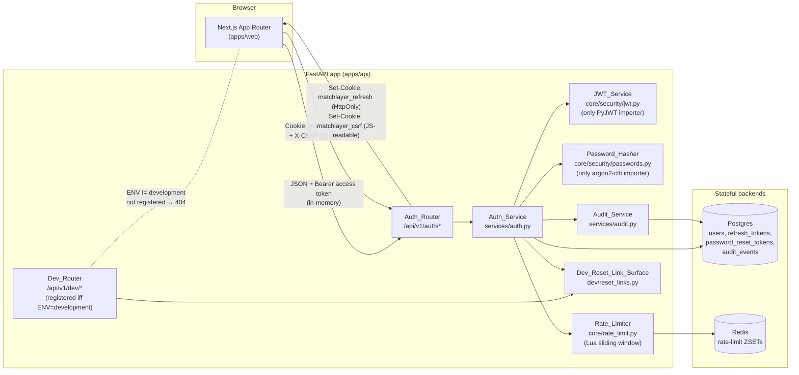
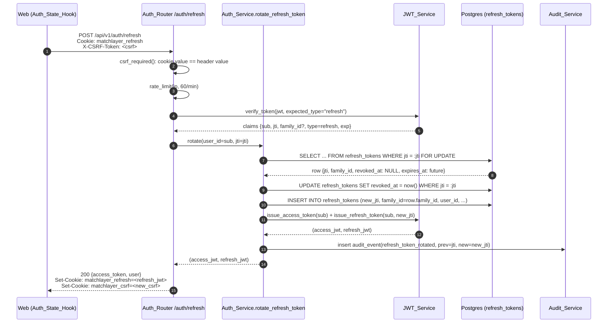

# Design Document — phase-1-auth

## Overview

`phase-1-auth` is the second of three sequential specs that together deliver Phase 1 of the MatchLayer roadmap. It builds directly on `phase-1-foundation` and ships the authentication and account surface that every later feature in this phase depends on: registration, login, refresh-token rotation, logout, password reset, the audit log, the `/me` and `PATCH /me` endpoints, the matching frontend pages, and the cross-cutting controls (rate limiting, account lockout, double-submit CSRF on the cookie surface) those flows require.

This spec deliberately stops at "authentication." There is no resume upload, no parsing, no scoring, no email verification, no MFA, no OAuth, no admin surface, and no production email delivery — those land in `phase-1-matching`, Phase 6, or Phase 7. By the end of this spec a user can register, log in, refresh, log out, reset a forgotten password, edit their display name, and have every security-relevant action recorded in an append-only audit log, against a green CI run on the `phase-1/auth` branch.

The implementation lands as one PR on branch `phase-1/auth` (per `conventions.md` "Branch naming" — `phase-N/short-description`), parented on the foundation baseline. Every requirement from `requirements.md` is anchored to one or more numbered sections below; where a choice exists primarily to support a downstream spec or to match a steering doc rule, that anchor is called out inline.

This spec deliberately defers:

- **RS256 + JWKS key infrastructure** to Phase 6 (production secrets management). Phase 1 uses `HS256` with a single secret in `MATCHLAYER_JWT_SECRET`. The JWT_Service signs with one alg and one key; rotating to RS256 is an internal change to one module.
- **Production email delivery** to Phase 6. Phase 1 only logs the reset link via the dev-mode surface (see Dev-Mode Reset-Link Surface). The Auth_Service has no email-provider dependency to swap out.
- **MFA / TOTP, OAuth providers, email verification on registration** to Phase 7. The `users` table has columns and code paths that don't preclude these (see Data Models) but no provider-side code is written here.
- **GDPR-style data export and deletion endpoints** to Phase 7.

The cross-cutting `security.md` baseline applies in full. Where a requirement consumes a `security.md` clause directly, this design cites the clause inline (e.g., "per `security.md` 'Authentication & session security'") rather than restating it.

## Architecture



Key data flows:

- **Access tokens are Bearer-only.** The browser holds the access token in memory (closure-backed module state, not `localStorage`, never `document.cookie`). Server Components and the rest of the app fetch the API with `Authorization: Bearer <jwt>`.
- **Refresh tokens are cookie-only.** `matchlayer_refresh` is `HttpOnly`, `Secure` (off only when `MATCHLAYER_ENVIRONMENT=development`), `SameSite=Lax`, scoped to `Path=/api/v1/auth`. The browser cannot read it; only `/api/v1/auth/refresh` and `/api/v1/auth/logout` can consume it.
- **Double-submit CSRF on the cookie surface.** A sibling cookie `matchlayer_csrf` (not HttpOnly) carries a random string. The frontend echoes it as `X-CSRF-Token` on every refresh/logout call. The server compares cookie value to header value and rejects on mismatch. `SameSite=Lax` covers most cases; the double-submit cookie covers cross-origin POSTs that `Lax` allows through.
- **Audit writes are in-band.** Every mutation goes through `Auth_Service`, which inserts the `audit_events` row in the same transaction as the auth mutation that produced it. Failure to write the audit row aborts the auth mutation (Requirement 15.4).
- **Dev-mode reset links are environment-gated at registration time.** The `Dev_Router` is only mounted onto the FastAPI app when `MATCHLAYER_ENVIRONMENT=development`. In any other environment the router does not exist; a request to `/api/v1/dev/last-reset-link` returns the foundation-level 404 envelope. This is "the surface itself disappears outside dev," not "the surface is conditionally enabled at request time."

## Repository Layout

The tree below shows everything this spec creates or modifies on top of `phase-1-foundation`. Files marked `(g)` are generated; `(c)` are committed by hand; `(c+g)` are committed and regenerated by CI with a drift check.

```
matchlayer/
├── .env.example                                                          (c, edit)
├── README.md                                                             (c, edit)
├── apps/
│   ├── api/
│   │   ├── pyproject.toml                                                (c, edit)
│   │   ├── uv.lock                                                       (c+g)
│   │   ├── alembic/versions/
│   │   │   └── 0001_users_and_auth.py                                    (c)
│   │   ├── src/matchlayer_api/
│   │   │   ├── main.py                                                   (c, edit) — wire new routers
│   │   │   ├── config.py                                                 (c, edit) — auth settings
│   │   │   ├── auth/                                                     (c, new package)
│   │   │   │   ├── __init__.py                                           (c)
│   │   │   │   ├── router.py                                             (c) — Auth_Router
│   │   │   │   └── schemas.py                                            (c) — Pydantic IO models
│   │   │   ├── core/security/                                            (c, new package)
│   │   │   │   ├── __init__.py                                           (c)
│   │   │   │   ├── passwords.py                                          (c) — Password_Hasher
│   │   │   │   ├── password_blocklist.txt                                (c) — sorted top-1000
│   │   │   │   ├── jwt.py                                                (c) — JWT_Service
│   │   │   │   └── cookies.py                                            (c) — cookie helpers
│   │   │   ├── core/rate_limit.py                                        (c) — Rate_Limiter
│   │   │   ├── core/dependencies.py                                      (c) — FastAPI deps
│   │   │   ├── db/                                                       (c, new package)
│   │   │   │   ├── __init__.py                                           (c)
│   │   │   │   └── models.py                                             (c) — User, RefreshToken, etc.
│   │   │   ├── services/                                                 (c, new package)
│   │   │   │   ├── __init__.py                                           (c)
│   │   │   │   ├── auth.py                                               (c) — Auth_Service
│   │   │   │   └── audit.py                                              (c) — Audit_Service
│   │   │   └── dev/                                                      (c, new package)
│   │   │       ├── __init__.py                                           (c)
│   │   │       ├── router.py                                             (c) — Dev_Router
│   │   │       └── reset_links.py                                        (c) — single-slot LRU
│   │   └── tests/
│   │       ├── conftest.py                                               (c, edit)
│   │       ├── unit/
│   │       │   ├── test_passwords.py                                     (c)
│   │       │   ├── test_jwt.py                                           (c)
│   │       │   ├── test_rate_limit.py                                    (c)
│   │       │   ├── test_cookies.py                                       (c)
│   │       │   └── test_dev_reset_links.py                               (c)
│   │       ├── integration/
│   │       │   ├── test_register.py                                      (c)
│   │       │   ├── test_login.py                                         (c)
│   │       │   ├── test_refresh.py                                       (c)
│   │       │   ├── test_logout.py                                        (c)
│   │       │   ├── test_password_reset.py                                (c)
│   │       │   ├── test_me.py                                            (c)
│   │       │   ├── test_audit_events_role_grants.py                      (c)
│   │       │   └── test_logging_redaction.py                             (c)
│   │       ├── property/
│   │       │   ├── test_password_roundtrip.py                            (c)
│   │       │   ├── test_jwt_roundtrip.py                                 (c)
│   │       │   ├── test_rate_limit_window.py                             (c)
│   │       │   ├── test_refresh_family.py                                (c)
│   │       │   └── test_email_normalization.py                           (c)
│   │       └── timing/
│   │           └── test_login_timing_local.py                            (c, skipped in CI)
│   └── web/
│       ├── package.json                                                  (c, edit)
│       └── src/
│           ├── app/
│           │   ├── (auth)/                                               (c, new route group)
│           │   │   ├── layout.tsx                                        (c) — auth shell
│           │   │   ├── register/page.tsx                                 (c)
│           │   │   ├── login/page.tsx                                    (c)
│           │   │   ├── forgot-password/page.tsx                          (c)
│           │   │   └── reset-password/page.tsx                           (c)
│           │   └── (app)/                                                (c, new route group)
│           │       ├── layout.tsx                                        (c) — Authenticated_Shell
│           │       └── page.tsx                                          (c) — placeholder dashboard
│           ├── components/
│           │   └── auth/                                                 (c, new)
│           │       ├── auth-card.tsx                                     (c)
│           │       ├── form-error.tsx                                    (c) — aria-live region
│           │       └── retry-after-message.tsx                           (c)
│           └── lib/
│               ├── auth.ts                                               (c) — Auth_State_Hook + token store
│               └── api.ts                                                (c, edit) — Bearer + 401 retry
├── packages/
│   └── shared-types/
│       └── src/
│           ├── api-types.ts                                              (g) — adds new endpoints
│           └── api-schemas.ts                                            (g) — adds new endpoints
└── tools/
    └── check_env_drift.py                                                (c, no edit) — picks up new vars
```

`packages/shared-types/src/*.ts` files are generated. The existing pnpm `codegen` script and the `openapi-drift` CI job (foundation §9.1) cover them; this spec adds no new pipeline steps. Under no circumstances should those files be hand-edited.

## Data Models

One Alembic revision creates four tables. Every column is spelled out below; nullability and defaults are explicit. All timestamps are `TIMESTAMP WITH TIME ZONE` (Postgres `timestamptz`) so the foundation rule "ISO 8601 UTC with `Z` suffix" is honored for round-tripping (see `conventions.md` "API design — Timestamps").

### 4.1 `users`

| Column                 | Type          | Nullable | Default | Notes                                                                                                                                                                                                 |
| ---------------------- | ------------- | -------- | ------- | ----------------------------------------------------------------------------------------------------------------------------------------------------------------------------------------------------- |
| `id`                   | `uuid`        | NO       | —       | Primary key. UUIDv7 generated by the application via `uuid_utils`.                                                                                                                                    |
| `email`                | `text`        | NO       | —       | Stored as the user submitted it. Lookups are case-insensitive (see index below).                                                                                                                      |
| `password_hash`        | `text`        | NO       | —       | PHC-format Argon2id string from `argon2-cffi`. Never logged, never returned.                                                                                                                          |
| `display_name`         | `text`        | NO       | —       | Defaults to the local part of `email` at registration time when the user did not supply one. Validated per Requirement 6.6 (Unicode classes `L`, `M`, `N`, `Pd`, `Pc`, `Zs`; ≤ 64 chars after strip). |
| `failed_login_count`   | `integer`     | NO       | `0`     | Reset to 0 on success or lockout trigger.                                                                                                                                                             |
| `last_failed_login_at` | `timestamptz` | YES      | `NULL`  | Used to compute the rolling lockout window without a separate table.                                                                                                                                  |
| `locked_until`         | `timestamptz` | YES      | `NULL`  | When set and in the future, login returns 423 regardless of password.                                                                                                                                 |
| `created_at`           | `timestamptz` | NO       | `now()` |                                                                                                                                                                                                       |
| `updated_at`           | `timestamptz` | NO       | `now()` | Updated by application code on display-name change and password change.                                                                                                                               |
| `deleted_at`           | `timestamptz` | YES      | `NULL`  | Soft-delete (`conventions.md` "Database — Soft delete"). Phase 1 never sets this from the auth surface; reserved for the Phase 7 account-deletion endpoint.                                           |

**Indexes:**

- `users_email_lower_uniq` — `CREATE UNIQUE INDEX users_email_lower_uniq ON users (lower(email))`. Functional unique index. Every lookup of `users.email` in the Auth_Service is `WHERE lower(email) = lower(:email)` so this index is the lookup path and the uniqueness enforcement (Requirement 1.6, Requirement 14.2).
- Implicit primary-key index on `id`.

### 4.2 `refresh_tokens`

| Column       | Type          | Nullable | Default | Notes                                                                         |
| ------------ | ------------- | -------- | ------- | ----------------------------------------------------------------------------- |
| `jti`        | `uuid`        | NO       | —       | Primary key. Matches the `jti` claim of exactly one issued refresh-token JWT. |
| `family_id`  | `uuid`        | NO       | —       | Shared across rotations of the same login (Requirement 8.2, 8.3). UUIDv7.     |
| `user_id`    | `uuid`        | NO       | —       | FK → `users.id` `ON DELETE CASCADE`.                                          |
| `issued_at`  | `timestamptz` | NO       | `now()` |                                                                               |
| `expires_at` | `timestamptz` | NO       | —       | `issued_at + MATCHLAYER_AUTH_REFRESH_TOKEN_TTL_SECONDS`.                      |
| `revoked_at` | `timestamptz` | YES      | `NULL`  | Set on rotation, logout, password reset, or family-reuse detection.           |

**Indexes:**

- Implicit primary-key index on `jti`.
- `refresh_tokens_family_id_idx` — `CREATE INDEX refresh_tokens_family_id_idx ON refresh_tokens (family_id)`.
- `refresh_tokens_user_id_idx` — `CREATE INDEX refresh_tokens_user_id_idx ON refresh_tokens (user_id)`.

The JWT bytes themselves are never stored — Requirement 8.6. The `jti` claim is the only linkage.

### 4.3 `password_reset_tokens`

| Column       | Type          | Nullable | Default | Notes                                                                                |
| ------------ | ------------- | -------- | ------- | ------------------------------------------------------------------------------------ |
| `id`         | `uuid`        | NO       | —       | Primary key. UUIDv7.                                                                 |
| `user_id`    | `uuid`        | NO       | —       | FK → `users.id` `ON DELETE CASCADE`.                                                 |
| `token_hash` | `bytea`       | NO       | —       | SHA-256 of the plaintext token (32 bytes). The plaintext never touches the database. |
| `expires_at` | `timestamptz` | NO       | —       | `created_at + 1 hour` (Requirement 5.3).                                             |
| `used_at`    | `timestamptz` | YES      | `NULL`  | Set on successful confirmation (Requirement 5.10).                                   |
| `created_at` | `timestamptz` | NO       | `now()` |                                                                                      |

**Indexes:**

- Implicit primary-key index on `id`.
- `password_reset_tokens_user_id_idx` — `CREATE INDEX password_reset_tokens_user_id_idx ON password_reset_tokens (user_id)`.
- `password_reset_tokens_token_hash_uniq` — `CREATE UNIQUE INDEX password_reset_tokens_token_hash_uniq ON password_reset_tokens (token_hash)`. Lookup path on confirm; uniqueness as defense-in-depth.

### 4.4 `audit_events`

| Column       | Type          | Nullable | Default | Notes                                                                                                                                                        |
| ------------ | ------------- | -------- | ------- | ------------------------------------------------------------------------------------------------------------------------------------------------------------ |
| `id`         | `uuid`        | NO       | —       | Primary key. UUIDv7.                                                                                                                                         |
| `event_type` | `text`        | NO       | —       | One of the strings enumerated in the Audit Log section.                                                                                                      |
| `user_id`    | `uuid`        | YES      | `NULL`  | FK → `users.id` `ON DELETE SET NULL`. Nullable because some events (`registration_attempt_existing_email`, `rate_limit_rejected`) precede a known principal. |
| `ip_address` | `text`        | YES      | `NULL`  | The IP captured from the `X-Forwarded-For` chain via the foundation request middleware.                                                                      |
| `user_agent` | `text`        | YES      | `NULL`  | Truncated to 1024 chars before insert (Requirement 11.5).                                                                                                    |
| `payload`    | `jsonb`       | NO       | `'{}'`  | Schema per `event_type` enumerated in the Audit Log section. Restricted by Requirement 11.4.                                                                 |
| `created_at` | `timestamptz` | NO       | `now()` |                                                                                                                                                              |

**Indexes:**

- Implicit primary-key index on `id`.
- `audit_events_user_id_idx` — `CREATE INDEX audit_events_user_id_idx ON audit_events (user_id)`.
- `audit_events_created_at_idx` — `CREATE INDEX audit_events_created_at_idx ON audit_events (created_at)`. Required by Requirement 14.2 and used by the README's recent-events `psql` snippet (Requirement 14.6).

### 4.5 Role grants on `audit_events`

The application connects to Postgres as the role configured in `MATCHLAYER_DATABASE_URL` (call it `matchlayer_app`). The migration explicitly grants only `INSERT` and `SELECT` on `audit_events` to that role and revokes `UPDATE` and `DELETE`. This is the **INV-1** correctness invariant (see Correctness Properties) and Requirement 11.2.

```sql
-- emitted via op.execute() in 0001_users_and_auth.py
GRANT INSERT, SELECT ON TABLE audit_events TO matchlayer_app;
REVOKE UPDATE, DELETE, TRUNCATE ON TABLE audit_events FROM matchlayer_app;
```

The role name comes from a new `MATCHLAYER_DATABASE_APP_ROLE` setting (default `matchlayer_app`, mirrors the docker-compose `POSTGRES_USER`). The grant is run as part of the upgrade and reversed (`REVOKE INSERT, SELECT`, `GRANT UPDATE, DELETE`) on downgrade so the schema is fully reversible. Defense-in-depth rationale: even if the API process is compromised and arbitrary SQL is issued through the connection pool, the audit trail cannot be rewritten.

## Components and Interfaces

The new modules under `apps/api/src/matchlayer_api/` and the import boundaries between them. Boundaries are enforced by code review and by the unit tests in the Testing Strategy section.

```
matchlayer_api/
├── auth/
│   ├── router.py          # FastAPI Auth_Router. HTTP shape only.
│   └── schemas.py         # Pydantic request/response models (EmailStr, etc.)
├── core/
│   ├── security/
│   │   ├── passwords.py   # Password_Hasher. ONLY module that imports argon2-cffi.
│   │   ├── password_blocklist.txt
│   │   ├── jwt.py         # JWT_Service. ONLY module that imports `jwt` (PyJWT).
│   │   └── cookies.py     # set_refresh_cookie, clear_refresh_cookie, set_csrf_cookie helpers.
│   ├── rate_limit.py      # Rate_Limiter. ONLY module that imports redis-py.
│   └── dependencies.py    # FastAPI dependencies: get_current_user, csrf_required, rate_limit(...)
├── db/
│   └── models.py          # SQLAlchemy 2.x declarative models for the four tables.
├── services/
│   ├── auth.py            # Auth_Service. ONLY module that writes users, refresh_tokens, password_reset_tokens.
│   └── audit.py           # Audit_Service. Inserts into audit_events.
└── dev/
    ├── router.py          # Dev_Router. Mounted iff MATCHLAYER_ENVIRONMENT == "development".
    └── reset_links.py     # Single-slot in-memory store + structured-log helper.
```

**Import boundary rules** (from Requirement 7.1, Requirement 1.10, and `security.md` "Anti-patterns"):

| Rule                                                                                                                  | Enforced by                                                                                                                |
| --------------------------------------------------------------------------------------------------------------------- | -------------------------------------------------------------------------------------------------------------------------- |
| Only `core/security/jwt.py` imports `jwt` (PyJWT).                                                                    | A unit test that walks the package and grep-asserts `import jwt`/`from jwt import` only appears in `core/security/jwt.py`. |
| Only `core/security/passwords.py` imports `argon2`.                                                                   | Same mechanism, asserting against `import argon2`/`from argon2 import` outside `core/security/passwords.py`.               |
| Only `services/auth.py` writes the auth tables.                                                                       | Convention + code review. Routers depend on services; services own the SQLAlchemy session calls for their tables.          |
| `auth/router.py` does no business logic.                                                                              | Code review. Routers translate HTTP shape; services do the work. Mirror of the foundation `api/health.py` pattern.         |
| Nothing outside `core/security/cookies.py` calls `Response.set_cookie` for `matchlayer_refresh` or `matchlayer_csrf`. | Code review + a small integration test asserting that exactly one helper sets each cookie name.                            |

`Auth_Router` depends on `Auth_Service` and a small set of FastAPI dependencies (`get_session`, `get_current_user`, `rate_limit(...)`, `csrf_required`). `Auth_Service` depends on `JWT_Service`, `Password_Hasher`, `Rate_Limiter`, `Audit_Service`, and `Dev_Reset_Link_Surface`. `Audit_Service` depends only on the SQLAlchemy session. `Dev_Reset_Link_Surface` depends only on `structlog` and an in-process holder.

`main.py` is edited to: (a) include `auth.router.router` on `/api/v1/auth`; (b) include `dev.router.router` on `/api/v1/dev` _only when_ `settings.environment == "development"` (the `if` lives in `main.py`, not inside the dev router); (c) register the new exception types with the foundation `errors.py` handler so the RFC 7807 envelope shape is unchanged.

## JWT Design

### 6.1 Claim shape

Every JWT issued by the JWT_Service carries exactly these claims and no others:

| Claim  | Type    | Notes                                                                                           |
| ------ | ------- | ----------------------------------------------------------------------------------------------- |
| `sub`  | string  | The User_Account `id` (UUIDv7) as a string. Never the email or any other PII (Requirement 7.8). |
| `iat`  | integer | Issued-at, Unix seconds, UTC.                                                                   |
| `exp`  | integer | Expiry, Unix seconds, UTC. `exp - iat` is the TTL, see §6.2.                                    |
| `jti`  | string  | UUIDv7 generated per token. For refresh tokens, this maps 1-to-1 to a `refresh_tokens` row.     |
| `type` | string  | One of the literals `"access"` or `"refresh"`. Verified on every check (Requirement 7.6).       |

The header is fixed: `{"alg": "HS256", "typ": "JWT"}`. There is no custom `kid`; with one secret the field would be noise.

### 6.2 TTLs

| Token type | TTL setting                                 | Default           |
| ---------- | ------------------------------------------- | ----------------- |
| `access`   | `MATCHLAYER_AUTH_ACCESS_TOKEN_TTL_SECONDS`  | `900` (15 min)    |
| `refresh`  | `MATCHLAYER_AUTH_REFRESH_TOKEN_TTL_SECONDS` | `604800` (7 days) |

The Refresh_Cookie's `Max-Age` is set from the same setting so the cookie and the JWT expire together.

### 6.3 Algorithm allowlist

`JWT_Service.verify_token` calls PyJWT with `algorithms=["HS256"]`. PyJWT enforces the allowlist server-side: any token whose header `alg` is `none`, `RS256`, `HS512`, or anything else is rejected with `jwt.InvalidAlgorithmError`, which the Auth_Router maps to HTTP 401 `invalid_refresh_token` for refresh and HTTP 401 `unauthenticated` for access. Because the allowlist is hard-coded in this one wrapper, alg-confusion attacks are structurally prevented (Requirement 7.3, **PBT-2**).

### 6.4 Secret-length floor and startup failure

`MATCHLAYER_JWT_SECRET` is read by `Settings` as a `SecretStr`. A `field_validator` rejects any value whose UTF-8 byte length is less than 32, raising `ValueError("MATCHLAYER_JWT_SECRET must be at least 32 bytes when UTF-8 encoded; received N bytes")`. Because `Settings` is constructed in `create_app()` before uvicorn binds the socket (the foundation pattern), validation failure aborts startup with a non-zero exit code and a structured log line that names the violated minimum length without echoing the secret value (Requirement 7.7).

The `.env.example` placeholder is `change-me-development-only-32+chars` (33 bytes), which clears the floor and makes "copy `.env.example`, run" the working dev experience (Requirement 14.5).

### 6.5 Inline ADR — HS256 over RS256, stateful refresh tokens with families

This subsection is the inline ADR-style rationale for the JWT design. Per the `adrs.md` index and the user-confirmed gate decision, no new ADR file is created for Phase 1.

**Why HS256 over RS256 for Phase 1.** RS256 buys you the ability to publish a JWKS so resource servers can verify access tokens without holding the signing key. In Phase 1, there is exactly one resource server (the FastAPI app), and it already holds the key. The operational overhead of RS256 in Phase 1 — generating and storing a keypair, publishing a JWKS endpoint, rotating the public/private pair — is pure cost with no consumer. HS256 with a single env-var secret matches the surface area of the system. RS256 + JWKS becomes worthwhile when there are multiple verifying services or a signed-token-as-API-key pattern; that's a Phase 6 concern (production secrets management). The migration cost is bounded: change one wrapper module, regenerate the secret store entry, redeploy.

**Why stateful refresh tokens with families instead of pure-stateless JWTs.** Pure-stateless JWTs cannot be revoked individually. A stolen refresh token would be valid for its full 7-day TTL with no recourse. By persisting one row per refresh token in `refresh_tokens` and rotating on every use, we get four properties pure-stateless can't deliver: (1) immediate revocation (logout, password change, manual incident response); (2) sliding-window detection of token reuse — if a revoked refresh token is presented, we know the family is compromised and can revoke every sibling; (3) per-session lineage (`family_id` ties together the rotations from a single login); (4) an audit-grade record of session lifecycle. The cost is one Postgres write per refresh — at a 15-minute access token, that's one write per 15 minutes per active user, which is cheap at our scale. Pure-stateless would buy back that write at the cost of all four properties; the trade is not worth it.

**Why server-side rotation specifically.** Each refresh marks the previous row's `revoked_at` and inserts a new row in the same `family_id`. Reuse of the previous `jti` after rotation lights up the family-revoke path (see Refresh-Token Rotation and Family Reuse). This makes refresh-token theft a positively detectable event rather than an unobservable success. Per `security.md` "Tokens" — short-lived access tokens, longer refresh tokens, rotated on use — the family scheme is how "rotated on use" earns its keep.

## Refresh-Token Rotation and Family Reuse

### 7.1 Happy-path rotation



### 7.2 Reuse-detection path

```mermaid
sequenceDiagram
  autonumber
  participant W as Web (or attacker)
  participant R as Auth_Router /auth/refresh
  participant S as Auth_Service.rotate_refresh_token
  participant DB as Postgres (refresh_tokens)
  participant A as Audit_Service

  W->>R: POST /api/v1/auth/refresh with stale jti (already revoked)
  R->>S: rotate(user_id, jti)
  S->>DB: SELECT ... FROM refresh_tokens WHERE jti = :jti FOR UPDATE
  DB-->>S: row {jti, family_id, revoked_at: <some past time>}
  Note over S: Predecessor is already revoked.<br/>This is the reuse signal.
  S->>DB: UPDATE refresh_tokens SET revoked_at = now()<br/>WHERE family_id = :family_id AND revoked_at IS NULL
  S->>A: insert audit_event(refresh_token_reuse_detected, family_id)
  S-->>R: RefreshTokenReused
  R-->>W: 401 {type: refresh_token_reused}<br/>Set-Cookie: matchlayer_refresh=; Max-Age=0<br/>Set-Cookie: matchlayer_csrf=; Max-Age=0
```

### 7.3 Pseudocode for the critical section

```python
# services/auth.py — shape only
async def rotate_refresh_token(
    self,
    *,
    session: AsyncSession,
    presented_jti: UUID,
    user_id: UUID,
) -> RefreshOutcome:
    # SELECT FOR UPDATE makes rotation race-safe under the same family.
    # Two concurrent rotations against the same jti will serialize on
    # this row lock; the second rotation observes the row in revoked
    # state and lands on the reuse-detection branch.
    row = await session.execute(
        select(RefreshTokenRow)
        .where(RefreshTokenRow.jti == presented_jti)
        .with_for_update()
    )
    row = row.scalar_one_or_none()

    if row is None:
        return RefreshOutcome.invalid()  # Requirement 3.6

    if row.user_id != user_id or row.expires_at < utcnow():
        return RefreshOutcome.invalid()  # Requirement 3.5–3.6

    if row.revoked_at is not None:
        # Reuse detected. Revoke every sibling that is not already revoked.
        await session.execute(
            update(RefreshTokenRow)
            .where(
                RefreshTokenRow.family_id == row.family_id,
                RefreshTokenRow.revoked_at.is_(None),
            )
            .values(revoked_at=utcnow())
        )
        await self._audit.emit(
            session,
            event_type="refresh_token_reuse_detected",
            user_id=row.user_id,
            payload={"family_id": str(row.family_id)},
        )
        return RefreshOutcome.reused()  # Requirement 3.7

    # Happy path: revoke predecessor, issue successor in the same family.
    row.revoked_at = utcnow()
    new_jti = uuid7()
    new_row = RefreshTokenRow(
        jti=new_jti,
        family_id=row.family_id,  # PRESERVED — Requirement 8.3
        user_id=row.user_id,
        issued_at=utcnow(),
        expires_at=utcnow() + self._settings.refresh_ttl,
    )
    session.add(new_row)

    access_jwt = self._jwt.issue_access_token(sub=str(row.user_id))
    refresh_jwt = self._jwt.issue_refresh_token(sub=str(row.user_id), jti=new_jti)
    await self._audit.emit(
        session,
        event_type="refresh_token_rotated",
        user_id=row.user_id,
        payload={"prev_jti": str(presented_jti), "new_jti": str(new_jti)},
    )
    return RefreshOutcome.rotated(access_jwt, refresh_jwt)
```

**Concurrency note.** Two requests racing on the same refresh token serialize on the `SELECT ... FOR UPDATE` row lock. The first commits the rotation; the second observes the predecessor's `revoked_at` set and lands on the reuse-detection branch. This is the desired behavior — concurrent reuse of one `jti` is indistinguishable from reuse by an attacker, and the family revoke is the safe action. The same lock is taken by the logout path, which prevents a logout-vs-rotate race from producing a phantom successor.

## Password Handling

### 8.1 Argon2id parameters

| Parameter     | Value            | Notes                                                                                                                                                                                     |
| ------------- | ---------------- | ----------------------------------------------------------------------------------------------------------------------------------------------------------------------------------------- |
| `time_cost`   | `1`              | iterations. Calibrated down from the `argon2-cffi` v23+ default of `2` per the §8.1 tuning ladder (see below). Still above the OWASP minimum of `1` for Argon2id with ≥ 64 MiB of memory. |
| `memory_cost` | `65536` (64 MiB) | KiB. Meets the OWASP 2023 minimum and the `argon2-cffi` "low-memory" preset floor.                                                                                                        |
| `parallelism` | `1`              | lanes.                                                                                                                                                                                    |
| `hash_len`    | `32`             | bytes (256 bits).                                                                                                                                                                         |
| `salt_len`    | `16`             | bytes (128 bits).                                                                                                                                                                         |
| `type`        | `Argon2id`       |                                                                                                                                                                                           |
| `encoding`    | PHC string       | The default for `argon2-cffi`'s `PasswordHasher.hash`.                                                                                                                                    |

Source: OWASP Password Storage Cheatsheet, Argon2id (2024 revision) — recommends `time_cost ≥ 1, memory_cost ≥ 65536 KiB (64 MiB), parallelism = 1` with the `time_cost` knob calibrated to keep p95 hash latency within the host's budget. Do not weaken the values below this floor without filing a new ADR.

These are `argon2-cffi`'s `PasswordHasher()` defaults as of v23+ with `time_cost` lowered one rung from `2` to `1` to satisfy Requirement 15.2 (≤ 100 ms p95 on a developer laptop, ≤ 200 ms p95 in CI) on a WSL2 host where the v23+ defaults were measured at ≈ 298 ms p95 — well above the laptop budget. The calibrated value still meets the OWASP 2024 Argon2id floor (`t=1, m=64 MiB`). Confirmed by the explicit timing test in `test_passwords.py`.

If a future calibration shows the laptop p95 has crept above 100 ms, we tune by lowering `time_cost` to 1 first (still above the OWASP floor), then `memory_cost` to 47 MiB if needed. Both knobs are encapsulated in the `Password_Hasher` so callers don't change.

### 8.2 PHC-string round-trip

`PasswordHasher.hash(plaintext)` returns a self-describing PHC string of the form `$argon2id$v=19$m=65536,t=1,p=1$<salt>$<hash>`. The Auth_Service writes it directly into `users.password_hash` as `text`. `PasswordHasher.verify(stored, plaintext)` parses the parameters from the stored string, so changing the parameters in code does not invalidate hashes generated under the old parameters — the verifier reads what was stored. **PBT-1** asserts the round-trip property (see Correctness Properties).

`PasswordHasher.check_needs_rehash(stored)` returns `True` when the stored parameters are below the configured policy. We call it on every successful login and, when it returns `True`, transparently re-hash with current parameters before responding (no UX impact). This is the recommended pattern from the `argon2-cffi` docs.

### 8.3 Dummy hash for unknown email

To prevent timing-based account enumeration on `/login` (Requirement 2.4), the Auth_Service holds a precomputed Argon2id hash of a fixed dummy plaintext, computed once at module import. When the submitted email does not match any User_Account, the Auth_Service still calls `Password_Hasher.verify(dummy_hash, submitted_password)` so the unknown-email path performs the same cryptographic work as the known-email path. The result is discarded and HTTP 401 is returned regardless. This makes the unknown-email and known-email-wrong-password paths indistinguishable in wall-clock latency to within the ≤ 25 ms p95 budget (Requirement 2.4, **INV-5**).

### 8.4 Password blocklist

The top-1000 most common passwords are shipped in the API package as a sorted plaintext file at `apps/api/src/matchlayer_api/core/security/password_blocklist.txt` (one password per line, UTF-8, lowercased, sorted lexicographically). The Password_Hasher loads it once at module import into a Python `list[str]` and uses `bisect.bisect_left` for membership lookup — O(log n), zero external infrastructure. Redis is not on the path here; loading at import is fast (one file read, one sort already done) and the blocklist is small enough to live in process memory cheaply.

Source list: SecLists `Passwords/Common-Credentials/10-million-password-list-top-1000.txt`, lower-cased, deduplicated, sorted. The license is permissive and is documented at the top of the file in a comment.

### 8.5 Password normalization (NFKC)

Submitted passwords are normalized with `unicodedata.normalize("NFKC", plaintext)` before hashing and before verification. NFKC (Normalization Form Compatibility Composition) ensures that the same logical password — e.g., `é` typed as a single codepoint U+00E9 vs. as `e` + combining-acute U+0301 — hashes to the same byte sequence. Without normalization, a user who registers with one input method and logs in with another could be locked out of their own account.

NFKC over NFC because compatibility composition also folds visually-equivalent forms (full-width digits, ligatures, etc.) — slight loss of semantic distinctness in exchange for a much friendlier "the password I just typed is the password I registered with" experience. The blocklist is also stored in NFKC form so the membership check operates on the same normalized representation.

The minimum-length check (≥ 12 characters, Requirement 1.4) is applied to the submitted plaintext **before** normalization, against the codepoint count of the original input — so a user can't bypass length enforcement by submitting a single combining-character glyph that NFKC normalizes to a longer sequence.

## CSRF Strategy

### 9.1 Why double-submit and not just SameSite=Lax

`SameSite=Lax` blocks cookies on cross-origin POST/PUT/DELETE/PATCH from a third-party top-level navigation. That is necessary but not sufficient:

- **GET-but-with-side-effects-on-the-CSRF-cookie surface.** Our refresh endpoint is POST, so navigations don't carry the cookie. Good.
- **Same-site cross-origin attacks.** A page on `evil.matchlayer.net` (if such a subdomain ever existed) would be considered same-site for `Lax` purposes and could submit the cookie. The double-submit token is the second factor.
- **Browsers without `SameSite` enforcement.** Older browsers ignore the attribute. Phase 1 still supports those for read-only flows; the double-submit cookie ensures state-changing flows fail closed regardless.

Per `security.md` "CSRF: any state-changing endpoint that uses cookie auth requires CSRF protection. Either double-submit cookie token or `SameSite=Strict` for sensitive actions." We use double-submit because `SameSite=Strict` would break the cross-tab refresh ergonomics in the Authenticated_Shell.

### 9.2 Cookie attribute table

| Attribute  | `matchlayer_refresh`                                                                | `matchlayer_csrf`                                            |
| ---------- | ----------------------------------------------------------------------------------- | ------------------------------------------------------------ |
| Value      | Refresh JWT (7-day TTL)                                                             | 256-bit URL-safe random string (`secrets.token_urlsafe(32)`) |
| `HttpOnly` | **Yes**                                                                             | **No** — the frontend has to read it to echo it.             |
| `Secure`   | Yes, except when `MATCHLAYER_ENVIRONMENT=development` (so `http://localhost` works) | Same carve-out as `matchlayer_refresh`                       |
| `SameSite` | `Lax`                                                                               | `Lax`                                                        |
| `Path`     | `/api/v1/auth`                                                                      | `/api/v1/auth`                                               |
| `Max-Age`  | `MATCHLAYER_AUTH_REFRESH_TOKEN_TTL_SECONDS`                                         | Same as `matchlayer_refresh` (Requirement 9.2)               |
| `Domain`   | unset (host-only)                                                                   | unset (host-only)                                            |

Both cookies are emitted only by the Auth_Router and only via `core/security/cookies.py` helpers so the attribute set is set in one place. Both are cleared (`Max-Age=0`) on every response that revokes the underlying refresh token (logout, password reset confirm, family-reuse detection — Requirement 9.5).

### 9.3 Header-vs-cookie comparison

The check lives in a FastAPI dependency `csrf_required`:

```python
# core/dependencies.py — shape only
async def csrf_required(request: Request) -> None:
    refresh_cookie = request.cookies.get("matchlayer_refresh")
    if not refresh_cookie:
        # Requirement 9.4 anchor: when there is no refresh cookie, the
        # request is not cookie-authenticated, so the CSRF check is N/A.
        # The caller (router) treats the missing cookie the way the
        # endpoint requires (401 for /refresh, 204 for /logout).
        return

    cookie_csrf = request.cookies.get("matchlayer_csrf")
    header_csrf = request.headers.get("X-CSRF-Token")
    if not cookie_csrf or not header_csrf or not secrets.compare_digest(cookie_csrf, header_csrf):
        raise CsrfMismatchError()  # mapped to 403 + RFC 7807 type "csrf_mismatch"
```

`secrets.compare_digest` is a constant-time compare so a per-byte timing oracle on the token doesn't exist. The dependency is attached to `POST /auth/refresh` and `POST /auth/logout` and to nothing else — Bearer-authenticated endpoints (`GET /me`, `PATCH /me`) carry no cookie authority and therefore need no CSRF token.

## Rate Limiting

### 10.1 Algorithm — sliding window via Redis SORTED SET

A single approach for every rate-limited endpoint: **sliding-window counter implemented as a Redis SORTED SET**, mutated atomically by one Lua script per check.

For a rate-limit key `K` with limit `L` requests per window of `W` seconds:

1. The set at key `K` holds one member per request, scored by the request's Unix-millisecond timestamp.
2. Each check:
   - `ZREMRANGEBYSCORE K -inf (now_ms - W*1000)` — purge entries older than the window.
   - `ZCARD K` — count surviving entries.
   - If `count < L`: `ZADD K now_ms <unique_member>` and `EXPIRE K W` so dead keys auto-clean. Return `(allowed=true, retry_after_seconds=0)`.
   - If `count >= L`: read the oldest surviving score (`ZRANGE K 0 0 WITHSCORES`) and compute `retry_after = ceil((oldest_ms + W*1000 - now_ms) / 1000)`. Return `(allowed=false, retry_after_seconds=retry_after)`.

All four steps run inside one `EVAL`/`EVALSHA` of a Lua script so the check is atomic with respect to other clients (Requirement 10.1). The unique member is `<now_ms>:<random_suffix>` so two requests in the same millisecond don't collide on a member.

```lua
-- core/rate_limit.lua — shape; full file shipped in the API package
local key = KEYS[1]
local now_ms = tonumber(ARGV[1])
local window_ms = tonumber(ARGV[2])
local limit = tonumber(ARGV[3])
local member = ARGV[4]

redis.call('ZREMRANGEBYSCORE', key, '-inf', now_ms - window_ms)
local count = redis.call('ZCARD', key)
if count >= limit then
  local oldest = redis.call('ZRANGE', key, 0, 0, 'WITHSCORES')
  local retry_after_ms = (oldest[2] + window_ms) - now_ms
  if retry_after_ms < 0 then retry_after_ms = 0 end
  return {0, math.ceil(retry_after_ms / 1000)}
end
redis.call('ZADD', key, now_ms, member)
redis.call('PEXPIRE', key, window_ms)
return {1, 0}
```

The Python wrapper computes `now_ms = int(time.time() * 1000)`, generates `member = f"{now_ms}:{secrets.token_hex(4)}"`, and returns a `RateLimitDecision(allowed: bool, retry_after_seconds: int)` dataclass.

### 10.2 Key derivation per endpoint

Keys are namespaced by endpoint and key category so an IP rate-limit miss on `/login` doesn't poison the IP rate-limit window on `/refresh`.

- IP key: `rl:auth:{endpoint}:ip:{ip}` where `ip` is the foundation `request.client.host` after `X-Forwarded-For` resolution.
- Email key: `rl:auth:{endpoint}:email:{lower(email)}` for endpoints that key on the submitted email.

`{endpoint}` values are `register`, `login`, `refresh`, `password_reset_request`, `password_reset_confirm`.

### 10.3 Per-endpoint policy table

Defaults below match Requirement 10.2–10.6. Every default is overridable via the env var listed in the third column (Requirement 10.8).

| Endpoint                                   | Key category(ies)                 | Default limit / window                 | Env-var override                                                                                                                                           |
| ------------------------------------------ | --------------------------------- | -------------------------------------- | ---------------------------------------------------------------------------------------------------------------------------------------------------------- |
| `POST /api/v1/auth/register`               | `ip`                              | 10 / 15 min                            | `MATCHLAYER_AUTH_RATE_LIMIT_REGISTER_IP_LIMIT`, `..._WINDOW_SECONDS`                                                                                       |
| `POST /api/v1/auth/login`                  | `email` AND `ip` (both must pass) | email: 10 / 15 min<br/>ip: 50 / 15 min | `MATCHLAYER_AUTH_RATE_LIMIT_LOGIN_EMAIL_LIMIT`, `..._WINDOW_SECONDS`<br/>`MATCHLAYER_AUTH_RATE_LIMIT_LOGIN_IP_LIMIT`, `..._WINDOW_SECONDS`                 |
| `POST /api/v1/auth/refresh`                | `ip`                              | 60 / 1 min                             | `MATCHLAYER_AUTH_RATE_LIMIT_REFRESH_IP_LIMIT`, `..._WINDOW_SECONDS`                                                                                        |
| `POST /api/v1/auth/password-reset/request` | `email` AND `ip`                  | email: 5 / 1 hour<br/>ip: 20 / 1 hour  | `MATCHLAYER_AUTH_RATE_LIMIT_RESET_REQUEST_EMAIL_LIMIT`, `..._WINDOW_SECONDS`<br/>`MATCHLAYER_AUTH_RATE_LIMIT_RESET_REQUEST_IP_LIMIT`, `..._WINDOW_SECONDS` |
| `POST /api/v1/auth/password-reset/confirm` | `ip`                              | 20 / 1 hour                            | `MATCHLAYER_AUTH_RATE_LIMIT_RESET_CONFIRM_IP_LIMIT`, `..._WINDOW_SECONDS`                                                                                  |

For endpoints with two key categories, both limits are checked; either rejection rejects the request and the rejecting category is recorded in the `audit_events.payload`.

### 10.4 Fail-closed on Redis outage

If the Redis call raises (timeout, connection refused, Lua error), the wrapper returns `RateLimitDecision(allowed=False, retry_after_seconds=60)` and the router maps that to HTTP 503 with RFC 7807 `type="rate_limiter_unavailable"` (Requirement 10.9). Per the Requirements analyzer Appendix A note, fail-closed is **per-request**, not at startup — the API stays alive when Redis blips and rejects new auth requests until Redis recovers, rather than crash-looping. Phase 6 will add a CloudWatch alarm on `rate_limiter_unavailable` so a Redis outage is visible without taking the rest of the API down.

### 10.5 FastAPI dependency wiring

```python
# core/dependencies.py — shape only
def rate_limit(*, endpoint: str, by: tuple[str, ...]) -> Callable:
    async def dep(
        request: Request,
        body: AuthEmailBody | None = None,           # only present where endpoints accept email
        rl: Rate_Limiter = Depends(get_rate_limiter),
    ) -> None:
        for category in by:
            key, limit, window = _resolve(endpoint, category, request, body)
            decision = await rl.check(key, limit=limit, window=window)
            if not decision.allowed:
                raise RateLimited(endpoint=endpoint, category=category, retry_after=decision.retry_after_seconds)
    return dep
```

Wired per route:

```python
# auth/router.py — shape only
@router.post("/login", dependencies=[Depends(rate_limit(endpoint="login", by=("email", "ip")))])
async def login(...): ...

@router.post("/refresh",
    dependencies=[
        Depends(rate_limit(endpoint="refresh", by=("ip",))),
        Depends(csrf_required),
    ],
)
async def refresh(...): ...
```

The dependency is responsible for setting the `Retry-After` header on the 429 response and for emitting the `rate_limit_rejected` audit event (Requirement 10.7). The audit payload includes `endpoint` and `category` (`ip` or `email`) but never the raw email value when the category is `email` — only that "an email-keyed rejection occurred" — to avoid creating a discoverable mapping in the audit log.

## Audit Log

### 11.1 Table shape recap

See §4.4 for column definitions. Indexes on `user_id` and `created_at` (§4.4) cover the recent-events query in Requirement 14.6 and the per-user query Phase 6 will need for incident response.

### 11.2 `payload` JSONB schema per `event_type`

Every event type has a documented payload shape. The `payload` column is JSONB and the inserter constructs it from a typed Python `TypedDict` per event so a typo can't introduce an unexpected key. Required fields are listed; **forbidden** fields are explicit and cover the `security.md` "Never log" list (Requirement 11.4).

- `registration_success` — required: `{}` (no extra fields needed; `user_id` is a column). Forbidden: `password`, `password_hash`, full request body.
- `registration_attempt_existing_email` — required: `{}`. The submitted email is in the `users.email` column once normalized; `user_id` on the audit row points at the existing account. Forbidden: `password`, `password_hash`.
- `login_success` — required: `{}`. Forbidden: `password`, `password_hash`.
- `login_failure` — required: `{"submitted_email": <lower-cased str>}`. Forbidden: `password`, `password_hash`. (The lower-cased submitted email is permitted by Requirement 2.7 and `security.md` "Logging — Never log: ... password hashes, full request bodies for upload endpoints" — emails are not in the never-log list.)
- `account_locked` — required: `{"failed_login_count_at_lock": <int>, "window_seconds": <int>}`. Forbidden: `password`.
- `logout` — required: `{"jti": <str>}`. Forbidden: the JWT bytes.
- `refresh_token_rotated` — required: `{"prev_jti": <str>, "new_jti": <str>}`. Forbidden: the JWT bytes.
- `refresh_token_reuse_detected` — required: `{"family_id": <str>}`. Forbidden: the JWT bytes.
- `password_reset_requested` — required: `{}`. Forbidden: `Reset_Token` plaintext, the link.
- `password_reset_confirmed` — required: `{}`. Forbidden: `new_password`, `password_hash`, `Reset_Token` plaintext.
- `display_name_changed` — required: `{"previous_display_name_length": <int>, "new_display_name_length": <int>}`. Forbidden: the actual display-name strings (defense in depth — display names are user-supplied free text).
- `account_deleted` — required: `{}`. Reserved for Phase 7; the `event_type` is enumerated here so the migration's `event_type` text column doesn't need a follow-up.
- `rate_limit_rejected` — required: `{"endpoint": <str>, "category": "ip" | "email"}`. Forbidden: the raw key value when `category == "email"` (Requirement 10.7).

### 11.3 Same-transaction insert rule

`Auth_Service` opens one async SQLAlchemy session per request via the foundation `get_session` dependency (§6.6 of `phase-1-foundation/design.md`). Every audit insert is part of that same session, committed in the same transaction as the auth mutation. This is enforced by `Audit_Service.emit(session, ...)` requiring the caller to pass the active session — there is no overload that opens a fresh connection. Per Requirement 15.4: a failure to write the audit row aborts the auth mutation rather than leaving an unaudited side effect.

For pre-mutation rejections (rate-limit reject, CSRF mismatch), the audit insert still runs in the same request-scoped session and is committed by the rejecting middleware path before the response is returned. The session's `commit()` is the dependency's exit hook, so even early-return paths flush the audit row before the response leaves the app.

### 11.4 Role-grant rationale

Per Requirement 11.2 and §4.5: the application role holds only `INSERT, SELECT` on `audit_events`. The migration emits the `GRANT` and the matching `REVOKE UPDATE, DELETE, TRUNCATE`. This is defense in depth — if the application is compromised through any vector that gives an attacker arbitrary SQL through the connection pool (SQL injection, deserialization, etc.), the audit trail still cannot be rewritten. Forensic value of the table is preserved at the database boundary, not just at the application boundary. **INV-1** in the Correctness Properties section codifies this as a tested invariant.

## Error Handling

This spec adds no new error-envelope shape. Every error response continues to use the foundation's RFC 7807 envelope (`type`, `title`, `detail`, `status`, `request_id`) emitted by `errors.py`, with `detail` always safe to display per `security.md` "Input validation & API safety" and `conventions.md` "API design — Error shape." The `request_id` is supplied by the foundation request-id middleware so every error is correlatable in structured logs without exposing PII.

This section consolidates pointers to where each error class is defined and handled. The full per-endpoint behaviour lives inline in the relevant section above; nothing is duplicated here.

- **Validation errors (HTTP 422, `type="validation_error"`).** Pydantic `ValidationError` raised by request-body parsing on register, login, password-reset, and PATCH /me. The `detail` carries the human-readable summary (length minimum, blocklist hit per Requirement 1.5, display-name codepoint class, etc.). See Auth Pages Design for the user-facing strings.
- **Authentication errors (HTTP 401, `type="invalid_credentials"` / `type="invalid_refresh_token"` / `type="refresh_token_reused"` / `type="unauthenticated"`).** Issued by `Auth_Service` (login wrong-password and unknown-email both, see Password Handling §8.3) and `JWT_Service.verify_token` (alg-confusion, expected-type mismatch, expired/missing token, see JWT Design). The login envelope is identical for unknown-email and wrong-password per Requirement 2.2/2.3. The refresh path also clears `matchlayer_refresh` and `matchlayer_csrf` on the rejection response per Requirement 9.5.
- **CSRF errors (HTTP 403, `type="csrf_mismatch"`).** Raised by `csrf_required` (see CSRF Strategy §9.3) when the cookie value and `X-CSRF-Token` header value disagree. Constant-time compare via `secrets.compare_digest`.
- **Account-locked errors (HTTP 423, `type="account_locked"`).** Raised by the login path when `users.locked_until` is set and in the future, per Requirement 12.7 (see Auth Pages Design §14.3 for the user-facing string).
- **Invalid-reset-token errors (HTTP 400, `type="invalid_reset_token"`).** Raised by `Auth_Service.confirm_password_reset` for missing, expired, or already-used tokens (Requirements 5.6/5.7/5.8). Single envelope shape so the UI can't distinguish — see Auth Pages Design §14.5.
- **Rate-limit errors (HTTP 429, `type="rate_limited"`).** Raised by the `rate_limit(...)` dependency (see Rate Limiting). Sets the `Retry-After` header and emits the `rate_limit_rejected` audit event per Requirement 10.7.
- **Rate-limiter unavailable (HTTP 503, `type="rate_limiter_unavailable"`).** Raised when the Redis call fails per Requirement 10.9. Fail-closed per request, not at startup, so the API stays alive when Redis blips (see Rate Limiting §10.4).
- **Not-found errors (HTTP 404, `type="not_found"`).** Foundation handler. Notable for the dev-mode reset-link surface: when `MATCHLAYER_ENVIRONMENT != "development"`, `/api/v1/dev/last-reset-link` is not registered and falls through to this handler (Requirement 13.4, see Dev-Mode Reset-Link Surface §12.3).
- **Audit-write failure aborts the auth mutation.** Per Requirement 15.4, if the `audit_events` insert raises, the surrounding transaction rolls back and the auth mutation is aborted rather than producing an unaudited side effect. The router maps the exception to HTTP 500 with the foundation envelope; the underlying exception is logged but not echoed in `detail`. See Audit Log §11.3.
- **Startup configuration errors.** A `MATCHLAYER_JWT_SECRET` shorter than 32 bytes raises during `Settings` construction and aborts startup before the socket is bound (see JWT Design §6.4 and Configuration and Environment Variables §17.2). The byte count is logged; the secret value is not.

No error response ever carries a stack trace or secret value in production per `security.md` "Input validation & API safety — No secrets or stack traces in error responses in production." `INV-2` in the Correctness Properties section asserts this empirically across every auth endpoint.

## Dev-Mode Reset-Link Surface

### 12.1 Module location

`apps/api/src/matchlayer_api/dev/reset_links.py` exposes:

```python
# dev/reset_links.py — shape only
@dataclass(frozen=True, slots=True)
class ResetLinkRecord:
    link: str
    created_at: datetime

class DevResetLinkStore:
    def __init__(self) -> None:
        self._lock = threading.Lock()
        self._latest: ResetLinkRecord | None = None

    def record(self, link: str) -> None:
        with self._lock:
            self._latest = ResetLinkRecord(link=link, created_at=utcnow())

    def latest(self) -> ResetLinkRecord | None:
        with self._lock:
            return self._latest

DEV_RESET_LINK_STORE = DevResetLinkStore()  # process-singleton
```

`apps/api/src/matchlayer_api/dev/router.py` exposes `GET /api/v1/dev/last-reset-link` returning `{"link": ..., "created_at": ...}` from `DEV_RESET_LINK_STORE.latest()`. When `latest()` returns `None`, the endpoint returns 200 with `{"link": null, "created_at": null}` so a developer can hit it before any reset has been requested without confusion.

### 12.2 In-memory single-slot LRU semantics

"LRU" here is degenerate by design: capacity = 1. Each `record()` call replaces the previous slot. There is no on-disk persistence, no Redis backing, no spillover. Per Requirement 13.5 — older links are evicted on each new generation.

The single-slot design has one consequence developers should know: only the most recent reset link is retrievable. If a developer requests a reset for User A, then for User B, the GET endpoint returns User B's link. This matches the dev workflow ("last thing I clicked"). Tests document the single-slot semantics so this isn't surprising.

### 12.3 Env-gating at registration time

`main.py`:

```python
# main.py — shape only, edit
def create_app() -> FastAPI:
    settings = get_settings()
    app = FastAPI(...)

    # ... foundation wiring ...

    app.include_router(auth_router, prefix="/api/v1/auth")

    if settings.environment == "development":
        from matchlayer_api.dev.router import router as dev_router
        app.include_router(dev_router, prefix="/api/v1/dev")

    return app
```

When `MATCHLAYER_ENVIRONMENT != "development"`, the dev router is not imported and not mounted. A request to `/api/v1/dev/last-reset-link` falls through to the foundation 404 handler and returns the RFC 7807 envelope with `type="not_found"` (Requirement 13.4). No request-time conditional, no leaked dev path in the OpenAPI spec, no hidden state to misconfigure.

The Auth_Service's reset-request flow gates the **log emission and the store update** on the same `settings.environment == "development"` check (Requirement 13.1, 13.2):

```python
# services/auth.py — shape only
async def request_password_reset(self, *, email: str, ...) -> None:
    user = await self._lookup_user_by_email(email)
    if user is None:
        return  # Requirement 5.2 — silent success

    plaintext_token = secrets.token_urlsafe(32)  # 256 bits
    token_hash = hashlib.sha256(plaintext_token.encode("utf-8")).digest()
    await self._store_reset_token(user_id=user.id, token_hash=token_hash, ttl_hours=1)
    await self._audit.emit(session, event_type="password_reset_requested", user_id=user.id, payload={})

    if self._settings.environment == "development":
        link = f"{self._settings.web_base_url}/reset-password?token={plaintext_token}"
        log.info("password_reset_link_generated", password_reset_link=link, user_id=str(user.id))
        DEV_RESET_LINK_STORE.record(link)
    # In any other environment, the plaintext token is never logged,
    # never stored, and never returned. Phase 6 wires real email delivery here.
```

### 12.4 Structured-log shape

The dev-mode log line uses the foundation structlog config and is emitted at level `info`. The keys present are exactly:

```json
{
  "event": "password_reset_link_generated",
  "level": "info",
  "timestamp": "2025-... ISO 8601 UTC ...",
  "request_id": "...",
  "user_id": "<uuid>",
  "password_reset_link": "http://localhost:3000/reset-password?token=<plaintext>"
}
```

The foundation logging-redaction processor (foundation §6.3) scrubs keys matching `password|token|secret|email|resume_text|parsed_text`. Note that `password_reset_link` is **not** matched by that regex by intent — the regex matches whole-word `password` and `token`, not the compound key. The dev-mode-only emission is the deliberate single carve-out documented in Requirements Appendix A (REQ-13.6). In every non-development environment the log line is not emitted at all (§12.3), so the carve-out has no production exposure.

### 12.5 Persistence forbidden

Per Requirement 13.6, the plaintext `Reset_Token` is never persisted to disk, Redis, or any external service. The single-slot store lives only in process memory; restarting the API drops the value. The structured log line is the only durable trace, and it exists only in development logs.

## Frontend Architecture

### 13.1 File tree

The marketing landing remains at `/` (foundation work, public). The gated surface lives at `/dashboard` and below.

```
apps/web/src/
├── app/
│   ├── (auth)/                  # Route group — does NOT change URL
│   │   ├── layout.tsx           # Auth shell: centered card, brand wordmark, sibling links
│   │   ├── register/page.tsx    # Server Component frame; client form inside
│   │   ├── login/page.tsx
│   │   ├── forgot-password/page.tsx
│   │   └── reset-password/page.tsx
│   ├── (app)/                   # Route group — Authenticated_Shell
│   │   ├── layout.tsx           # Server Component, verifies session, may redirect
│   │   └── dashboard/page.tsx   # Placeholder dashboard ("Hello, {display_name}.")
│   └── layout.tsx               # Root (already exists, minor edit for QueryClientProvider)
├── components/auth/
│   ├── auth-card.tsx            # Server Component
│   ├── form-error.tsx           # Client; aria-live="polite"
│   └── retry-after-message.tsx  # Client; formats Retry-After seconds → user string
└── lib/
    ├── auth.ts                  # Token store + useAuth hook + signIn/signOut/refresh
    └── api.ts                   # Bearer-attaching fetch wrapper, 401-retry-via-refresh
```

The route groups `(auth)` and `(app)` keep auth pages and authenticated pages on separate layouts without affecting the URL path (a Next.js App Router idiom).

### 13.2 Server vs Client component boundary

| File                                                            | Type           | Why                                                                                                     |
| --------------------------------------------------------------- | -------------- | ------------------------------------------------------------------------------------------------------- |
| `app/(auth)/layout.tsx`                                         | Server         | Static frame. No state.                                                                                 |
| `app/(auth)/login/page.tsx`                                     | Server (frame) | Renders the page chrome.                                                                                |
| `app/(auth)/login/_form.tsx`                                    | `'use client'` | React Hook Form + Zod resolver + mutation.                                                              |
| Equivalent split for register, forgot-password, reset-password. | Same           | Form interactivity is the only thing that needs to be client.                                           |
| `app/(app)/layout.tsx`                                          | Server         | Verifies the session server-side; calls `redirect()` when missing.                                      |
| `app/(app)/dashboard/page.tsx`                                  | Server         | Reads `user` from a server-side helper that re-uses the session check.                                  |
| `components/auth/auth-card.tsx`                                 | Server         | Pure presentation.                                                                                      |
| `components/auth/form-error.tsx`                                | `'use client'` | Subscribes to form state.                                                                               |
| `lib/auth.ts`                                                   | `'use client'` | Holds the in-memory access token; uses `useSyncExternalStore`.                                          |
| `lib/api.ts`                                                    | mixed          | A neutral module — exported `apiFetch` works on the client; SC code passes the access token explicitly. |

This honors `conventions.md` "Server vs client: prefer Server Components; mark `'use client'` only when needed."

### 13.3 The `useAuth` hook contract

```ts
// apps/web/src/lib/auth.ts — TypeScript contract
import type { paths } from "@matchlayer/shared-types";

export type AuthUser =
  paths["/api/v1/auth/me"]["get"]["responses"]["200"]["content"]["application/json"];

export interface UseAuth {
  user: AuthUser | null;
  isAuthenticated: boolean;
  isLoading: boolean;
  signIn(email: string, password: string): Promise<void>;
  signOut(): Promise<void>;
  refresh(): Promise<void>;
}

export function useAuth(): UseAuth;
```

`AuthUser` is the auto-generated shape from `@matchlayer/shared-types` — no hand-written types for API request/response shapes (`conventions.md`). Requirement 12.5 enumerates the minimum surface; this contract is exactly that surface.

### 13.4 Access-token-in-memory pattern

Per Requirement 12.6 and `security.md` "Tokens — Access tokens in memory or `Authorization: Bearer` header — never in localStorage" — the access token never touches any persistent browser storage.

Implementation uses a module-level closure plus `useSyncExternalStore` so React subscribers re-render when the token changes, without a Context provider tree.

```ts
// apps/web/src/lib/auth.ts — shape only
let accessToken: string | null = null;
const subscribers = new Set<() => void>();

function setAccessToken(token: string | null) {
  accessToken = token;
  subscribers.forEach((cb) => cb());
}

function getAccessToken(): string | null {
  return accessToken;
}

function subscribe(cb: () => void): () => void {
  subscribers.add(cb);
  return () => subscribers.delete(cb);
}

export function useAuth(): UseAuth {
  // Synchronously reads the access token via useSyncExternalStore
  // so any component that calls useAuth() participates in re-render
  // when the token (and therefore isAuthenticated) flips.
  const token = useSyncExternalStore(subscribe, getAccessToken, () => null);
  // ... compose the rest of the contract from token + a useQuery for /me ...
}
```

Why a closure instead of a Context: a Context would force every consumer to live under a Provider, which is fine, but pushes one extra `'use client'` boundary up the tree. The closure + `useSyncExternalStore` pattern keeps the Authenticated_Shell as a Server Component that calls a server-side fetch with no provider needed; only the leaf interactive components reach into `lib/auth.ts` on the client. Per Requirement 12.6, neither pattern would write to `localStorage` — the closure simply matches the SC-first house style better.

### 13.5 Authenticated_Shell server-side verification

Wraps every route under `(app)/`, e.g. `/dashboard`. The marketing surface at `/` is public and not under this layout.

```tsx
// apps/web/src/app/(app)/layout.tsx — shape only
import { redirect } from "next/navigation";
import { headers, cookies } from "next/headers";

export default async function AppLayout({ children, ... }) {
  // Server Components don't see the in-memory access token.
  // The shell uses the refresh cookie via /auth/refresh:
  //   - If refresh succeeds → render children, hand off the access token to the client tree.
  //   - If refresh fails    → redirect("/login?next=" + currentPath).
  const session = await verifySessionFromRefreshCookie({ headers, cookies });
  if (!session) {
    const next = headers().get("x-pathname") ?? "/";
    redirect(`/login?next=${encodeURIComponent(next)}`);
  }
  return <AppShellChrome user={session.user}>{children}</AppShellChrome>;
}
```

`verifySessionFromRefreshCookie` is a server-side helper in `lib/auth.ts` that calls `POST /api/v1/auth/refresh` with the inbound cookies, retrieves a fresh access token, and (on success) injects the access token into a small server-rendered `<script>` that hydrates `lib/auth.ts`'s in-memory store on the client. On failure (401, 403, network error), it returns `null` and the shell redirects.

This design has one operational subtlety worth flagging: the SC fetch to `/auth/refresh` is rate-limited per IP (60/min, see Rate Limiting). One render = one refresh check; that's well below the limit. If a future server-rendered page needs to call `/me` directly, it can use the access token returned by `verifySessionFromRefreshCookie` rather than refreshing again.

### 13.6 Form architecture

Every Auth_Page form uses **React Hook Form** + **`@hookform/resolvers/zod`** + **the auto-generated Zod schemas from `@matchlayer/shared-types`**. Per Requirement 12.2 and `conventions.md` "Forms":

```tsx
// apps/web/src/app/(auth)/login/_form.tsx — shape only
"use client";
import { useForm } from "react-hook-form";
import { zodResolver } from "@hookform/resolvers/zod";
import {
  LoginRequestSchema,
  type LoginRequest,
} from "@matchlayer/shared-types";

export function LoginForm({ next }: { next: string }) {
  const form = useForm<LoginRequest>({
    resolver: zodResolver(LoginRequestSchema),
  });
  const { signIn } = useAuth();
  // ...
}
```

The Zod schemas come from the codegen pipeline (`openapi-zod-client`). No hand-written schema for any field that has an API representation; only purely client-side state (e.g., a "remember me" checkbox that has no backend meaning) ever uses a hand-written schema.

Every input has an explicit `id` and a paired `<label htmlFor={id}>`. The form's error region is a single `<div role="alert" aria-live="polite">` rendered by `components/auth/form-error.tsx`. WCAG AA color-contrast is satisfied by the design tokens chosen in `phase-1-foundation`; light and dark themes are tested per Requirement 12.9.

### 13.7 The `next=` redirect convention

The Authenticated_Shell redirects to `/login?next=<original_path>` on a missing or invalid session (Requirement 12.4). The login page reads `next` from the URL search params, validates it as a same-origin path (must start with `/` and contain no `://` after URL-decoding), and uses it as the `router.push()` target on successful sign-in. Off-site URLs are silently dropped to `/` to prevent open-redirect.

## Auth Pages Design

The `design.md` rule for auth pages: "restrained. Centered card, brand mark at top, simple form. Background can have a subtle animated gradient or noise — nothing that competes with the form." Every page below honors that rule. Card width: `max-w-md` (448px) per the design system spacing scale. Card uses `rounded-2xl` and the layered soft shadow from `design.md`.

### 14.1 Common shell

Every Auth_Page renders the same shell:

- Top: the MatchLayer wordmark in the brand gradient (foundation §7.8 pattern).
- Card: centered vertically and horizontally; `rounded-2xl`, `border-strong`, `bg-bg-elevated`.
- Form: stacked `<label>` + `<input>` rows with `space-y-4`, primary `<button>` is full-width.
- Error region: `<div role="alert" aria-live="polite">` directly above the submit button. Empty when there are no errors. Reads validation errors and server-side errors from the same region.
- Footer: a single sibling-page link (e.g., login → "Don't have an account? Register").
- Background: subtle animated noise pattern from `design.md` "Auth pages: ... Background can have a subtle animated gradient or noise — nothing that competes with the form." The pattern respects `prefers-reduced-motion` via the foundation `motion-safe.tsx` hook.

### 14.2 `/register`

Fields: `email` (type=`email`, required), `password` (type=`password`, required, autocomplete=`new-password`), `display_name` (optional). Submit calls `POST /api/v1/auth/register`.

User-facing error strings (Requirement 1 acceptance criteria):

- 422 with `type="validation_error"` on length/blocklist failure → render `detail` directly. The `detail` from the API for the blocklist case names "common password" without echoing the submitted value (Requirement 1.5).
- 200 (existing email path, Requirement 1.6) → identical to a real success: redirect to `/`. The user cannot tell the email was already registered. This is the account-enumeration defense.
- 429 → `<RetryAfterMessage seconds={retryAfter}>` ("Too many attempts — please try again in N seconds.").

### 14.3 `/login`

Fields: `email`, `password` (autocomplete=`current-password`). Submit calls `POST /api/v1/auth/login`.

User-facing error strings:

- 401 with `type="invalid_credentials"` → "Email or password is incorrect." (Literal string from Requirement 2.2/2.3 — the same string is rendered for both unknown-email and wrong-password, byte-for-byte identical UX, identical timing per §8.3.)
- 423 with `type="account_locked"` → "Account is temporarily locked. Try again later." (Requirement 12.7.)
- 429 → `<RetryAfterMessage seconds={retryAfter}>`. Per Requirement 12.8, the message includes the rounded-up `Retry-After` seconds.

The page reads `?next=` from the URL on mount and forwards it on successful sign-in (§13.7). It also reads `?just-registered=1` on the off-chance a future flow lands users here from registration; in Phase 1 the register page auto-signs-in so this is unused but reserved.

### 14.4 `/forgot-password`

Field: `email`. Submit calls `POST /api/v1/auth/password-reset/request`.

The page always renders a success state on a 202 response, regardless of whether the email matched a User_Account (Requirement 5.2). The success state reads: "If that email is registered, we've sent password-reset instructions." This is the silent-success enumeration defense.

In dev, a small footer hint (visible only when `process.env.NEXT_PUBLIC_API_BASE_URL` matches a localhost-style origin) reads "Dev tip: get the link at GET /api/v1/dev/last-reset-link" so a developer who's eyeballing the page knows where the link went.

### 14.5 `/reset-password`

Reads `token` from the `?token=` query parameter. If the parameter is absent, the page renders a friendly empty state ("This page is for confirming a password reset. Open the link from your reset email.") rather than an error (Requirement 12.3).

When the token is present, the form has `new_password` (autocomplete=`new-password`) and `confirm_password`. The Zod schema enforces `new_password === confirm_password` client-side; the server-side check is on length and blocklist only (the API doesn't see `confirm_password`).

User-facing error strings:

- 400 with `type="invalid_reset_token"` → "This password-reset link is invalid or expired. Request a new one." (Single message for missing/expired/used per Requirement 5.6/5.7/5.8 — the API returns the same envelope and the UI doesn't try to distinguish.)
- 422 → render `detail` (length or blocklist).

On 204 success, the page redirects to `/login?just-reset=1` and the login page renders an inline confirmation: "Password updated. Please sign in."

### 14.6 WCAG AA notes

- Color contrast: every text/background pair from `design.md`'s token table clears AA at 4.5:1 in both themes. The error-region red against `bg-elevated` clears AA. Tested in browser dev tools per page per theme before merge.
- Focus rings: visible, branded (`outline` uses `--color-brand`). Never `outline: none` without a replacement.
- Keyboard reachability: every input, every button, the sibling-page link. Tab order matches visual order.
- `aria-live="polite"` on the form error region means assistive tech announces server validation errors without forcibly interrupting (Requirement 12.2).
- Per `security.md` "no account enumeration" the same UX renders for the unknown-email and known-email-wrong-password cases, and the timing is bounded by the dummy-hash pattern (§8.3) so an attacker with a screen reader gets the same signal a sighted attacker does — none.

## OpenAPI Codegen Impact

The new endpoints will appear in `packages/shared-types/src/api-types.ts` (TypeScript types) and `packages/shared-types/src/api-schemas.ts` (Zod schemas) on the next `pnpm codegen` run:

| Endpoint                                       | Generated path key                                                                                                                                                                                                                                                                                                                                                                 |
| ---------------------------------------------- | ---------------------------------------------------------------------------------------------------------------------------------------------------------------------------------------------------------------------------------------------------------------------------------------------------------------------------------------------------------------------------------- |
| `POST /api/v1/auth/register`                   | `paths["/api/v1/auth/register"]["post"]`                                                                                                                                                                                                                                                                                                                                           |
| `POST /api/v1/auth/login`                      | `paths["/api/v1/auth/login"]["post"]`                                                                                                                                                                                                                                                                                                                                              |
| `POST /api/v1/auth/refresh`                    | `paths["/api/v1/auth/refresh"]["post"]`                                                                                                                                                                                                                                                                                                                                            |
| `POST /api/v1/auth/logout`                     | `paths["/api/v1/auth/logout"]["post"]`                                                                                                                                                                                                                                                                                                                                             |
| `POST /api/v1/auth/password-reset/request`     | `paths["/api/v1/auth/password-reset/request"]["post"]`                                                                                                                                                                                                                                                                                                                             |
| `POST /api/v1/auth/password-reset/confirm`     | `paths["/api/v1/auth/password-reset/confirm"]["post"]`                                                                                                                                                                                                                                                                                                                             |
| `GET /api/v1/auth/me`                          | `paths["/api/v1/auth/me"]["get"]`                                                                                                                                                                                                                                                                                                                                                  |
| `PATCH /api/v1/auth/me`                        | `paths["/api/v1/auth/me"]["patch"]`                                                                                                                                                                                                                                                                                                                                                |
| `GET /api/v1/dev/last-reset-link` _(dev only)_ | Present in the spec only when the API was started with `MATCHLAYER_ENVIRONMENT=development`. Codegen runs in CI and does not depend on the dev router being registered (the codegen `dump_openapi` invocation reads `app.openapi()` for whichever env it's invoked in; CI invokes with the default — non-development — env, so the dev path does not pollute the committed types). |

Curated re-exports in `packages/shared-types/src/index.ts` (one new alias and one Zod schema name per request and response):

```ts
export type RegisterRequest =
  paths["/api/v1/auth/register"]["post"]["requestBody"]["content"]["application/json"];
export type RegisterResponse =
  paths["/api/v1/auth/register"]["post"]["responses"]["201"]["content"]["application/json"];
export { RegisterRequestSchema, RegisterResponseSchema } from "./api-schemas";
// ... same pattern for login, refresh, logout, password-reset/{request,confirm}, me (GET, PATCH) ...
```

The existing pnpm `codegen` script and the `openapi-drift` CI job (foundation §9.1) cover regeneration and drift. **No codegen pipeline changes are needed for this spec.** The forced contract — every API change must regenerate the types or fail CI — gives the frontend forms a guarantee that the Zod schemas they bind to match the live FastAPI app.

The dev-only endpoint is, by design, absent from the codegen output. The frontend does not need a generated type for it; the dev-helper hint on `/forgot-password` (§14.4) constructs the URL by hand. Keeping it out of `api-types.ts` also keeps it from leaking into prod-build TypeScript of the web app.

## Migrations

### 16.1 The `0001_users_and_auth` revision

One Alembic migration: `apps/api/alembic/versions/0001_users_and_auth.py`. `down_revision = "0000_baseline"` (the empty foundation baseline). Style: `op.create_table` + `op.create_index` for schema; `op.execute` only for the role grants (no equivalent Alembic primitive). Mirrors the foundation Alembic config (sync URL via `+psycopg`).

### 16.2 Upgrade structure

```python
# apps/api/alembic/versions/0001_users_and_auth.py — shape only
"""users and auth tables

Revision ID: 0001_users_and_auth
Revises: 0000_baseline
Create Date: ...
"""
import sqlalchemy as sa
from alembic import op

revision = "0001_users_and_auth"
down_revision = "0000_baseline"
branch_labels = None
depends_on = None

def upgrade() -> None:
    # 1. users
    op.create_table(
        "users",
        sa.Column("id", sa.dialects.postgresql.UUID(as_uuid=True), primary_key=True),
        sa.Column("email", sa.Text(), nullable=False),
        sa.Column("password_hash", sa.Text(), nullable=False),
        sa.Column("display_name", sa.Text(), nullable=False),
        sa.Column("failed_login_count", sa.Integer(), nullable=False, server_default="0"),
        sa.Column("last_failed_login_at", sa.DateTime(timezone=True), nullable=True),
        sa.Column("locked_until", sa.DateTime(timezone=True), nullable=True),
        sa.Column("created_at", sa.DateTime(timezone=True), nullable=False, server_default=sa.func.now()),
        sa.Column("updated_at", sa.DateTime(timezone=True), nullable=False, server_default=sa.func.now()),
        sa.Column("deleted_at", sa.DateTime(timezone=True), nullable=True),
    )
    op.execute("CREATE UNIQUE INDEX users_email_lower_uniq ON users (lower(email))")

    # 2. refresh_tokens
    op.create_table(
        "refresh_tokens",
        sa.Column("jti", sa.dialects.postgresql.UUID(as_uuid=True), primary_key=True),
        sa.Column("family_id", sa.dialects.postgresql.UUID(as_uuid=True), nullable=False),
        sa.Column("user_id", sa.dialects.postgresql.UUID(as_uuid=True),
                  sa.ForeignKey("users.id", ondelete="CASCADE"), nullable=False),
        sa.Column("issued_at", sa.DateTime(timezone=True), nullable=False, server_default=sa.func.now()),
        sa.Column("expires_at", sa.DateTime(timezone=True), nullable=False),
        sa.Column("revoked_at", sa.DateTime(timezone=True), nullable=True),
    )
    op.create_index("refresh_tokens_family_id_idx", "refresh_tokens", ["family_id"])
    op.create_index("refresh_tokens_user_id_idx", "refresh_tokens", ["user_id"])

    # 3. password_reset_tokens
    op.create_table(
        "password_reset_tokens",
        sa.Column("id", sa.dialects.postgresql.UUID(as_uuid=True), primary_key=True),
        sa.Column("user_id", sa.dialects.postgresql.UUID(as_uuid=True),
                  sa.ForeignKey("users.id", ondelete="CASCADE"), nullable=False),
        sa.Column("token_hash", sa.LargeBinary(), nullable=False),
        sa.Column("expires_at", sa.DateTime(timezone=True), nullable=False),
        sa.Column("used_at", sa.DateTime(timezone=True), nullable=True),
        sa.Column("created_at", sa.DateTime(timezone=True), nullable=False, server_default=sa.func.now()),
    )
    op.create_index("password_reset_tokens_user_id_idx", "password_reset_tokens", ["user_id"])
    op.create_index("password_reset_tokens_token_hash_uniq", "password_reset_tokens", ["token_hash"], unique=True)

    # 4. audit_events
    op.create_table(
        "audit_events",
        sa.Column("id", sa.dialects.postgresql.UUID(as_uuid=True), primary_key=True),
        sa.Column("event_type", sa.Text(), nullable=False),
        sa.Column("user_id", sa.dialects.postgresql.UUID(as_uuid=True),
                  sa.ForeignKey("users.id", ondelete="SET NULL"), nullable=True),
        sa.Column("ip_address", sa.Text(), nullable=True),
        sa.Column("user_agent", sa.Text(), nullable=True),
        sa.Column("payload", sa.dialects.postgresql.JSONB(), nullable=False, server_default="{}"),
        sa.Column("created_at", sa.DateTime(timezone=True), nullable=False, server_default=sa.func.now()),
    )
    op.create_index("audit_events_user_id_idx", "audit_events", ["user_id"])
    op.create_index("audit_events_created_at_idx", "audit_events", ["created_at"])

    # 5. role grants (defense in depth — see §4.5)
    role = op.get_context().get_x_argument(as_dictionary=True).get("app_role", "matchlayer_app")
    op.execute(f"GRANT INSERT, SELECT ON TABLE audit_events TO {role}")
    op.execute(f"REVOKE UPDATE, DELETE, TRUNCATE ON TABLE audit_events FROM {role}")


def downgrade() -> None:
    role = op.get_context().get_x_argument(as_dictionary=True).get("app_role", "matchlayer_app")
    op.execute(f"GRANT UPDATE, DELETE, TRUNCATE ON TABLE audit_events TO {role}")
    op.execute(f"REVOKE INSERT, SELECT ON TABLE audit_events FROM {role}")

    op.drop_index("audit_events_created_at_idx", table_name="audit_events")
    op.drop_index("audit_events_user_id_idx", table_name="audit_events")
    op.drop_table("audit_events")

    op.drop_index("password_reset_tokens_token_hash_uniq", table_name="password_reset_tokens")
    op.drop_index("password_reset_tokens_user_id_idx", table_name="password_reset_tokens")
    op.drop_table("password_reset_tokens")

    op.drop_index("refresh_tokens_user_id_idx", table_name="refresh_tokens")
    op.drop_index("refresh_tokens_family_id_idx", table_name="refresh_tokens")
    op.drop_table("refresh_tokens")

    op.execute("DROP INDEX IF EXISTS users_email_lower_uniq")
    op.drop_table("users")
```

### 16.3 Downgrade order

Reverse of upgrade: drop role grants → drop indexes/tables in `audit_events`, `password_reset_tokens`, `refresh_tokens`, `users` order. The functional unique index `users_email_lower_uniq` is dropped via `op.execute("DROP INDEX IF EXISTS ...")` because it was created via `op.execute` and Alembic's auto-tracking can't see it. Per Requirement 14.3, the migration is fully reversible.

### 16.4 Application of the migration

The README runbook (Requirement 14.6 + foundation §13) gains a step:

```sh
uv run --project apps/api alembic upgrade head
```

`alembic.ini` already wires the sync DSN derivation from `Settings`. The role-grant step requires that the `app_role` exists; in the docker-compose dev stack this is always `matchlayer` (set as `POSTGRES_USER`), so the `MATCHLAYER_DATABASE_APP_ROLE` setting defaults to `matchlayer` for parity with the dev compose. In production (Phase 6+) the role is created by infra-side bootstrap.

## Configuration and Environment Variables

### 17.1 `.env.example` delta

The foundation `.env.example` (§12 of `phase-1-foundation/design.md`) is extended with the variables below. The drift checker (`tools/check_env_drift.py`, foundation §9.5) walks the source tree for `MATCHLAYER_*` references and asserts every variable used appears in `.env.example`, so adding a setting without adding the row fails CI.

| Variable                                                        | Type   | Default for local                     | Requirement(s)       | Notes                                                                                         |
| --------------------------------------------------------------- | ------ | ------------------------------------- | -------------------- | --------------------------------------------------------------------------------------------- |
| `MATCHLAYER_JWT_SECRET`                                         | string | `change-me-development-only-32+chars` | 7.2, 7.7, 14.4, 14.5 | Must be ≥ 32 bytes UTF-8. Validated at startup; failure prevents the API binding the socket.  |
| `MATCHLAYER_AUTH_ACCESS_TOKEN_TTL_SECONDS`                      | int    | `900`                                 | 7.5                  | 15 minutes.                                                                                   |
| `MATCHLAYER_AUTH_REFRESH_TOKEN_TTL_SECONDS`                     | int    | `604800`                              | 7.5                  | 7 days. Also drives the Refresh_Cookie `Max-Age` and the `matchlayer_csrf` `Max-Age`.         |
| `MATCHLAYER_AUTH_LOCKOUT_THRESHOLD`                             | int    | `10`                                  | 2.9                  | Failed-login attempts before lockout.                                                         |
| `MATCHLAYER_AUTH_LOCKOUT_WINDOW_SECONDS`                        | int    | `900`                                 | 2.9                  | Rolling-window length (15 minutes).                                                           |
| `MATCHLAYER_AUTH_LOCKOUT_DURATION_SECONDS`                      | int    | `900`                                 | 2.9                  | Lockout duration (15 minutes).                                                                |
| `MATCHLAYER_WEB_BASE_URL`                                       | string | `http://localhost:3000`               | 13.1                 | Used to build the dev-mode reset link URL.                                                    |
| `MATCHLAYER_DATABASE_APP_ROLE`                                  | string | `matchlayer`                          | 11.2, 14.2           | Postgres role that holds the auth tables' privileges; matches docker-compose `POSTGRES_USER`. |
| `MATCHLAYER_AUTH_RATE_LIMIT_REGISTER_IP_LIMIT`                  | int    | `10`                                  | 10.2, 10.8           |                                                                                               |
| `MATCHLAYER_AUTH_RATE_LIMIT_REGISTER_IP_WINDOW_SECONDS`         | int    | `900`                                 | 10.2, 10.8           |                                                                                               |
| `MATCHLAYER_AUTH_RATE_LIMIT_LOGIN_EMAIL_LIMIT`                  | int    | `10`                                  | 10.3, 10.8           |                                                                                               |
| `MATCHLAYER_AUTH_RATE_LIMIT_LOGIN_EMAIL_WINDOW_SECONDS`         | int    | `900`                                 | 10.3, 10.8           |                                                                                               |
| `MATCHLAYER_AUTH_RATE_LIMIT_LOGIN_IP_LIMIT`                     | int    | `50`                                  | 10.3, 10.8           |                                                                                               |
| `MATCHLAYER_AUTH_RATE_LIMIT_LOGIN_IP_WINDOW_SECONDS`            | int    | `900`                                 | 10.3, 10.8           |                                                                                               |
| `MATCHLAYER_AUTH_RATE_LIMIT_REFRESH_IP_LIMIT`                   | int    | `60`                                  | 10.4, 10.8           |                                                                                               |
| `MATCHLAYER_AUTH_RATE_LIMIT_REFRESH_IP_WINDOW_SECONDS`          | int    | `60`                                  | 10.4, 10.8           |                                                                                               |
| `MATCHLAYER_AUTH_RATE_LIMIT_RESET_REQUEST_EMAIL_LIMIT`          | int    | `5`                                   | 10.5, 10.8           |                                                                                               |
| `MATCHLAYER_AUTH_RATE_LIMIT_RESET_REQUEST_EMAIL_WINDOW_SECONDS` | int    | `3600`                                | 10.5, 10.8           |                                                                                               |
| `MATCHLAYER_AUTH_RATE_LIMIT_RESET_REQUEST_IP_LIMIT`             | int    | `20`                                  | 10.5, 10.8           |                                                                                               |
| `MATCHLAYER_AUTH_RATE_LIMIT_RESET_REQUEST_IP_WINDOW_SECONDS`    | int    | `3600`                                | 10.5, 10.8           |                                                                                               |
| `MATCHLAYER_AUTH_RATE_LIMIT_RESET_CONFIRM_IP_LIMIT`             | int    | `20`                                  | 10.6, 10.8           |                                                                                               |
| `MATCHLAYER_AUTH_RATE_LIMIT_RESET_CONFIRM_IP_WINDOW_SECONDS`    | int    | `3600`                                | 10.6, 10.8           |                                                                                               |

### 17.2 Secret-length-floor failure behavior

The `Settings` model defines:

```python
# config.py — shape only, edit
class Settings(BaseSettings):
    # ... existing foundation fields ...
    jwt_secret: SecretStr
    auth_access_token_ttl_seconds: int = 900
    auth_refresh_token_ttl_seconds: int = 604800
    # ... etc ...

    @field_validator("jwt_secret")
    @classmethod
    def _jwt_secret_min_length(cls, v: SecretStr) -> SecretStr:
        if len(v.get_secret_value().encode("utf-8")) < 32:
            raise ValueError(
                "MATCHLAYER_JWT_SECRET must be at least 32 bytes when "
                "UTF-8 encoded; received "
                f"{len(v.get_secret_value().encode('utf-8'))} bytes"
            )
        return v
```

The validator runs at `Settings` construction, before `create_app()` returns, before uvicorn binds. A non-conforming secret aborts startup with a non-zero exit code. The error is logged via the foundation logger; the value of the secret is not echoed in the message — only the byte count, which is a deliberate compromise to make the message actionable without leaking entropy.

### 17.3 Existing variables this spec leaves untouched

Foundation variables (`MATCHLAYER_DATABASE_URL`, `MATCHLAYER_REDIS_URL`, `MATCHLAYER_S3_*`, `MATCHLAYER_CORS_ALLOWED_ORIGINS`, `NEXT_PUBLIC_API_BASE_URL`, `MATCHLAYER_ENVIRONMENT`, `MATCHLAYER_LOG_LEVEL`) keep their defaults and meanings. The auth code consumes `MATCHLAYER_DATABASE_URL` (via `get_session`), `MATCHLAYER_REDIS_URL` (via the rate limiter), `MATCHLAYER_ENVIRONMENT` (for the dev-router gate and the `Secure` cookie carve-out), and `NEXT_PUBLIC_API_BASE_URL` (frontend → backend) without redefinition.

## Testing Strategy

Three test categories: **unit**, **integration**, **property-based**. A fourth narrow **timing** category exists for the local-only login-timing test (Requirement 2.4 / **INV-5**). All Python tests live under `apps/api/tests/`; frontend tests live under `apps/web/tests/`.

Hypothesis is added as a dev dep (`pyproject.toml`'s `[tool.uv]` dev section) for the property-based suite. Hypothesis is the standard PBT library for Python and matches the foundation pattern (one library per concern). Hypothesis's default profile runs 100 examples per `@given`; we leave that as the floor and bump per-test to 500 for the rate-limiter and JWT round-trip via a `@settings(max_examples=500)` decorator where coverage is hungrier.

### 18.1 Unit tests

| File                                            | Subject                                                                                            | Notes                                                                    |
| ----------------------------------------------- | -------------------------------------------------------------------------------------------------- | ------------------------------------------------------------------------ |
| `apps/api/tests/unit/test_passwords.py`         | `Password_Hasher.hash`/`verify`, blocklist hit, NFKC normalization, p95 latency on this host.      | Uses Hypothesis `text` strategy filtered to ≥12 chars, NFKC-stable.      |
| `apps/api/tests/unit/test_jwt.py`               | `JWT_Service` claim shape, alg allowlist, `expected_type` enforcement, secret-length floor.        | Crafts headers manually to test `alg=none`, `alg=HS512`.                 |
| `apps/api/tests/unit/test_rate_limit.py`        | `Rate_Limiter` against a real Redis (the docker-compose service); fail-closed on Redis-down.       | Uses an injectable `redis.asyncio.Redis` stub for the fail-closed path.  |
| `apps/api/tests/unit/test_cookies.py`           | Cookie attribute set: `HttpOnly`, `Secure` carve-out for dev, `SameSite=Lax`, `Path`, `Max-Age`.   | Asserts the helper's output `Response` has the exact `Set-Cookie` shape. |
| `apps/api/tests/unit/test_dev_reset_links.py`   | Single-slot LRU eviction, no-persist, env-gating helper.                                           |                                                                          |
| `apps/api/tests/unit/test_import_boundaries.py` | `import jwt` only in `core/security/jwt.py`; `import argon2` only in `core/security/passwords.py`. | Walks the `matchlayer_api` package and grep-asserts.                     |

### 18.2 Integration tests

Run against a real Postgres (the docker-compose service) and a real Redis. The conftest provides per-test database transactions with rollback so tests don't pollute each other.

| File                                                          | Subject                                                                                                                                                                        |
| ------------------------------------------------------------- | ------------------------------------------------------------------------------------------------------------------------------------------------------------------------------ |
| `apps/api/tests/integration/test_register.py`                 | Happy path (201 + cookies), validation 422, blocklist 422, existing-email enumeration defense (200, no token).                                                                 |
| `apps/api/tests/integration/test_login.py`                    | Happy path (200), unknown-email 401, wrong-password 401 (identical envelope), lockout flow, locked 423 path.                                                                   |
| `apps/api/tests/integration/test_refresh.py`                  | Happy rotation (new `family_id` preserved), missing cookie → 401, CSRF mismatch → 403, alg-confusion → 401, reuse-detection → family revoke + 401.                             |
| `apps/api/tests/integration/test_logout.py`                   | Happy logout (one row revoked), missing cookie → 204, idempotent re-logout, CSRF mismatch → 403.                                                                               |
| `apps/api/tests/integration/test_password_reset.py`           | Request silent-success (unknown vs known email — both 202), confirm happy path (204 + family revoke), invalid/expired/used token → 400, dev-mode log + LRU surface populated.  |
| `apps/api/tests/integration/test_me.py`                       | GET /me happy, missing token → 401, deleted user → 401, PATCH /me display-name validation, audit event emitted.                                                                |
| `apps/api/tests/integration/test_audit_events_role_grants.py` | **INV-1**. Connects as the application role and asserts UPDATE/DELETE/TRUNCATE raise PermissionError.                                                                          |
| `apps/api/tests/integration/test_logging_redaction.py`        | **INV-2**. Captures structlog output across every auth endpoint and asserts no `password`, `password_hash`, `Reset_Token` plaintext, or `new_password` field appears anywhere. |

### 18.3 Property-based tests (PBT-1 through PBT-5)

Each property is annotated with the **Feature: phase-1-auth, Property N: ...** tag in a top-of-file comment per the design rule (Correctness Properties reference).

**PBT-1 — Argon2 hash/verify roundtrip** (`apps/api/tests/property/test_password_roundtrip.py`):

```python
# Feature: phase-1-auth, Property 1: For any password p, verify(p, hash(p)) is True;
# for any pair p != q, verify(q, hash(p)) is False.
from hypothesis import given, settings, strategies as st
from matchlayer_api.core.security.passwords import Password_Hasher

@given(p=st.text(min_size=12, max_size=128))
@settings(max_examples=200)
def test_hash_verify_roundtrip(p):
    h = Password_Hasher.hash(p)
    assert Password_Hasher.verify(h, p) is True

@given(p=st.text(min_size=12, max_size=128), q=st.text(min_size=12, max_size=128))
@settings(max_examples=200)
def test_verify_rejects_wrong_password(p, q):
    if p == q:
        return  # filter; round-trip case is the other property
    h = Password_Hasher.hash(p)
    assert Password_Hasher.verify(h, q) is False
```

Strategy: arbitrary text bounded to passing length so the property is over the valid input space. NFKC-edge cases are covered by an extra `@example(...)` using a Unicode string with combining marks.

**PBT-2 — JWT roundtrip with alg-confusion rejection** (`apps/api/tests/property/test_jwt_roundtrip.py`):

```python
# Feature: phase-1-auth, Property 2: For any valid claims, verify(issue(claims), expected_type)
# returns the claims; tokens issued under any alg != HS256 are rejected; alg=none is rejected.
@given(sub=uuid_strategy(), token_type=st.sampled_from(["access", "refresh"]))
@settings(max_examples=500)
def test_issue_verify_roundtrip(sub, token_type):
    svc = JWT_Service(secret="x" * 32, ...)
    token = svc.issue(sub=sub, type_=token_type)
    claims = svc.verify(token, expected_type=token_type)
    assert claims["sub"] == sub
    assert claims["type"] == token_type
```

Negative cases: a parametrized `pytest.mark.parametrize` over `["none", "HS512", "RS256"]` crafts a token under each algorithm and asserts `verify` raises.

**PBT-3 — Sliding-window rate limiter monotonic accounting** (`apps/api/tests/property/test_rate_limit_window.py`):

```python
# Feature: phase-1-auth, Property 3: The post-window count never exceeds limit;
# rejection => retry_after > 0; allowed => retry_after == 0.
@given(
    limit=st.integers(min_value=1, max_value=20),
    window_ms=st.integers(min_value=100, max_value=2000),
    requests=st.lists(st.integers(min_value=0, max_value=5000), min_size=1, max_size=50),
)
@settings(max_examples=500)
def test_window_invariants(limit, window_ms, requests):
    rl = Rate_Limiter(redis_url=..., now_ms=lambda: requests[i])
    seen = []
    for ts in requests:
        d = await rl.check("k", limit=limit, window_ms=window_ms, now_ms=ts)
        seen.append((ts, d))
        # Invariant: at every step, the count of allowed members within
        # [ts - window_ms, ts] is at most limit.
        ...
        if d.allowed:
            assert d.retry_after_seconds == 0
        else:
            assert d.retry_after_seconds > 0
```

Uses a fakeredis shim or an injectable now-clock so the property runs deterministically.

**PBT-4 — Refresh-token family invariants** (`apps/api/tests/property/test_refresh_family.py`):

```python
# Feature: phase-1-auth, Property 4: Rotation preserves family_id; reuse detection on a
# revoked predecessor revokes every other family member; logout revokes only one row.
@given(rotations=st.integers(min_value=1, max_value=10))
async def test_rotation_preserves_family(rotations, db_session):
    # bootstrap login → family F, jti J0
    # rotate `rotations` times, asserting family stays F and the previous jti is revoked.
    ...

@given(...)
async def test_reuse_revokes_family(db_session):
    # rotate to J1 → present J0 again → expect every J in F revoked.
    ...
```

Uses the integration DB so the SQL semantics (FOR UPDATE, etc.) are exercised under property generation.

**PBT-5 — Email case-insensitive idempotency** (`apps/api/tests/property/test_email_normalization.py`):

```python
# Feature: phase-1-auth, Property 5: For any registered email E and any case permutation E',
# the case-insensitive lookup at every endpoint that consumes E succeeds (or returns the same
# enumeration-defense response shape).
@given(email_local=email_local_strategy(), email_domain=email_domain_strategy(), perm=st.integers())
async def test_case_permutation_is_idempotent(email_local, email_domain, perm, client):
    e = f"{email_local}@{email_domain}"
    await register(client, email=e, password="password-12345")
    permuted = case_permute(e, perm)
    # /login, /password-reset/request, /register (existing-email path) all see the same user.
    ...
```

### 18.4 Login-timing test (INV-5, local-only)

`apps/api/tests/timing/test_login_timing_local.py` runs ≥100 trials each of (a) login with a never-registered email, (b) login with a registered email and a wrong password, on a fresh local Postgres + Redis. Asserts the median wall-clock delta ≤ 25 ms (Requirement 2.4). Marked with `@pytest.mark.timing` and skipped in CI via `pytest -m "not timing"` because GitHub Actions runners are too noisy for sub-30ms timing assertions to be stable. Requirement 2.4 explicitly says "measured locally"; the test name (`_local`) and the marker make that explicit.

### 18.5 Frontend tests (Vitest + Testing Library)

| File                                          | Subject                                                                                                                                  |
| --------------------------------------------- | ---------------------------------------------------------------------------------------------------------------------------------------- |
| `apps/web/tests/auth-card.test.tsx`           | Renders brand wordmark + sibling link + form children; passes axe-core baseline.                                                         |
| `apps/web/tests/login-form.test.tsx`          | 401 → renders the literal "Email or password is incorrect."; 423 → renders the lockout string; 429 → renders Retry-After seconds.        |
| `apps/web/tests/use-auth.test.tsx`            | `useAuth` exposes the contract; access token is never touched by `localStorage`/`document.cookie` (asserts via spying on those globals). |
| `apps/web/tests/authenticated-shell.test.tsx` | When refresh fails, the shell calls `redirect("/login?next=...")`; the `next` param round-trips a URL-encoded path.                      |

## Correctness Properties

_A property is a characteristic or behavior that should hold true across all valid executions of a system — essentially, a formal statement about what the system should do. Properties serve as the bridge between human-readable specifications and machine-verifiable correctness guarantees._

The properties below are split into two groups. **PBT-1 through PBT-5** are universally-quantified properties suitable for property-based testing; each has a corresponding test file in §18.3. **INV-1 through INV-5** are security-critical invariants that don't decompose neatly into "for all inputs" formulations but are still automated, asserted by dedicated integration tests in §18.2 and §18.4.

### Property 1: PBT-1: Argon2 hash/verify is a sound roundtrip

THE Auth*Service SHALL ensure that \_for any* valid password `p` (≥ 12 characters, NFKC-stable), `Password_Hasher.verify(Password_Hasher.hash(p), p)` returns `True`; and _for any_ distinct passwords `p ≠ q`, `Password_Hasher.verify(Password_Hasher.hash(p), q)` returns `False`.

**Validates: Requirements 1.7, 1.10, 5.10**
**Implemented in: `apps/api/tests/property/test_password_roundtrip.py`** (§18.3, PBT-1)

### Property 2: PBT-2: JWT roundtrip preserves claims and the algorithm allowlist holds

THE Auth*Service SHALL ensure that \_for any* valid claims `(sub, type ∈ {access, refresh})`, `JWT_Service.verify_token(JWT_Service.issue_token(claims), expected_type=type)` returns the claims unchanged; _for any_ token whose header `alg` is not exactly `HS256` (including `none`, `HS512`, `RS256`, etc.), `JWT_Service.verify_token` raises; and _for any_ token whose `type` claim does not equal the `expected_type` argument, `JWT_Service.verify_token` raises.

**Validates: Requirements 7.2, 7.3, 7.4, 7.6, 7.8, 3.4, 3.5, 6.2**
**Implemented in: `apps/api/tests/property/test_jwt_roundtrip.py`** (§18.3, PBT-2)

### Property 3: PBT-3: Sliding-window rate limiter accounts monotonically

THE Rate*Limiter SHALL ensure that \_for any* sequence of timestamped check requests against a key with limit `L` and window `W`, at every step the count of `allowed=True` decisions whose timestamps fall within `[now - W, now]` is at most `L`; _for any_ `allowed=False` decision, `retry_after_seconds > 0`; and _for any_ `allowed=True` decision, `retry_after_seconds == 0`.

**Validates: Requirements 10.1, 10.7, 10.8**
**Implemented in: `apps/api/tests/property/test_rate_limit_window.py`** (§18.3, PBT-3)

### Property 4: PBT-4: Refresh-token family rotation invariants

THE Auth*Service SHALL ensure that \_for any* refresh-token family `F`, every successful rotation produces a new row in `refresh_tokens` whose `family_id` equals `F`; _for any_ presentation of a `jti` whose row has `revoked_at != NULL`, every other row in the same `family_id` with `revoked_at = NULL` is updated to set `revoked_at = now()` before the response is returned; and _for any_ logout against a single `jti`, exactly one row is updated and no other row in any family is touched.

**Validates: Requirements 3.7, 3.8, 3.10, 4.5, 8.2, 8.3, 8.4**
**Implemented in: `apps/api/tests/property/test_refresh_family.py`** (§18.3, PBT-4)

### Property 5: PBT-5: Email lookup is case-insensitive everywhere it is consumed

THE Auth*Service SHALL ensure that \_for any* registered email `E` and any case-permutation `E'` of `E`, the case-insensitive lookup at every endpoint that consumes an email (`/auth/register` enumeration-defense path, `/auth/login`, `/auth/password-reset/request`) resolves to the same `User_Account` row.

**Validates: Requirements 1.6, 2.2, 2.3, 5.2, 5.3, 14.2**
**Implemented in: `apps/api/tests/property/test_email_normalization.py`** (§18.3, PBT-5)

### Property 6: INV-1: The application role cannot rewrite the audit log

THE database role used by the API_App SHALL ensure that no row in `audit_events` ever has its `UPDATE`, `DELETE`, or `TRUNCATE` privilege exercised by that role. This is enforced at the Postgres `GRANT`/`REVOKE` boundary (§4.5) and asserted at test time by connecting as the role and verifying that the forbidden statements raise `psycopg.errors.InsufficientPrivilege`.

**Validates: Requirements 11.2**
**Implemented in: `apps/api/tests/integration/test_audit_events_role_grants.py`** (§18.2)

### Property 7: INV-2: No password, plaintext token, or non-allowlisted PII appears in any auth-surface log line

THE Auth_Service SHALL ensure that no log line emitted from any auth endpoint contains the values of `password`, `password_hash`, `new_password`, plaintext `Reset_Token`, or any field the `security.md` "Logging" section names as PII other than `email` and `ip_address`. Asserted by an integration test that captures the structlog output for one full request against every endpoint and grep-asserts the absence of forbidden substrings.

**Validates: Requirements 1.9, 2.10, 5.11, 8.6, 11.4, 13.6**
**Implemented in: `apps/api/tests/integration/test_logging_redaction.py`** (§18.2)

### Property 8: INV-3: The case-insensitivity contract holds at every email-consuming endpoint

THE Auth_Service SHALL ensure that the case-permutation idempotency from PBT-5 holds against the live HTTP surface, so a typo of caps in a user's email never produces a phantom unowned account or a missed enumeration defense. Covered fully by PBT-5; the prose statement is here to make the cross-cutting nature explicit.

**Validates: Requirements 1.6, 2.2, 2.3, 5.2, 5.3**
**Implemented in: `apps/api/tests/property/test_email_normalization.py`** (PBT-5, §18.3)

### Property 9: INV-4: Every refresh rotation preserves the family; every reuse detection revokes every sibling

THE Auth_Service SHALL ensure that the family-id preservation and reuse-revoke contract from PBT-4 holds against the live HTTP refresh surface. Covered by PBT-4 plus the integration tests in `test_refresh.py` (which exercise the actual HTTP/cookie/CSRF/audit path end-to-end).

**Validates: Requirements 3.7, 3.8, 8.3, 8.4**
**Implemented in: `apps/api/tests/property/test_refresh_family.py` and `apps/api/tests/integration/test_refresh.py`** (§18.2, §18.3)

### Property 10: INV-5: Login timing for unknown vs known-but-wrong-password is indistinguishable

THE Auth_Service SHALL ensure that the median wall-clock latency of the unknown-email login path and the known-email-wrong-password login path differ by no more than 25 ms over ≥ 100 trials per case, measured locally. The dummy-hash mitigation (§8.3) is the implementation; the timing test is the assertion. CI runners are too noisy for sub-30ms timing assertions, so the test runs locally and is excluded from CI per the requirement's "measured locally" qualifier.

**Validates: Requirements 2.4**
**Implemented in: `apps/api/tests/timing/test_login_timing_local.py`** (§18.4)

## Phase 2 Hooks

What this spec deliberately leaves easy to extend. None of these are implemented in Phase 1; this section enumerates the seams a future spec can pick up without restructuring.

- **RS256 + JWKS rotation.** `JWT_Service` is the only PyJWT importer (Requirement 7.1) and exposes only `issue_access_token`, `issue_refresh_token`, `verify_token`. Switching to RS256 changes the body of those three methods (load a keypair, sign with `RS256`, publish a JWKS endpoint) and changes the `algorithms=["HS256"]` list to `["RS256"]`. The Auth_Router never sees the alg. The `MATCHLAYER_JWT_SECRET` env var name is reserved for the HS256 case; an RS256 migration adds `MATCHLAYER_JWT_PRIVATE_KEY_PATH` / `MATCHLAYER_JWT_PUBLIC_KEY_PATH` (or AWS Secrets Manager refs in Phase 6) without colliding.
- **OAuth providers (Google, GitHub, etc.).** The `users` table has no `provider` column, but the schema is forward-compatible: a Phase 7 migration adds `users.provider` (nullable, default `"password"`) and `users.provider_subject` (nullable, indexed) without rewriting existing rows. The Auth_Service's registration path is the natural site for a "if `provider` is OAuth, skip password hashing and trust the provider token" branch.
- **MFA / TOTP.** The login flow is one Auth_Service method (`authenticate`) with one return value (a `Token_Pair`). Phase 7 adds a `users.totp_secret` column (encrypted at rest) and a second-step state machine: `authenticate` returns `MfaChallenge` instead of `Token_Pair` when the user has TOTP enabled, and a new `/auth/mfa/verify` endpoint exchanges the challenge for the actual `Token_Pair`. The audit-event taxonomy already includes `login_success` and `login_failure`; Phase 7 adds `mfa_challenge_issued` and `mfa_verify_success/failure`.
- **Email verification on registration.** Reserved env-var names: `MATCHLAYER_AUTH_EMAIL_VERIFICATION_REQUIRED` (bool, default `false` in Phase 1) and `MATCHLAYER_AUTH_EMAIL_VERIFICATION_TTL_HOURS`. The `users` table can grow `email_verified_at TIMESTAMPTZ NULL` in a forward-compatible migration; the Auth_Service `authenticate` method already takes the user row and can refuse to issue a Token_Pair when verification is required and unset.
- **Production email delivery for password reset.** `services/auth.py:request_password_reset` ends with the dev-mode-only branch (§12.3). Phase 6 replaces that branch with a call to a new `EmailService` interface (probably backed by SES). The branch already isolates the env-conditional behavior; the swap is one delete and one inject.
- **Account deletion endpoint and the soft-delete column.** `users.deleted_at` exists from this spec (§4.1) but is never set by any Phase 1 code path. Phase 7 adds `DELETE /api/v1/auth/me` and `DELETE /api/v1/admin/users/{id}` that set the column, and the `account_deleted` audit event type is already enumerated (§11.2) so the migration's `event_type` text column doesn't need a follow-up.
- **GDPR data export.** Reserved env-var name: `MATCHLAYER_DATA_EXPORT_TTL_HOURS`. Phase 7 adds an export endpoint that walks the user's data across the schema. Because every PII-touching column has been catalogued (§4 column nullability tables make this easy), the Phase 7 work is mostly enumeration, not architecture.
- **Cross-region active-active.** The refresh-token rotation path's `SELECT ... FOR UPDATE` (§7.3) is the only place where Phase 1 makes a single-region Postgres assumption. A Phase 6+ multi-region setup either (a) keeps refresh-token rotation pinned to the writer region (simplest), or (b) replaces the row lock with an optimistic-concurrency `UPDATE ... WHERE revoked_at IS NULL RETURNING *` and treats a zero-row return as the reuse signal. Both paths are local edits to one Auth_Service method.
