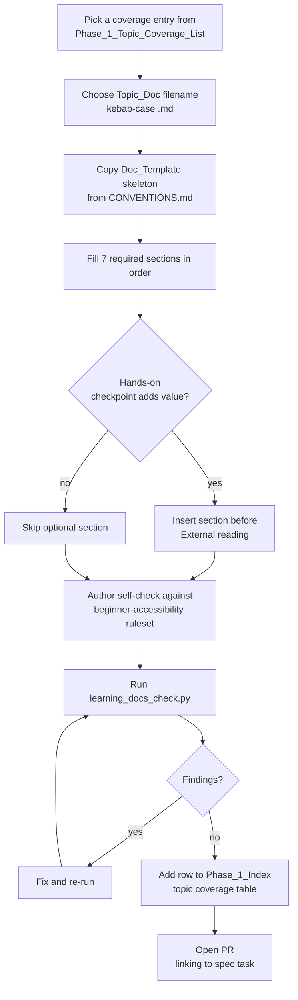
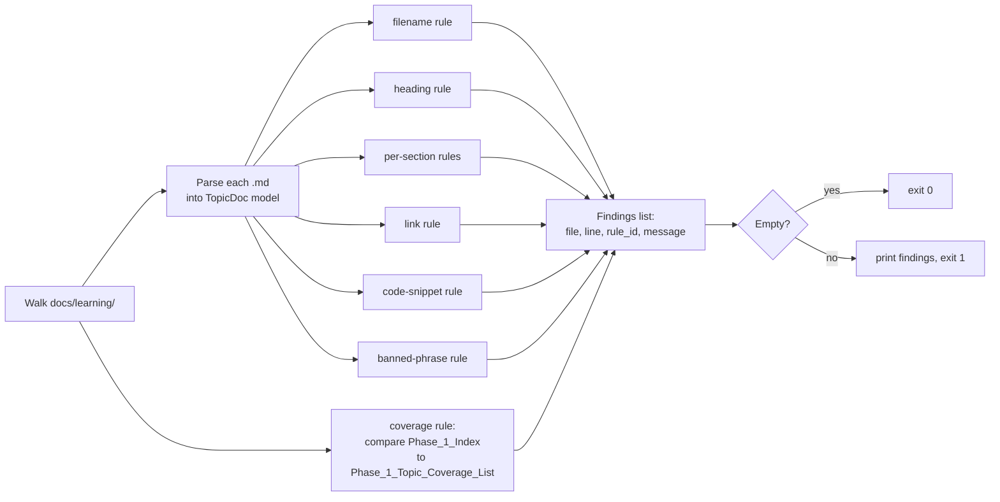

# Design Document

## Overview

`phase-1-learning-docs` produces a folder of long-form Markdown documentation. The "system" under design is therefore the **documentation library itself** — its folder layout, file conventions, the canonical Doc_Template, and the validation surface that keeps the library honest — not application code. The implementation work is authoring text, but the design has the same kinds of artifacts as a software design: a structure, an interface (the Doc_Template), data invariants (filename, heading-order, link-resolution rules), and a verification approach (a compliance validator that mechanically checks those invariants).

The library lives at `docs/learning/` and is multi-phase by construction. Phase 1 only populates `docs/learning/phase-1/`; later phases plug in sibling sub-libraries (`docs/learning/phase-2/`, …) without touching anything Phase 1 produced. This design specifies:

1. The on-disk layout of the library and every required entry point file.
2. The canonical Doc_Template that every Topic_Doc must follow, including the exact heading list and ordering.
3. The mapping from each entry in the Phase_1_Topic_Coverage_List to a concrete Topic_Doc filename.
4. The authoring workflow a contributor follows when writing or updating a Topic_Doc.
5. The compliance-validation approach: a static Markdown-walking script that checks structural invariants (filenames, heading sequences, link targets, code-snippet equality, knowledge-presuming phrases) and reports violations.
6. The maintenance discipline that keeps Topic_Docs in sync with the Phase 1 codebase.

The Phase 1 implementation source of truth being explained is `.kiro/specs/phase-1-foundation/`. Every Topic_Doc's "MatchLayer Phase 1 usage" section anchors to a real file path inside that implementation, and the validator enforces that those paths resolve.

The design intentionally treats the library as data: a Topic_Doc is a structured Markdown document with a fixed schema (an ordered list of H2 sections), and the Phase_1_Index is a generated-shape document that mirrors a single source-of-truth coverage table. That framing makes the structural rules testable as universal properties, and most of the correctness work shifts from prose review into a deterministic validator.

## Architecture

### Two-layer architecture

The library has two layers:

```
┌───────────────────────────────────────────────────────────────────┐
│  Content Layer (the artifact)                                     │
│  docs/learning/                                                   │
│    ├── README.md            (Library_Index)                       │
│    ├── CONVENTIONS.md       (Conventions_Doc — schema + rules)    │
│    └── phase-1/                                                   │
│        ├── README.md        (Phase_1_Index)                       │
│        └── <topic>.md ...   (Topic_Docs, one per file)            │
└───────────────────────────────────────────────────────────────────┘
                              ▲
                              │ enforces
                              │
┌───────────────────────────────────────────────────────────────────┐
│  Validation Layer (the compliance checker)                        │
│  tools/learning_docs_check.py                                     │
│    ├── filename rules      (kebab-case, .md extension)            │
│    ├── heading rules       (Doc_Template order + names)           │
│    ├── link rules          (internal resolves, external https)    │
│    ├── code-snippet rules  (verbatim match to Implementation_File)│
│    ├── coverage rules      (every coverage entry has a Topic_Doc) │
│    ├── content rules       (no banned phrases, acronyms expanded) │
│    └── findings reporter   (file, line, rule id, message)         │
└───────────────────────────────────────────────────────────────────┘
```

The Content Layer is the deliverable. The Validation Layer is a small Python script that walks the content, parses each Topic_Doc into a structured shape, applies the rules, and emits a list of `Finding` records. The validator runs locally for the author and is the source of compliance truth referenced by every "IF non-compliant THEN …" criterion in the requirements.

The Validation Layer is intentionally separate from CI for Phase 1. The requirements explicitly defer "automated link-checking CI infrastructure" to a future enhancement (out-of-scope clause in the Introduction); Phase 1 ships the validator as a runnable script and the rules it embodies, without wiring it into a required CI job. A later spec can add a CI step that invokes the same script, with no changes to the library.

### Folder layout (concrete)

```
docs/
├── adr/                           # already exists, untouched
├── runbooks/                      # already exists, untouched
├── costs.md                       # already exists, untouched
└── learning/                      # NEW: Learning_Docs_Library root
    ├── README.md                  # Library_Index
    ├── CONVENTIONS.md             # Conventions_Doc (Doc_Template + rules)
    └── phase-1/                   # Phase_1_Sub_Library
        ├── README.md              # Phase_1_Index
        ├── monorepo-layout.md     # foundation & tooling
        ├── pnpm-and-workspaces.md
        ├── …                      # one Topic_Doc per coverage entry
        └── aws-migration-path-preservation.md   # hosting & deploy
```

There are no subdirectories inside `docs/learning/phase-1/` (Req 2.9). Future phases add a sibling directory under `docs/learning/`; nothing inside `docs/learning/phase-1/` is touched by that addition (Req 1.6).

### Authoring flow



### Validation flow



### Why a separate validator instead of just review

The requirements treat several rules as IF/THEN gates that block spec closure (Req 3.11, 3.12, 6.4, 7.2, 7.3, 8.6, 8.7). Those rules are expressible as predicates over a parsed Topic_Doc, and machine checks are dramatically more reliable than human review for rules of that shape. The validator also gives the author a fast feedback loop while writing.

The rules that depend on judgment — beginner-accessibility quality (Req 5), pitfall realism, mental-model clarity — remain reviewer responsibilities. The Conventions_Doc names the spec author as the reviewer and maintainer (Req 9.5).

## Components and Interfaces

### 1. Library_Index — `docs/learning/README.md`

The single landing page for the multi-phase library. Required sections, in order:

1. **Title** (H1) — `# MatchLayer Learning Docs`.
2. **Introduction** — one paragraph naming the library and its purpose.
3. **Reader Assumption** (H2) — body contains the verbatim sentence required by Req 1.5: _"a junior developer with zero prior knowledge of the topic"_.
4. **Phase Sub-Libraries** (H2) — bulleted list of every `phase-<N>/` directory present (1 ≤ N ≤ 7) with relative Markdown links. Phase 1 lists one entry: `[phase-1/](phase-1/)`.
5. **External Sources** (H2) — relative Markdown links to `.kiro/steering/`, `docs/adr/`, and to each `apps/*/README.md` that exists at authoring time. At minimum: `apps/api/README.md` and `apps/web/README.md`.
6. **Non-goals** (H2) — at least four bullet points covering Req 10.2–10.5: not an API reference (link to the OpenAPI document), not a per-app README replacement (links to each `apps/*/README.md`), not the ADRs (link to `docs/adr/`), and the long-form companion to `.kiro/steering/`.

#### Library_Index interface contract

| Aspect                 | Contract                                                                                                                                               |
| ---------------------- | ------------------------------------------------------------------------------------------------------------------------------------------------------ |
| Path                   | `docs/learning/README.md` (exact)                                                                                                                      |
| Sub-library listing    | One bullet per `docs/learning/phase-<N>/` directory present at write-time, ordered by N                                                                |
| Reader Assumption text | Verbatim string literal from Req 1.5                                                                                                                   |
| External links         | Relative paths only; resolve from `docs/learning/`                                                                                                     |
| Update trigger         | New phase added → append a bullet under `Phase Sub-Libraries`. New `apps/*/README.md` → append a bullet under both `External Sources` and `Non-goals`. |

The Library_Index does not duplicate prose from steering, ADRs, or per-app READMEs (Req 1.8). When it needs to describe the contents of one of those sources, it links to that source rather than restating it.

### 2. Conventions_Doc — `docs/learning/CONVENTIONS.md`

The schema document. Every rule that the validator and the reviewer enforce traces back to a section here. Required sections, in order:

1. `# MatchLayer Learning Docs — Conventions`
2. **Reader definition** (H2) — restates the Reader as a junior developer with no prior exposure to the topic, no prior exposure to its prerequisites, and no assumed familiarity with the stack (Req 5.1).
3. **Doc_Template** (H2) — the canonical section list, fully specified (see _Doc_Template_ below).
4. **Filename rules** (H2) — kebab-case regex `^[a-z0-9]+(-[a-z0-9]+)*\.md$`, max length 80 characters including `.md`, reserved name `README.md` excluded (Req 2.9, 8.1).
5. **Heading rules** (H2) — H1 on line 1, H2 for every Doc_Template section, exact text match including capitalization and punctuation (Req 8.2–8.5).
6. **File-reference rules** (H2) — Implementation_File path format (POSIX-style, repository-root-relative, no leading slash, no `./` prefix) (Req 6.1).
7. **Code-snippet rules** (H2) — fenced code blocks only, allowed language identifiers (`python`, `typescript`, `tsx`, `javascript`, `jsx`, `yaml`, `json`, `dockerfile`, `sql`, `bash`, `sh`, `text`), verbatim-from-source rule, "simplified for illustration" labelling rule, citation line `Source: ` `<path>` ` (Req 6.2, 6.3, 6.6, 6.7).
8. **Link rules** (H2) — internal links use relative paths and must resolve, external links use `https://` exactly, authoritative-source preference list (minimum: MDN Web Docs, docs.python.org, nextjs.org) (Req 7.1–7.6).
9. **Beginner-accessibility ruleset** (H2) — domain-term-on-first-use rule, acronym-on-first-use format `Expanded Form (ACRONYM)`, banned phrases list, prerequisite-declaration rule, reference-or-define-on-cross-mention rule (Req 5.2–5.7).
10. **Hands-on checkpoint rubric** (H2) — the written rubric required by Req 3.9, defining when the optional section is included: a time-bounded exercise of ≤30 minutes that produces an observable artifact reinforcing the topic's "How it works" or "MatchLayer Phase 1 usage" content. Three or more candidate exercises mean inclusion is justified; fewer than two means the section is omitted.
11. **Maintenance discipline** (H2) — same-PR update rule for Implementation_File and library/technology changes (Req 9.1–9.4).
12. **Maintainer** (H2) — names the spec author as Phase_1_Sub_Library maintainer and states that maintainership transfers only via a future spec naming the new maintainer (Req 9.5–9.6).

#### Doc_Template (canonical specification)

Every Topic_Doc inside any phase sub-library has this shape, written as exact heading text in this exact order:

| #   | Required? | H-level | Heading text               | Purpose                                                                                                                             |
| --- | --------- | ------- | -------------------------- | ----------------------------------------------------------------------------------------------------------------------------------- |
| 0   | yes       | H1      | _Topic title_              | Human-readable title (3–80 chars). Line 1 of the file.                                                                              |
| 1   | yes       | H2      | `Introduction`             | Plain-language intro plus ≥3 declarative learning-outcome sentences. Declares prerequisite Topic_Docs as a hyperlinked list.        |
| 2   | yes       | H2      | `Problem it solves`        | Names ≥1 concrete problem and describes ≥1 prior approach or pre-existing state.                                                    |
| 3   | yes       | H2      | `Mental model`             | Includes ≥1 of: named analogy, diagram (image / ASCII / Mermaid), or numbered ≥3-step walkthrough.                                  |
| 4   | yes       | H2      | `How it works`             | Conceptual explanation of the topic. **MUST NOT** reference MatchLayer-specific files, modules, or Phase 1 implementation details.  |
| 5   | yes       | H2      | `MatchLayer Phase 1 usage` | ≥1 Implementation_File path reference and ≥1 fenced code snippet copied verbatim from that file, with the `Source: ` citation line. |
| 6   | yes       | H2      | `Common pitfalls`          | ≥3 distinct pitfalls; each pitfall states **mistake**, **observable symptom**, **recovery action** as labelled parts.               |
| 7   | optional  | H2      | `Hands-on checkpoint`      | Time-bounded ≤30-minute exercise. Inserted **immediately before** `External reading`.                                               |
| 8   | yes       | H2      | `External reading`         | 1 to 10 external hyperlinks satisfying Req 7.4–7.5 (https only, authoritative source preferred).                                    |

The optional `Hands-on checkpoint` is the only permitted variation in the section list. Every other section is mandatory in this exact order.

#### Banned-phrase list (Req 5.5)

The Conventions_Doc enumerates these phrases. The validator does a case-insensitive substring search:

- `as you know`
- `obviously`
- `clearly`
- `simply`
- `just` (only when it functions as a knowledge-presuming hedge — see note below)
- `of course`
- `everyone knows`
- `it should be clear`

The validator flags every match for human review. `just` has a high false-positive rate (`a just-in-time compiler`, `just below the threshold`), so the Conventions_Doc instructs reviewers to triage `just` findings rather than auto-fail them; the rule remains a finding, not a hard rejection, for that one word.

### 3. Phase_1_Index — `docs/learning/phase-1/README.md`

The Phase 1 landing page. Required structure:

1. **Title** (H1) — `# MatchLayer Phase 1 — Learning Docs`.
2. **Introduction** (H2) — 40–150 words, names `.kiro/specs/phase-1-foundation/` explicitly as the implementation source of truth (Req 2.3).
3. **Topic coverage table** (H2 named `Topic coverage`) — rows: coverage-list entry text, assigned Topic_Doc filename. One row per entry from Req 4.2–4.9. Used by the validator and by the Reader to confirm completeness (Req 4.10–4.12).
4. **Thematic sections** (H2 each, in this exact order, per Req 2.4):
   - `Foundation and tooling`
   - `Frontend`
   - `Backend`
   - `Security`
   - `Database and storage`
   - `Containerization`
   - `Contracts and codegen`
   - `Hosting and deploy`
     Each thematic section lists every Topic_Doc assigned to it as a Markdown hyperlink (link target = filename relative to `docs/learning/phase-1/`, link text = Topic_Doc's H1 title). Each link is followed by an 8–30 word single-sentence summary ending with a period (Req 2.6–2.7).
5. **Recommended reading order** (H2) — numbered list of every existing Topic_Doc, first entry from `Foundation and tooling`, last entry from `Hosting and deploy` (Req 2.8).
6. **Non-goals** (optional H2) — Phase_1_Index may inherit non-goals from Library_Index by linking back, or restate them; not required by the spec but useful when the Phase_1_Index is read in isolation.

#### Topic_Doc presence rule

If a row in the coverage table names a filename that does not exist in `docs/learning/phase-1/`, the validator flags it (Req 4.12). If a Topic_Doc file exists in `docs/learning/phase-1/` but is not referenced by exactly one row, the validator also flags it (Req 2.5, 2.10). The Phase_1_Index omits rather than renders broken links to missing Topic_Docs (Req 2.10).

### 4. Topic_Doc

A single Markdown file inside `docs/learning/phase-1/` covering one topic. Conforms to the Doc_Template above. Authoring constraints:

- **Filename**: kebab-case, `.md` extension, ≤80 chars, never `README.md`.
- **H1**: line 1, 3–80 chars, followed by a blank line.
- **H2 sections**: exact text and exact order from the Doc_Template table.
- **Implementation_File references**: every path resolves to a real file in the repo at the commit where the Topic_Doc is committed.
- **Code snippets**: every fenced block has a language tag from the allowed set; every block sourced from an Implementation_File matches that file character-for-character (after removing whole lines is permitted) and carries the `Source: ` `<path>` ` citation line; every "simplified for illustration" block is preceded by that exact phrase and followed by a hyperlink to the source path.
- **Internal links**: relative paths, resolve from the Topic_Doc's directory.
- **External links**: `https://` scheme exactly.
- **Beginner-accessibility**: every domain term defined on first use in the same paragraph; every acronym introduced as `Expanded Form (ACRONYM)` on first use; prerequisites declared in the introduction as a hyperlinked list; no banned phrases.

### 5. Compliance Validator — `tools/learning_docs_check.py`

A Python script (placed under the existing `tools/` directory next to `check_env_drift.py`). Responsibilities:

| Rule ID  | Source requirement           | Check                                                                                                                                                                                                                                                  |
| -------- | ---------------------------- | ------------------------------------------------------------------------------------------------------------------------------------------------------------------------------------------------------------------------------------------------------ |
| `LDC001` | Req 2.9, 8.1                 | Filename matches `^[a-z0-9]+(-[a-z0-9]+)*\.md$`, length ≤80, not `README.md`.                                                                                                                                                                          |
| `LDC002` | Req 8.2                      | Line 1 is `# <title>` with title length 3–80 chars; line 2 is blank.                                                                                                                                                                                   |
| `LDC003` | Req 8.3, 8.4, 8.5, 3.1, 3.11 | H2 headings present, in exact order, with exact text. Optional `Hands-on checkpoint` allowed only between `Common pitfalls` and `External reading`.                                                                                                    |
| `LDC004` | Req 3.5                      | `How it works` body contains no occurrence of any string matching `apps/`, `packages/`, `infra/`, `ml/`, `tools/`, `.kiro/`, `docs/`, or `MatchLayer` (case-sensitive prefix scan for repository-root path components, plus the literal product name). |
| `LDC005` | Req 3.6, 6.1                 | `MatchLayer Phase 1 usage` references at least one Implementation_File path; every referenced path resolves under repo root.                                                                                                                           |
| `LDC006` | Req 3.6, 6.2, 6.7            | Every code block whose surrounding paragraph references an Implementation_File path matches that file's contents byte-for-byte after permitted whole-line deletions; carries the `Source: ` `<path>` ` citation line.                                  |
| `LDC007` | Req 6.3                      | "simplified for illustration" code blocks are preceded by the labelling phrase and followed by a Markdown link to the source path.                                                                                                                     |
| `LDC008` | Req 6.6                      | Every fenced code block uses one of the allowed language tags.                                                                                                                                                                                         |
| `LDC009` | Req 7.1, 7.2, 7.3            | Every internal link resolves to an existing path; every fragment matches a heading present in the target file.                                                                                                                                         |
| `LDC010` | Req 7.4                      | Every external link uses `https://` exactly.                                                                                                                                                                                                           |
| `LDC011` | Req 7.6                      | The `External reading` section contains 1–10 external hyperlinks.                                                                                                                                                                                      |
| `LDC012` | Req 5.2                      | Every domain-specific term flagged by the project glossary list is followed in the same paragraph by a parenthetical or em-dash definition on first use. (Heuristic; reviewer confirms.)                                                               |
| `LDC013` | Req 5.3                      | Every acronym (run of ≥2 capital letters surrounded by word boundaries) is preceded on first use by `Expanded Form (` and followed by `)`. (Heuristic; reviewer confirms.)                                                                             |
| `LDC014` | Req 5.5                      | No banned phrase appears outside fenced code blocks.                                                                                                                                                                                                   |
| `LDC015` | Req 5.6                      | Introduction contains a hyperlinked prerequisite list (or an explicit "no prerequisites" sentence).                                                                                                                                                    |
| `LDC016` | Req 4.1, 4.10, 4.12          | Every coverage-list entry has at least one Topic_Doc filename in the Phase_1_Index `Topic coverage` table; every named Topic_Doc filename exists in `docs/learning/phase-1/`.                                                                          |
| `LDC017` | Req 2.5, 2.10                | Every Topic_Doc in `docs/learning/phase-1/` is listed in exactly one thematic section of the Phase_1_Index.                                                                                                                                            |
| `LDC018` | Req 1.4                      | Library_Index `Phase Sub-Libraries` section lists every present `phase-<N>/` directory.                                                                                                                                                                |
| `LDC019` | Req 1.7, 10.3                | Library_Index `External Sources` and `Non-goals` reference every existing `apps/*/README.md`.                                                                                                                                                          |
| `LDC020` | Req 10.7                     | Every relative link in Library_Index `Non-goals` and `External Sources` resolves.                                                                                                                                                                      |

A `Finding` is emitted as a record `(file, line, rule_id, message)`. The validator exits non-zero when the findings list is non-empty.

#### Validator interface contract

| Aspect        | Contract                                                                                                                                                               |
| ------------- | ---------------------------------------------------------------------------------------------------------------------------------------------------------------------- |
| Invocation    | `python tools/learning_docs_check.py [--root <repo-root>]`                                                                                                             |
| Exit code     | `0` when no findings, `1` when any finding exists                                                                                                                      |
| Output format | One JSON object per line on stdout; or human-readable when `--format text`; default text                                                                               |
| Side effects  | Read-only; never mutates the repository                                                                                                                                |
| Dependencies  | Python 3.13 + standard library only (`pathlib`, `re`, `json`); no network access (so external links are checked structurally — scheme and shape — not by HTTP request) |

The validator never makes network requests. External-link integrity beyond scheme and shape is out of scope for Phase 1 (deferred to a future CI enhancement).

### 6. Phase_1_Topic_Coverage_List → Topic_Doc mapping

The following table is the canonical mapping from each entry in Req 4.2–4.9 to a Topic_Doc filename. The Phase_1_Index reproduces this table in its `Topic coverage` section. Topic consolidation (Req 4.11) is permitted; this baseline mapping is one Topic_Doc per entry except where a single underlying concept binds two entries together. The mapping is:

| Coverage-list entry (Req §)                               | Topic_Doc filename                           |
| --------------------------------------------------------- | -------------------------------------------- |
| Monorepo concept and apps-vs-packages split (4.2)         | `monorepo-layout.md`                         |
| pnpm and pnpm workspaces (4.2)                            | `pnpm-and-workspaces.md`                     |
| uv as a Python package manager (4.2)                      | `uv-python-package-manager.md`               |
| Node.js + Python version pinning (4.2)                    | `language-version-pinning.md`                |
| Root `package.json` and `tsconfig.base.json` (4.2)        | `root-package-and-tsconfig.md`               |
| `.editorconfig` (4.2)                                     | `editorconfig.md`                            |
| Lockfiles and frozen-lockfile installs (4.2)              | `lockfiles-and-frozen-installs.md`           |
| `.env`, `.env.example`, env-drift script (4.2)            | `env-files-and-drift-detection.md`           |
| Pre-commit hooks (4.2)                                    | `pre-commit-hooks.md`                        |
| Next.js App Router + Server vs Client Components (4.3)    | `nextjs-app-router-and-rsc.md`               |
| TypeScript strict mode + repo compiler options (4.3)      | `typescript-strict-mode.md`                  |
| Tailwind v4 + `@theme inline` token strategy (4.3)        | `tailwind-v4-and-theme-tokens.md`            |
| shadcn/ui as a copy-in primitive library (4.3)            | `shadcn-ui-as-copy-in-primitives.md`         |
| Geist Sans + Geist Mono via `next/font` (4.3)             | `geist-fonts-via-next-font.md`               |
| Framer Motion + reduced-motion pattern (4.3)              | `framer-motion-and-reduced-motion.md`        |
| `next-themes` + system-default theme (4.3)                | `next-themes-and-system-default.md`          |
| Security-headers proxy (Next.js 16 `proxy.ts`) (4.3)      | `nextjs-proxy-security-headers.md`           |
| WCAG AA color contrast (4.3)                              | `wcag-aa-color-contrast.md`                  |
| FastAPI as async ASGI + application-factory pattern (4.4) | `fastapi-application-factory.md`             |
| Pydantic v2 + `pydantic-settings` (4.4)                   | `pydantic-and-pydantic-settings.md`          |
| Async Python and the asyncio model (4.4)                  | `async-python-and-asyncio.md`                |
| SQLAlchemy 2.x async + per-request session (4.4)          | `sqlalchemy-async-and-session-dependency.md` |
| Connection pooling + `pool_pre_ping` (4.4)                | `connection-pooling-and-pre-ping.md`         |
| Alembic migrations + empty baseline (4.4)                 | `alembic-migrations-and-empty-baseline.md`   |
| `structlog` and structured JSON logging (4.4)             | `structlog-and-json-logging.md`              |
| Request-id ASGI middleware + `X-Request-Id` (4.4)         | `request-id-middleware.md`                   |
| RFC 7807 error envelope (4.4)                             | `rfc-7807-error-envelope.md`                 |
| OpenAPI dump CLI (4.4)                                    | `openapi-dump-cli.md`                        |
| Security headers (CSP, HSTS, etc.) (4.5)                  | `security-headers-explained.md`              |
| CORS allowlists (4.5)                                     | `cors-allowlists.md`                         |
| Structured logging as PII defense + redaction (4.5)       | `structured-logging-as-pii-defense.md`       |
| Secrets management, gitleaks, .env discipline (4.5)       | `secrets-management.md`                      |
| Dependency + supply-chain scanning (4.5)                  | `dependency-and-supply-chain-scanning.md`    |
| Threat-model categories (4.5)                             | `threat-model-categories.md`                 |
| PostgreSQL 16 fundamentals (4.6)                          | `postgresql-fundamentals.md`                 |
| Postgres vs MinIO and why Phase 1 uses both (4.6)         | `postgres-vs-minio.md`                       |
| Redis fundamentals + Phase 1 standby (4.6)                | `redis-fundamentals.md`                      |
| Named Docker volumes + persistence (4.6)                  | `named-docker-volumes.md`                    |
| Future addition of pgvector in Phase 2 (4.6)              | `pgvector-and-the-phase-2-boundary.md`       |
| Containers vs virtual machines (4.7)                      | `containers-vs-vms.md`                       |
| Docker images, layers, build cache (4.7)                  | `docker-images-layers-and-cache.md`          |
| Dockerfiles + multi-stage builds (4.7)                    | `dockerfiles-and-multi-stage-builds.md`      |
| `docker compose` + healthchecks + `--wait` (4.7)          | `docker-compose-and-healthchecks.md`         |
| Production Dockerfiles in `infra/docker/` (4.7)           | `production-dockerfiles.md`                  |
| Distroless + non-root + read-only runtime (4.7)           | `distroless-and-runtime-hardening.md`        |
| Image digest pinning (4.7)                                | `image-digest-pinning.md`                    |
| OpenAPI generation by FastAPI (4.8)                       | `openapi-from-fastapi.md`                    |
| Codegen orchestrator + `execa` (4.8)                      | `codegen-orchestrator-and-execa.md`          |
| `openapi-typescript` (4.8)                                | `openapi-typescript-codegen.md`              |
| `openapi-zod-client` (4.8)                                | `openapi-zod-client-codegen.md`              |
| Curated `index.ts` re-export pattern (4.8)                | `shared-types-curated-reexports.md`          |
| OpenAPI drift check in CI (4.8)                           | `openapi-drift-check.md`                     |
| GitHub Actions workflow structure (4.9)                   | `github-actions-workflow-structure.md`       |
| The five Phase 1 CI jobs (4.9)                            | `phase-1-ci-jobs.md`                         |
| Dependabot configuration (4.9)                            | `dependabot-configuration.md`                |
| Branch protection + required-checks aggregator (4.9)      | `branch-protection-and-required-checks.md`   |
| Vercel hobby tier as Phase 1 frontend host (4.9)          | `vercel-hobby-tier-hosting.md`               |
| Fly.io as Phase 1 backend host (4.9)                      | `flyio-backend-hosting.md`                   |
| AWS S3 as Phase 1 file-storage backend (4.9)              | `aws-s3-in-phase-1.md`                       |
| Phase 6 AWS migration-path preservation (4.9)             | `aws-migration-path-preservation.md`         |

This mapping is the design-time baseline. The Phase_1_Index `Topic coverage` table is the runtime source of truth; if implementation chooses to consolidate (e.g., merge `connection-pooling-and-pre-ping.md` into `sqlalchemy-async-and-session-dependency.md`), the table reflects that and the Topic_Doc's introduction names every consolidated entry (Req 4.11). The validator enforces the runtime table, not this design-time baseline.

## Data Models

The library is data-shaped, so the design models it as data. Three model types matter:

### TopicDoc

A parsed Topic_Doc Markdown file.

```python
@dataclass(frozen=True)
class TopicDoc:
    path: Path                      # e.g. docs/learning/phase-1/fastapi-application-factory.md
    filename: str                   # 'fastapi-application-factory.md'
    title: str                      # H1 text
    sections: list[Section]         # ordered, by H2 in source order
    fenced_blocks: list[FencedBlock]
    internal_links: list[Link]
    external_links: list[Link]
    prerequisites: list[Link]       # parsed from Introduction
    raw_lines: list[str]

@dataclass(frozen=True)
class Section:
    heading: str                    # exact H2 text
    line: int                       # 1-based line of the heading
    body: str                       # raw markdown of the section body

@dataclass(frozen=True)
class FencedBlock:
    language: str                   # tag on opening fence, '' if none
    body: str                       # block contents, no fences
    line: int
    source_path: Optional[Path]     # parsed from preceding/following 'Source: `<path>`' line, None if not sourced
    is_simplified: bool             # True if preceded by 'simplified for illustration'

@dataclass(frozen=True)
class Link:
    text: str
    target: str                     # raw href
    line: int
    is_internal: bool
    fragment: Optional[str]         # heading anchor, if any
```

### CoverageRow

One row in the Phase_1_Index `Topic coverage` table.

```python
@dataclass(frozen=True)
class CoverageRow:
    entry_text: str                 # verbatim from the Phase_1_Topic_Coverage_List
    requirement_clause: str         # e.g. '4.4'
    topic_doc_filename: str         # the Topic_Doc that covers it
    thematic_section: str           # one of the 8 thematic sections
```

### Finding

A validator output record.

```python
@dataclass(frozen=True)
class Finding:
    file: Path
    line: int                       # 0 when the rule is file-level
    rule_id: str                    # e.g. 'LDC003'
    requirement: str                # e.g. 'Req 8.4'
    message: str                    # human-readable explanation
```

The validator's contract is simple: given the on-disk state of `docs/learning/` and the repository root, return `list[Finding]`.

### Doc_Template as data

The Doc_Template itself is a constant in the validator:

```python
DOC_TEMPLATE_REQUIRED: tuple[str, ...] = (
    "Introduction",
    "Problem it solves",
    "Mental model",
    "How it works",
    "MatchLayer Phase 1 usage",
    "Common pitfalls",
    "External reading",
)
DOC_TEMPLATE_OPTIONAL: dict[str, tuple[str, str]] = {
    # heading -> (must come after, must come before)
    "Hands-on checkpoint": ("Common pitfalls", "External reading"),
}
```

Compliance for a Topic_Doc reduces to: extract H2 headings in source order, drop any that appear in `DOC_TEMPLATE_OPTIONAL` after verifying their sandwich position, then assert the result equals `DOC_TEMPLATE_REQUIRED`. That single assertion captures Req 3.1, 3.11, 8.3, 8.4, 8.5, 8.7.

### Banned-phrase list as data

```python
BANNED_PHRASES: tuple[str, ...] = (
    "as you know",
    "obviously",
    "clearly",
    "simply",
    "just",
    "of course",
    "everyone knows",
    "it should be clear",
)
```

Matched case-insensitively as a whole-word substring outside fenced code blocks.

### Allowed code-block languages

```python
ALLOWED_LANGUAGES: frozenset[str] = frozenset({
    "python", "typescript", "tsx", "javascript", "jsx",
    "yaml", "json", "dockerfile", "sql", "bash", "sh", "text",
})
```

### Authoritative-source registry

```python
AUTHORITATIVE_HOSTS: tuple[str, ...] = (
    "developer.mozilla.org",     # MDN
    "docs.python.org",
    "nextjs.org",
    # plus every official-docs host the Conventions_Doc names
)
```

The Conventions_Doc is the runtime list; the validator reads it from a fenced YAML block in `CONVENTIONS.md` rather than hard-coding the host list, so adding an authoritative source is a docs-only change.

## Correctness Properties

_A property is a characteristic or behavior that should hold true across all valid executions of a system — essentially, a formal statement about what the system should do. Properties serve as the bridge between human-readable specifications and machine-verifiable correctness guarantees._

The "system" here is the documentation library and its compliance validator. Properties are universal statements over the parsed Markdown content. They are testable as property-based tests by generating randomized library states (synthetic Topic*Docs, synthetic Implementation_Files, synthetic Phase_1_Indexes) and asserting the validator's findings match the predicates below. A handful of acceptance criteria — process rules at PR time, prose-quality judgments — are not property-shaped; those are flagged as smoke or example tests in the \_Testing Strategy* section and in the prework, and are out of scope here.

### Property 1: Phase Sub-Libraries listing reflects on-disk state

_For any_ set `S` of `phase-<N>/` directories present directly under `docs/learning/` (where `1 ≤ N ≤ 7`), the bulleted list under the Library_Index `Phase Sub-Libraries` heading SHALL contain exactly one bullet per element of `S`, and each bullet's link target SHALL be that directory's relative path.

**Validates: Requirements 1.4**

### Property 2: Phase-1 non-interference under sibling addition

_For any_ addition of a sibling directory `docs/learning/phase-<M>/` (where `2 ≤ M ≤ 7`) to a state of the library that already contains `docs/learning/phase-1/`, every file under `docs/learning/phase-1/` SHALL be byte-identical to its pre-addition state.

**Validates: Requirements 1.6**

### Property 3: External Sources reflects every present app README

_For any_ set `R` of files matching `apps/*/README.md` present in the repository, the Library_Index `External Sources` section SHALL contain a relative Markdown link to every element of `R`, plus a relative link to `.kiro/steering/` and to `docs/adr/`.

**Validates: Requirements 1.7**

### Property 4: No 50-word duplication from upstream sources

_For any_ Topic_Doc and any contiguous 50-word window of its prose body, that window's text SHALL NOT appear verbatim in any file under `.kiro/steering/`, `docs/adr/`, or `apps/*/README.md`.

**Validates: Requirements 1.8**

### Property 5: Phase_1_Index introduction word count and reference

_For any_ state of the Phase_1_Index, its `Introduction` section SHALL contain between 40 and 150 words inclusive, and SHALL contain the literal substring `.kiro/specs/phase-1-foundation/`.

**Validates: Requirements 2.3**

### Property 6: Phase_1_Index thematic-section sequence equality

_For any_ state of the Phase_1_Index, the sequence of H2 headings whose text appears in the canonical thematic-section set `{"Foundation and tooling", "Frontend", "Backend", "Security", "Database and storage", "Containerization", "Contracts and codegen", "Hosting and deploy"}` SHALL equal the canonical sequence `("Foundation and tooling", "Frontend", "Backend", "Security", "Database and storage", "Containerization", "Contracts and codegen", "Hosting and deploy")` in that exact order.

**Validates: Requirements 2.4**

### Property 7: Every Topic_Doc listed exactly once across thematic sections

_For any_ Topic_Doc `T` present in `docs/learning/phase-1/`, the count of Markdown hyperlinks across the eight thematic sections of the Phase_1_Index whose target equals `T`'s filename SHALL equal exactly 1.

**Validates: Requirements 2.5**

### Property 8: Topic_Doc entry markup integrity in the Phase_1_Index

_For any_ Topic_Doc `T` listed under any thematic section of the Phase_1_Index, the entry SHALL satisfy: (a) the link target equals `T`'s filename relative to `docs/learning/phase-1/`; (b) the link text equals `T`'s H1 title; (c) the immediately following single-sentence summary contains between 8 and 30 words inclusive and ends with a period (`.`).

**Validates: Requirements 2.6, 2.7**

### Property 9: Recommended reading order is exhaustive with foundation-first and hosting-last endpoints

_For any_ state of the Phase_1_Index, the numbered list under `Recommended reading order` SHALL contain exactly the set of Topic_Doc filenames that exist under `docs/learning/phase-1/`; the first entry SHALL be a Topic_Doc assigned to the `Foundation and tooling` thematic section; and the last entry SHALL be a Topic_Doc assigned to the `Hosting and deploy` thematic section.

**Validates: Requirements 2.8**

### Property 10: Topic_Doc filename conformance

_For any_ file `f` directly under `docs/learning/phase-1/` other than the Phase_1_Index (`README.md`), `f`'s basename SHALL match the regular expression `^[a-z0-9]+(-[a-z0-9]+)*\.md$` and SHALL have length at most 80 characters including the `.md` extension.

**Validates: Requirements 2.9, 8.1**

### Property 11: Internal hyperlink resolution

_For any_ internal hyperlink `L` in any Markdown file under `docs/learning/`, the path part of `L` (interpreted relative to the directory of the file containing `L`) SHALL resolve to a path that exists in the repository at the commit where the file is committed.

**Validates: Requirements 2.10, 7.1, 7.2, 10.7**

### Property 12: Internal heading-anchor matches a real heading

_For any_ internal hyperlink `L` in any Markdown file under `docs/learning/` whose URL fragment is non-empty, the target file SHALL contain a heading whose GitHub-style anchor slug equals the fragment.

**Validates: Requirements 7.3**

### Property 13: Doc_Template H2 sequence equality

_For any_ Topic_Doc `T`, after extracting `T`'s H2 headings in source order and removing any occurrence of the optional heading `Hands-on checkpoint` only when it appears strictly between `Common pitfalls` and `External reading` with no other H2 in that gap, the resulting sequence SHALL equal the canonical sequence `("Introduction", "Problem it solves", "Mental model", "How it works", "MatchLayer Phase 1 usage", "Common pitfalls", "External reading")`.

**Validates: Requirements 3.1, 3.10, 3.11, 8.3, 8.4, 8.5, 8.7**

### Property 14: Introduction declares at least three learning outcomes

_For any_ Topic_Doc, the body of its `Introduction` section SHALL contain at least three sentences each ending with a period (`.`), each phrased as a declarative statement of a learning outcome and aggregated under a single labelled list or paragraph identified as the learning outcomes.

**Validates: Requirements 3.2**

### Property 15: Mental model section contains a concrete handhold

_For any_ Topic_Doc, the body of its `Mental model` section SHALL contain at least one of: (a) an ordered (numbered) Markdown list with at least three items, (b) a fenced code block tagged `text` containing ASCII art or a fenced block tagged `mermaid`, or (c) a Markdown image reference.

**Validates: Requirements 3.4, 5.4**

### Property 16: How it works section is implementation-agnostic

_For any_ Topic_Doc, the body of its `How it works` section SHALL contain no occurrence of any of the strings `apps/`, `packages/`, `infra/`, `ml/`, `tools/`, `.kiro/`, `docs/`, or `MatchLayer` outside fenced code blocks.

**Validates: Requirements 3.5**

### Property 17: MatchLayer Phase 1 usage section contains anchored content

_For any_ Topic_Doc, the body of its `MatchLayer Phase 1 usage` section SHALL contain at least one Implementation_File path reference and at least one fenced code block whose adjacent `Source:` citation references that or another Implementation_File path.

**Validates: Requirements 3.6**

### Property 18: Common pitfalls section has three labelled entries

_For any_ Topic_Doc, the body of its `Common pitfalls` section SHALL contain at least three distinct entries, where each entry contains the labels `Mistake:`, `Symptom:`, and `Recovery:` (or the equivalent labels fixed in the Conventions_Doc) each followed by non-empty text.

**Validates: Requirements 3.7**

### Property 19: External reading section size bounds

_For any_ Topic_Doc, the count of Markdown hyperlinks inside its `External reading` section SHALL be between 1 and 10 inclusive, and every such hyperlink SHALL satisfy Property 22 (https-only) below.

**Validates: Requirements 3.8, 7.6**

### Property 20: Coverage table maps every entry to an existing Topic_Doc

_For any_ row of the Phase_1_Index `Topic coverage` table, the row SHALL name a non-empty Topic_Doc filename, AND that filename SHALL exist as a file directly under `docs/learning/phase-1/`.

**Validates: Requirements 4.1, 4.10, 4.12**

### Property 21: Consolidated Topic_Docs name every consolidated entry

_For any_ Topic_Doc `T` whose filename is recorded in the Phase_1_Index `Topic coverage` table for two or more distinct coverage entries, the body of `T`'s `Introduction` section SHALL contain a verbatim mention of every coverage-entry text recorded against `T`.

**Validates: Requirements 4.11**

### Property 22: Domain-specific term defined on first use

_For any_ Topic_Doc `T` and any term `w` in the project glossary defined in the Conventions_Doc, the first occurrence of `w` in `T` outside fenced code blocks SHALL appear in the same paragraph as a definition delimiter (parenthetical, em-dash clause, or copular `is` clause) introducing `w`'s definition.

**Validates: Requirements 5.2**

### Property 23: Acronym introduced in expanded form on first use

_For any_ Topic_Doc `T` and any acronym `A` (a token of two or more capital letters surrounded by word boundaries) appearing in `T` outside fenced code blocks, the first occurrence of `A` in `T` SHALL be preceded in the same sentence by an expansion of the form `Expanded Form (` immediately followed by `A` and a closing parenthesis `)`.

**Validates: Requirements 5.3**

### Property 24: Banned phrases are absent

_For any_ Topic_Doc, after stripping fenced code blocks from its body, no case-insensitive whole-word match SHALL exist for any phrase in the canonical banned-phrase set defined in the Conventions_Doc, with the documented exception that occurrences of the word `just` are surfaced as warnings rather than hard rejections.

**Validates: Requirements 5.5**

### Property 25: Prerequisites declared in the Introduction

_For any_ Topic_Doc, the body of its `Introduction` section SHALL contain either (a) a list whose items are Markdown hyperlinks under a sub-heading or labelled item identified as Prerequisites, where each link target resolves to another Topic_Doc, or (b) an explicit sentence stating that the Topic_Doc has no prerequisites.

**Validates: Requirements 5.6**

### Property 26: Cross-reference is hyperlinked or inline-defined

_For any_ Topic_Doc `T` and any concept `C` whose canonical name maps to another Topic_Doc `T'` in the Phase_1_Sub_Library, every occurrence of `C` in `T` outside fenced code blocks SHALL be either inside a Markdown hyperlink whose target resolves to `T'`, or accompanied within at most three surrounding sentences by an inline definition of `C` of one to three sentences.

**Validates: Requirements 5.7**

### Property 27: Implementation_File reference is well-formed and resolves

_For any_ Implementation_File path reference appearing in any Topic_Doc, the path SHALL match the format of a POSIX-style, repository-root-relative path with no leading `/` and no `./` prefix, AND the path SHALL resolve to an existing file in the repository at the commit where the Topic_Doc is committed.

**Validates: Requirements 6.1, 6.4**

### Property 28: Sourced fenced block matches its source and carries a citation

_For any_ fenced code block in any Topic_Doc whose adjacent text contains a `Source:` citation line referencing an Implementation_File path `p`, the block's body SHALL be obtainable from the file at `p` by deleting zero or more whole lines (i.e., the block body is a whole-line subsequence of the file's contents at the commit where the Topic_Doc is committed), AND the citation line SHALL match the format `` Source: `<p>` `` immediately preceding or following the block.

**Validates: Requirements 6.2, 6.7, 3.12**

### Property 29: Simplified-for-illustration block is labelled and linked

_For any_ fenced code block in any Topic_Doc whose body is not a whole-line subsequence of any Implementation_File, the immediately preceding non-empty line of prose SHALL contain the literal phrase `simplified for illustration`, AND the immediately following non-empty line of prose SHALL contain a Markdown hyperlink whose target is a repository-root-relative path that resolves to an existing file.

**Validates: Requirements 6.3**

### Property 30: Fenced code blocks use allowed language tags

_For any_ fenced code block in any Topic_Doc, its opening-fence language identifier SHALL be a member of the set `{python, typescript, tsx, javascript, jsx, yaml, json, dockerfile, sql, bash, sh, text}`.

**Validates: Requirements 6.6**

### Property 31: External hyperlinks use the https scheme

_For any_ external hyperlink in any Topic_Doc or in the Library_Index, its URL SHALL begin with the literal scheme prefix `https://`.

**Validates: Requirements 7.4**

### Property 32: Authoritative source preference is honored

_For any_ external hyperlink in any Topic_Doc whose subject has an authoritative-source entry in the canonical authoritative-host registry defined in the Conventions_Doc, the hyperlink's host SHALL match the authoritative host listed for that subject.

**Validates: Requirements 7.5**

### Property 33: Topic_Doc H1 conformance

_For any_ Topic_Doc, the file's first line SHALL be of the form `# <title>` where `<title>` has length between 3 and 80 characters inclusive, and the second line SHALL be blank.

**Validates: Requirements 8.2**

### Property 34: Library_Index Non-goals has at least four bullets

_For any_ state of the Library_Index, the body of its `Non-goals` (or `What this is not`) section SHALL contain at least four Markdown bullet items.

**Validates: Requirements 10.1**

### Property 35: Phase_1_Sub_Library does not over-discuss future phases

_For any_ Topic_Doc, the count of sentences mentioning any of `Phase 2`, `Phase 3`, `Phase 4`, `Phase 5`, `Phase 6`, or `Phase 7` (case-sensitive token match) SHALL be at most two, and each such sentence SHALL describe how a Phase 1 choice preserves a future option rather than providing implementation guidance for the future phase.

**Validates: Requirements 10.6**

## Error Handling

The validator and the authoring workflow are the only pieces that have runtime errors to handle. The library itself is static text; "errors" in the library show up as validator findings, not exceptions.

### Validator error model

The validator runs as a single-pass walker over `docs/learning/`. Two error categories matter:

| Category                        | Examples                                                                                                                                           | Behavior                                                                                                                                                                                                                              |
| ------------------------------- | -------------------------------------------------------------------------------------------------------------------------------------------------- | ------------------------------------------------------------------------------------------------------------------------------------------------------------------------------------------------------------------------------------- |
| **Findings** (expected)         | Filename violates the regex; H2 headings out of order; broken link; non-allowed language tag; banned phrase present                                | Recorded as a `Finding(file, line, rule_id, requirement, message)`. Validator collects all findings and prints them in a stable, sorted-by-(file, line, rule_id) order. Process exit code is `1` when the findings list is non-empty. |
| **Walk failures** (exceptional) | A Markdown file is unreadable; the repo root cannot be found; a referenced file path contains characters that are not valid in the host filesystem | Logged as a single human-readable error to stderr. Process exit code is `2`. The validator does not partially succeed — a walk failure aborts the run.                                                                                |

The validator never emits a stack trace as user-visible output. Internal exceptions during a per-file rule check are caught, converted into a `Finding` with rule_id `LDC999` and requirement `unknown`, and processing continues. The `LDC999` finding records the file, the rule that failed, and a short cause message; this guarantees that one buggy rule cannot mask other findings in the same run.

### Reporter behavior

```
docs/learning/phase-1/fastapi-application-factory.md:42  LDC003  Req 8.4
  Expected H2 'Common pitfalls' before 'External reading'; found 'External reading' first.

docs/learning/phase-1/wcag-aa-color-contrast.md:1   LDC002  Req 8.2
  Line 1 must be '# <title>' with title length between 3 and 80 characters; got '## Overview'.
```

Findings are stable across runs given the same input, so they suit code-review snapshotting and copy-paste into commit messages.

### Author-side errors

When an author writes a Topic_Doc that violates a structural rule, the failure mode is "validator emits a finding". There is no scenario where the library is correct in a way the validator cannot describe; the rule list (LDC001–LDC020) is the public surface for compliance. When an author disagrees with a finding (false positive in the heuristic rules `LDC012`, `LDC013`, `LDC014`'s `just` case), the resolution is to leave the finding in place and document the rationale in the PR description; the Conventions_Doc names these three rules as advisory rather than blocking.

### Maintenance-window errors

Two specific failure modes deserve named handling because they are easy to hit in real PRs:

1. **Implementation_File renamed without updating Topic_Doc** — the validator emits `LDC005` (path does not resolve) and `LDC006` (snippet does not match) for every affected Topic_Doc on the next run. The PR is blocked from merge under Req 9.4 until either (a) the Topic_Doc is updated, or (b) a written waiver naming the responsible reviewer is added to the PR description. The validator does not enforce the waiver mechanism — that is a human review step — but the findings list makes the affected Topic_Docs trivially identifiable.

2. **Topic added/removed without updating Phase_1_Index** — `LDC016` and `LDC017` catch this on the next validator run. Author fixes the index and re-runs.

## Testing Strategy

The library and its validator are tested in three layers, in line with the dual testing approach the workflow specifies. Property-based testing is appropriate here because the validator is a pure function from filesystem state to a list of findings, and most properties above are universal predicates over parsed Markdown — exactly the shape PBT is designed for.

### Layer 1: Property-based tests on the validator

Each property in _Correctness Properties_ (P1–P35, except SMOKE-class items) is implemented as a single property-based test. Every test:

- Generates randomized library states using a synthetic-Markdown generator (random Topic_Doc skeletons, random sourced/non-sourced fenced blocks, random link sets, random Implementation_File trees).
- Runs the validator over the generated state.
- Asserts the validator's findings list satisfies the property's predicate.

The generators are designed so each property has both positive and negative inputs in its sample distribution. For example, the Property 13 test generates Topic_Docs with the canonical H2 sequence (expecting no `LDC003` finding), Topic_Docs with one section missing, Topic_Docs with two sections swapped, and Topic_Docs with the optional `Hands-on checkpoint` placed in legal and illegal positions. The test asserts the validator emits `LDC003` for exactly the non-canonical inputs.

Configuration:

- **Library**: Hypothesis (Python). Already aligned with the project's Python toolchain (uv, ruff, mypy strict). Listed in `apps/api/`'s testing stack as a candidate for property-based testing of pure utilities — same library reused here.
- **Iteration count**: minimum 100 iterations per property (`@given(...)` with `settings(max_examples=100)`).
- **Tagging**: each test carries a docstring of the form `"""Feature: phase-1-learning-docs, Property <N>: <property text>"""` so failing tests trace back to the design property.

The tests live in `tools/tests/test_learning_docs_check.py`. They are runnable as `pytest tools/tests/test_learning_docs_check.py` and require no network access.

### Layer 2: Example tests on prose-quality requirements

A handful of acceptance criteria do not reduce to a structural predicate over parsed Markdown:

- Req 3.3 (Problem it solves names ≥1 problem and ≥1 prior approach)
- Req 3.9 (Hands-on checkpoint inclusion against the rubric)
- Req 4.2–4.9 (each named coverage entry appears in the table)
- Req 5.1, 9.5 (Conventions_Doc states the Reader definition; names the maintainer)
- Req 10.2, 10.4, 10.5 (specific Non-goals bullets and their links)

These are tested with concrete example assertions — single fixed strings checked for presence or absence in the relevant document. The example tests live alongside the property tests in `tools/tests/test_learning_docs_check.py` under a `class TestExamples:` block.

### Layer 3: Smoke tests on filesystem state

The library's existence-shaped requirements (Req 1.1, 1.2, 1.3, 2.1, 2.2) are tested as one-shot smoke tests:

- `docs/learning/` is a directory.
- `docs/learning/README.md` exists and is non-empty.
- `docs/learning/CONVENTIONS.md` exists and is non-empty.
- `docs/learning/phase-1/` is a directory.
- `docs/learning/phase-1/README.md` exists and is non-empty.

These run as the first tests in the suite. Failure here aborts the rest of the run because every other test depends on the library being present.

### What is not tested

- **External link reachability over HTTP.** The validator does not make network requests. External-link checks are scheme-and-shape only (Properties 31, 32). Reachability is deferred to a future CI enhancement (already named out-of-scope in the requirements introduction).
- **Prose quality.** Whether a "Mental model" section actually clarifies a topic for a junior developer is a reviewer call. The structural handhold check (Property 15) is a necessary condition, not a sufficient one.
- **PR-time enforcement of the same-PR-update rule (Req 9.1–9.4).** That is a human-process rule documented in the Conventions_Doc and enforced by reviewers; the validator catches the artifacts of breaking it (broken paths, mismatched snippets) but does not gate PRs directly in Phase 1.

### Test runner integration

The Phase 1 implementation does not require `learning_docs_check.py` to run in CI. The author runs it locally before opening a PR, and the PR description includes the validator's exit status and finding count. A future spec can add a CI step `name: learning-docs-check` that runs the same script with the same exit semantics; the design and the validator are forward-compatible with that change.
