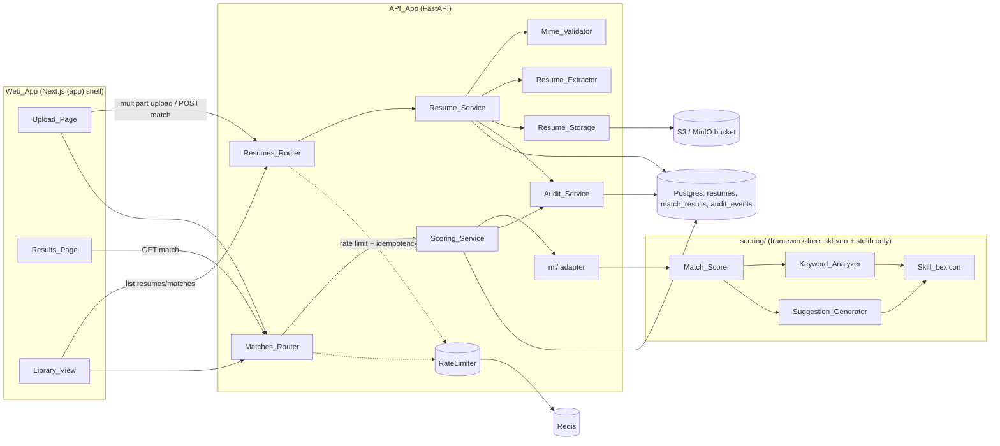
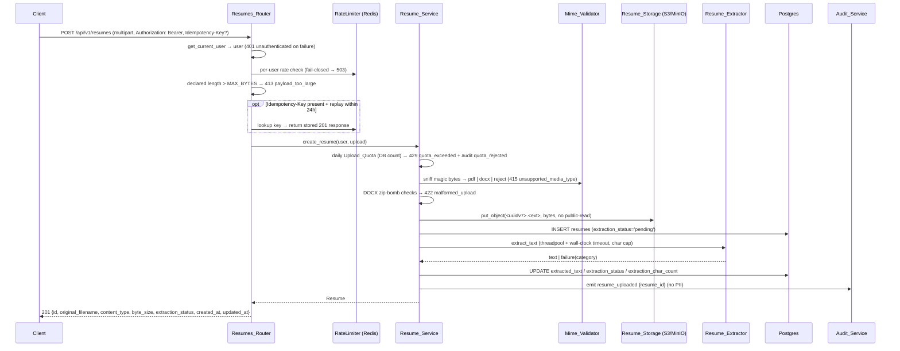
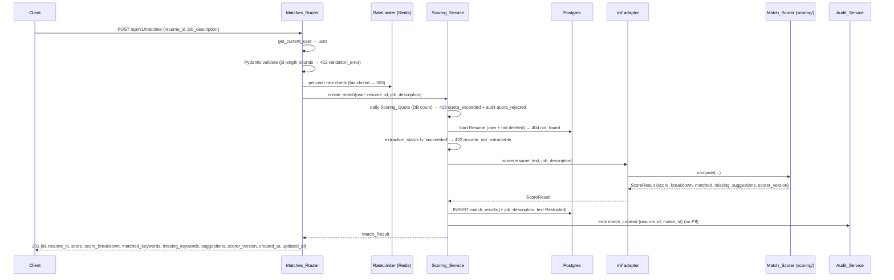

# Design Document

## Overview

`phase-1-matching` delivers the user-facing payoff of Phase 1: a logged-in user uploads a resume (PDF or DOCX), pastes a job description, and gets back a transparent 0–100 match score, a matched/missing keyword analysis, and rule-based improvement suggestions. All matching is **deterministic and non-LLM** — scikit-learn TF-IDF cosine similarity plus keyword/skill overlap against a committed `Skill_Lexicon` — honoring the "infrastructure before intelligence" principle in `product.md` and the $20/month cost ceiling.

This spec is the third and final Phase 1 spec. It is an _integration_ design more than a greenfield one: it composes against building blocks that already exist and that this document treats as fixed.

Reused, not redesigned (from `phase-1-foundation` and `phase-1-auth`):

- The FastAPI app factory `create_app` (`apps/api/src/matchlayer_api/main.py`) and its middleware/exception wiring.
- `Settings` / `get_settings()` (`config.py`) — every new variable is added here; S3 settings already exist and are reused verbatim.
- The async SQLAlchemy `engine` / `SessionLocal` / `get_session` dependency (`core/db.py`).
- `MatchLayerError` and `register_exception_handlers` (`core/errors.py`) — the RFC 7807 envelope. New error `type`s are raised as `MatchLayerError` instances.
- `get_current_user` (`core/dependencies.py`) — Bearer → `User`, already returning `unauthenticated` (401) for missing/invalid/wrong-type tokens and soft-deleted users. This satisfies Requirement 1.1–1.3 with **no change**.
- The Redis-backed `RateLimiter` primitive and `RateLimitDecision` (`core/rate_limit.py`), including its fail-closed-on-Redis-outage behavior.
- `Audit_Service` (`services/audit.py`) — append-only writer with per-event `TypedDict` payloads enforced by mypy overloads. This spec adds five event types.
- The `(app)` Authenticated_Shell layout, `useAuth`, `apiFetch`, and the `@matchlayer/shared-types` OpenAPI→TS+Zod codegen pipeline.

New surface introduced by this spec:

- API: `Resumes_Router` (`/api/v1/resumes`) and `Matches_Router` (`/api/v1/matches`), `Resume_Service`, `Scoring_Service`, `Resume_Storage`, `Mime_Validator`, `Resume_Extractor`.
- Scoring core: the framework-free `Match_Scorer`, `Keyword_Analyzer`, `Suggestion_Generator`, and `Skill_Lexicon`, plus the thin `ml/` adapter (`structure.md` separation).
- Persistence: `resumes` and `match_results` tables via Alembic migration `0002_resumes_and_matches`.
- Frontend: `Upload_Page`, `Results_Page`, `Library_View` inside the `(app)` shell.
- Non-indexing controls for the authenticated/PII surface (Requirement 15, ADR 0006): `(app)` layout `robots` metadata, an `X-Robots-Tag` response header on every `/api/v1/*` response, and a new `app/robots.ts`.

### Research notes that informed the design

- **Magic-byte MIME detection without a system dependency.** `python-magic` requires the `libmagic` system library (an extra container/dev install). `filetype` is pure-Python and detects both `application/pdf` (`%PDF` header) and `application/vnd.openxmlformats-officedocument.wordprocessingml.document` (DOCX is a ZIP/OOXML container). `security.md` permits either (`python-magic` **or** `filetype`); we choose `filetype` to avoid the system lib. (Content rephrased; see the `filetype` project docs.)
- **DOCX is a ZIP container, so zip-bomb defense is mandatory.** The stdlib `zipfile` module exposes `ZipInfo.file_size` (uncompressed) and the entry list _without_ decompressing, so the decompression-bomb checks in Requirement 2.4 can run before any extraction.
- **Bounded synchronous extraction.** `pypdf` (PDF) and `python-docx` (DOCX) are CPU-bound and synchronous. Running them directly on the event loop would block it; running them in a worker thread (`fastapi.concurrency.run_in_threadpool`) under an `asyncio.wait_for` wall-clock guard, combined with a cooperative time-check during page/paragraph iteration and a hard char cap, bounds worst-case work. True parsing isolation (a sandboxed worker) is deferred to Phase 4/SQS per `security.md` and the requirements scope.
- **TF-IDF determinism.** scikit-learn's `TfidfVectorizer` is deterministic for fixed parameters and inputs (no randomized initialization), and cosine similarity of two non-negative TF-IDF vectors lies in `[0, 1]`. This is what makes the scorer's determinism and boundedness properties hold (Requirements 5.3, 5.4).

---

## Architecture

### System context

The matching flow spans the existing FastAPI app, the new scoring core, Postgres, and the S3-compatible object store (MinIO locally), with Redis reused for per-minute rate limiting and 24-hour idempotency keys.



Import-boundary rule (Requirement 10.1, enforced by `tests/unit/test_import_boundaries.py`): the `scoring/` package (`Match_Scorer`, `Keyword_Analyzer`, `Suggestion_Generator`, `Skill_Lexicon`) imports **only** scikit-learn and the standard library — never `fastapi`, `sqlalchemy`, `matchlayer_api.config`, or any storage/web module. The only bridge from the API world into `scoring/` is `matchlayer_api/ml/scorer_adapter.py`, which marshals plain strings in and a plain dataclass out (Requirement 10.2).

### Upload data flow (`POST /api/v1/resumes`)



### Match data flow (`POST /api/v1/matches`)



### Cross-cutting middleware addition (Requirement 15.3)

A small ASGI middleware, `ApiNoIndexMiddleware`, is added in `create_app` and sets `X-Robots-Tag: noindex, nofollow` on **every** response whose path starts with `/api/v1/`, regardless of status code (including RFC 7807 error responses produced by the exception handlers). It is added so it wraps the exception-handling layer, guaranteeing the header survives on 4xx/5xx responses too. This is a privacy control (defense in depth), not only SEO (`seo.md`, ADR 0006).

---

## Components and Interfaces

Directory placement follows `structure.md`: routers under `api/<feature>/`, business logic under `services/`, cross-cutting infra under `core/`, the thin model bridge under `ml/`, and the framework-free scoring library in its own import-bounded `scoring/` subpackage. The `Skill_Lexicon` **source of truth** is the top-level `ml/` tree; the API consumes a committed artifact copy.

### Resumes_Router — `apps/api/src/matchlayer_api/api/resumes/router.py`

HTTP-shape concerns only; delegates to `Resume_Service`. Mounted by `create_app` via `app.include_router(resumes_router)`. Every route depends on `get_current_user` and a per-user rate-limit dependency.

| Method & path                 | Behavior                                                                                                                        | Key requirements   |
| ----------------------------- | ------------------------------------------------------------------------------------------------------------------------------- | ------------------ |
| `POST /api/v1/resumes`        | multipart `file`; 413 if declared length > `MATCHLAYER_RESUME_MAX_BYTES`; honors `Idempotency-Key`; 201 with the safe field set | 2.1, 2.2, 2.8, 2.9 |
| `GET /api/v1/resumes`         | cursor-paginated list of the caller's non-deleted resumes, `created_at` desc; `limit` 1–100 else 422                            | 4.1, 4.2, 4.3      |
| `GET /api/v1/resumes/{id}`    | single owned resume; 404 `not_found` if missing/deleted/other-owner                                                             | 4.4, 1.5, 1.6      |
| `DELETE /api/v1/resumes/{id}` | soft delete, 204, audit `resume_deleted`; idempotent                                                                            | 4.5, 4.6           |

Rate limiting and the 413 declared-length check live in the router (pre-service) because they must short-circuit before any object write (Requirement 2.2).

### Matches_Router — `apps/api/src/matchlayer_api/api/matches/router.py`

| Method & path                 | Behavior                                                                                                      | Key requirements  |
| ----------------------------- | ------------------------------------------------------------------------------------------------------------- | ----------------- |
| `POST /api/v1/matches`        | JSON `{resume_id, job_description}`; Pydantic + jd length bounds → 422; `Idempotency-Key`; 201 full field set | 8.1–8.3, 8.7, 8.9 |
| `GET /api/v1/matches`         | cursor-paginated list, `created_at` desc; items omit `job_description_text`                                   | 9.1, 9.2          |
| `GET /api/v1/matches/{id}`    | single owned match; returns even if its resume was later soft-deleted                                         | 9.3, 9.6          |
| `DELETE /api/v1/matches/{id}` | soft delete, 204, audit `match_deleted`; idempotent                                                           | 9.4, 9.5          |

### Resume_Service — `apps/api/src/matchlayer_api/services/resumes.py`

The **only** module that reads/writes the `resumes` table (Requirement 1.4 scoping enforced here: every query carries `WHERE user_id = :current_user`). Public surface (async):

```python
class Resume_Service:
    async def create_resume(self, session, *, user: User, upload: UploadFile,
                            idempotency_key: str | None) -> Resume: ...
    async def list_resumes(self, session, *, user: User, limit: int,
                           cursor: str | None) -> Page[Resume]: ...
    async def get_resume(self, session, *, user: User, resume_id: UUID) -> Resume: ...   # raises NotFoundError
    async def soft_delete_resume(self, session, *, user: User, resume_id: UUID) -> None:  # idempotent
        ...
```

`create_resume` orchestration: enforce `Upload_Quota` (DB count for the UTC day) → `Mime_Validator.detect` → DOCX zip-bomb guard → `Resume_Storage.put` under a UUIDv7 key → INSERT row (`extraction_status='pending'`) → `Resume_Extractor.extract` → UPDATE extraction columns → `Audit_Service.emit("resume_uploaded", payload={"resume_id": ...})`. PII discipline: `original_filename`, file bytes, and `extracted_text` are never logged or placed in audit payloads (Requirements 2.6, 3.6).

### Scoring_Service — `apps/api/src/matchlayer_api/services/matching.py`

The **only** module that reads/writes `match_results`. Public surface:

```python
class Scoring_Service:
    async def create_match(self, session, *, user: User, resume_id: UUID,
                           job_description: str, idempotency_key: str | None) -> MatchResult: ...
    async def list_matches(self, session, *, user: User, limit: int, cursor: str | None) -> Page[MatchResult]: ...
    async def get_match(self, session, *, user: User, match_id: UUID) -> MatchResult: ...
    async def soft_delete_match(self, session, *, user: User, match_id: UUID) -> None: ...
```

`create_match`: enforce `Scoring_Quota` (DB count, UTC day) → load owned, non-deleted `Resume` (404 else) → require `extraction_status == 'succeeded'` (422 `resume_not_extractable` else) → call `ml.scorer_adapter.score(resume.extracted_text, job_description)` → INSERT `match_results` (storing `job_description_text` Restricted) → audit `match_created`. `job_description_text` is never logged (Requirement 8.8).

### Resume_Storage — `apps/api/src/matchlayer_api/core/storage.py`

The only module that reads/writes resume file bytes. Wraps a `boto3` S3 client built from the existing `Settings` S3 fields (`s3_endpoint_url`, `s3_region`, `s3_access_key_id`, `s3_secret_access_key`, `s3_bucket`). boto3 is synchronous, so calls run via `fastapi.concurrency.run_in_threadpool` to keep the event loop free.

```python
class Resume_Storage:
    async def put(self, *, key: str, data: bytes, content_type: str) -> None: ...  # private ACL
    async def get(self, *, key: str) -> bytes: ...
```

`put` writes with no public-read (no public ACL set; MinIO/S3 default-private), satisfying Requirement 2.10. The object key is `<uuidv7>.<ext>` (`ext ∈ {pdf, docx}`) and **never** incorporates any part of the client filename (Requirement 2.5).

### Mime_Validator — `apps/api/src/matchlayer_api/core/mime.py`

`detect(data: bytes) -> Literal["pdf", "docx"] | None` using `filetype` magic-byte sniffing, ignoring the client `Content-Type` and extension entirely (Requirement 2.3). Returns `None` for anything other than PDF/DOCX, which the service maps to 415.

### Resume_Extractor — `apps/api/src/matchlayer_api/services/extraction.py`

`async extract(data: bytes, kind: Literal["pdf","docx"]) -> ExtractionOutcome`. Runs `pypdf` / `python-docx` in a worker thread under `asyncio.wait_for(..., timeout=MATCHLAYER_RESUME_EXTRACTION_TIMEOUT_SECONDS)`; iterates pages/paragraphs with a cooperative wall-clock check; truncates to `MATCHLAYER_RESUME_MAX_EXTRACTED_CHARS`. Returns `ExtractionOutcome(status, text, char_count, failure_category)` where `status ∈ {"succeeded","failed"}`. Whitespace-only or empty result → `failed` (Requirement 3.5). Never raises into the request path solely due to extraction failure (fail-soft, no 5xx). Failure logging names a category (`extraction_timeout`, `corrupt_document`, `empty_text`) and the resume id only — never bytes or text (Requirement 3.7).

### ml/ adapter — `apps/api/src/matchlayer_api/ml/scorer_adapter.py`

The thin bridge required by Requirement 10.2. It performs **no scoring arithmetic** — only marshalling:

```python
def score(resume_text: str, job_description: str) -> ScoreResult:
    scorer = get_scorer()          # cached Match_Scorer bound to the loaded Skill_Lexicon
    return scorer.score(resume_text, job_description)
```

`get_scorer()` constructs (once) a `Match_Scorer` from the loaded `Skill_Lexicon` and the configured weights. The adapter imports from `matchlayer_api.scoring`, never the reverse.

### Match_Scorer — `apps/api/src/matchlayer_api/scoring/scorer.py`

Framework-free, deterministic. Imports only scikit-learn (`TfidfVectorizer`, `cosine_similarity`) and stdlib.

```python
@dataclass(frozen=True)
class ScoreResult:
    score: int                       # 0..100
    breakdown: ScoreBreakdown
    matched_keywords: list[Keyword]  # ordered by descending weight
    missing_keywords: list[Keyword]  # ordered by descending weight
    suggestions: list[Suggestion]    # ordered by descending missing-keyword weight
    scorer_version: str

class Match_Scorer:
    def __init__(self, lexicon: Skill_Lexicon, *, w_similarity: float, w_keyword: float) -> None: ...
    def score(self, resume_text: str, job_description: str) -> ScoreResult: ...
```

Algorithm:

1. Normalize both texts (case-fold, collapse whitespace, lexicon alias substitution).
2. **Similarity component**: fit `TfidfVectorizer` on the two normalized documents; cosine similarity of the two vectors → `sim ∈ [0, 1]`.
3. **Keyword-coverage component**: delegate to `Keyword_Analyzer` to get the analyzed set, matched, and missing; `coverage = |matched| / |analyzed|` (0 when the analyzed set is empty).
4. **Combine**: `score = round(100 * (w_similarity * sim + w_keyword * coverage))`, clamped to `[0, 100]`.
5. Empty resume or empty JD after normalization → `score = 0`, both components `0` (Requirement 5.6).
6. Stamp `scorer_version` (see `Skill_Lexicon`).

### Keyword_Analyzer — `apps/api/src/matchlayer_api/scoring/keyword_analyzer.py`

```python
class Keyword_Analyzer:
    def analyze(self, resume_text: str, job_description: str) -> KeywordAnalysis: ...
```

`KeywordAnalysis` carries the analyzed set, `matched`, and `missing` (each a `list[Keyword]` of `{term, weight}`). The analyzed set is the union of (a) `Skill_Lexicon` canonical terms appearing in the JD and (b) the highest-weighted TF-IDF terms of the JD, capped at `MATCHLAYER_MATCH_MAX_KEYWORDS` (Requirement 6.1). Terms are normalized by case-fold + lexicon alias rules (6.2). The analyzed set is partitioned: `matched` = terms present in the normalized resume text, `missing` = terms absent (6.3). By construction `matched ∩ missing = ∅` and `matched ∪ missing = analyzed` (6.4), and every `matched` term is verifiably a substring (token match) of the normalized resume text (6.5). Both lists are ordered by descending weight (6.6).

### Suggestion_Generator — `apps/api/src/matchlayer_api/scoring/suggestions.py`

```python
class Suggestion_Generator:
    def generate(self, missing: list[Keyword]) -> list[Suggestion]: ...
```

Fixed rules/templates keyed off each missing term and its `Skill_Lexicon` metadata — no LLM/embedding/network (Requirement 7.1). At most `MATCHLAYER_MATCH_MAX_SUGGESTIONS`, ordered by descending missing-keyword weight (7.2). Each suggestion references exactly one missing keyword and phrases guidance as a user action; it never fabricates experience/employers/dates (7.5). Empty `missing` → exactly one affirmative suggestion (7.3). Deterministic for identical input + `Scorer_Version` (7.4).

### Skill_Lexicon — `apps/api/src/matchlayer_api/scoring/lexicon.py` + data artifact

Loads a committed JSON artifact via `importlib.resources` (stdlib). The artifact carries canonical skills, alias rules, optional per-term weights/metadata, and a `lexicon_version` string. `Scorer_Version = f"{ALGORITHM_VERSION}+lex.{lexicon_version}"` (Requirement 10.4) — changing the lexicon version changes the persisted `scorer_version`.

**Source of truth vs runtime artifact (Requirement 10.3, `structure.md`).** The canonical source lives under the top-level `ml/` tree (`ml/lexicon/skill_lexicon.v1.json`); the regeneration script lives at `ml/pipelines/build_skill_lexicon.py` and is **never imported by the API at runtime**. The API consumes a committed copy shipped as package data (`apps/api/src/matchlayer_api/scoring/data/skill_lexicon.v1.json`). A CI drift check (mirroring the existing `.env` and OpenAPI drift checks) fails the build if the copy diverges from the `ml/` source. Tradeoff: one committed copy of a small JSON file in exchange for keeping the API container free of the `ml/` training lineage — consistent with `structure.md` ("the API imports trained artifacts, not training code").

### Quota enforcement — in `Resume_Service` / `Scoring_Service`

Daily quotas are computed by **counting rows in Postgres** for the current UTC calendar day (`created_at >= start_of_utc_day`), keyed on `user_id`. This makes quotas exact and durable, and independent of Redis (so a Redis outage does not silently disable the cost-as-DoS control). `Upload_Quota` counts all `resumes` rows created today by the user (including later-soft-deleted ones — the upload still happened); `Scoring_Quota` counts `match_results` rows. On exceed: 429 `quota_exceeded` with a `detail` naming the limit and the UTC reset time, no underlying work performed, and an audit `quota_rejected` row naming the category (Requirement 11.6).

### Per-user rate limiting and idempotency — `core/dependencies.py` (extension)

A new dependency factory `user_rate_limit(endpoint: Literal["resume","match"])` `Depends(get_current_user)` then calls the existing `RateLimiter` with key `rl:{endpoint}:user:{user_id}`, window 60s, limit from `MATCHLAYER_RESUME_RATE_LIMIT_PER_MIN` / `MATCHLAYER_MATCH_RATE_LIMIT_PER_MIN`. It reuses `RateLimitDecision` and raises the existing `RateLimited` (→ 429 `rate_limited` + `Retry-After`) or `RateLimiterUnavailableError` (→ 503 `rate_limiter_unavailable`, fail-closed) — both already mapped in `core/errors.py` (Requirements 11.1–11.3, 11.7).

**Idempotency** (Requirements 2.8, 8.9): mutating POSTs accept `Idempotency-Key`. The key is stored in Redis as `idem:{user_id}:{route}:{key}` with a 24h TTL, holding the created resource id and the serialized 201 response. A replay within 24h returns the stored response without a second object write or row insert. Redis-backed (rather than a third table) keeps the migration to exactly the two tables Requirement 14.2 enumerates; the rate-limiter's fail-closed behavior already gates the Redis-down case before idempotency logic runs.

### Audit_Service additions — `services/audit.py`

Five new `event_type`s with `TypedDict` payloads and matching `emit` overloads (no PII, internal IDs only):

| event_type        | payload                                | requirement |
| ----------------- | -------------------------------------- | ----------- |
| `resume_uploaded` | `{resume_id: str}`                     | 2.7         |
| `resume_deleted`  | `{resume_id: str}`                     | 4.5         |
| `match_created`   | `{resume_id: str, match_id: str}`      | 8.6         |
| `match_deleted`   | `{match_id: str}`                      | 9.4         |
| `quota_rejected`  | `{quota: Literal["upload","scoring"]}` | 11.6        |

The `user_id` principal is passed via the existing `user_id=` argument (the FK column), not the payload.

### Frontend components — `apps/web/src/app/(app)/`

All three pages live inside the existing `(app)` Authenticated_Shell, inheriting its session-gating redirect to `/login` (Requirement 12.1, 13.1). They use the generated client + Zod schemas from `@matchlayer/shared-types` (Requirements 12.7, 13.1) and `apiFetch` for Bearer attachment + silent refresh.

- **`(app)/upload/page.tsx` — Upload_Page.** `'use client'`. File input restricted to `.pdf`/`.docx` and a labeled `<textarea>` for the JD (`id`/`for` association). Client-side pre-validation against `MATCHLAYER_RESUME_MAX_BYTES` and accepted types before issuing the request (12.4); form validation via the generated Zod schemas; errors announced through an `aria-live="polite"` region rendering the RFC 7807 `detail` for 413/415/422/429 (12.3, 12.5). Design-token styling, "app shell: calm", WCAG AA in both themes (12.6). Uploads via `FormData` (supported by `apiFetch`), then navigates to `POST /api/v1/matches` and on to the Results_Page.
- **`(app)/matches/[id]/page.tsx` — Results_Page.** Fetches the match via `GET /api/v1/matches/{id}`. Animated count-up to the score with the signature violet→cyan gradient on the score number (13.2); matched terms in the `success` token family, missing terms in `warning`, suggestions as a readable list (13.3); `score_breakdown` rendered so similarity, coverage, and weights are visible (13.4). All match-derived content rendered as **plain text** — never `dangerouslySetInnerHTML` (13.7). Honors `prefers-reduced-motion` via the existing `motion-safe` hook: animation disabled, final values shown resolved (13.5). 404 → friendly not-found state, not a raw error (13.6).
- **`(app)/library/page.tsx` — Library_View.** Lists the user's resumes and recent matches, each match linking to its Results_Page; WCAG AA in both themes (13.8).

### Non-indexing controls — frontend (Requirement 15)

- **`(app)/layout.tsx`**: add `export const metadata: Metadata = { robots: { index: false, follow: false } }` so all nested authenticated routes inherit `noindex, nofollow` (15.2). The existing `force-dynamic`/session-gating behavior is unchanged. No sitemap/canonical/OG metadata is added to any `(app)` route (15.1).
- **`apps/web/src/app/robots.ts`** (new — none exists today): a `MetadataRoute.Robots` that disallows `/api/`, `/upload`, `/matches`, `/library`, and `/dashboard` (15.4).
- **Sitemap**: none exists yet (owned by `seo-foundation`). Requirement 15.5 is forward-looking; this design records the constraint that when `app/sitemap.ts` lands it must exclude these routes. No publicly shareable result is introduced (15.6), and indexing controls are treated as defense-in-depth, not a substitute for auth (15.7).

---

## Data Models

### SQLAlchemy models — `apps/api/src/matchlayer_api/db/models.py` (additions)

Mirror the existing conventions: `PG_UUID(as_uuid=True)` PK defaulting to `_uuid7`, `timestamptz` with `server_default=text("now()")`, nullable `deleted_at`, `JSONB` for structured columns.

```python
class Resume(Base):
    __tablename__ = "resumes"
    id: Mapped[UUID] = mapped_column(PG_UUID(as_uuid=True), primary_key=True, default=_uuid7)
    user_id: Mapped[UUID] = mapped_column(
        PG_UUID(as_uuid=True), ForeignKey("users.id", ondelete="CASCADE"), nullable=False)
    original_filename: Mapped[str] = mapped_column(Text, nullable=False)   # display-only, Restricted PII
    storage_key: Mapped[str] = mapped_column(Text, nullable=False)         # <uuidv7>.<ext>
    content_type: Mapped[str] = mapped_column(Text, nullable=False)
    byte_size: Mapped[int] = mapped_column(Integer, nullable=False)
    extracted_text: Mapped[str | None] = mapped_column(Text, nullable=True)   # Restricted PII
    extraction_status: Mapped[str] = mapped_column(Text, nullable=False)      # pending|succeeded|failed
    extraction_char_count: Mapped[int | None] = mapped_column(Integer, nullable=True)
    created_at / updated_at / deleted_at  # as in existing models

class MatchResult(Base):
    __tablename__ = "match_results"
    id: Mapped[UUID] = mapped_column(PG_UUID(as_uuid=True), primary_key=True, default=_uuid7)
    user_id: Mapped[UUID] = mapped_column(
        PG_UUID(as_uuid=True), ForeignKey("users.id", ondelete="CASCADE"), nullable=False)
    resume_id: Mapped[UUID] = mapped_column(
        PG_UUID(as_uuid=True), ForeignKey("resumes.id", ondelete="CASCADE"), nullable=False)
    job_description_text: Mapped[str] = mapped_column(Text, nullable=False)   # Restricted PII
    score: Mapped[int] = mapped_column(Integer, nullable=False)               # 0..100
    score_breakdown: Mapped[dict] = mapped_column(JSONB, nullable=False)
    matched_keywords: Mapped[list] = mapped_column(JSONB, nullable=False)
    missing_keywords: Mapped[list] = mapped_column(JSONB, nullable=False)
    suggestions: Mapped[list] = mapped_column(JSONB, nullable=False)
    scorer_version: Mapped[str] = mapped_column(Text, nullable=False)
    created_at / updated_at / deleted_at
```

### Alembic migration — `apps/api/alembic/versions/0002_resumes_and_matches.py`

`revision = "0002_resumes_and_matches"`, `down_revision = "0001_users_and_auth"` (Requirement 14.1). `upgrade()` creates both tables (columns above) and indexes; `downgrade()` drops indexes then tables in reverse order (14.4). No fine-grained grants are needed: `0001`'s `ALTER DEFAULT PRIVILEGES ... GRANT SELECT, INSERT, UPDATE, DELETE ON TABLES TO matchlayer_app` already covers newly created tables (the audit_events REVOKE is specific to that table).

Indexes (with the migration documenting _why_, per `conventions.md`, Requirement 14.3):

- `resumes_user_id_idx` on `resumes(user_id)` — every list/get query filters by `user_id`.
- `match_results_user_id_idx` on `match_results(user_id)` — same.
- `match_results_resume_id_idx` on `match_results(resume_id)` — the 9.6 lookup joins matches to a resume.
- (supporting cursor pagination) composite `resumes_user_created_idx` on `resumes(user_id, created_at DESC, id DESC)` and `match_results_user_created_idx` on `match_results(user_id, created_at DESC, id DESC)` — back the keyset pagination `ORDER BY created_at DESC, id DESC`.

### Pydantic schemas — `api/resumes/schemas.py`, `api/matches/schemas.py`

```python
class ResumeResponse(BaseModel):           # 2.9, 4.2 — excludes extracted_text & storage_key
    id: str; original_filename: str; content_type: str; byte_size: int
    extraction_status: Literal["pending","succeeded","failed"]
    created_at: datetime; updated_at: datetime

class ResumeListResponse(BaseModel):
    items: list[ResumeResponse]; next_cursor: str | None

class CreateMatchRequest(BaseModel):
    resume_id: str
    job_description: str = Field(min_length=1)   # trimmed-length bounds enforced by validator (8.3)

class KeywordOut(BaseModel):  term: str; weight: float
class SuggestionOut(BaseModel): keyword: str; text: str
class ScoreBreakdownOut(BaseModel):
    similarity_component: float; keyword_coverage_component: float
    weight_similarity: float; weight_keyword: float; final_score: int

class MatchResponse(BaseModel):             # 8.7
    id: str; resume_id: str; score: int
    score_breakdown: ScoreBreakdownOut
    matched_keywords: list[KeywordOut]; missing_keywords: list[KeywordOut]
    suggestions: list[SuggestionOut]; scorer_version: str
    created_at: datetime; updated_at: datetime

class MatchListItem(BaseModel):             # 9.2 — omits job_description_text
    id: str; resume_id: str; score: int; created_at: datetime
class MatchListResponse(BaseModel): items: list[MatchListItem]; next_cursor: str | None
```

The `job_description` length bounds (`MATCHLAYER_JD_MIN_CHARS`..`MATCHLAYER_JD_MAX_CHARS`, after trim) are enforced by a field validator that raises so the request returns 422 `validation_error` (8.3).

### JSONB column shapes

```jsonc
// match_results.score_breakdown
{ "similarity_component": 0.42, "keyword_coverage_component": 0.667,
  "weight_similarity": 0.6, "weight_keyword": 0.4, "final_score": 52 }

// match_results.matched_keywords / missing_keywords (ordered by descending weight)
[ { "term": "python", "weight": 0.91 }, { "term": "fastapi", "weight": 0.77 } ]

// match_results.suggestions (ordered by descending missing-keyword weight)
[ { "keyword": "kubernetes",
    "text": "Add a bullet describing hands-on Kubernetes experience if you have it." } ]
```

### Settings additions — `config.py`

New `MATCHLAYER_*` fields (defaults match Requirement 14.6); object storage reuses the existing S3 fields (Requirement 14.7, no second credential set):

```python
resume_max_bytes: int = 5_242_880
resume_max_decompressed_bytes: int = 52_428_800
resume_max_archive_entries: int = 256
resume_extraction_timeout_seconds: int = 15
resume_max_extracted_chars: int = 200_000
jd_min_chars: int = 30
jd_max_chars: int = 50_000
match_max_keywords: int = 50
match_max_suggestions: int = 10
score_weight_similarity: float = 0.6
score_weight_keyword: float = 0.4
resume_rate_limit_per_min: int = 10
match_rate_limit_per_min: int = 20
resume_daily_quota: int = 20
match_daily_quota: int = 50
```

A `model_validator` asserts `score_weight_similarity + score_weight_keyword == 1.0` at startup (Requirement 5.3), failing fast like the existing JWT-secret validator. `.env.example` gains one entry per new variable with the default as placeholder, and the README runbook documents MinIO bucket provisioning (`mc mb`), an end-to-end upload+match walkthrough, and quota tuning (Requirements 14.6, 14.8). The CI `.env` drift check must pass (14.9).

### New dependencies — `apps/api/pyproject.toml`

Runtime: `scikit-learn>=1.5,<2.0` (scorer; pulls numpy/scipy — no runtime cost, fits the ceiling), `boto3>=1.34,<2.0` (S3/MinIO), `pypdf>=4.2,<6.0`, `python-docx>=1.1,<2.0`, `filetype>=1.2,<2.0`. No `sentence-transformers`, spaCy, embedding, or LLM dependency is added (Requirements 5.8, 10.5). `hypothesis` is already a dev dependency.

### OpenAPI codegen impact

The new endpoints flow through the existing pipeline: FastAPI emits OpenAPI → `pnpm codegen` regenerates `packages/shared-types/src/api-types.ts` + `api-schemas.ts` → curated re-exports added to `index.ts` (`ResumeResponse`, `ResumeListResponse`, `CreateMatchRequest`, `MatchResponse`, `MatchListResponse`, and their `*Schema` Zod objects). The CI codegen drift check keeps frontend and backend in lockstep (`conventions.md`).

---

## Correctness Properties

_A property is a characteristic or behavior that should hold true across all valid executions of a system — essentially, a formal statement about what the system should do. Properties serve as the bridge between human-readable specifications and machine-verifiable correctness guarantees._

This feature is well-suited to property-based testing: the scoring core (`Match_Scorer`, `Keyword_Analyzer`, `Suggestion_Generator`) is pure, deterministic, and has clear universal properties (boundedness, determinism, partition, soundness, idempotence), and several API behaviors (per-user isolation, response-shape exclusion, idempotency, the `X-Robots-Tag` invariant, keyset pagination) are universal over generated inputs. The recommended library is **Hypothesis** — the repo already ships a `.hypothesis` cache and lists `hypothesis>=6.100,<7.0` in `apps/api`'s dev dependencies, and existing property tests live under `apps/api/tests/property/`. Each property below maps to one Hypothesis test (≥100 iterations) tagged with its feature and property number and text. UI rendering, IaC-like config/migration, and the "never logged" negatives are deliberately handled by other test types (see Testing Strategy).

The prework consolidated redundant criteria: the two idempotency criteria (2.8, 8.9) collapse into one parametrized property; soft-delete idempotence (4.6, 9.5) into one; keyset pagination (4.1, 9.1) into one; the resume response-shape exclusion (2.9, 4.2) into one; and the keyword partition (6.3) is subsumed by the disjoint-union (6.4) and matched-soundness (6.5) properties.

### Property 1: Score is always a bounded integer

_For any_ resume text and _any_ job-description text, `Match_Scorer.score` returns a `score` that is an integer in the inclusive range `0..100`.

**Validates: Requirements 5.1, 5.3**

### Property 2: Scoring is deterministic

_For any_ resume text and _any_ job-description text, two invocations of `Match_Scorer.score` with the same inputs and the same `Scorer_Version` produce identical `score`, identical `score_breakdown`, identical `matched_keywords`, identical `missing_keywords`, and identical `suggestions`.

**Validates: Requirements 5.4, 5.7**

### Property 3: Keyword-coverage equals the matched fraction and the breakdown is consistent

_For any_ resume text and _any_ job-description text, the `score_breakdown` reports the similarity component, the keyword-coverage component, both applied weights, and a `final_score` equal to the returned `score`; and the keyword-coverage component equals `|matched_keywords| / |analyzed set|` (defined as `0` when the analyzed set is empty).

**Validates: Requirements 5.2, 5.5**

### Property 4: Empty resume or empty job description scores zero without error

_For any_ resume text that is empty or whitespace-only, or _any_ job-description text that is empty or whitespace-only (after normalization), `Match_Scorer.score` returns `score == 0` with both `score_breakdown` component values equal to `0`, and does not raise.

**Validates: Requirements 5.6**

### Property 5: The analyzed keyword set is bounded and well-formed

_For any_ job-description text, the analyzed keyword set has cardinality at most `MATCHLAYER_MATCH_MAX_KEYWORDS` and every analyzed term is a member of the union of (a) `Skill_Lexicon` canonical terms found in the job description and (b) the top-weighted TF-IDF terms of the job description.

**Validates: Requirements 6.1**

### Property 6: Matched and missing partition the analyzed set

_For any_ resume text and _any_ job-description text, `matched_keywords` and `missing_keywords` are disjoint and their union equals the analyzed keyword set.

**Validates: Requirements 6.3, 6.4**

### Property 7: Every matched keyword is present in the resume

_For any_ resume text and _any_ job-description text, every term in `matched_keywords` is verifiably present in the normalized resume text.

**Validates: Requirements 6.5**

### Property 8: Lexicon aliases are treated as the same keyword

_For any_ analyzed term that has a `Skill_Lexicon` alias, replacing that term in the resume text with its alias (or vice versa) leaves the term classified as matched — a term and its lexicon-defined alias are interchangeable for matching.

**Validates: Requirements 6.2**

### Property 9: Keyword and suggestion lists are ordered by descending weight

_For any_ resume text and _any_ job-description text, `matched_keywords` and `missing_keywords` are each ordered by non-increasing keyword weight, and `suggestions` are ordered by non-increasing weight of the missing keyword each addresses.

**Validates: Requirements 6.6, 7.2**

### Property 10: Suggestions are bounded and derived only from missing keywords

_For any_ `missing_keywords` set, `Suggestion_Generator.generate` returns at most `MATCHLAYER_MATCH_MAX_SUGGESTIONS` suggestions and every suggestion references a keyword that is a member of the `missing_keywords` set (no fabricated or unrelated terms).

**Validates: Requirements 7.1, 7.2, 7.5**

### Property 11: Empty missing set yields exactly one affirmative suggestion

_For any_ invocation in which `missing_keywords` is empty, `Suggestion_Generator.generate` returns exactly one affirmative suggestion (not an empty list).

**Validates: Requirements 7.3**

### Property 12: Suggestion generation is deterministic

_For any_ `missing_keywords` set, two invocations of `Suggestion_Generator.generate` with the same input and the same `Scorer_Version` produce an identical ordered suggestion list.

**Validates: Requirements 7.4**

### Property 13: Non-PDF/DOCX bytes are rejected by magic-byte detection

_For any_ byte payload whose true content is neither a PDF nor a DOCX/OOXML container, `Mime_Validator.detect` returns `None` (driving a 415), regardless of any declared `Content-Type` header or filename extension.

**Validates: Requirements 2.3**

### Property 14: Storage keys never incorporate the client filename

_For any_ client-supplied filename (including path-traversal, Unicode, or overlong names) accepted as a PDF or DOCX, the derived storage key matches `^[0-9a-f-]{36}\.(pdf|docx)$` and contains no portion of the filename stem.

**Validates: Requirements 2.5**

### Property 15: Extracted text is truncated and counted consistently

_For any_ extracted text, the stored `extracted_text` length is at most `MATCHLAYER_RESUME_MAX_EXTRACTED_CHARS`, and `extraction_char_count` equals the length of the stored text.

**Validates: Requirements 3.3**

### Property 16: Extraction fails soft

_For any_ file bytes that cannot yield at least one non-whitespace character (corrupt, empty, whitespace-only, or timing out), the resume's `extraction_status` is set to `failed`, `extracted_text` is left null, and the originating `POST /api/v1/resumes` request does not return a 5xx solely because of the extraction outcome.

**Validates: Requirements 3.5**

### Property 17: Resume response never exposes sensitive fields

_For any_ `Resume`, the serialized resume response (both the single-item and list-item shapes) contains exactly the safe field set `{id, original_filename, content_type, byte_size, extraction_status, created_at, updated_at}` and never contains `extracted_text` or `storage_key`.

**Validates: Requirements 2.9, 4.2**

### Property 18: Match creation response carries the full field set

_For any_ successfully created `Match_Result`, the 201 response body contains exactly `{id, resume_id, score, score_breakdown, matched_keywords, missing_keywords, suggestions, scorer_version, created_at, updated_at}`, and the match-list item shape contains `{id, resume_id, score, created_at}` and never `job_description_text`.

**Validates: Requirements 8.7, 9.2**

### Property 19: Per-user scoping never leaks another user's rows

_For any_ two distinct User_Accounts each owning an arbitrary set of resumes and matches, every list and get performed as one user returns only rows owned by that user — no query result ever includes a row owned by the other user.

**Validates: Requirements 1.4**

### Property 20: Keyed mutations are idempotent

_For any_ valid upload request and _any_ valid match-creation request carrying an `Idempotency-Key`, issuing the identical request twice within 24 hours returns the original response both times and creates exactly one resource (one stored object / one `resumes` row for upload; one `match_results` row for match), never two.

**Validates: Requirements 2.8, 8.9**

### Property 21: Soft deletion is idempotent

_For any_ owned resume or match, issuing `DELETE` twice returns 204 both times and results in exactly one corresponding `resume_deleted` / `match_deleted` audit event (the second delete inserts no additional audit row).

**Validates: Requirements 4.6, 9.5**

### Property 22: Listing is correctly ordered and paginates completely

_For any_ set of a user's resumes (or matches), walking the cursor-paginated list endpoint from the first page to exhaustion yields every non-deleted row owned by that user exactly once, in strictly non-increasing `created_at` (ties broken by descending `id`) order, and yields no soft-deleted row.

**Validates: Requirements 4.1, 9.1**

### Property 23: Every API response is marked non-indexable

_For any_ request to a `/api/v1/*` endpoint defined by this spec and _any_ resulting outcome (success or an error status such as 401, 404, 413, 415, 422, 429, 503), the response carries the header `X-Robots-Tag: noindex, nofollow`.

**Validates: Requirements 15.3**

---

## Error Handling

All errors use the existing RFC 7807 envelope from `core/errors.py` (`{type, title, detail, status, request_id}`) and are raised as `MatchLayerError` (or its existing dependency-mapped subclasses). `detail` is always PII-safe (never resume text, JD text, or filenames — `security.md`). The `X-Robots-Tag` middleware applies to error responses too (Property 23).

### Type catalog introduced/used by this spec

| `type`                     | Status | Raised when                                                               | Requirement        |
| -------------------------- | ------ | ------------------------------------------------------------------------- | ------------------ |
| `unauthenticated`          | 401    | missing/invalid/wrong-type token, soft-deleted user (existing dependency) | 1.2, 1.3           |
| `not_found`                | 404    | resource missing, soft-deleted, or owned by another user (no disclosure)  | 1.5, 1.6, 4.4, 8.4 |
| `payload_too_large`        | 413    | declared upload length > `MATCHLAYER_RESUME_MAX_BYTES`                    | 2.2                |
| `unsupported_media_type`   | 415    | magic-byte type is neither PDF nor DOCX                                   | 2.3                |
| `malformed_upload`         | 422    | DOCX zip-bomb (decompressed size or entry count over limits)              | 2.4                |
| `validation_error`         | 422    | Pydantic failure; `limit` out of 1–100; JD length out of bounds           | 4.3, 8.2, 8.3      |
| `resume_not_extractable`   | 422    | match references a resume whose `extraction_status != 'succeeded'`        | 8.5                |
| `rate_limited`             | 429    | per-user per-minute rate limit exceeded (existing `RateLimited`)          | 11.3               |
| `quota_exceeded`           | 429    | daily Upload/Scoring quota exceeded; `detail` states limit + UTC reset    | 11.6               |
| `rate_limiter_unavailable` | 503    | Redis unreachable on a rate check (existing, fail-closed)                 | 11.7               |

New `MatchLayerError` subclasses (`PayloadTooLargeError`, `UnsupportedMediaTypeError`, `MalformedUploadError`, `ResumeNotExtractableError`, `QuotaExceededError`, `NotFoundError`) set their `status_code`/`error_type`/`title`; `unauthenticated`, `rate_limited`, and `rate_limiter_unavailable` reuse the handlers already registered. `Retry-After` is set on 429 `quota_exceeded` (seconds until UTC midnight) and on 429/503 rate-limit responses (existing behavior).

### Fail-soft vs fail-fast

- **Extraction failure is fail-soft**: never turns an upload into a 5xx (Property 16); the resume persists with `extraction_status='failed'` and is simply not matchable until re-uploaded.
- **Redis outage is fail-closed**: rate-limit check → 503, no upload/scoring performed (Requirement 11.7). Daily quotas are computed in Postgres, so they remain enforced even if Redis is degraded.
- **Audit-write failure on a mutation path** aborts the mutation (the audit row shares the transaction, per `Audit_Service` / `security.md`); audit-write failure on a pre-mutation reject path is logged but does not mask the user-facing rejection (existing rate-limit precedent).

---

## Testing Strategy

The dual approach from `conventions.md`: example/integration tests for concrete behavior and edge/error cases, property-based tests (Hypothesis, ≥100 iterations) for the universal properties above. Backend tests live under `apps/api/tests/{unit,integration,property}`; frontend tests under `apps/web/tests` (Vitest + Testing Library).

### Unit tests (`tests/unit/`)

- `Match_Scorer`, `Keyword_Analyzer`, `Suggestion_Generator`, `Mime_Validator`, `Resume_Extractor` in isolation — pure functions, no DB/HTTP.
- Concrete examples: a strong-match pair, a clear mismatch, a keyword-stuffed adversarial pair (reuse `ml/evals/datasets/eyeball/`).
- `ml/scorer_adapter` delegates without computing (Requirement 10.2).
- Extend `tests/unit/test_import_boundaries.py` so `matchlayer_api.scoring.*` imports only scikit-learn + stdlib (Requirements 5.8, 10.1) and the API never imports `ml/pipelines` (10.3).

### Integration tests (`tests/integration/`, real Postgres)

Reuse the existing harness: docker-compose Postgres, the `client_with_session` ASGI fixture, the autouse truncate fixture, and unique-email factories. Add factories for resumes and matches. Cover the example/edge criteria: auth gating (1.1–1.3, 1.5, 1.6), upload happy path + 413/415/422 (2.1–2.4, 2.7), list/get/delete (4.4, 4.5, 4.7, 9.3, 9.4, 9.6), match creation + 404/422 (8.1–8.6), rate-limit/quota envelopes (11.1–11.7), and the "never logged" PII negatives (2.6, 3.6, 3.7, 8.8) using the log-capture pattern from `test_logging_redaction.py`. MinIO-backed storage test for the no-public-read guarantee (2.10). Migration apply/rollback and schema/index assertions (14.1–14.5). `X-Robots-Tag` presence across success and error statuses backs Property 23.

### Property-based tests (`tests/property/`, Hypothesis)

One test per property (1–23), each tagged with the feature name and the property number and text (`Feature: phase-1-matching`, property number, property text), and configured for ≥100 examples. Generators: random unicode/ascii text for resume/JD (including empty/whitespace strategies for Property 4), random byte blobs and real PDF/DOCX fixtures with mismatched extensions for Property 13, adversarial filenames for Property 14, and small in-memory user/row models for the scoping/pagination/idempotence/soft-delete properties (19–22) driven through the service layer against the test Postgres. Scoring properties (1–12) run fully in-memory with no DB or network. Do not implement PBT from scratch — use Hypothesis.

### Frontend tests (`apps/web/tests/`, Vitest + Testing Library)

Component/behavior tests for the Upload_Page (accept attribute, label association, client pre-validation, `aria-live` error rendering of RFC 7807 `detail`: 12.2–12.5), Results_Page (score render, matched/missing token families, breakdown, `prefers-reduced-motion` resolved state via `matchMedia` mock, friendly 404, plain-text rendering / no `dangerouslySetInnerHTML`: 13.2–13.7), and Library_View (list + links: 13.8). Static/lint guards: pages import API types/Zod from `@matchlayer/shared-types` (12.7), no `dangerouslySetInnerHTML` on match content (13.7). Non-indexing: assert the `(app)` layout exports `robots: {index:false, follow:false}` (15.2) and that `app/robots.ts` disallows `/api/`, `/upload`, `/matches`, `/library`, `/dashboard` (15.4); a guard test asserts any future `app/sitemap.ts` excludes `(app)` routes (15.5). `axe` checks and manual light/dark contrast for WCAG AA (12.6, 13.8) — note full WCAG validation requires manual testing with assistive technologies.

### Not property-tested (and why)

- **UI rendering/animation, design tokens, contrast** (12.x, 13.x) — snapshot/component/axe + manual review, not universal input properties.
- **Migration, `.env`/OpenAPI drift, dependency-set, import boundaries** (10.x, 14.x, 5.8) — one-shot structural/smoke checks; behavior does not vary with input.
- **"Never logged" PII negatives** (2.6, 3.6, 8.8) — asserted by log-capture example tests; a negative-existence claim is more reliably checked with sentinels than with generated inputs.
- **Infrastructure config** (2.10 no-public-read, 11.7 Redis fail-closed) — integration tests with 1–2 representative cases.
