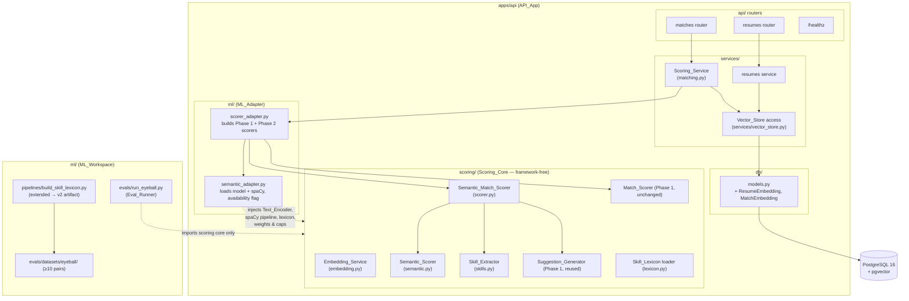
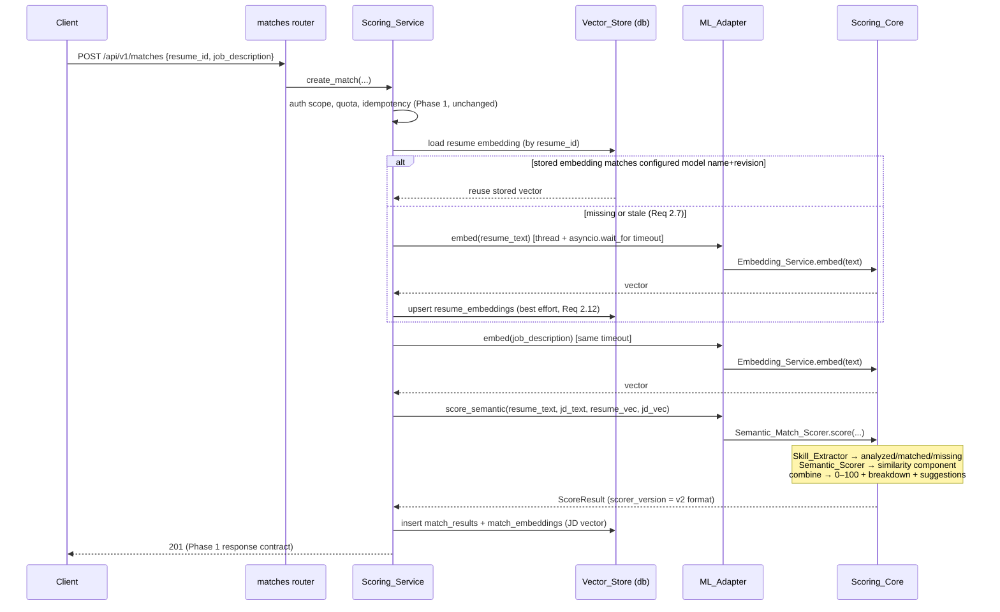
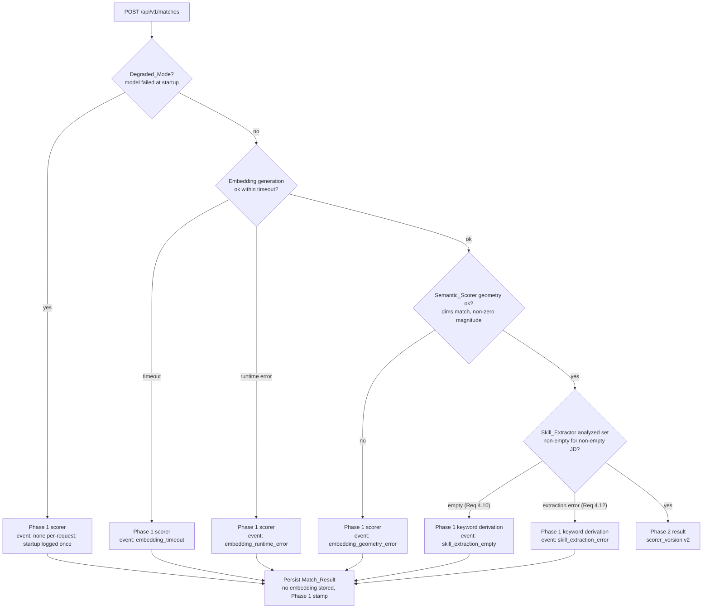
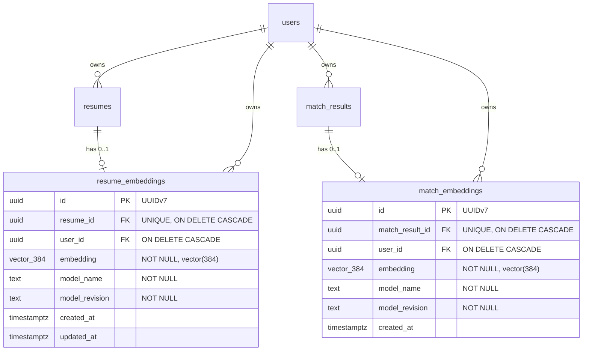

# Design Document — phase-2-nlp-embeddings

## Overview

Phase 2 upgrades the intelligence of the Phase 1 matching pipeline without changing its shape. Three things change inside `POST /api/v1/matches`:

1. **The similarity component** of the match score is computed from sentence embeddings (cosine similarity of two pgvector-persisted vectors) instead of single-pair TF-IDF cosine.
2. **The keyword component** is fed by a spaCy-based `Skill_Extractor` whose output is skill-only by construction (every term is a canonical `Skill_Lexicon` term), structurally retiring the Phase 1 TF-IDF-plus-stopword-blocklist derivation and its generic-term leak ("check", "selection").
3. **PostgreSQL gains pgvector** (ADR 0004): resume embeddings are persisted at upload time and reused across match requests; job-description embeddings are persisted with each match result.

Everything else is continuity: the `Match_Scorer` combination contract (weighted blend → 0–100 integer), the API contracts of every Phase 1 endpoint, the rule-based suggestions engine, the empty-input contract, per-user scoping, and the framework-free `Scoring_Core` / `ML_Adapter` / `ML_Workspace` boundaries. The Phase 1 deterministic scorer is retained intact as the fallback engine: if the embedding model fails to load at startup (Degraded_Mode), times out, or errs on an individual request, scoring falls back to Phase 1 behavior with a distinguishing `scorer_version` stamp — an ML artifact problem never takes down the core flow.

Cost and hosting constraints are first-class: the embedding model is an open-source Sentence Transformers model running in-process on the Fly.io backend (no LLMs, no paid inference, no third-party AI calls), and the design targets the sub-$20/month ceiling.

### Key design decisions

| #   | Decision                                                                                                                        | Rationale                                                                                                                                                                                                                                                                                                                                                                                                                                                                                                                                                                                                                                                                                                                                                                                                  |
| --- | ------------------------------------------------------------------------------------------------------------------------------- | ---------------------------------------------------------------------------------------------------------------------------------------------------------------------------------------------------------------------------------------------------------------------------------------------------------------------------------------------------------------------------------------------------------------------------------------------------------------------------------------------------------------------------------------------------------------------------------------------------------------------------------------------------------------------------------------------------------------------------------------------------------------------------------------------------------- |
| D1  | **Embedding model: `sentence-transformers/all-MiniLM-L6-v2`** (384-dim), pinned by name + HF revision                           | Smaller than `bge-small-en-v1.5` (22.7M vs 33M params, ~87MB vs ~127MB fp32 weights) and faster on CPU — decisive on a memory-constrained Fly.io machine (Req 10.1). Both candidates output 384 dimensions, so a later quality-driven switch to bge-small needs no schema migration (only a new reviewed migration decision per Req 1.7 is avoided entirely; re-embedding is governed by the model-metadata columns per Req 2.7/2.10). bge-small's edge is retrieval quality with a query-instruction prefix, which fits asymmetric query→document retrieval better than our symmetric document↔document similarity. Sources: HF model cards for [all-MiniLM-L6-v2](https://huggingface.co/sentence-transformers/all-MiniLM-L6-v2) and [bge-small-en-v1.5](https://huggingface.co/BAAI/bge-small-en-v1.5). |
| D2  | **Separate embedding tables** (`resume_embeddings`, `match_embeddings`) rather than vector columns on `resumes`/`match_results` | Leaves Phase 1 tables and their write paths untouched (Req 6.4), lets the model-name/revision metadata be `NOT NULL` (Req 2.10) without widening Phase 1 rows with nullables, and gives the FK-based ownership/association enforcement of Req 1.8 a natural home.                                                                                                                                                                                                                                                                                                                                                                                                                                                                                                                                          |
| D3  | **Cosine → component mapping: `(cos + 1) / 2`**                                                                                 | Deterministic, monotonically non-decreasing over [-1, 1], maps onto [0, 1] exactly (Req 3.1). Trivially documented and reproducible by any tester.                                                                                                                                                                                                                                                                                                                                                                                                                                                                                                                                                                                                                                                         |
| D4  | **Chunking: non-overlapping tokenizer-based chunks, token-count-weighted mean, L2-normalize**                                   | Deterministic and covers the full document (Req 2.3). Uses the model's own tokenizer and its `max_seq_length` (256 word-piece tokens for MiniLM) so no text is silently truncated. Entirely in-memory.                                                                                                                                                                                                                                                                                                                                                                                                                                                                                                                                                                                                     |
| D5  | **`Scorer_Version` v2 format: `2.0.0+lex.{lex}+emb.{model}@{rev}+spacy.{pipeline}@{ver}`**                                      | All four components individually recoverable by splitting on `+` and the labeled prefixes (Req 6.1); injective because no component value may contain `+` (Req 6.3). Fallback results keep the unchanged Phase 1 format `1.0.0+lex.{lex}`, which is distinct from every v2 value (Req 6.2).                                                                                                                                                                                                                                                                                                                                                                                                                                                                                                                |
| D6  | **`Embedding_Service` lives in the Scoring_Core behind a `Text_Encoder` protocol**                                              | All computation (chunking, aggregation, normalization) stays in the framework-free core (Req 12.1/12.2); the ML_Adapter wraps the loaded `SentenceTransformer` in the protocol and injects it. Property tests drive the chunking logic with a stub encoder — fast and model-free.                                                                                                                                                                                                                                                                                                                                                                                                                                                                                                                          |
| D7  | **Embedding timeout enforced in the Scoring_Service via `asyncio.wait_for` around a worker thread**                             | The wall-clock bound (Req 2.8) is orchestration, not scoring math, so it lives in the service layer. A timed-out encode thread cannot be force-cancelled in CPython; the request falls back immediately while the orphan thread finishes and its result is discarded — documented limitation, acceptable at this scale.                                                                                                                                                                                                                                                                                                                                                                                                                                                                                    |
| D8  | **Phase 1 `Match_Scorer` retained unchanged as the fallback engine**                                                            | Degraded_Mode and per-request fallbacks (Req 7) reuse the tested Phase 1 path verbatim, including its keyword derivation and suggestions, stamped with the Phase 1 `scorer_version`.                                                                                                                                                                                                                                                                                                                                                                                                                                                                                                                                                                                                                       |
| D9  | **spaCy pipeline: `en_core_web_sm`, installed as a pinned wheel dependency**                                                    | Small (~12MB), provides tokenization/POS/noun-chunks — all the Skill_Extractor needs. Pinned as a direct wheel URL in `pyproject.toml` so `uv sync --frozen` reproduces it and no runtime download happens (Req 10.2/10.6). Version for `Scorer_Version` read from installed package metadata, so the stamp is always truthful.                                                                                                                                                                                                                                                                                                                                                                                                                                                                            |
| D10 | **Model weights baked into the API image at build time; `HF_HUB_OFFLINE=1` at runtime**                                         | `huggingface_hub.snapshot_download` at Docker build, pinned by name + revision. Runtime never contacts a model hub (Req 10.2/10.6).                                                                                                                                                                                                                                                                                                                                                                                                                                                                                                                                                                                                                                                                        |
| D11 | **Eval_Runner imports `matchlayer_api.scoring` (core only), never the reverse**                                                 | `structure.md` bans `apps/` importing `ml/`; the reverse direction lets the runner score with the real core against both pipelines without duplicating scoring code. The ML_Workspace dev environment installs the API package.                                                                                                                                                                                                                                                                                                                                                                                                                                                                                                                                                                            |
| D12 | **Lexicon v2 built from documented open sources (ESCO skills taxonomy, plus the curated v1 seed)**                              | ESCO is a large, licensed-for-reuse (EUPL) skills vocabulary with aliases; the pipeline records source name, version/retrieval date, and license (Req 5.1) and produces byte-identical output for identical inputs.                                                                                                                                                                                                                                                                                                                                                                                                                                                                                                                                                                                        |

### Research summary

- **Model footprint**: all-MiniLM-L6-v2 is a 6-layer MiniLM distillation, 384-dim output, 256 word-piece max sequence length, ~90MB on disk, ~200–350MB resident with PyTorch CPU runtime loaded. bge-small-en-v1.5 is ~33M params, 512-token max, better MTEB retrieval scores but recommends an instruction prefix for queries. Both run comfortably in-process on CPU; MiniLM's smaller runtime footprint and faster encode latency win under the Fly.io memory constraint.
- **Memory reality check (Req 10.1/10.5/10.7)**: FastAPI + SQLAlchemy + PyTorch CPU + MiniLM + spaCy `en_core_web_sm` will not fit a 256MB Fly machine. The design targets a `shared-cpu-1x` machine with **512MB or 1GB** RAM (roughly $3–6/month on Fly.io's pricing — within the $20 ceiling alongside the domain cost). Peak RSS is measured at ready-to-serve state and recorded per Req 10.5; if it exceeds the chosen size, the remediation options of Req 10.7 (documented in `docs/costs.md` / deployment docs) apply before deploy.
- **pgvector**: `CREATE EXTENSION vector` + a `vector(384)` column enforces dimensionality at write time (a wrong-dimension insert fails the statement), which is exactly the rejection semantics Req 1.6 requires. Postgres DDL is transactional, so a failed migration rolls back atomically (Req 1.3/1.9). Local dev switches the compose image to `pgvector/pgvector:pg16`. Fly Postgres supports pgvector; if enabling it proves painful, the documented fallback is Supabase/Neon (Req 1.5, `tech.md`).
- **spaCy matching**: `PhraseMatcher` over a tokenized vocabulary gives token-boundary matching for free; longest-match preference is implemented by sorting candidate spans by length and resolving overlaps greedily — deterministic and O(n) per document.

## Architecture

### Component placement



Boundary rules preserved (Req 12): the Scoring_Core imports no FastAPI, SQLAlchemy, `matchlayer_api.config`, or storage/web module — artifacts and configuration arrive via constructors. The ML_Adapter is the only layer that reads settings and loads artifacts, and computes no score. Vector_Store access lives in `db/` + `services/`; the core operates only on in-memory values. The API_App imports nothing from the ML_Workspace (the committed lexicon JSON is consumed as a data file, unchanged from Phase 1).

### Match request flow (normal mode)



### Fallback decision tree

Every fallback completes the request with the Phase 1 engine, stamped with the Phase 1 `scorer_version`, and emits exactly one structured JSON event with a category from a documented set (Req 7.4):



Notes:

- Per-request fallbacks never flip the process into Degraded_Mode (Req 7.3); Degraded_Mode is entered only at startup and exited only by a restart that loads the model successfully (Req 7.7).
- The event set (documented in the runbook): `model_load_failure` (startup), `embedding_timeout`, `embedding_runtime_error`, `embedding_geometry_error`, `skill_extraction_error`, `skill_extraction_empty`, `embedding_persist_failure`, `degraded_mode_entered`, `degraded_mode_active` (startup summary). Events carry `request_id` for per-request occurrences and never contain text, vector values, or any Restricted PII (Req 2.9, 7.4).
- `/healthz` gains a `semantic_scoring` field with exactly the values `"available"` / `"unavailable"`; the endpoint keeps returning healthy in Degraded_Mode so orchestration does not restart-loop the instance (Req 7.5).

### Resume upload flow (embedding at upload)

After text extraction succeeds (Phase 1 flow unchanged), the resumes service generates and persists the resume embedding best-effort (Req 2.5): any embedding or persistence failure leaves the upload response identical to Phase 1 (HTTP 201, `extraction_status` reflecting extraction alone, Req 9.7 / 2.11) and the resume is embedded lazily at match time (Req 2.7).

## Components and Interfaces

All new Scoring_Core code follows the Phase 1 conventions: frozen dataclasses for results, constructor-injected configuration, `mypy --strict`, no `Any` without justification.

### 1. `Text_Encoder` protocol + `Embedding_Service` (Scoring_Core, `scoring/embedding.py`)

```python
class Text_Encoder(Protocol):
    """What the Embedding_Service needs from a sentence-embedding model."""

    @property
    def dimension(self) -> int: ...
    @property
    def max_tokens(self) -> int: ...          # model max sequence length (word-piece tokens)
    def count_tokens(self, text: str) -> int: ...
    def split_tokens(self, text: str, max_tokens: int) -> list[str]:
        """Deterministically split text into consecutive chunks of ≤ max_tokens
        tokens whose concatenation covers the full text."""
    def encode(self, texts: list[str]) -> list[list[float]]:
        """L2-normalized embeddings, one per input, each of length `dimension`."""


class Embedding_Service:
    def __init__(self, encoder: Text_Encoder) -> None: ...

    @property
    def dimension(self) -> int: ...

    def embed(self, text: str) -> list[float]:
        """Deterministic embedding of the full document (Req 2.1, 2.3, 2.4).

        If count_tokens(text) <= max_tokens: single encode call.
        Otherwise: chunks = split_tokens(text, max_tokens); vectors = encode(chunks);
        result = L2-normalize( sum_i(token_count_i * v_i) / total_tokens ).
        All in memory; nothing written anywhere (Req 2.3).
        """
```

- The chunk-and-aggregate strategy (D4) is documented in the module docstring and the repo README runbook section.
- Pure and synchronous; concurrency/timeouts are the caller's concern (D7).
- The ML_Adapter's concrete encoder wraps `SentenceTransformer` (with `normalize_embeddings=True`) and its tokenizer; a test stub encoder drives property tests without the model.

### 2. `Semantic_Scorer` (Scoring_Core, `scoring/semantic.py`)

```python
class EmbeddingGeometryError(ValueError):
    """Raised when cosine similarity is undefined (Req 3.10)."""

class Semantic_Scorer:
    def similarity_component(self, a: Sequence[float], b: Sequence[float]) -> float:
        """(cosine(a, b) + 1) / 2, clamped to [0, 1] against float drift (Req 3.1, D3).

        Raises EmbeddingGeometryError if len(a) != len(b) or either has zero
        magnitude (Req 3.10). Deterministic (Req 3.4).
        """
```

### 3. `Skill_Extractor` (Scoring_Core, `scoring/skills.py`)

```python
class Skill_Extractor:
    def __init__(self, nlp: Language, lexicon: Skill_Lexicon, *, max_keywords: int) -> None:
        """nlp is the loaded spaCy pipeline, injected by the ML_Adapter (Req 4.8).

        Builds a PhraseMatcher over every canonical term and alias surface form
        (case-folded), so matches occur only at token boundaries (Req 4.11).
        """

    def extract(self, text: str) -> list[Keyword]:
        """Ordered canonical skills found in text (Req 4.1, 4.3, 4.5, 4.7).

        - Candidate spans from the PhraseMatcher; overlapping spans resolved by
          longest-match-wins, ties by earliest start (Req 4.11).
        - Each surface form resolved to its canonical term via lexicon aliases,
          identically for JD and resume text (Req 4.3).
        - Deduplicated set ordered by descending lexicon weight, ties by
          ascending lexicographic canonical term (Req 4.5).

        spaCy noun-chunk / POS analysis gates candidates: only spans whose root
        token is a NOUN/PROPN or that match a multi-token lexicon surface form
        survive — the lexicon remains the final authority on skill-hood, so the
        output can never contain a non-lexicon term (Req 4.1, 4.9).
        """

    def analyze(self, resume_text: str, job_description: str) -> KeywordAnalysis:
        """analyzed = extract(jd) capped at max_keywords (highest-weight retained);
        matched = analyzed ∩ extract(resume); missing = analyzed \ matched.
        Disjoint, union = analyzed (Req 4.4). Reuses the Phase 1 KeywordAnalysis
        dataclass so the Suggestion_Generator and coverage math plug in unchanged.
        """
```

Empty-resume behavior falls out of the definition: `extract("")` is empty, so `matched = ∅` and `missing = analyzed` (Req 4.4).

### 4. `Semantic_Match_Scorer` (Scoring_Core, `scoring/scorer.py`)

```python
class Semantic_Match_Scorer:
    def __init__(
        self,
        lexicon: Skill_Lexicon,
        skill_extractor: Skill_Extractor,
        semantic_scorer: Semantic_Scorer,
        *,
        w_similarity: float,
        w_keyword: float,
        max_suggestions: int,
        scorer_version: str,      # composed v2 string, injected by the adapter
    ) -> None: ...

    def score(
        self,
        resume_text: str,
        job_description: str,
        resume_embedding: Sequence[float],
        jd_embedding: Sequence[float],
    ) -> ScoreResult:
        """Phase 2 composition preserving the Phase 1 contract (Req 3.2, 3.5, 3.6).

        - Empty-after-normalization check first (Phase 1 `_normalize`): either
          side empty → score 0, both components 0 (Req 3.5).
        - similarity = semantic_scorer.similarity_component(...)  (may raise
          EmbeddingGeometryError → caller falls back, Req 3.10)
        - analysis = skill_extractor.analyze(...); coverage = |matched|/|analyzed|
          (0 if analyzed empty, Req 4.6). Raises EmptyAnalyzedSetError when the
          JD is non-empty but analyzed is empty, so the service can apply the
          Req 4.10 fallback.
        - final = max(0, min(100, round(100 * (w_sim*similarity + w_kw*coverage))))
          — the same documented rounding rule as Phase 1 (Req 3.2, 3.6).
        - suggestions = Phase 1 Suggestion_Generator over `missing` (Req 8.1–8.4).
        """
```

`ScoreBreakdown` gains one optional field, `similarity_method` (`"semantic-embedding" | "tfidf"`), populated by both scorers going forward; its absence in stored Phase 1 rows implies TF-IDF. All Phase 1 breakdown fields keep their names and types (Req 3.3, 9.5).

The Phase 1 `Match_Scorer` is untouched (D8). The Phase 1 breakdown it produces now also carries `similarity_method="tfidf"` — an additive optional field only (Req 9.1).

### 5. ML_Adapter extensions (`ml/scorer_adapter.py`, new `ml/semantic_adapter.py`)

```python
# semantic_adapter.py — artifact loading + availability
@dataclass(frozen=True)
class SemanticPipeline:
    embedding_service: Embedding_Service
    scorer: Semantic_Match_Scorer
    model_name: str
    model_revision: str

def load_semantic_pipeline() -> SemanticPipeline | None:
    """Called once from the FastAPI lifespan. Reads settings; loads the
    SentenceTransformer (local path, HF_HUB_OFFLINE) and spaCy pipeline;
    composes the v2 scorer_version string; wraps everything. Returns None on
    any load failure (→ Degraded_Mode), logging one `model_load_failure`
    structured event with the failure category and no PII (Req 7.1, 7.4).
    Computes no similarity/coverage/score value (Req 12.2).
    """

def semantic_available() -> bool: ...   # backs the /healthz field (Req 7.5)

async def embed_with_timeout(text: str, timeout_seconds: float) -> list[float]:
    """anyio.to_thread(embedding_service.embed, text) under asyncio.wait_for
    (Req 2.8, D7). Raises EmbeddingTimeoutError / propagates encode errors."""
```

`scorer_adapter.py` keeps `get_scorer()` (Phase 1) unchanged and adds `get_semantic_scorer()` returning the composed Phase 2 scorer from the loaded pipeline. Startup weight validation stays in `Settings` (Phase 1 `_score_weights_sum_to_one`, extended to also reject weights outside [0, 1] — Req 3.9).

### 6. Vector_Store access (`services/vector_store.py`)

Async functions over the two new tables (SQLAlchemy 2.x, no raw SQL):

```python
async def get_resume_embedding(session, *, resume_id, user_id) -> StoredEmbedding | None
async def upsert_resume_embedding(session, *, resume_id, user_id, vector, model_name, model_revision) -> None
async def insert_match_embedding(session, *, match_result_id, user_id, vector, model_name, model_revision) -> None
```

- Every read is scoped by `user_id` exactly as resume/match reads are (Req 1.8).
- `StoredEmbedding` carries `vector`, `model_name`, `model_revision` so the reuse-vs-regenerate decision (Req 2.7) is made from stored data (Req 2.10).
- Persistence failures are caught by the calling service and logged as `embedding_persist_failure`; they never fail the request (Req 2.11, 2.12).

### 7. `Scoring_Service` updates (`services/matching.py`)

`create_match` gains the orchestration shown in the sequence diagram: embedding reuse/generation with timeout, semantic scoring, fallback ladder, and best-effort persistence of the JD embedding alongside the `match_results` insert. Idempotency-Key replays return the stored response without invoking any Phase 2 pipeline work (Req 9.4 — the Phase 1 replay path already short-circuits before scoring; unchanged). List/get/delete paths are unchanged; soft-deleting a resume or match leaves its stored embedding in place under the Phase 1 `extracted_text` retention rule (Req 9.3, 9.8).

### 8. Resumes service update (`services/resumes.py`)

After successful extraction: generate + upsert the resume embedding best-effort under the same timeout (Req 2.5, 2.11, 9.7). Failure never alters the upload response.

### 9. Health surface (`api/health.py`)

`/healthz` response gains `"semantic_scoring": "available" | "unavailable"` (machine-readable, exactly two values, Req 7.5). The endpoint's status code semantics are unchanged — a degraded instance still reports serving.

### 10. Configuration (`config.py`, `.env.example`)

New settings (all `MATCHLAYER_`-prefixed, documented in `.env.example` with placeholders, read only by the adapter/service layers — never by the Scoring_Core, Req 12.5):

| Variable                               | Default                                  | Purpose                                                                                       |
| -------------------------------------- | ---------------------------------------- | --------------------------------------------------------------------------------------------- |
| `MATCHLAYER_EMBEDDING_MODEL_NAME`      | `sentence-transformers/all-MiniLM-L6-v2` | Pinned model name (Req 2.2)                                                                   |
| `MATCHLAYER_EMBEDDING_MODEL_REVISION`  | pinned HF commit SHA                     | Pinned revision (Req 2.2)                                                                     |
| `MATCHLAYER_EMBEDDING_MODEL_PATH`      | baked image path                         | Local artifact dir; no hub calls at runtime (Req 10.6)                                        |
| `MATCHLAYER_EMBEDDING_DIMENSION`       | `384`                                    | Must equal the migration's declared dimension; startup check fails fast on mismatch (Req 1.6) |
| `MATCHLAYER_EMBEDDING_TIMEOUT_SECONDS` | `20`                                     | Per-input wall-clock bound (Req 2.8)                                                          |
| `MATCHLAYER_SPACY_PIPELINE`            | `en_core_web_sm`                         | Pinned pipeline name (Req 10.2); version read from installed package metadata                 |

Existing `MATCHLAYER_SCORE_WEIGHT_SIMILARITY` / `MATCHLAYER_SCORE_WEIGHT_KEYWORD` (defaults 0.6/0.4) and `MATCHLAYER_MATCH_MAX_KEYWORDS` / `MATCHLAYER_MATCH_MAX_SUGGESTIONS` (50/10) are reused unchanged (Req 3.2, 4.5, 8.2). The weight validator is extended to reject out-of-range weights and to use the ±0.001 tolerance (Req 3.9).

### 11. Lexicon pipeline v2 (`ml/pipelines/build_skill_lexicon.py`, extended)

- Adds documented open sources (D12), each with name, version/retrieval date, license in the pipeline source (Req 5.1).
- Deterministic assembly (sorted keys, canonical JSON serialization) → byte-identical reruns (Req 5.1).
- Emits an added/removed diff summary against the previously committed artifact (Req 5.5).
- Validates the Phase 1 invariants (unique canonicals, alias uniqueness, alias/canonical non-collision, 0 < weight ≤ 1) and exits non-zero without writing on violation (Req 5.6).
- Preserves `--check` drift mode (Req 5.7); `tools/check_lexicon_drift.py` continues to gate CI.
- Output: `ml/lexicon/skill_lexicon.v2.json` + the runtime copy in `apps/api/src/matchlayer_api/scoring/data/`, same schema version (loader unchanged) with `lexicon_version: "v2"` and strictly more canonical terms than v1 (Req 5.2, 5.4). Loader keeps rejecting unsupported schema versions (Req 5.8).

### 12. `Scorer_Version` composition (`scoring/lexicon.py` + new `scoring/versioning.py`)

```python
SEMANTIC_ALGORITHM_VERSION = "2.0.0"

def semantic_scorer_version(lexicon_version, model_name, model_revision,
                            spacy_name, spacy_version) -> str:
    """f"2.0.0+lex.{lexicon_version}+emb.{model_name}@{model_revision}"
       f"+spacy.{spacy_name}@{spacy_version}"
    Raises if any component contains '+' (preserves injectivity, Req 6.3)."""

def parse_scorer_version(value: str) -> ScorerVersionParts:
    """Recovers algorithm / lexicon / model name+revision / spaCy name+version
    from the string alone (Req 6.1). Phase 1 strings parse as algorithm+lexicon
    with no embedding/spaCy parts."""
```

Fallback results are stamped with the unchanged Phase 1 `scorer_version()` (`1.0.0+lex.{v}`) — distinct from every v2 value and still carrying the lexicon version (Req 6.2). Nothing ever rewrites stored Phase 1 rows (Req 6.4, 6.5).

### 13. Eval_Runner (`ml/evals/run_eyeball.py`)

- Loads every `eyeball/*.json`, validating against the dataset README schema first; a malformed file aborts with the filename and non-zero exit before any pair result is emitted (Req 11.7).
- Scores each pair with both engines — Phase 2 (`Semantic_Match_Scorer` + real model + spaCy) and Phase 1 (`Match_Scorer`) — importing only `matchlayer_api.scoring` (D11, Req 11.4).
- Per-pair report: Phase 1 score, Phase 2 score, band met/missed (low 0–39 / medium 40–69 / high 70–100), matched/missing sets, each `must_match_skills` / `must_miss_skills` expectation met/violated (Req 11.2, 11.3).
- Summary: pass/fail counts under Phase 2; exits non-zero if any Phase 2 expectation is violated (Req 11.8) — CI-friendly.
- Dataset expansion to ≥10 pairs including the semantic-paraphrase pair and the generic-term-leak pair with `must_miss_skills: ["check", "selection", ...]` (Req 11.1, 11.5, 11.6).

### 14. Deployment (`infra/docker/api.Dockerfile`, `docker-compose.yml`, docs)

- **Compose**: postgres image → `pgvector/pgvector:pg16` (Req 1.4). Existing init scripts unchanged.
- **API image**: build stage runs `huggingface_hub.snapshot_download(model_name, revision=...)` into `MATCHLAYER_EMBEDDING_MODEL_PATH`; spaCy model installed as a pinned wheel via `uv sync --frozen`; runtime sets `HF_HUB_OFFLINE=1` (Req 10.2, 10.6). Non-root, no shell conventions preserved.
- **Fly.io**: machine sized 512MB–1GB per the research summary; peak RSS at ready-to-serve measured and recorded with machine size in the deployment docs (Req 10.5); remediation decision documented if it exceeds the limit (Req 10.7).
- **Docs**: README runbook (chunking strategy, degraded mode, fallback event categories), `docs/costs.md` itemized update naming the Fly machine size and Postgres provider with total < $20 (Req 10.3), and the Supabase/Neon fallback decision recorded if Fly Postgres + pgvector fails (Req 1.5).

## Data Models

### New tables (one Alembic migration)



Migration behavior:

- Single revision on top of the Phase 1 head: `CREATE EXTENSION IF NOT EXISTS vector`, then both tables. Alembic runs it in one transaction, so any failure (privileges, conflicts, pgvector unavailable) rolls back atomically — no partial objects, safely re-runnable (Req 1.2, 1.3, 1.9).
- The vector dimension **384** is declared literally in the migration (Req 1.6); `vector(384)` makes Postgres reject any wrong-dimension write at the statement level, persisting nothing for that write. The migration docstring records why (indexing note below) per `conventions.md`.
- `UNIQUE(resume_id)` / `UNIQUE(match_result_id)` — at most one current embedding per source row; regeneration under a new model overwrites via upsert (Req 2.7). The unique constraints double as the lookup indexes; `user_id` gets an index for the ownership-scoped reads (documented in the migration per `conventions.md`).
- FKs to `users`, `resumes`, `match_results` enforce Req 1.8's ownership/association rule at the database level: a write without an existing owner and source entity is rejected.
- **No ANN index** (ivfflat/hnsw): Phase 2 performs no vector search — embeddings are read back by primary-entity key only (no cross-user similarity queries, Req 9.6). Recorded in the migration docstring.
- A model change to a different output dimension requires a new reviewed migration by construction — the dimension is a DDL literal, and the app's startup check (`MATCHLAYER_EMBEDDING_DIMENSION` vs. loaded encoder dimension vs. declared column) fails fast rather than auto-migrating (Req 1.7).

### SQLAlchemy models

`db/models.py` gains `ResumeEmbedding` and `MatchEmbedding` mirroring the DDL, using the `pgvector.sqlalchemy.Vector(384)` type from the `pgvector` Python package (async-engine compatible). Both follow the Phase 1 patterns: UUIDv7 PKs, `timestamptz` timestamps.

### `score_breakdown` JSONB shape (additive only)

```jsonc
{
  // Phase 1 contract — names, types, presence unchanged (Req 9.5)
  "similarity_component": 0.8123, // pre-weighting, [0,1]
  "keyword_coverage_component": 0.6, // pre-weighting, [0,1]
  "weight_similarity": 0.6,
  "weight_keyword": 0.4,
  "final_score": 73,
  // Phase 2 additions — new optional fields only (Req 3.3, 9.1)
  "similarity_method": "semantic-embedding", // or "tfidf" on fallback/Phase 1 path
}
```

`final_score == round(100 * (weight_similarity * similarity_component + weight_keyword * keyword_coverage_component))` — the breakdown alone reproduces the score (Req 3.3). Embedding vector values and distances never appear in any response body (Req 9.2, 9.6); the only embedding-derived response value is `similarity_component`.

### `scorer_version` values

| Path                         | Format                                                | Example                                                                                      |
| ---------------------------- | ----------------------------------------------------- | -------------------------------------------------------------------------------------------- |
| Phase 2 semantic             | `2.0.0+lex.{lex}+emb.{name}@{rev}+spacy.{name}@{ver}` | `2.0.0+lex.v2+emb.sentence-transformers/all-MiniLM-L6-v2@c9745ed+spacy.en_core_web_sm@3.8.0` |
| Any fallback / Degraded_Mode | Phase 1 format, unchanged                             | `1.0.0+lex.v2`                                                                               |

Pre-Phase-2 rows keep their stored `1.0.0+lex.v1` values forever (Req 6.4, 6.5).

## Correctness Properties

_A property is a characteristic or behavior that should hold true across all valid executions of a system — essentially, a formal statement about what the system should do. Properties serve as the bridge between human-readable specifications and machine-verifiable correctness guarantees._

Properties are exercised against the framework-free Scoring_Core. Embedding properties use a deterministic stub `Text_Encoder` so 100+ iterations run in milliseconds; extraction properties use the real spaCy pipeline with the committed lexicon (plus small synthetic lexicons for ordering/cap coverage).

### Property 1: Embeddings have the declared dimension and are deterministic

_For any_ input text (including texts longer than the encoder's `max_tokens`), `Embedding_Service.embed(text)` returns a vector whose length equals the encoder's declared dimension, and calling it twice with identical text under the same encoder returns identical vectors.

**Validates: Requirements 2.1, 2.4**

### Property 2: Chunking covers the full document and aggregation follows the documented formula

_For any_ text whose token count exceeds `max_tokens`, the chunker produces consecutive chunks that each contain at most `max_tokens` tokens and whose concatenation covers the full text, and the returned embedding equals the documented aggregation (token-count-weighted mean of chunk vectors, L2-normalized) recomputed independently from the same chunks.

**Validates: Requirements 2.3**

### Property 3: Cosine mapping is bounded, monotone, and deterministic

_For any_ two non-zero vectors of equal dimension, `Semantic_Scorer.similarity_component` returns a value in [0, 1] equal to `(cosine + 1) / 2` (within clamping), repeated invocation on identical vectors returns identical values, and _for any_ two vector pairs whose cosines satisfy `cos_a ≤ cos_b`, the mapped components satisfy `map(cos_a) ≤ map(cos_b)`.

**Validates: Requirements 3.1, 3.4**

### Property 4: The final score is reproducible from the breakdown alone, with the Phase 1 shape preserved

_For any_ similarity component and coverage component in [0, 1] and valid weight pair, the final score equals `max(0, min(100, round(100 · (w_sim · sim + w_kw · cov))))` and lies in [0, 100]; the breakdown contains every Phase 1 field (`similarity_component`, `keyword_coverage_component`, `weight_similarity`, `weight_keyword`, `final_score`) under its Phase 1 name and type plus a `similarity_method` identifier; recomputing the weighted formula from the breakdown fields alone reproduces `final_score`; the recorded coverage component equals `|matched| / |analyzed|` recomputed from the returned keyword sets (0 when analyzed is empty); and a zero similarity component with a non-zero coverage component still yields the weighted combination rather than 0.

**Validates: Requirements 3.2, 3.3, 3.6, 4.6, 9.5**

### Property 5: Empty-after-normalization inputs score zero

_For any_ pair of texts in which at least one member consists solely of whitespace characters (including the empty string), the Phase 2 `Semantic_Match_Scorer` returns a final score of 0 with both breakdown components equal to 0.

**Validates: Requirements 3.5**

### Property 6: Invalid score weights are rejected at settings construction

_For any_ weight pair that does not sum to 1.0 within ±0.001 or in which either weight lies outside [0, 1], constructing `Settings` raises a validation error naming the weight misconfiguration; _for any_ valid weight pair, construction succeeds.

**Validates: Requirements 3.9**

### Property 7: Extraction output is skill-only

_For any_ input text (arbitrary mixtures of lexicon surface forms, generic job-posting words, and random tokens), every term in the extracted analyzed, matched, and missing sets is a canonical Skill_Lexicon term — non-lexicon terms, including generic words like "check" and "selection", never appear.

**Validates: Requirements 4.1, 4.2, 4.9**

### Property 8: Alias surface forms resolve to canonical terms identically for both text roles

_For any_ lexicon alias embedded at token boundaries in a text under any letter casing, the Skill_Extractor yields the alias's canonical term, and the resolution behaves identically whether the text is presented as job-description text or resume text.

**Validates: Requirements 4.3**

### Property 9: Matching respects token boundaries and prefers the longest surface form

_For any_ text in which a skill surface form occurs only as a strict substring of a longer token, that skill is not extracted; and _for any_ text containing a multi-token lexicon surface form, the longest matching form's canonical term is extracted rather than a canonical term for any of its sub-tokens.

**Validates: Requirements 4.11**

### Property 10: matched/missing partition the analyzed set

_For any_ resume text and job-description text, `matched_keywords` and `missing_keywords` are disjoint and their union equals the analyzed skill set; and _for any_ resume text that is empty after normalization, `matched_keywords` is empty and `missing_keywords` equals the analyzed set.

**Validates: Requirements 4.4**

### Property 11: Skill sets are weight-ordered, tie-broken lexicographically, and capped

_For any_ input text and configured `max_keywords`, the analyzed, matched, and missing sets are ordered by descending lexicon weight with equal-weight ties broken by ascending lexicographic canonical term, and the analyzed set contains at most `max_keywords` terms consisting of the highest-weighted candidates.

**Validates: Requirements 4.5**

### Property 12: Undefined cosine geometry signals an error

_For any_ vector pair with mismatched dimensions, and _for any_ pair in which either vector has zero magnitude, `Semantic_Scorer.similarity_component` raises `EmbeddingGeometryError` rather than returning a value.

**Validates: Requirements 3.10**

### Property 13: Scorer_Version round-trips and is injective

_For any_ valid component tuple (algorithm version, lexicon version, embedding model name and revision, spaCy pipeline name and version), parsing the composed Scorer*Version string recovers exactly the original components from the string alone; and \_for any* two distinct component tuples, the composed strings differ.

**Validates: Requirements 6.1, 6.3, 5.3**

### Property 14: Fallback Scorer_Version values are distinct from every semantic value

_For any_ lexicon version and _any_ valid Phase 2 component tuple, the Phase 1 fallback Scorer_Version string differs from the composed Phase 2 string, identifies the Phase 1 algorithm version, and the lexicon version remains recoverable from the fallback string.

**Validates: Requirements 6.2**

### Property 15: Suggestions reference exactly one missing skill each, capped, ordered, deterministic

_For any_ ordered set of missing skills, every generated suggestion references exactly one skill from that set, at most `max_suggestions` suggestions are produced, they are ordered by descending lexicon weight of the addressed skill, and generating twice from identical input produces identical output.

**Validates: Requirements 8.1, 8.2, 8.4**

### Property 16: Lexicon invariant violations are rejected without output

_For any_ assembled lexicon document violating at least one artifact invariant — a duplicate canonical term, an alias mapped to more than one canonical term, an alias colliding with a canonical term, or a weight outside 0 < w ≤ 1 — the lexicon pipeline's validation rejects the document (non-zero exit, no artifact written).

**Validates: Requirements 5.6**

### Property 17: The full Phase 2 pipeline is deterministic

_For any_ resume text and job-description text, scoring twice under an identical Scorer_Version — including with independently constructed scorer instances (as separate processes would construct them) — produces identical `score`, `score_breakdown`, `matched_keywords`, `missing_keywords`, and `suggestions` values.

**Validates: Requirements 6.6, 4.7**

## Error Handling

### Fallback ladder (never a 5xx for an ML failure)

| Failure                                                  | Detection point                                 | Behavior                                                                                                 | Structured event                           | Requirement |
| -------------------------------------------------------- | ----------------------------------------------- | -------------------------------------------------------------------------------------------------------- | ------------------------------------------ | ----------- |
| Embedding model fails to load at startup                 | FastAPI lifespan via `load_semantic_pipeline()` | App starts; Degraded_Mode; all requests scored with Phase 1 engine, Phase 1 stamp                        | `model_load_failure` (once at startup)     | 7.1, 7.2    |
| spaCy pipeline fails to load at startup                  | Same lifespan load                              | Semantic pipeline unavailable → Degraded_Mode (Phase 1 keyword derivation is part of the Phase 1 engine) | `model_load_failure`                       | 4.12        |
| Embedding exceeds `MATCHLAYER_EMBEDDING_TIMEOUT_SECONDS` | `asyncio.wait_for` in Scoring_Service           | Single-request Phase 1 fallback; process stays in normal mode regardless of frequency                    | `embedding_timeout` + `request_id`         | 2.8, 7.3    |
| Embedding raises at inference                            | Same call site                                  | Single-request Phase 1 fallback                                                                          | `embedding_runtime_error` + `request_id`   | 7.3         |
| Mismatched dims / zero magnitude                         | `EmbeddingGeometryError` from Semantic_Scorer   | Single-request Phase 1 fallback                                                                          | `embedding_geometry_error` + `request_id`  | 3.10        |
| Skill extraction raises per request                      | try/except around `analyze` in service          | Phase 1 keyword derivation for that request                                                              | `skill_extraction_error` + `request_id`    | 4.12        |
| Empty analyzed set from non-empty JD                     | `EmptyAnalyzedSetError` from scorer             | Phase 1 keyword derivation; if that is also empty, coverage 0 (never rejected)                           | `skill_extraction_empty` + `request_id`    | 4.10        |
| Embedding persistence fails (upload)                     | try/except around upsert                        | Upload completes per Phase 1 contract; embed lazily at match time                                        | `embedding_persist_failure`                | 2.11, 9.7   |
| Embedding persistence fails (match)                      | try/except around insert                        | Request completes using the in-memory vector                                                             | `embedding_persist_failure` + `request_id` | 2.12        |
| Wrong-dimension vector write                             | pgvector `vector(384)` statement error          | Treated as persistence failure above; nothing persisted for that write                                   | `embedding_persist_failure`                | 1.6         |

Every fallback result is stamped with the Phase 1 `scorer_version` (Req 6.2) and persisted without an embedding (Req 7.6). Exactly one event is emitted per occurrence; events contain a category from the documented set, the `request_id` where applicable, and never any Restricted PII, input text, or vector values (Req 2.9, 7.4, `security.md`).

### Startup validation (fail fast)

- Score weights not summing to 1.0 ±0.001 or outside [0, 1] → startup failure naming the misconfiguration (Req 3.9; extends the Phase 1 validator).
- Configured `MATCHLAYER_EMBEDDING_DIMENSION` disagreeing with the loaded encoder's output dimension → startup failure (guards Req 1.6/1.7 before any write can fail). This check runs only when the model loads; in Degraded_Mode it is moot.
- Unsupported lexicon schema version → loader error, no partial load (Req 5.8; Phase 1 behavior preserved).

### Migration errors

Any migration failure — pgvector unavailable (explicit error message), insufficient privileges, schema conflict — rolls back atomically under Alembic's transactional DDL, leaving the schema at the Phase 1 head and the migration safely re-runnable (Req 1.3, 1.9).

### Eval and pipeline tooling

- Eval_Runner: schema-invalid dataset file → error naming the file, non-zero exit, no pair results (Req 11.7); any Phase 2 expectation violation → non-zero exit after the full report (Req 11.8).
- Lexicon pipeline: invariant violation → non-zero exit, no artifact written (Req 5.6); `--check` drift → non-zero exit (Req 5.7).

### PII discipline

Resume text, job-description text, embeddings, and chunk intermediates are Restricted: never in log lines, error messages, RFC 7807 `detail`, audit payloads, or telemetry (Req 2.9). Errors reference entities by ID only. Chunking operates entirely in memory with no surviving temp files (Req 2.3).

## Testing Strategy

Property-based testing applies: the Scoring_Core is pure functions and value-in/value-out components with large input spaces (texts, vectors, lexicon documents, version tuples). Hypothesis is already in use in this repo and remains the PBT library.

### Property-based tests (Hypothesis)

- One test per correctness property above (17 tests), each configured with **minimum 100 examples** (`@settings(max_examples=100)` or project profile).
- Each test is tagged with a comment referencing its design property, in the format: `# Feature: phase-2-nlp-embeddings, Property {number}: {property_text}`.
- Location: `apps/api/tests/scoring/` alongside the Phase 1 scoring tests (plus `tools`-style tests for the lexicon pipeline property under `ml/` tooling tests).
- Generators:
  - **Texts**: mixtures of lexicon canonical terms, aliases (randomized casing), generic job-posting words, random unicode tokens, and whitespace-only strings for the empty-input property.
  - **Vectors**: bounded-float lists of the stub encoder's dimension, plus deliberately mismatched-dimension and zero vectors for Property 12.
  - **Stub encoder**: deterministic hash-based `Text_Encoder` with a small `max_tokens` so chunking triggers cheaply (Properties 1, 2, 17).
  - **Small synthetic lexicons**: controlled weights/aliases for ordering, cap, alias, and boundary properties (8–11, 15) so edge cases (equal weights, sub-token aliases) are reachable; the committed v2 lexicon is used in a subset of runs for realism.
  - **Version tuples / lexicon documents**: structured generators for Properties 13, 14, 16.
- The real spaCy pipeline (`en_core_web_sm`) is loaded once per session for extraction properties; the real embedding model is _not_ used in property tests (cost — per the PBT decision guide, model inference behavior is covered by integration tests).

### Unit and example-based tests

Focused examples where behavior is a specific scenario rather than universal (from the prework classification):

- Embedding timeout → Phase 1 fallback with fake slow encoder (2.8); per-request fallback does not flip mode (7.3); upload survives embedding/persistence failure (2.11, 9.7); match survives persistence failure (2.12).
- Log-capture assertions: exactly one structured event per fallback path, documented category, `request_id`, zero PII/vector content (2.9, 7.4).
- Empty missing set → exactly one affirmative suggestion (8.3); empty-analyzed-set fallback (4.10); raising extractor fallback (4.12).
- Startup dimension-mismatch check (1.7); unsupported lexicon schema version (5.8, generator-varied version values).
- Lexicon pipeline: byte-identical rerun, diff summary, `--check` drift, v2 artifact loads and exceeds v1 count (5.1, 5.2, 5.4, 5.5, 5.7).
- Eval_Runner: report shape, side-by-side scores, malformed-file rejection, summary/exit codes on fixture datasets (11.2, 11.3, 11.7, 11.8); dataset content validation for ≥10 pairs and required categories (11.1).

### Integration tests (real Postgres + pgvector in Docker, per Phase 1 conventions)

- Migration: applies from Phase 1 head; atomic rollback on induced failure; clean failure on non-pgvector image (1.1–1.3, 1.9).
- Vector_Store: wrong-dimension write rejected with nothing persisted; orphan FK writes rejected; owner-scoped reads; model name/revision recorded (1.6, 1.8, 2.10).
- Flows: resume embedding persisted at upload and reused at match (encoder spy); stale/missing embedding regenerated; JD embedding persisted with match; soft-delete retention for both embedding tables (2.5–2.7, 9.3, 9.8).
- Degraded_Mode app instance: starts and serves with a broken model path, Phase 1 stamps, valid response schema, `/healthz` field, no embedding rows, restart recovery (7.1, 7.2, 7.5–7.7).
- Contract continuity: OpenAPI snapshot diff (Phase 1 fields unchanged, additions optional-only, no embedding-exposing fields/endpoints), pre-Phase 2 rows returned verbatim, Idempotency-Key replay bypasses the pipeline (6.4, 6.5, 9.1, 9.2, 9.4, 9.6).
- One cross-process determinism example complementing Property 17 (6.6).

### Smoke / static checks

- **Boundary test** (extends Phase 1): `matchlayer_api.scoring` imports no FastAPI, SQLAlchemy, pgvector, `matchlayer_api.config`, or storage/web modules and reads no environment variables; no `matchlayer_api` module imports from the `ml/` workspace (12.1–12.6, 3.7, 4.8, 11.4).
- `tools/check_env_drift.py` covers the new settings vs `.env.example` (12.5).
- Deployment checklist (not CI): container starts at the target Fly memory limit with `HF_HUB_OFFLINE=1`, peak RSS measured and recorded, cost log updated (10.1–10.7).

### Evaluation gate

`ml/evals/run_eyeball.py` runs against the committed dataset as a release check for Phase 2: all Phase 2 expectations pass, the generic-term-leak pair proves the Phase 1 defect fixed, and the semantic-paraphrase pair proves the measurable improvement (11.5, 11.6, 11.8).
