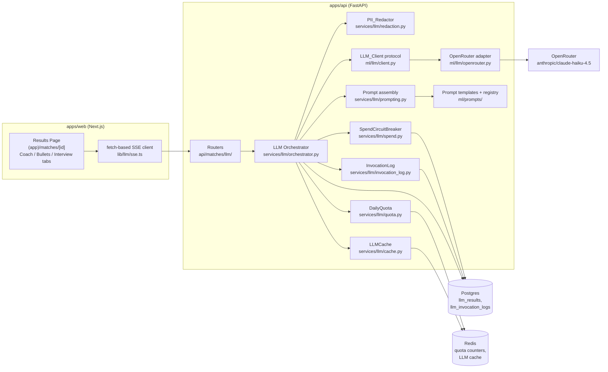
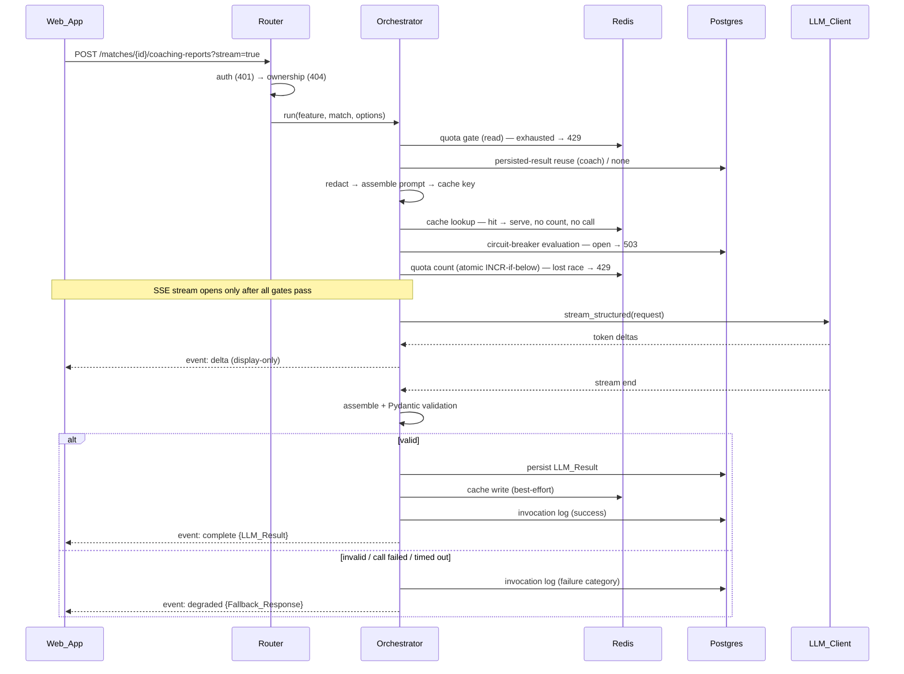

# Design Document — phase-3-llm-layer

## Overview

Phase 3 adds the first generative features to MatchLayer on top of the deterministic Phase 1/2 matching pipeline: a **Resume Coach**, a **Bullet Rewriter**, and an **Interview Question Generator**. All three are modeled as sub-resources of an existing `Match_Result` under `/api/v1/matches/{matchId}/...`, stream their output to the frontend via Server-Sent Events, and persist a schema-validated structured result.

The design is organized around a single shared **LLM request pipeline** that every feature flows through:

```
auth → ownership → quota gate → cache lookup → redaction → prompt assembly
     → quota count (atomic) → circuit-breaker gate → LLM call (streamed)
     → schema validation → persist LLM_Result → cache write → invocation log
```

Every stage in that pipeline has a defined failure behavior that lands on exactly one of three outcomes: a pre-call RFC 7807 rejection (401/404/422/429/503), a schema-validated `LLM_Result`, or a feature-specific `Fallback_Response` built entirely from data already inside MatchLayer. There is no fourth outcome — in particular, no 5xx caused solely by an LLM failure and no best-effort parse of free-form model text.

Key design commitments (each traced to requirements):

- **Provider abstraction** (`LLM_Client`): a provider-neutral protocol in `ml/llm/client.py`; all OpenRouter-specific code confined to a single adapter module `ml/llm/openrouter.py` speaking OpenRouter's OpenAI-compatible API over `httpx`. Swapping to Bedrock in Phase 6 means one new adapter + config change. (Req 1)
- **Versioned prompts**: prompt files in `ml/prompts/`, active versions resolved from a single registry module. (Req 2)
- **PII redaction** with indexed typed placeholders and a documented employment-history exception, applied before any text leaves the system. (Req 3)
- **Prompt-injection defense** by role separation, content delimiting, and delimiter neutralization — never content filtering. (Req 4)
- **Structured outputs only**: streamed tokens are display-progressive; the authoritative result is always assembled at stream end and validated against a Pydantic schema. (Req 8, 11)
- **Cost control**: per-user daily quota on Redis (atomic check-and-increment), a global monthly spend circuit breaker computed from persisted invocation logs (fail-safe open), and a per-user Redis cache keyed by redacted-input hash + prompt version + model. (Req 13, 14, 15)
- **Evaluation-ready logging**: one `llm_invocation_logs` row per provider call with prompt version, model, redactor version, input hash, output/failure category, latency, tokens, and cost — never raw PII. Phase 5 replays these. (Req 12)

## Research Summary

Findings that informed the design:

- **OpenRouter API surface.** OpenRouter exposes an OpenAI-compatible `POST /chat/completions` endpoint (SSE streaming with `data:` chunks, `[DONE]` sentinel), supports `response_format` structured outputs (normalized across providers, including Anthropic models), can return usage accounting including **provider-reported cost** when `usage: {"include": true}` is sent, and offers an authenticated key-metadata endpoint (`GET /key`) suitable for startup key validation. This lets the adapter satisfy Req 8.1 (schema-constrained output), Req 12.2 (provider-reported cost preferred), and Req 1.10 (startup validation) without provider-specific hacks leaking above the adapter.
- **`httpx` over the `openai` SDK.** The repo already depends on `httpx` (API tests). The adapter needs exactly one endpoint plus SSE chunk parsing (~200 lines); taking the `openai` SDK as a dependency would put OpenAI-shaped types adjacent to the provider-neutral interface and add a supply-chain surface for no leverage. Decision: raw `httpx.AsyncClient` inside `openrouter.py` only.
- **SSE from FastAPI.** FastAPI serves SSE via `StreamingResponse` with `media_type="text/event-stream"` over an async generator. Client disconnects surface as `asyncio.CancelledError` inside the generator, which is the hook for aborting the upstream provider call (Req 11.7).
- **SSE in the browser.** Native `EventSource` cannot send `Authorization` headers or POST bodies. The Web_App therefore consumes SSE with `fetch()` + `ReadableStream` and a small SSE parser — the established pattern for authenticated LLM streaming UIs.
- **Redis import boundary.** `core/rate_limit.py` is currently the only module importing `redis`, enforced by `tests/unit/test_import_boundaries.py`. Phase 3 needs Redis for quota and cache, so client construction moves to a new `core/redis.py`; the boundary test is updated to allow exactly that one module. `RateLimiter`, `DailyQuota`, and `LLMCache` all receive an injected client.
- **Phase 2 precedents reused.** `/healthz` additive-field pattern (`semantic_scoring`) is copied for the `llm` field; the module-level availability probe pattern (`semantic_adapter.semantic_available()`) is copied for LLM availability; `MatchResult` already stores `matched_keywords`, `missing_keywords`, and `suggestions` as JSONB — exactly the inputs the fallbacks and prompt grounding need, read verbatim (Req 5.3, 7.6).

## Architecture

### System context



### Request pipeline

Every LLM feature request (streaming or not) flows through one orchestrator function. The order below is normative — several requirements pin specific orderings (quota gate before cache lookup, Req 13.2; checks before the stream opens, Req 11.4; count at call initiation, Req 13.3).



For non-streaming requests the same pipeline runs; the terminal event becomes the single JSON response body (200 with either the `LLM_Result` or the `Fallback_Response`).

### Key design decisions

**D1 — One orchestrator, three thin feature services.** The gates, redaction, caching, quota accounting, logging, and validation are identical across features; only the prompt template, the input assembly, the output schema, and the fallback builder differ. Each feature supplies a small `LLMFeatureSpec` (template name, schema, input builder, fallback builder) to the shared orchestrator. This keeps the ~15 cross-cutting requirements implemented once, testable once.

**D2 — Streaming is display-progressive; validation is terminal.** The adapter streams raw model output tokens (the model is instructed to produce JSON). The API relays them as `delta` SSE events for progressive display and accumulates them server-side. At stream end the accumulated text is parsed and Pydantic-validated; only the validated object is persisted, cached, and carried by the `complete` terminal event. The Web_App renders deltas via a tolerant, display-only partial-JSON text extractor and **replaces** the progressive rendering with the structured result on `complete` (Req 8.5, 11.2, 17.2). Progressive text is never authoritative and never persisted.

**D3 — Streaming negotiation via a `stream` query parameter.** `POST ...?stream=true` requests SSE; omitted/false returns a single JSON response. A query parameter (over `Accept` header negotiation) is explicit in the OpenAPI schema, survives codegen into the generated TS client, and keeps both response modes documented on one operation (Req 11.1).

**D4 — Quota is a two-step check: fast gate + atomic reserve.** The gate (read-only, first enforcement step after auth/ownership, Req 13.2) rejects obviously exhausted users with 429 before any work. The authoritative count is an atomic Lua INCR-if-below-limit executed at the moment the provider call is initiated (Req 13.3, 13.7) — cache hits, fallbacks without calls, and 429s never pass through it. If the atomic reserve loses a concurrency race, the request gets the same 429. If Redis is unreachable at either step, the request takes the fallback path without a provider call (Req 13.8): fail-closed on spend, fail-open on usefulness.

**D5 — Circuit breaker state is derived, not stored.** Tracked spend = `SUM(cost_usd)` over `llm_invocation_logs` for the current UTC month, evaluated before each provider call and after each log persist (Req 14.2). The process holds only a cached last-evaluation result; a read failure or a failed log persist flips the cached state to open (fail-safe, Req 14.7, 14.8) until a later successful evaluation reads a below-limit sum. Deriving from the log table means the breaker recovers on month rollover or a raised limit with zero extra state machinery (Req 14.4, 14.5).

**D6 — Redis client construction moves to `core/redis.py`.** Quota and cache need Redis; the import boundary ("only one module imports redis") is preserved by relocating it: `core/redis.py` owns `aioredis` and the per-request client factory; `core/rate_limit.py`, `DailyQuota`, and `LLMCache` receive injected clients. The import-boundary test is updated to name `core/redis.py` as the single allowed importer.

**D7 — Coach persisted-result reuse is a distinct step from the cache.** Req 5.4 requires returning a persisted Coaching_Report (same active prompt version + model) without a provider call and **without consuming quota**, independent of cache TTL. The coach POST therefore checks `llm_results` before redaction; Bullet_Rewriter and Interview_Question_Generator rely on the LLM_Cache for repeat suppression (their persisted results are retrievable via GET, Req 6.5, 7.4) — a new POST with identical input is a cache hit within TTL, a fresh call after.

**D8 — Redaction is region-aware.** The redactor segments the resume into a contact/header region, employment-history sections (heading-lexicon based), and everything else. Email/phone regexes and the name heuristic detect PII everywhere, but spans inside employment-history sections are exempt (the documented Redaction_Exception, Req 3.3). The segmentation rule, patterns, and heuristic are committed code plus a policy doc, and the redactor carries an explicit version string recorded in every invocation log (Req 3.2, 3.4).

## Components and Interfaces

### Backend layout (new/changed files)

```
apps/api/src/matchlayer_api/
├── config.py                          # + LLM settings block (Req 18.1, 18.2)
├── core/
│   ├── redis.py                       # NEW — sole redis importer, client factory (D6)
│   └── rate_limit.py                  # refactored: client injected from core/redis.py
├── ml/
│   ├── llm/
│   │   ├── __init__.py
│   │   ├── client.py                  # provider-neutral protocol + request/response/chunk types
│   │   ├── openrouter.py              # the single OpenRouter adapter (httpx)
│   │   └── availability.py            # LLM_Unavailable state (key-absent / breaker-open probe)
│   └── prompts/
│       ├── registry.py                # ACTIVE_PROMPT_VERSIONS — the one designated source (Req 2.4)
│       ├── resume_coach.v1.txt
│       ├── bullet_rewrite.v1.txt
│       └── interview_questions.v1.txt
├── services/llm/
│   ├── __init__.py
│   ├── orchestrator.py                # shared pipeline (D1)
│   ├── schemas.py                     # CoachingReport, BulletRewrite, InterviewQuestionSet,
│   │                                  # fallback envelope, failure-reason enum (Req 8.4, 9.2)
│   ├── redaction.py                   # PII_Redactor (D8)
│   ├── prompting.py                   # template load, placeholder substitution, delimiter neutralization
│   ├── coach.py                       # Resume_Coach feature spec + fallback builder
│   ├── bullets.py                     # Bullet_Rewriter feature spec + fallback builder
│   ├── questions.py                   # Interview_Question_Generator spec + fallback builder
│   ├── quota.py                       # DailyQuota (Redis fixed-window, atomic Lua)
│   ├── spend.py                       # SpendCircuitBreaker (D5)
│   ├── cache.py                       # LLMCache (Redis, per-user keying)
│   ├── invocation_log.py              # invocation-log persistence + monthly spend query
│   └── results.py                     # LLM_Result persistence + cursor pagination queries
├── api/matches/llm/
│   ├── __init__.py
│   ├── router.py                      # the three sub-resource routers (Req 16.1)
│   ├── schemas.py                     # request models, list envelopes, SSE event models
│   └── sse.py                         # SSE event formatting + StreamingResponse generator
└── api/health.py                      # + llm: available|unavailable field (Req 10.1)
```

### LLM_Client protocol and OpenRouter adapter (`ml/llm/`)

The provider-neutral interface. No OpenRouter identifier appears in these types (Req 1.1):

```python
# ml/llm/client.py
class LLMMessage(BaseModel):
    role: Literal["system", "user"]
    content: str

class LLMRequest(BaseModel):
    messages: list[LLMMessage]
    output_schema: dict[str, Any]        # JSON Schema the provider must constrain output to
    max_output_tokens: int               # always set from settings (Req 1.4)

class LLMUsage(BaseModel):
    input_tokens: int | None             # None = unavailable, distinct from 0 (Req 12.2)
    output_tokens: int | None
    cost_usd: Decimal | None
    cost_basis: Literal["provider_reported", "computed", "unavailable"]

class LLMStreamChunk(BaseModel):
    delta: str                           # raw output text fragment

class LLMCompletion(BaseModel):
    text: str                            # full accumulated raw output
    usage: LLMUsage
    latency_ms: int                      # transmission start → final token / termination

class LLMError(Exception):
    """Provider error, timeout, or abort. Carries a failure category, never response bodies."""

class LLMClient(Protocol):
    async def validate_credentials(self) -> None: ...
    def stream(self, request: LLMRequest) -> AsyncIterator[LLMStreamChunk]: ...
    async def result(self) -> LLMCompletion: ...   # after stream exhaustion/abort
```

`ml/llm/openrouter.py` implements the protocol with `httpx.AsyncClient`:

- `POST {base_url}/chat/completions` with `stream: true`, `response_format: {"type": "json_schema", "json_schema": {...}}` mapped from `output_schema` (Req 8.1), `max_tokens` from settings, `usage: {"include": true}` so the final chunk carries token counts and OpenRouter's reported cost.
- The **full call** — connect, stream, final chunk — runs inside `asyncio.timeout(settings.llm_timeout_seconds)` (Req 1.6). On expiry the HTTP stream is closed and `LLMError(category="timeout")` raised.
- **Exactly one attempt** — no retries anywhere in the adapter or above it (Req 1.12, 9.6).
- Cost: provider-reported when the usage payload carries it (`cost_basis="provider_reported"`); otherwise computed from token counts × `llm_price_input_usd_per_mtok` / `llm_price_output_usd_per_mtok` settings (`"computed"`); if the call failed before usage arrived, `None`/`"unavailable"` (Req 12.2).
- `validate_credentials()` issues OpenRouter's authenticated key-metadata request (`GET /key`) bounded by the same timeout; raises a typed error distinguishing _invalid key_ / _unreachable_ / _timeout_ for the startup check (Req 1.10).
- The API key is held as `SecretStr`, attached only as the `Authorization` header, and never included in exceptions, logs, or reprs (Req 1.9).

**Startup wiring** (in the app factory / lifespan):

- Key absent/empty → app starts normally, `ml/llm/availability.py` records `key_present=False`; features serve fallbacks (Req 1.8, 10.3).
- Key present → `validate_credentials()` runs during lifespan startup; failure aborts startup with the cause category in the error message, never the key value (Req 1.10).

### Prompt templates and registry (`ml/prompts/`)

- Templates are UTF-8 files `<feature>.v<N>.txt` (Req 2.1). Content = the system-prompt instruction text with named `{placeholder}` slots and the injection-hardening instructions (treat delimited content as data; never reveal the system prompt — Req 4.2).
- `registry.py` is the **single designated source** for active versions (Req 2.4):

```python
ACTIVE_PROMPT_VERSIONS: Final[dict[LLMFeature, int]] = {
    LLMFeature.RESUME_COACH: 1,
    LLMFeature.BULLET_REWRITE: 1,
    LLMFeature.INTERVIEW_QUESTIONS: 1,
}
```

A rollback edits exactly this dict. Prompt changes ship as new files with incremented `N`; a unit test asserts no two consecutive versions of a feature are byte-identical (Req 2.3).

### Prompt assembly (`services/llm/prompting.py`)

- `load_template(feature) -> PromptTemplate` — reads the active version's file; missing/unreadable file raises `PromptTemplateError` → fallback path + structured log with feature, template name, version, no PII (Req 2.5).
- `render(template, values) -> str` — substitutes **only** named placeholders; a placeholder with no value raises `PromptRenderError` (never transmitted partially rendered; log carries template, version, failing placeholder name — Req 2.6, 2.7). No instruction text is added at runtime.
- **Message construction** (Req 4.1): the rendered template text becomes the single system-role message. All user-supplied/derived content (redacted resume text, JD text, bullets, matched/missing skills) is placed in the user-role message wrapped in fixed delimiters:

```
<user_content kind="resume">
...redacted resume text...
</user_content>
```

- **Delimiter neutralization** (Req 4.6): before wrapping, any occurrence of the literal sequences `<user_content` or `</user_content` inside user-supplied text is deterministically rewritten (`<` → `⟨` for those sequences only), so user text can never close or open a content region. Applied after redaction, before wrapping.
- No tool/function-calling capability is ever requested — the only structured mechanism is `output_schema` (Req 4.3). Adversarial instruction-like text passes through unmodified apart from redaction and neutralization (Req 4.4).

### PII_Redactor (`services/llm/redaction.py`)

```python
REDACTOR_VERSION: Final[str] = "1.0.0"

class RedactionResult(BaseModel):
    text: str
    redactor_version: str

def redact(text: str, *, kind: Literal["resume", "job_description", "bullet"]) -> RedactionResult: ...
```

Algorithm (deterministic, pure — Req 3.4):

1. **Segment** the input into regions: the contact/header region (lines before the first recognized section heading, capped at the first 10 lines), employment-history sections (a section whose heading matches a committed lexicon — `experience`, `work experience`, `employment`, `employment history`, `work history`, `professional experience` — extending to the next section heading), and other text. This segmentation is the committed **boundary rule** for the Redaction_Exception (Req 3.3): any span inside an employment-history section is exempt from redaction; everything else is redactable. Documented in `docs/redaction-policy.md` with rationale.
2. **Detect**: emails and phone numbers by committed regexes over the whole text; full names by a documented heuristic over the contact/header region (capitalized 2–4 token sequences on the first non-empty lines, excluding lexicon words). A detected name is then matched at **every** occurrence in the whole text (Req 3.2).
3. **Replace** non-exempt occurrences with indexed typed placeholders `[EMAIL_n]`, `[PHONE_n]`, `[NAME_n]`: one index per distinct value per type, starting at 1, assigned in first-occurrence order; every occurrence of the same value gets the same placeholder (Req 3.1, 3.5).
4. **Guardrails**: the whole redaction runs inside a 5-second wall-clock bound; any exception or timeout raises `RedactionError` carrying **no input text fragment** → fallback path (Req 3.6). Neither input nor output is ever logged (Req 3.7).

Committed synthetic fixtures (`tests/fixtures/redaction/*.json`) pair inputs with exact expected outputs — repeated values, multiple distinct values per type, and exception-region cases — with a test asserting exact equality (Req 3.9).

All downstream hashing (cache key, invocation-log input hash) is computed **only** over redacted text (Req 3.8).

### Orchestrator (`services/llm/orchestrator.py`)

The single pipeline, parameterized by an `LLMFeatureSpec`:

```python
@dataclass(frozen=True)
class LLMFeatureSpec[TResult: BaseModel]:
    feature: LLMFeature
    result_schema: type[TResult]                        # Pydantic model (Req 8.2)
    build_inputs: Callable[[MatchResult, FeatureInput], PromptValues]
    build_fallback: Callable[[MatchResult, FeatureInput, FailureReason], TResult]
```

`run(spec, match, feature_input, *, stream)` executes the pipeline in the sequence-diagram order and returns either an `LLMOutcome` (for non-streaming JSON) or drives the SSE generator (for streaming). Failure taxonomy: every exception from redaction, prompting, quota accounting (Redis down), the adapter, or validation is mapped to exactly one `FailureReason` and produces one structured failure log event (feature, prompt version, reason, request_id, user id — no PII, Req 9.4), then the fallback builder runs. Fallbacks are never persisted and never cached (Req 9.5, 15.4).

**Prompt-input hash**: `sha256` over a canonical byte string `feature | template_version | model | redacted_system_values` — the same digest is the invocation-log `input_hash` and the core of the cache key (Req 12.6, 15.1).

### DailyQuota (`services/llm/quota.py`)

Fixed-window counter per user per UTC day on Redis:

- Key: `llm:quota:{user_id}:{YYYYMMDD}` (UTC date). Expiry set to 48h after first write, so the key is self-cleaning and day rollover is automatic — a new UTC day means a new key with a fresh count (Req 13.6).
- `gate(user_id) -> QuotaDecision` — read-only `GET`; count ≥ limit → 429 (Req 13.2).
- `reserve(user_id) -> QuotaDecision` — atomic Lua `INCR`-if-below-limit (Req 13.7); called only at provider-call initiation (Req 13.3). A reserved count stays counted even if the call fails.
- Both return `remaining` for the `X-LLM-Quota-Remaining` response header, included on every LLM feature response including 429s (Req 13.5).
- Any Redis error → `QuotaAccountingError` → fallback path, no provider call (Req 13.8).

### SpendCircuitBreaker (`services/llm/spend.py`)

- `evaluate(session) -> BreakerState` — `SELECT COALESCE(SUM(cost_usd), 0) FROM llm_invocation_logs WHERE created_at >= <month start UTC>` via SQLAlchemy Core (no raw SQL in services); open iff sum ≥ `llm_monthly_spend_limit_usd` (Req 14.1, 14.2).
- Called before every provider call and after every invocation-log persist. The result is memoized in a process-local state object so `/healthz` and the 503 path read it without a query per probe.
- Read failure or invocation-log persist failure → state forced open (`cause=tracking_failure`) until a subsequent successful evaluation reads a below-limit sum (Req 14.7, 14.8).
- Every open↔closed transition emits exactly one structured event: direction, tracked spend, limit, cause (`limit_reached | month_rollover | limit_raised | tracking_failure`) — no PII, no key (Req 14.6).
- While open: LLM feature requests get a 503 RFC 7807 (`type` identifies the spend limit; `detail` user-safe, no figures) — unless the API key is also absent, in which case the absent-key fallback behavior wins (Req 10.3). In-flight calls run to completion and log their cost (bounded overshoot, Req 14.3).

### LLMCache (`services/llm/cache.py`)

- Key: `llm:cache:{user_id}:{feature}:{input_hash}:v{template_version}:{model}` — user id is **always** part of the key and the lookup, so a lookup can structurally never resolve cross-user (Req 15.1–15.3).
- Value: the serialized validated `LLM_Result` envelope. TTL: `llm_cache_ttl_seconds` (default 86400, Req 15.6).
- Lookup failure / Redis down → treated as a miss, normal call path proceeds (Req 15.7). Write failure → result still returned; logged, no 5xx (Req 15.8).
- Cache hits are served without a provider call, without an invocation-log row for a call that didn't happen, and without quota consumption (Req 15.2, 13.3). Over a streaming request, a hit emits the `complete` terminal event directly (Req 15.5).
- Fallbacks and invalid outputs are never written (Req 15.4).

### Feature services (`coach.py`, `bullets.py`, `questions.py`)

Each defines its `LLMFeatureSpec`:

- **Resume_Coach** (`coach.py`): inputs = redacted resume text, redacted JD text, and the Match_Result's stored `matched_keywords` / `missing_keywords` read verbatim (Req 5.3). Persisted-result reuse before the pipeline (D7, Req 5.4); a version/model change makes the next POST a fresh call while retaining old rows (Req 5.7). Fallback: built from stored `suggestions` + `missing_keywords`, empty lists carried as empty (Req 5.5).
- **Bullet_Rewriter** (`bullets.py`): request body validated by Pydantic before anything else — 1..`llm_max_bullets` bullets, none empty/whitespace, each ≤ `llm_max_bullet_chars` → otherwise 422 pre-LLM (Req 6.3). Prompt includes JD context + missing skills (Req 6.4). Post-validation alignment check: exactly one entry per submitted bullet, in order, `original` exactly matching — any deviation is a schema-validation failure → fallback (Req 6.7). Fallback: each bullet unchanged + guidance derived only from stored missing skills/suggestions (Req 6.6).
- **Interview_Question_Generator** (`questions.py`): prompt includes matched + missing skills (Req 7.6). Schema enforces 5..`llm_max_questions` questions, category enum, text ≤ 300 chars, reason ≤ 500 chars (Req 7.2, 7.3); out-of-bounds counts are validation failures, never truncated/padded (Req 7.7). Fallback: template-based questions from matched/missing skills, generic templates when both lists are empty, always ≥ 5, conforming to the same schema (Req 7.5). `llm_max_questions < 5` fails startup (Req 7.8).

### Routers and SSE (`api/matches/llm/`)

Endpoints (all under the authenticated `/api/v1` surface, `X-Robots-Tag: noindex, nofollow` via existing middleware, Req 16.7):

| Method | Path                                                               | Purpose                               |
| ------ | ------------------------------------------------------------------ | ------------------------------------- |
| POST   | `/api/v1/matches/{matchId}/coaching-reports?stream=`               | Generate (or reuse) a Coaching_Report |
| GET    | `/api/v1/matches/{matchId}/coaching-reports?limit=&cursor=`        | List, newest-first                    |
| GET    | `/api/v1/matches/{matchId}/coaching-reports/{id}`                  | Read one                              |
| POST   | `/api/v1/matches/{matchId}/bullet-rewrites?stream=`                | Rewrite submitted bullets             |
| GET    | `/api/v1/matches/{matchId}/bullet-rewrites?limit=&cursor=`         | List                                  |
| GET    | `/api/v1/matches/{matchId}/bullet-rewrites/{id}`                   | Read one                              |
| POST   | `/api/v1/matches/{matchId}/interview-question-sets?stream=`        | Generate a question set               |
| GET    | `/api/v1/matches/{matchId}/interview-question-sets?limit=&cursor=` | List                                  |
| GET    | `/api/v1/matches/{matchId}/interview-question-sets/{id}`           | Read one                              |

- **Auth/ownership**: 401 without valid auth, before any existence check (Req 16.8). Ownership check returns the identical 404 RFC 7807 for "not yours" and "not found" (Req 5.6, 16.2).
- **Pagination**: cursor = opaque base64 of `(created_at, id)`; `limit` 1–100 default 20; descending `created_at` (UUIDv7 order); malformed cursor or out-of-bounds limit → 422 (Req 16.4, 16.10).
- **SSE contract** (`sse.py`): events carry a machine-readable `event:` type —
  - `delta` — `{"text": "..."}` incremental display content only (never system prompt, provider metadata, or key — Req 11.6)
  - `complete` — the full validated `LLM_Result` envelope (identical to the persisted row, Req 11.2)
  - `degraded` — the `Fallback_Response` envelope
  - `error` — an RFC 7807 body (used only for failures that map to an error rather than a fallback)

  Exactly one terminal event (`complete` | `degraded` | `error`) is emitted per stream, even when the failure precedes any `delta`; the stream closes immediately after (Req 11.2, 11.3). All gates run **before** the stream opens; gate rejections return the plain RFC 7807 response, never an opened stream (Req 11.4). Client disconnect (`asyncio.CancelledError` in the generator) aborts the adapter's HTTP stream so the provider call stops consuming tokens (Req 11.7).

- Every LLM feature response (including 429) carries `X-LLM-Quota-Remaining`, documented in OpenAPI (Req 13.5).

### Health reporting (`api/health.py`)

Additive field following the Phase 2 pattern exactly (Req 10.1):

```python
llm: Literal["available", "unavailable"]
```

`unavailable` iff key absent at startup or breaker open (from `ml/llm/availability.py` + breaker state); never changes the 200 status; never exposes key/spend details (Req 10.2, 10.5, 10.6). Recovery (key present at next startup, month rollover, raised limit) flips it back without code change (Req 10.4).

### Invocation logging (`services/llm/invocation_log.py`)

One row per provider call, success or failure, streaming or not (Req 12.1). Write happens after the call terminates; a write failure never fails the user request (best-effort with a structured `invocation_log_write_failed` event, Req 12.5) but forces the breaker open (Req 14.8). Records are never auto-deleted in Phase 3 (Req 12.4).

### Configuration (`config.py`)

New settings block (all `MATCHLAYER_`-prefixed via the existing `Settings`):

| Setting                         | Type                | Default                        |
| ------------------------------- | ------------------- | ------------------------------ |
| `llm_base_url`                  | `str`               | `https://openrouter.ai/api/v1` |
| `llm_api_key`                   | `SecretStr \| None` | `None`                         |
| `llm_model`                     | `str`               | `anthropic/claude-haiku-4.5`   |
| `llm_timeout_seconds`           | `int`               | `60`                           |
| `llm_max_output_tokens`         | `int`               | `4096`                         |
| `llm_daily_quota`               | `int`               | `25`                           |
| `llm_monthly_spend_limit_usd`   | `Decimal`           | `10`                           |
| `llm_max_bullets`               | `int`               | `5`                            |
| `llm_max_bullet_chars`          | `int`               | `500`                          |
| `llm_max_questions`             | `int`               | `15`                           |
| `llm_cache_ttl_seconds`         | `int`               | `86400`                        |
| `llm_price_input_usd_per_mtok`  | `Decimal`           | `1.00`                         |
| `llm_price_output_usd_per_mtok` | `Decimal`           | `5.00`                         |

A `model_validator` fails startup naming the offending setting for any non-positive numeric value (Req 18.2) and for `llm_max_questions < 5` (Req 7.8). All are listed in `.env.example` with placeholders; the key entry carries a non-functional placeholder (Req 18.1). The two pricing settings back the computed-cost path of Req 12.2.

### Frontend (`apps/web`)

```
apps/web/src/
├── app/(app)/matches/[id]/            # existing results page — LLM tabs added
├── components/llm/
│   ├── LlmTabs.tsx                    # Coach / Bullet Rewrites / Interview Prep sections
│   ├── CoachPanel.tsx
│   ├── BulletRewritePanel.tsx         # bullet selection/paste + Zod client validation
│   ├── InterviewPanel.tsx
│   ├── StreamingText.tsx              # progressive display of delta events (plain text)
│   ├── FallbackBadge.tsx              # "generated without AI assistance" label
│   └── LlmErrorStates.tsx             # 429 quota / 503 spend / interrupted-stream states
└── lib/llm/
    ├── sse.ts                         # fetch + ReadableStream SSE parser
    ├── use-llm-stream.ts              # hook: start request, accumulate deltas, resolve terminal event
    └── progressive-text.ts            # display-only tolerant extraction of text from partial JSON
```

- Tabs live inside the existing `(app)` results page — inherits `noindex, nofollow` (Req 17.1).
- `use-llm-stream` drives the flow of Req 17.2/17.10/17.11: deltas render progressively (skeleton before the first delta, Req 17.6); `complete` **replaces** the progressive view with the structured result; `degraded` discards progressive content and shows the fallback with `FallbackBadge`; `error` shows the RFC 7807 `detail`; a connection drop without a terminal event shows an "interrupted" state with retry — partial content is never presented as final.
- All LLM content renders as plain text or via a markdown renderer with raw HTML stripped (`react-markdown` with `skipHtml`); no `dangerouslySetInnerHTML` anywhere in these components (Req 17.3).
- `FallbackBadge` shows exactly when `is_fallback === true` (Req 17.4).
- 429 shows the daily limit and UTC reset; 503 shows "AI features temporarily disabled" (Req 17.5).
- On load, GETs (TanStack Query) display the newest persisted result for the viewed match without triggering generation; each displayed result shows `prompt_template_version` + `created_at` and a **Regenerate** action re-running the streaming flow (Req 17.8, 17.9).
- Bullet inputs validated client-side by the **generated** Zod schemas from `packages/shared-types` (count/length/non-empty), inline errors, no request on violation (Req 17.7).
- Generated TS types + Zod schemas cover every new endpoint and envelope via the existing OpenAPI codegen + CI drift check (Req 16.6, 8.4).

## Data Models

### New tables (Alembic migration)

```python
class LLMResult(Base):
    """llm_results — one persisted, schema-validated LLM_Feature output."""
    __tablename__ = "llm_results"

    id: Mapped[UUID]                      # UUIDv7 PK (Req 16.3)
    user_id: Mapped[UUID]                 # FK users.id, CASCADE
    match_result_id: Mapped[UUID]         # FK match_results.id, CASCADE
    feature: Mapped[str]                  # 'resume_coach' | 'bullet_rewrite' | 'interview_questions'
    prompt_template_version: Mapped[int]
    llm_model: Mapped[str]
    payload: Mapped[dict]                 # JSONB — validated CoachingReport / BulletRewrite / InterviewQuestionSet
    created_at: Mapped[datetime]          # timezone-aware, server_default now()

    # Index: (match_result_id, feature, created_at DESC) — newest-first lists (Req 16.4)
    #        and the coach reuse lookup (Req 5.4).


class LLMInvocationLog(Base):
    """llm_invocation_logs — one row per LLM_Provider call (Req 12). Never contains raw PII."""
    __tablename__ = "llm_invocation_logs"

    id: Mapped[UUID]                      # UUIDv7 PK
    user_id: Mapped[UUID]                 # FK users.id
    match_result_id: Mapped[UUID]         # FK match_results.id
    feature: Mapped[str]
    prompt_template_version: Mapped[int]
    llm_model: Mapped[str]
    redactor_version: Mapped[str]         # Req 3.4 / 12.1
    input_hash: Mapped[str]               # sha256 over redacted input — same digest as cache key (Req 12.6)
    output: Mapped[dict | None]           # JSONB — validated output; NULL on failure
    failure_category: Mapped[str | None]  # FailureReason enum value; NULL on success
    latency_ms: Mapped[int]
    input_tokens: Mapped[int | None]      # NULL = unavailable, distinct from 0 (Req 12.2)
    output_tokens: Mapped[int | None]
    cost_usd: Mapped[Decimal | None]      # Numeric(10, 6)
    cost_basis: Mapped[str]               # 'provider_reported' | 'computed' | 'unavailable'
    created_at: Mapped[datetime]

    # Indexes: (feature, prompt_template_version, llm_model, created_at) — Phase 5 replay (Req 12.4)
    #          (created_at) — monthly spend SUM (Req 14.1)
```

No soft delete on either table: invocation logs are append-only operational records (Req 12.4); `llm_results` rows cascade with their match.

### Pydantic response schemas (`services/llm/schemas.py`)

Source of truth for the OpenAPI schema and generated TS/Zod types (Req 8.4):

```python
class FailureReason(StrEnum):            # closed set (Req 9.2)
    PROVIDER_ERROR = "provider_error"
    TIMEOUT = "timeout"
    SCHEMA_VALIDATION_FAILED = "schema_validation_failed"
    REDACTION_FAILED = "redaction_failed"
    PROMPT_TEMPLATE_MISSING = "prompt_template_missing"
    QUOTA_ACCOUNTING_UNAVAILABLE = "quota_accounting_unavailable"   # Req 13.8
    LLM_UNAVAILABLE = "llm_unavailable"                             # key absent (Req 10.3)

class ImprovementAction(BaseModel):
    priority: int                         # explicit rank
    action: str

class CoachingReport(BaseModel):          # Req 5.2
    summary: str
    strengths: list[str]
    gaps: list[str]
    improvements: list[ImprovementAction] # 3..10, validator enforces descending priority order

class BulletRewriteEntry(BaseModel):      # Req 6.2
    original: str
    alternatives: list[str]               # 1..3
    rationale: str                        # non-empty

class BulletRewrite(BaseModel):
    entries: list[BulletRewriteEntry]     # exactly one per submitted bullet, submission order

class InterviewQuestion(BaseModel):       # Req 7.2
    question: str                         # non-empty, ≤300 chars
    category: Literal["technical", "behavioral", "experience-gap"]
    reason: str                           # non-empty, ≤500 chars

class InterviewQuestionSet(BaseModel):
    questions: list[InterviewQuestion]    # 5..llm_max_questions (validator reads settings)

class LLMResultEnvelope[T](BaseModel):    # every feature response (Req 9.2, 17.9)
    id: str | None                        # UUIDv7 string; None for fallbacks (not persisted)
    is_fallback: bool
    fallback_reason: FailureReason | None
    prompt_template_version: int | None   # None for fallbacks
    created_at: datetime | None
    result: T                             # CoachingReport | BulletRewrite | InterviewQuestionSet
```

The `output_schema` sent to the provider (Req 8.1) is `result_schema.model_json_schema()` — one source of truth for both provider constraint and server-side validation. Fallback content also conforms to the same `result` schema (Req 7.5, 5.5, 6.6), so the frontend renders one shape per feature.

### Redis key shapes

| Purpose     | Key                                                         | Value / semantics                                           |
| ----------- | ----------------------------------------------------------- | ----------------------------------------------------------- |
| Daily quota | `llm:quota:{user_id}:{YYYYMMDD}`                            | integer counter, 48h expiry, atomic INCR-if-below Lua       |
| LLM cache   | `llm:cache:{user_id}:{feature}:{input_hash}:v{ver}:{model}` | serialized `LLMResultEnvelope`, TTL `llm_cache_ttl_seconds` |

### SSE wire format

```
event: delta
data: {"text": "…"}

event: complete
data: {…LLMResultEnvelope…}

event: degraded
data: {…LLMResultEnvelope with is_fallback=true…}

event: error
data: {…RFC 7807 body…}
```

## Correctness Properties

_A property is a characteristic or behavior that should hold true across all valid executions of a system — essentially, a formal statement about what the system should do. Properties serve as the bridge between human-readable specifications and machine-verifiable correctness guarantees._

The prework analysis classified every acceptance criterion; criteria testing pure logic with meaningful input variation became the properties below, while infrastructure wiring, single-scenario flows, and documentation criteria are handled by example/integration/smoke tests in the Testing Strategy. Redundant candidate properties were consolidated (e.g., the per-feature schema-bound criteria 5.2, 6.2/6.7, 7.2/7.3/7.7 and the structured-output criteria 8.1–8.3/8.5 all collapse into the single validation-gate property).

### Property 1: Redaction placeholder correctness

_For any_ synthetic input text containing planted email addresses, phone numbers, and a header-region full name occurring anywhere outside employment-history sections, the PII_Redactor output contains no planted value, and every occurrence is replaced by an indexed typed placeholder from `[EMAIL_n]`, `[PHONE_n]`, `[NAME_n]` such that indices start at 1 per type, are assigned in first-occurrence order, every occurrence of the same value receives the same placeholder, and distinct values of the same type receive distinct indices.

**Validates: Requirements 3.1, 3.2, 3.5**

### Property 2: Redaction exception preserves employment-history spans

_For any_ synthetic resume text with PII-pattern-matching values planted inside employment-history sections (per the committed boundary rule), the PII_Redactor preserves those spans byte-for-byte while still redacting occurrences of the same values outside exempt regions.

**Validates: Requirements 3.3**

### Property 3: Redaction determinism

_For any_ input text, two invocations of the PII_Redactor under the same version produce byte-identical output.

**Validates: Requirements 3.4**

### Property 4: Hash and cache-key consistency over redacted text

_For any_ raw feature input, the invocation-log input hash and the LLM*Cache key hash component are equal, are computed from the redacted text (independently recomputing `sha256` over the canonical redacted byte string yields the same digest), and contain no raw-PII-derived bytes; and \_for any* two cache-key component tuples (input hash, template version, model, user id), the derived cache keys are equal if and only if the tuples are equal.

**Validates: Requirements 3.8, 12.6, 15.1**

### Property 5: Prompt rendering is exact substitution

_For any_ prompt template with named placeholders and any complete value map, the rendered prompt equals the template with each placeholder replaced by its value and no other change (no added instruction text); and _for any_ value map missing at least one placeholder, rendering raises an error, nothing is transmitted to the provider, and the request takes the fallback path.

**Validates: Requirements 2.6, 2.7**

### Property 6: Message construction and delimiter neutralization

_For any_ user-supplied content — including content containing instruction-like text and content embedding the literal delimiter sequences — the assembled message list carries system instructions only in the system-role message and the content only inside the delimited region of the user-role message, unmodified except for redaction and deterministic delimiter neutralization, such that the user-content region contains exactly the wrapper's own opening and closing delimiters and no user-originated active delimiter sequence.

**Validates: Requirements 4.1, 4.4, 4.6**

### Property 7: Prompt grounding includes stored match context

_For any_ Match_Result with arbitrary stored matched/missing skill lists (and, for the Bullet_Rewriter, any submitted bullets), the assembled prompt's user-content region contains the stored fields required by the feature — matched and missing skills verbatim for the coach and question generator, job-description context and missing skills for the rewriter — without recomputation.

**Validates: Requirements 5.3, 6.4, 7.6**

### Property 8: Validation gate — accept if and only if schema holds

_For any_ complete raw LLM response (valid payloads, malformed JSON, truncations, out-of-bounds improvement/question counts, unordered priorities, over-length fields, bullet entries omitted, reordered, or with mutated originals) and any chunking of it over a stream, the outcome is exactly one of: (a) the response parses and satisfies the feature's Pydantic schema including field bounds and bullet alignment, and that validated object is what is returned, persisted, and cached; or (b) validation fails and the feature returns its Fallback_Response with a recorded failure category, persists nothing, caches nothing, never delivers truncated/padded/repaired content, and makes no second provider call.

**Validates: Requirements 4.5, 5.2, 6.2, 6.7, 7.2, 7.3, 7.7, 8.1, 8.2, 8.3, 8.5**

### Property 9: Universal fallback outcome for any LLM failure

_For any_ injected failure mode from the closed set (provider error, timeout, runtime key rejection, schema-validation failure, redaction failure/timeout, missing prompt template, quota-accounting unavailability), the request produces the feature's Fallback_Response — HTTP 200 for non-streaming, degraded terminal event for streaming — never a 5xx caused by the failure; at most one provider call attempt is made; exactly one structured failure log event is emitted carrying the matching failure-reason enum value, request id, user id, feature, and prompt version and containing no planted PII sentinel and no API key; and no LLM_Result row or cache entry is created.

**Validates: Requirements 1.11, 1.12, 2.5, 3.6, 9.1, 9.2, 9.4, 9.5, 9.6, 13.8**

### Property 10: Fallback content is schema-conformant and locally derived

_For any_ Match_Result stored fields (matched/missing keywords and suggestions, including empty lists) and any valid submitted bullets, each feature's Fallback_Response validates against the same result schema as the LLM path, is marked `is_fallback=true` with a failure reason, and is derived only from the stored fields: the coach fallback carries the stored suggestions/missing skills (empty lists carried as empty), the rewriter fallback carries every submitted bullet unchanged, and the question-generator fallback contains at least 5 schema-valid questions even when both skill lists are empty.

**Validates: Requirements 5.5, 6.6, 7.5, 9.2, 9.3**

### Property 11: Bullet request validation rejects invalid input before any call

_For any_ submitted bullet list, the request is rejected with a 422 RFC 7807 response before any provider call if and only if the count is outside 1..`llm_max_bullets`, any bullet is empty or whitespace-only, or any bullet exceeds `llm_max_bullet_chars`; all other lists are accepted.

**Validates: Requirements 6.3**

### Property 12: Repeat requests never re-call the provider

_For any_ validated LLM_Result that has been persisted (coach reuse under unchanged version+model) or cached (any feature, within TTL), a subsequent identical request from the same user returns the same payload with zero provider calls, zero new invocation-log rows for a call that did not occur, and zero Daily_Quota consumption.

**Validates: Requirements 5.4, 15.2**

### Property 13: Cache isolation across users

_For any_ two distinct User_Accounts issuing byte-identical feature inputs under the same template version and model, a cached entry created for one is never served to the other — the second user's request is a cache miss that takes the normal call path.

**Validates: Requirements 15.3**

### Property 14: Quota accounting counts exactly the initiated provider calls

_For any_ generated sequence of feature requests for a set of users — mixing cache hits, persisted-result reuse, fresh calls that succeed, fresh calls that fail after initiation, gate rejections, and requests crossing a UTC-midnight clock boundary — each user's daily counter equals exactly the number of provider calls initiated for that user in that UTC day; counters are independent across users; requests beyond the limit receive 429; under concurrent reserves the number granted never exceeds the configured quota; and counted requests remain counted when their call fails.

**Validates: Requirements 13.1, 13.2, 13.3, 13.4, 13.6, 13.7**

### Property 15: Spend circuit breaker opens exactly at the limit and fails safe

_For any_ generated set of invocation-log rows (costs spread across months, including failed-call costs and unavailable costs) and any positive limit, the breaker is open after evaluation if and only if the sum of in-current-UTC-month recorded costs reaches or exceeds the limit; a spend-read failure or an invocation-log persist failure forces the state open until a subsequent successful below-limit evaluation closes it; month rollover and a raised limit close it at the next evaluation; and every open↔closed transition emits exactly one structured transition event with direction, tracked spend, limit, and cause.

**Validates: Requirements 14.1, 14.2, 14.4, 14.5, 14.6, 14.7, 14.8**

### Property 16: Ownership indistinguishability

_For any_ authenticated User_Account, any LLM_Feature endpoint, and any Match_Result identifier that is either owned by a different user or nonexistent, the response is a 404 RFC 7807 with identical status, `type`, and body shape in both cases, and no provider call or LLM pipeline work occurs.

**Validates: Requirements 5.6, 16.2**

### Property 17: Persistence round trip

_For any_ validated LLM_Result payload, persisting it and issuing a GET on its sub-resource path returns a 200 whose envelope carries the identical payload, an `id` that parses as a UUIDv7 exposed as a string, a `created_at` in ISO 8601 UTC with `Z` suffix, and the prompt template version.

**Validates: Requirements 6.5, 7.4, 16.3, 17.9**

### Property 18: Cursor pagination is complete, ordered, and bounded

_For any_ generated set of persisted LLM*Results under a match and any valid `limit` in 1..100, walking the list endpoint page-by-page yields entries in strictly descending `created_at` (UUIDv7) order with no duplicates or gaps, and the concatenation of pages equals the full set; and \_for any* out-of-bounds `limit` or malformed/undecodable `cursor`, the request is rejected with 422 and returns no result data.

**Validates: Requirements 16.4, 16.10**

### Property 19: SSE streams terminate with exactly one correct terminal event

_For any_ simulated stream outcome — a valid payload under any chunk split, a provider failure before or after the first delta, a validation failure at assembly, a timeout expiry, or a cache hit — the emitted SSE event sequence contains exactly one terminal event, of kind `complete` when and only when validation succeeded (or the result was cached) and `degraded`/`error` otherwise; no event follows the terminal event; the `complete` payload is identical to the persisted LLM_Result; and no `delta` event contains the planted system-prompt sentinel or API key sentinel.

**Validates: Requirements 8.5, 11.2, 11.3, 11.5, 11.6, 15.5**

### Property 20: Invocation log records every call exactly once

_For any_ provider call outcome (success or each failure category, streaming or non-streaming) with any generated usage payload (provider-reported cost present, token counts only, or usage absent), exactly one invocation-log row is written recording the feature, the registry-active prompt version, model, redactor version, the input hash of Property 4, the validated output or the failure category (never both), latency, token usage and cost with the correct basis (`provider_reported` when reported, `computed` from configured pricing otherwise, `unavailable` — distinct from zero — when usage is missing), user id, match id, and a UTC timestamp; and the serialized row contains no planted PII sentinel.

**Validates: Requirements 2.4, 12.1, 12.2, 12.3**

### Property 21: Config validation rejects non-positive bounds at startup

_For any_ single setting from the Phase 3 numeric set (`llm_timeout_seconds`, `llm_max_output_tokens`, `llm_daily_quota`, `llm_monthly_spend_limit_usd`, `llm_max_bullets`, `llm_max_bullet_chars`, `llm_max_questions`, `llm_cache_ttl_seconds`) assigned a non-positive value — or `llm_max_questions` assigned a value below 5 — constructing `Settings` fails with an error message naming that setting; and any assignment of positive (and ≥5 for questions) values constructs successfully.

**Validates: Requirements 7.8, 18.2**

### Property 22: Frontend stream state derives only from the terminal event

_For any_ generated SSE event sequence delivered to the streaming hook — deltas followed by a `complete`, `degraded`, or `error` terminal, or a connection close with no terminal — the final UI state is: the structured result exactly when the terminal is `complete`, the fallback content labeled as generated without AI when `degraded`, the error detail when `error`, and an interrupted-with-retry state when no terminal arrived; progressively rendered delta text is never presented as the final result.

**Validates: Requirements 17.2, 17.10, 17.11**

### Property 23: LLM content rendering injects no HTML

_For any_ LLM-produced string — including strings embedding `<script>`, event-handler attributes, and arbitrary HTML — rendering through the LLM content components produces a DOM containing no element or attribute originating from the content; the content appears only as text (or text-level markdown formatting).

**Validates: Requirements 17.3**

### Property 24: Client-side bullet validation mirrors the server bounds

_For any_ generated bullet list, the Bullet_Rewriter UI submits the request if and only if the list satisfies the generated Zod schema bounds (count 1..max, no empty/whitespace-only bullet, no over-length bullet); on violation an inline error identifying the violated bound is shown and no request is sent.

**Validates: Requirements 17.7**

## Error Handling

### Failure taxonomy and outcomes

| Failure                                                                                | Detected in             | Outcome                                                                                      | Status / event   |
| -------------------------------------------------------------------------------------- | ----------------------- | -------------------------------------------------------------------------------------------- | ---------------- |
| Missing/invalid auth                                                                   | Router dependency       | RFC 7807                                                                                     | 401, no stream   |
| Unowned / nonexistent match                                                            | Router ownership check  | RFC 7807 (identical shape both cases)                                                        | 404, no stream   |
| Invalid bullet input                                                                   | Pydantic request model  | RFC 7807                                                                                     | 422, no LLM work |
| Invalid `limit`/`cursor`                                                               | Router validation       | RFC 7807                                                                                     | 422              |
| Daily quota exhausted (gate or lost reserve race)                                      | `DailyQuota`            | RFC 7807, limit + UTC reset in `detail`, `X-LLM-Quota-Remaining: 0`                          | 429, no stream   |
| Spend breaker open (key present)                                                       | `SpendCircuitBreaker`   | RFC 7807, `type` = spend limit, no figures                                                   | 503, no stream   |
| API key absent (incl. breaker also open)                                               | `availability`          | Fallback_Response (`llm_unavailable`)                                                        | 200 / `degraded` |
| Redis down at quota gate/reserve                                                       | `DailyQuota`            | Fallback_Response (`quota_accounting_unavailable`), no provider call                         | 200 / `degraded` |
| Prompt template missing/unreadable                                                     | `prompting`             | Fallback_Response (`prompt_template_missing`)                                                | 200 / `degraded` |
| Placeholder unfilled / render failure                                                  | `prompting`             | Fallback_Response (`prompt_template_missing`) — nothing transmitted                          | 200 / `degraded` |
| Redactor error / >5s / unavailable                                                     | `redaction`             | Fallback_Response (`redaction_failed`), unredacted text never transmitted                    | 200 / `degraded` |
| Provider error / key rejected at runtime                                               | adapter                 | Fallback_Response (`provider_error`), one attempt only                                       | 200 / `degraded` |
| Call timeout (`llm_timeout_seconds`)                                                   | adapter                 | Fallback_Response (`timeout`)                                                                | 200 / `degraded` |
| JSON parse / truncation / schema failure / bullet misalignment / question-count bounds | orchestrator validation | Fallback_Response (`schema_validation_failed`), invalid content never persisted or delivered | 200 / `degraded` |
| Cache lookup failure                                                                   | `LLMCache`              | Treated as miss; normal path                                                                 | —                |
| Cache write failure                                                                    | `LLMCache`              | Result still returned; logged                                                                | —                |
| Invocation-log write failure                                                           | `invocation_log`        | Request still completes; structured event; breaker forced open                               | —                |
| Spend read failure                                                                     | `SpendCircuitBreaker`   | Breaker treated open (fail-safe); 503 path                                                   | 503              |
| Client disconnect mid-stream                                                           | SSE generator           | Provider call aborted; no further events                                                     | —                |

### Principles

- **Never a 5xx from an LLM failure** (Req 9.1). The only 5xx on these endpoints are the deliberate 503 spend-breaker response and genuine infrastructure failures already covered by the app's global handlers (e.g., Postgres down).
- **Fail-closed on spend, fail-open on usefulness.** Any uncertainty in quota or spend accounting blocks the provider call (no unbounded spend) but still serves the user a fallback (no broken page).
- **One failure, one log event** (Req 9.4): the orchestrator owns failure logging so no path emits zero or two events. Events carry the enum reason, request id, user id, feature, prompt version — never PII, prompt content, or the key.
- **Errors are RFC 7807 everywhere** via the existing `core/errors.py` machinery; `detail` is user-safe (Req 16.5). Startup misconfiguration (non-positive bounds, invalid key) fails fast with the offending setting/cause named, never the key value (Req 1.10, 18.2).

## Testing Strategy

The dual approach: **property-based tests** verify the 24 universal properties above across generated inputs; **example/integration tests** cover the flow wiring, enumerated branches, and infrastructure criteria classified EXAMPLE/EDGE_CASE/INTEGRATION/SMOKE in the prework; **smoke checks** cover configuration and documentation criteria.

### Property-based tests (backend: Hypothesis, frontend: fast-check)

- **Libraries**: `hypothesis` for the Python API (added as a dev dependency; already the standard PBT library for pytest codebases) and `fast-check` with Vitest for the frontend properties (22–24). No PBT machinery is hand-rolled.
- **Configuration**: minimum **100 iterations** per property (`max_examples=100` / `numRuns: 100`).
- **Traceability**: each property is implemented as a **single** property-based test tagged with a comment in the format:
  `# Feature: phase-3-llm-layer, Property N: <property title>`
- **Test doubles**: a counting/scripted `FakeLLMClient` implementing the `LLMClient` protocol (records call attempts, replays scripted chunk sequences and failures); `fakeredis` (or an injected in-memory fake honoring the Lua semantics) for quota/cache properties; an injected clock for UTC-day and month-rollover cases; SQLite/Postgres-in-Docker sessions for persistence-dependent properties per the existing integration-test setup. Properties 1–6 and 21 are pure-function tests needing no doubles.
- **Sentinels**: PII-absence assertions (Properties 9, 19, 20) plant unique sentinel strings in resume/JD/bullet inputs, the system prompt, and the API key, then assert their absence in captured structlog output, serialized DB rows, and SSE frames.

### Unit and integration tests (examples and edge cases)

Focused examples for what properties don't cover, per prework classifications:

- **Adapter** (Req 1.2, 1.4–1.6, 1.10): mocked OpenRouter endpoint — payload shape (`max_tokens`, `response_format`, no `tools`), timeout abort, the three startup-validation failure categories, key never in logs/errors.
- **Boundary/static tests**: only `ml/llm/openrouter.py` references OpenRouter; only `core/redis.py` imports redis; no hardcoded model identifier outside config; no instruction-text literals in services/routers; no `dangerouslySetInnerHTML` in `components/llm/`; consecutive prompt versions differ (Req 1.1, 1.3, 2.1, 2.3, 17.3).
- **Redaction fixtures** (Req 3.9): committed synthetic fixture files verified by exact equality — these are the mandated example tests complementing Properties 1–3.
- **Router integration** (real Postgres per existing test setup): happy path per feature (5.1, 6.1, 7.1), coach version-change regeneration (5.7), 401-before-ownership (16.8), 404 on unknown result id (16.9), `X-Robots-Tag` (16.7), `X-LLM-Quota-Remaining` on 200/degraded/429 (13.5), RFC 7807 shape on every error test (16.5).
- **SSE integration**: non-streaming vs `stream=true` modes (11.1), gate rejections return plain JSON without opening a stream (11.4), client-disconnect aborts the adapter (11.7).
- **Availability & breaker branches**: key-absent startup (1.8, 10.2), the three 10.3 cases, breaker-open blocks new calls while in-flight calls complete and log (14.3), healthz `llm` field in both states with unchanged status code (10.1, 10.5, 10.6).
- **Cache edges**: TTL expiry as miss (15.6), lookup failure → normal path (15.7), write failure → result returned (15.8), invocation-log write failure → request completes + breaker opens (12.5, 14.8).
- **Frontend component tests** (Vitest + Testing Library): tab composition (17.1), fallback badge both branches (17.4), 429/503 messages (17.5), skeleton state (17.6), load-persisted-without-POST (17.8), regenerate interaction (17.9).

### Smoke and CI checks

- Settings defaults + `.env.example` completeness (18.1); template files exist (2.2); OpenAPI paths for the nine endpoints (16.1); OpenAPI exposes the envelope/fallback schemas and the two-value `llm` health enum (8.4, 10.1); the existing OpenAPI→TS/Zod codegen drift check covers the new surface (16.6).
- gitleaks pre-commit + CI secret scanning apply unchanged, no new exclusions (18.5, 18.6).
- Documentation review items (runbook 18.3, `docs/costs.md` 18.4, redaction policy doc 3.3) are verified in PR review — not machine-testable.
