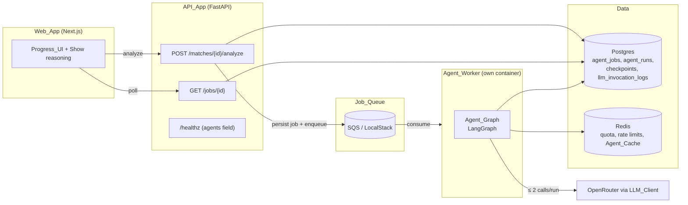
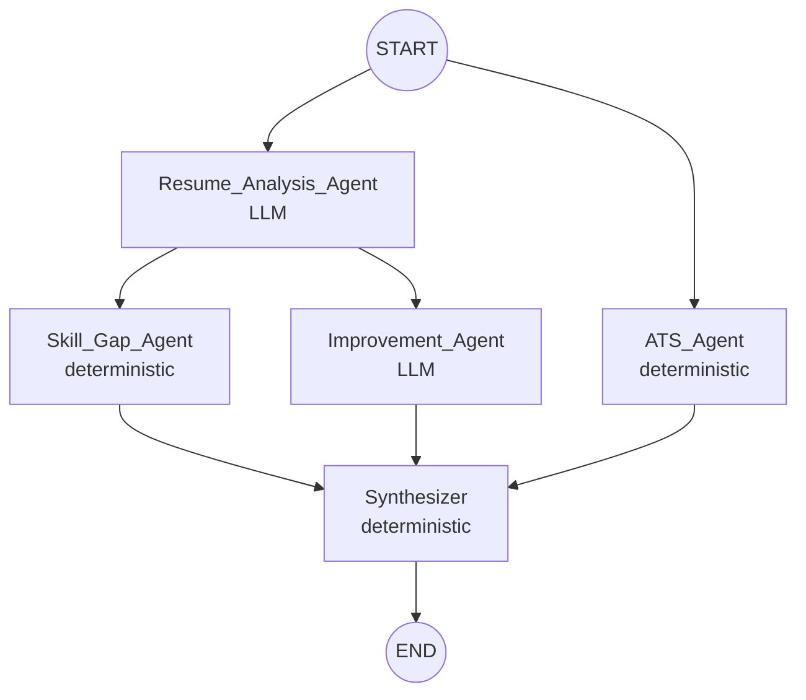
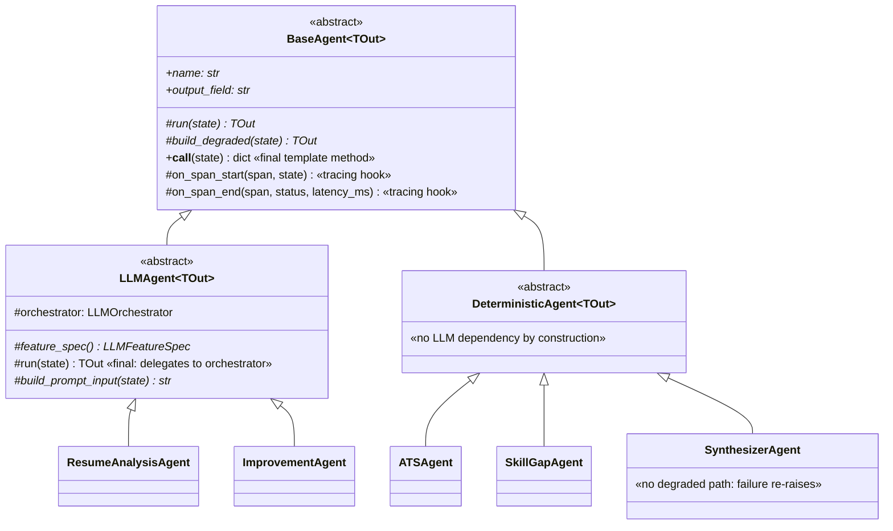

# Design Document — Phase 4: Agentic AI

## Overview

Phase 4 restructures MatchLayer's AI layer from one-shot LLM calls into a LangGraph-orchestrated multi-agent workflow. Five agents — Resume Analysis (LLM), ATS (deterministic), Skill Gap (deterministic), Improvement (LLM), and Synthesizer (deterministic) — are modeled as classes in a small inheritance hierarchy: an abstract `BaseAgent` defines the shared contract (lifecycle, typed input/output, error handling, tracing hooks) as a template method, two intermediate abstract classes (`LLMAgent`, `DeterministicAgent`) fix the LLM-vs-no-LLM split structurally, and five concrete subclasses implement only agent-specific logic. Each agent instance is registered directly as a LangGraph node over a typed Pydantic `AgentState`, with parallel branches where work is independent and per-node graceful degradation so a single failing agent never fails the run. Execution is asynchronous: `POST /api/v1/matches/{id}/analyze` returns `202` with a job id, an SQS-fed worker process runs the graph, and the client polls `GET /api/v1/jobs/{id}`. OpenTelemetry tracing enters the stack here, with one span per agent invocation and end-to-end trace propagation across the queue.

The design is a composition layer over Phase 1–3 machinery, never a replacement:

- **Scoring** — the ATS Agent wraps the Phase 2 `Semantic_Match_Scorer` (including its Degraded_Mode ladder); it reuses persisted scores when the active Scorer_Version already produced them.
- **LLM plumbing** — both LLM agents run through the Phase 3 `LLMOrchestrator` pipeline (in `services/llm/orchestrator.py`): the provider-neutral `LLMClient`, PII redaction, atomic Daily_Quota reserve, Spend_Circuit_Breaker, invocation logging, versioned prompt registry, and schema-conformant fallbacks all apply unchanged.
- **Infrastructure** — Redis (rate limits, quota, Agent_Cache), Postgres (jobs, runs, LangGraph checkpoints), and the existing RFC 7807 error envelope, UUIDv7 ids, and `pydantic-settings` configuration discipline.

New surface area: the `ml/agents/` package, an `api/jobs/` router plus an analyze sub-resource on matches, a `workers/agent_worker.py` SQS consumer with its own Dockerfile, LocalStack in docker-compose, `agent_jobs`/`agent_runs` tables, OpenTelemetry wiring, a frontend polling Progress UI with a "Show reasoning" toggle, and `docs/adr/0008-agent-architecture.md`.

Cost posture: at most **two** LLM calls per run (the two LLM agents), each governed by quota and the spend breaker, with per-agent caching keyed by `(agent, prompt_version, input_hash)` scoped per user. SQS at expected volume fits the AWS free tier. Total Phases 1–5 spend stays under the $20/month ceiling; `docs/costs.md` is updated accordingly.

### Research notes informing the design

- **LangGraph checkpointing** — `langgraph-checkpoint-postgres` provides `AsyncPostgresSaver` with a one-time `setup()` that creates its checkpoint tables. We invoke `setup()` from an Alembic migration (schema management stays in Alembic, per `conventions.md`), and the runtime never creates or alters checkpointer schema. Checkpoints are keyed by a `thread_id` in the run config — we use the Agent_Job UUIDv7, so every checkpoint row is attributable to exactly one job.
- **LangGraph state and parallelism** — LangGraph supports Pydantic models as graph state; nodes return partial updates merged into state. Fan-out edges from a node run branches concurrently within a superstep, which gives us the required Skill-Gap ∥ Improvement parallelism (and ATS ∥ Resume-Analysis at graph start) without hand-rolled `asyncio.gather`. Parallel-writable fields use per-field reducers (each agent writes only its own output field, so last-write-wins reducers per distinct field are safe).
- **OpenTelemetry over SQS** — trace context propagates via W3C `traceparent`/`tracestate` carried as SQS message attributes, injected with the standard `TraceContextTextMapPropagator` at enqueue and extracted in the worker. When no exporter endpoint is configured, the SDK is left uninitialized and the API defaults to a no-op tracer — zero behavioral impact.
- **SQS locally** — LocalStack's SQS emulation is API-compatible with `boto3`/`aioboto3`; the only differences between local and deployed are `endpoint_url`, region, and credentials — all configuration values, satisfying the "differ only in configuration" requirement.

## Architecture

### System context



### Agent graph topology



Two levels of parallelism fall out of the dependency analysis (Requirement 1.5):

1. **ATS ∥ Resume Analysis** — the ATS Agent's inputs come entirely from the persisted Match_Result (and, on a stale score, the Phase 2 scorer), so it starts immediately alongside the Resume Analysis Agent.
2. **Skill Gap ∥ Improvement** — both consume the Candidate_Profile, neither consumes the other's output (the Improvement Agent explicitly does not depend on the Skill_Gap_Report, Requirement 6.3), so they fan out from Resume Analysis.

The Synthesizer is the sole join point and terminal node. The longest sequential path is Resume Analysis → (Skill Gap ∥ Improvement) → Synthesizer: **two LLM nodes never serialize with each other's LLM latency beyond that path** — worst-case wall time is bounded by two LLM timeouts plus deterministic-node time, which is what makes the 30-second budget attainable.

### Async execution flow

```mermaid
sequenceDiagram
    participant W as Web_App
    participant A as API_App
    participant Q as SQS
    participant K as Agent_Worker
    participant P as Postgres

    W->>A: POST /matches/{id}/analyze
    A->>A: authz + quota precheck (≥2 units) + rate limit
    A->>P: INSERT agent_jobs (status=queued)  [idempotent per (match,user)]
    A->>Q: SendMessage {job_id, match_id, user_id} + traceparent attrs
    A-->>W: 202 {job_id, status: queued, url: /api/v1/jobs/{id}}
    loop poll (1–5 s interval)
        W->>A: GET /jobs/{id}
        A->>P: read job + agent_runs
        A-->>W: status + per-agent steps (+ Analysis_Result when completed)
    end
    Q->>K: ReceiveMessage (long poll)
    K->>P: job queued? → status=running, started_at, attempts+=1
    K->>K: run Agent_Graph (checkpointer thread_id = job_id)
    K->>P: agent_runs row per node; checkpoints per transition
    K->>P: status=completed (+Analysis_Result) or failed (+error)
    K->>Q: DeleteMessage (only after terminal transition persisted)
```

### Key design decisions

| #   | Decision                                                                                                                                                                                                                                                                                                                                                        | Rationale                                                                                                                                                                                                                                                                                                                                        |
| --- | --------------------------------------------------------------------------------------------------------------------------------------------------------------------------------------------------------------------------------------------------------------------------------------------------------------------------------------------------------------- | ------------------------------------------------------------------------------------------------------------------------------------------------------------------------------------------------------------------------------------------------------------------------------------------------------------------------------------------------ |
| D1  | **Reuse the Phase 3 `LLMOrchestrator` for agent LLM calls** rather than calling `LLMClient` directly from agents.                                                                                                                                                                                                                                               | The orchestrator already implements atomic quota reserve, PII redaction, input hashing, caching, invocation logging, and schema-conformant fallbacks — exactly the guarantees Requirement 9 demands. Agents supply an `LLMFeatureSpec` (prompt version, output schema, fallback builder); duplicating that pipeline would guarantee drift.       |
| D2  | **Agents are classes in an inheritance hierarchy**: an abstract `BaseAgent` implements the cross-cutting lifecycle (timeout, degradation, Agent_Run persistence, span emission) as a final template method; `LLMAgent` and `DeterministicAgent` intermediate classes encode the LLM-vs-no-LLM split; concrete subclasses implement only `run`/`build_degraded`. | Requirements 8, 12, and 13 impose identical cross-cutting behavior on all five nodes. One tested lifecycle in the base class beats five hand-rolled copies; the `DeterministicAgent` branch has no LLM dependency by construction, making Requirement 1.6 structural rather than behavioral; agent `run` methods stay pure functions over state. |
| D3  | **Checkpointer schema created via Alembic invoking `AsyncPostgresSaver.setup()`**; runtime never touches DDL.                                                                                                                                                                                                                                                   | `conventions.md` puts all schema management in Alembic. Requirement 2.5 mandates this explicitly.                                                                                                                                                                                                                                                |
| D4  | **Checkpointing is best-effort** — a custom saver wrapper catches checkpoint write failures, logs one structured warning, and lets the run continue in memory.                                                                                                                                                                                                  | Requirement 2.4. Job outcomes must be determined solely by graph execution; observability plumbing never fails a run (same philosophy as Phase 2's best-effort embedding persistence).                                                                                                                                                           |
| D5  | **Job idempotency via a partial unique index** on `agent_jobs (match_id, user_id) WHERE status IN ('queued','running')`, with unique-violation → return the existing job.                                                                                                                                                                                       | Requirement 10.5's "at most one non-terminal job even under concurrent requests" needs a database-level guarantee; application-level check-then-insert races.                                                                                                                                                                                    |
| D6  | **Enqueue-failure compensation**: persist job (`queued`) → commit → enqueue; on enqueue failure, transition the job to `failed` and return 503.                                                                                                                                                                                                                 | Requirement 11.1 orders persist-before-enqueue; Requirement 11.6 forbids orphaned `queued` rows. A `failed` terminal row is honest, keeps the audit trail, and unblocks the partial unique index for a retry.                                                                                                                                    |
| D7  | **Per-node timeout via `asyncio.wait_for`** around each node invocation, inside `BaseAgent.__call__`.                                                                                                                                                                                                                                                           | Cancellation both abandons in-flight work and discards any post-timeout result (Requirement 8.3) with no bespoke machinery.                                                                                                                                                                                                                      |
| D8  | **Confidence_Level and skill-gap rules are documented data-driven rules** in `docs/agent-rules.md`, implemented as pure functions.                                                                                                                                                                                                                              | Requirements 4.2 and 5.2 require documented deterministic rules with observable inputs. Pure functions make them property-testable.                                                                                                                                                                                                              |
| D9  | **The worker reuses the API image codebase** (same `matchlayer_api` package, different entrypoint) with its own Dockerfile.                                                                                                                                                                                                                                     | The worker needs the scorer, LLM services, and DB models; a separate package would duplicate the world. `worker.Dockerfile` differs only in entrypoint and in omitting the HTTP server.                                                                                                                                                          |
| D10 | **Streaming step results is out of scope**; polling only.                                                                                                                                                                                                                                                                                                       | Explicit nice-to-have in requirements; polling meets every acceptance criterion and keeps Phase 4 lean.                                                                                                                                                                                                                                          |
| D11 | **ADR is `0008-agent-architecture.md`**, not 0004.                                                                                                                                                                                                                                                                                                              | ADR 0004 (pgvector) exists and is immutable; ADRs number sequentially per `adrs.md`.                                                                                                                                                                                                                                                             |

## Components and Interfaces

### 1. Agent state schema — `ml/agents/state.py`

The single typed state passed between nodes. `mypy --strict` applies to the whole `ml/agents/` package.

```python
class AgentCompletion(StrEnum):
    COMPLETED = "completed"
    DEGRADED = "degraded"

class AgentStatusFlag(BaseModel):
    """Per-agent status carried in state; feeds trace summaries."""
    status: AgentCompletion
    failure_reason: FailureDetail | None = None   # structured, PII-free

class FailureDetail(BaseModel):
    trigger: Literal["error", "timeout", "schema_validation", "quota_exhausted",
                     "breaker_open", "empty_input", "degraded_construction_error"]
    detail: str | None = None                     # operator-safe, never PII

class AgentState(BaseModel):
    # Identifiers only — never raw extracted_text (Requirement 1.3)
    job_id: str
    match_id: str
    user_id: str

    # Redacted / derived inputs loaded once by the worker before invocation
    redacted_resume_text: str | None = None       # PII_Redactor output
    job_description_skills: list[str] = []        # Phase 2 Skill_Extractor output
    match_snapshot: MatchSnapshot | None = None   # persisted Match_Result fields

    # Per-agent outputs (each written by exactly one node → safe parallel merge)
    candidate_profile: CandidateProfile | None = None
    ats_output: ATSOutput | None = None
    skill_gap_report: SkillGapReport | None = None
    improvement_report: ImprovementReport | None = None
    analysis_result: AnalysisResult | None = None

    # Per-agent status flags (keyed by agent name)
    agent_status: dict[str, AgentStatusFlag] = {}
```

`MatchSnapshot` is a Pydantic projection of the persisted Match_Result (score, breakdown, scorer_version, matched/missing skills, rule-based suggestions) loaded by the worker so no node reads the database mid-graph and no node ever touches raw `extracted_text`. The worker redacts the resume text with the Phase 3 `PII_Redactor` **before** constructing the initial `AgentState`; raw text never enters graph state, so checkpoints, `agent_runs` rows, and spans inherit the Internal classification by construction.

Output schemas (all in `state.py`, all with a `degraded: bool = False` marker field so degraded and normal outputs share one schema, Requirement 8.2):

```python
class CandidateProfile(BaseModel):
    sections: list[str]
    skills: list[str]
    experiences: list[ExperienceEntry]     # role/organization/duration, each nullable
    gaps: list[str]
    degraded: bool = False
    derived_from_degraded_input: bool = False

class ATSOutput(BaseModel):
    score: float
    breakdown: dict[str, float]
    confidence: Literal["high", "medium", "low"]
    scorer_version: str
    degraded: bool = False

class SkillGapEntry(BaseModel):
    skill: str
    classification: Literal["missing", "weak"]
    rank: int                              # 1-based, sequential, unique

class SkillGapReport(BaseModel):
    gaps: list[SkillGapEntry]              # ordered by ascending rank
    degraded: bool = False
    derived_from_degraded_input: bool = False

class ImprovementReport(BaseModel):
    actions: list[ImprovementAction]       # rank int, ordered high→low priority
    rewrites: list[RewriteSuggestion]      # redacted excerpt + replacement + rationale
    degraded: bool = False
    derived_from_degraded_input: bool = False

class AnalysisResult(BaseModel):
    ats: ATSOutput
    skill_gaps: SkillGapReport
    improvements: ImprovementReport
    profile: CandidateProfile
    agent_traces: list[AgentTraceSummary]  # name, status, latency_ms, failure_reason

class AgentTraceSummary(BaseModel):
    agent_name: str
    status: AgentCompletion
    latency_ms: int
    failure_reason: FailureDetail | None = None
```

### 2. Agent class hierarchy — `ml/agents/base.py`

The agents form a small, deliberate inheritance hierarchy. The abstract root defines the shared contract — lifecycle, typed input/output, error handling, tracing hooks — as a template method; two intermediate abstract classes fix the LLM-vs-no-LLM split from the requirements Glossary structurally; five concrete classes implement only what is specific to each agent.



#### `BaseAgent[TOut: BaseModel]` — the shared contract

```python
class BaseAgent[TOut: BaseModel](ABC):
    """Abstract root. Subclasses supply agent identity and pure logic;
    the base class owns the invocation lifecycle."""

    #: agent_name used for agent_runs rows, span names, cache keys
    name: ClassVar[str]
    #: the single AgentState field this agent writes (safe parallel merge)
    output_field: ClassVar[str]

    def __init__(self, deps: AgentDeps) -> None:
        self._deps = deps          # node_timeout_s, persist_agent_run, tracer, clock

    # ---- the two methods every concrete agent implements -------------
    @abstractmethod
    async def run(self, state: AgentState) -> TOut:
        """Pure agent logic over state. Raises on any failure."""

    @abstractmethod
    def build_degraded(self, state: AgentState) -> TOut:
        """Schema-conformant non-LLM fallback (Degraded_Output)."""

    # ---- tracing hooks (default: ids/statuses only, never PII) -------
    def on_span_start(self, span: Span, state: AgentState) -> None: ...
    def on_span_end(self, span: Span, status: AgentCompletion,
                    latency_ms: int) -> None: ...

    # ---- the lifecycle: final template method, the LangGraph node ----
    async def __call__(self, state: AgentState) -> dict[str, object]:
        with self._deps.tracer.start_as_current_span(f"agent.{self.name}") as span:
            self.on_span_start(span, state)
            start = self._deps.clock.monotonic()
            try:
                output = await asyncio.wait_for(self.run(state),
                                                self._deps.node_timeout_s)
                status, reason = AgentCompletion.COMPLETED, None
            except Exception as exc:        # error | TimeoutError | ValidationError
                reason = classify_failure(exc)
                output = self._build_degraded_safely(state, reason)
                status = AgentCompletion.DEGRADED
            latency_ms = elapsed_ms(start)
            await self._deps.persist_agent_run(self.name, state, output,
                                               status, reason, latency_ms)
            self.on_span_end(span, status, latency_ms)   # ids/hashes only, no PII
            return {self.output_field: output,
                    "agent_status": {self.name: AgentStatusFlag(
                        status=status, failure_reason=reason)}}
```

Contract rules the hierarchy enforces:

- **Lifecycle lives in exactly one place.** `__call__` is the only entry point the graph sees; it is not overridden by any subclass (enforced by convention and a unit test asserting all concrete agents share `BaseAgent.__call__`). Timeout, degradation, Agent_Run persistence, and span emission therefore behave identically across all five nodes (Requirements 8, 12, 13).
- **Typed I/O.** Each subclass binds `TOut` to its Pydantic output model and declares the single `AgentState` field it writes via `output_field` — the same one-writer-per-field discipline that makes LangGraph's parallel merge safe. `mypy --strict` checks that `run` and `build_degraded` return the bound `TOut`.
- **Error handling.** Any exception from `run` (including timeout cancellation and output `ValidationError`) routes to `_build_degraded_safely`, which wraps `build_degraded` itself: if degraded construction raises, it returns the agent's minimal schema-valid output (empty/null optional content, `degraded=True`) and records `degraded_construction_error` (Requirement 8.6).
- **Tracing hooks.** `on_span_start`/`on_span_end` are the sanctioned extension points for span attributes. The LLM branch overrides them to attach prompt version, model id, and input hash (mirroring the LLM_Invocation_Log values, Requirement 13.2); the defaults record only name, status, and duration.
- **Construction is dependency injection.** Agents receive an `AgentDeps` (and, for the LLM branch, the orchestrator) at construction; they hold no global state and read no configuration directly, keeping `pydantic-settings` discipline intact and instances trivially testable.

#### `LLMAgent[TOut]` — `ml/agents/llm_agent.py`

The intermediate class for the two LLM agents. It makes `run` final and delegates to the Phase 3 `LLMOrchestrator` (D1), so no concrete LLM agent can bypass quota, redaction, caching, logging, or fallback plumbing:

```python
class LLMAgent[TOut: BaseModel](BaseAgent[TOut]):
    def __init__(self, deps: AgentDeps, orchestrator: LLMOrchestrator) -> None:
        super().__init__(deps)
        self._orchestrator = orchestrator

    @abstractmethod
    def feature_spec(self) -> LLMFeatureSpec[TOut]:
        """Prompt version (registry-resolved), output schema, cache namespace."""

    @abstractmethod
    def build_prompt_input(self, state: AgentState) -> str:
        """Assembles the delimited user-content region from state. May raise
        EmptyInputError (routes to degraded, zero LLM calls, zero quota)."""

    async def run(self, state: AgentState) -> TOut:      # final
        return await self._orchestrator.invoke(
            spec=self.feature_spec(),
            user_content=self.build_prompt_input(state),
            user_id=state.user_id,
        )
```

The orchestrator call handles: atomic Daily_Quota reserve at call initiation (reserve failure → `quota_exhausted`), breaker-open short-circuit (`breaker_open`), Agent_Cache lookup keyed `(user, agent, prompt_version, input_hash)`, PII-safe invocation logging, and schema validation of output. A cache hit or no-call degraded path still flows through `BaseAgent.__call__`, so it still produces an Agent_Run row and a child span (Requirements 9.7, 13.1); the orchestrator reports whether a provider call occurred, and the span hooks attach the LLM attributes only when it did.

#### `DeterministicAgent[TOut]` — `ml/agents/deterministic_agent.py`

A thin abstract marker class: its module imports nothing from `ml/llm/`, and its constructor accepts no orchestrator or client. Requirement 1.6 ("ATS, Skill Gap, Synthesizer make no LLM call under any input") is therefore satisfied structurally — the classes cannot reach an LLM — and verified by Property 3. Concrete deterministic agents implement `run` as a pure function over state (plus, for the ATS agent, the injected Phase 2 scorer adapter).

Behavioral notes shared by the whole hierarchy:

- The **Synthesizer is the exception to degradation**: `SynthesizerAgent` overrides `_build_degraded_safely` to re-raise (its `build_degraded` raises `NotImplementedError` and is never reached) — a Synthesizer failure propagates out of the graph, and the worker transitions the job to `failed` after persisting the Synthesizer's `failed` Agent_Run row (Requirements 7.6, 12.7).
- Latency is measured node-invocation-start → output-return inside `__call__` — the same boundary as the timeout and the span duration, so `agent_runs.latency_ms`, span duration, and timeout accounting agree (Requirements 8.3, 12.2, 13.1).
- The hierarchy is exactly three levels deep and stays that way: no concrete agent is ever subclassed further, and new agents in later phases extend one of the two intermediates.

### 3. The five concrete agents

#### `ResumeAnalysisAgent` — `ml/agents/resume_analysis_agent.py` (extends `LLMAgent[CandidateProfile]`)

- `build_prompt_input`: if `state.redacted_resume_text` is empty/None → raise `EmptyInputError` (`BaseAgent.__call__` routes to degraded, `empty_input` reason, zero LLM calls, zero quota — Requirement 3.6); otherwise returns the redacted text for the delimited user-content region.
- `feature_spec`: prompt `agent_resume_analysis.v1` (new versioned file, structured roles, registry-resolved), output schema = `CandidateProfile` JSON Schema, at most one provider call. The inherited `LLMAgent.run` handles quota, breaker, cache (`agent_resume_analysis` namespace), invocation logging, and output schema validation via the orchestrator.
- `build_degraded`: `CandidateProfile` built from the Phase 2 `Skill_Extractor` results and persisted Match_Result fields (skills = matched+missing lexicon skills, sections/experiences/gaps empty), `degraded=True`.

#### `ATSAgent` — `ml/agents/ats_agent.py` (extends `DeterministicAgent[ATSOutput]`)

- Constructed with the injected Phase 2 scorer adapter. `run`: if `match_snapshot.scorer_version` equals the active Scorer_Version → reuse persisted score/breakdown (no scorer invocation). Otherwise invoke the Phase 2 `Semantic_Match_Scorer` (with its Degraded_Mode ladder) via that adapter.
- Attaches `confidence` via the documented pure rule in `ml/agents/confidence.py` (documented in `docs/agent-rules.md`):
  - Inputs: `semantic: bool` (semantic vs Degraded_Mode fallback scorer), `resume_len: int`, `jd_len: int`.
  - `high` iff semantic AND `200 ≤ resume_len ≤ 50_000` AND `100 ≤ jd_len ≤ 20_000`; `medium` iff exactly one of {semantic, both-lengths-in-bounds} holds; else `low`. Degraded-Mode scores therefore can never be `high` (Requirement 4.5); identical inputs always yield the identical level.
- `build_degraded`: persisted Match_Result score fields with `confidence="low"`, `degraded=True`.

#### `SkillGapAgent` — `ml/agents/skill_gap_agent.py` (extends `DeterministicAgent[SkillGapReport]`)

`run` is a pure function of exactly three inputs: `candidate_profile`, `match_snapshot` (matched/missing skills), `job_description_skills`. Rules (implemented as free functions in `ml/agents/gap_rules.py` so they stay property-testable independently of the class, documented in `docs/agent-rules.md`):

- **Classification (amended):** a JD skill present in `profile.skills ∪ matched_skills` is covered and produces no entry; a JD skill absent from both sets → `missing`. Profile-presence counts as coverage, keeping the rule consistent with Requirement 5.7 / Property 8. The `weak` value remains valid in the `SkillGapEntry` schema for stability, but the classification rule no longer emits it.
- **Prioritization:** order by (1) `missing` before `weak` (retained for schema/ordering stability), (2) descending occurrence count of the skill in the JD skill list, (3) case-insensitive alphabetical tie-break. Ranks assigned 1..n after ordering — sequential, unique, ascending.
- If the profile is degraded → derive from Match_Result skill analysis alone, set `derived_from_degraded_input=True` (rules still apply).
- Empty gap list (all JD skills covered) is a **valid** result, never a degradation trigger (Requirement 5.7).
- `build_degraded`: persisted missing skills, each `missing`, ranked sequentially in persisted order (no prioritization rule), `degraded=True`.

#### `ImprovementAgent` — `ml/agents/improvement_agent.py` (extends `LLMAgent[ImprovementReport]`)

- `feature_spec`: the Phase 3 resume-coach Prompt_Template lineage resolved via the registry (a `resume_coach.v2`-style variant or the existing `v1` — resolved through the active-version registry, never a string literal).
- `build_prompt_input`: the Candidate_Profile (serialized) + Match_Result matched/missing skills, inside the delimited region. **No dependency on the Skill_Gap_Report** (parallel branch, Requirement 6.3). Rewrites quote only PII-redacted excerpts (the LLM only ever saw redacted text, so this holds by construction).
- Consumes a degraded Candidate_Profile identically to a normal one (same schema, no shape-branching); output then carries `derived_from_degraded_input=True`.
- `build_degraded`: `ImprovementReport` built from the Match_Result's stored rule-based suggestions (as actions, ranked in stored order) and missing skills; empty rewrites; `degraded=True`.

#### `SynthesizerAgent` — `ml/agents/synthesizer.py` (extends `DeterministicAgent[AnalysisResult]`, terminal)

`run` is a pure function: `(candidate_profile, ats_output, skill_gap_report, improvement_report, agent_status, run_latencies) → AnalysisResult`. No I/O, no clock, no randomness (Requirement 7.3). Assembles the four outputs plus one `AgentTraceSummary` per upstream agent (name, status from the state flags, latency from the lifecycle-recorded values passed via state metadata, failure reason when degraded). As noted in the hierarchy contract, it overrides `_build_degraded_safely` to re-raise — failure here is the only single-node failure that fails the job.

### 4. Graph wiring — `ml/agents/graph.py`

Agent instances are LangGraph nodes directly: `BaseAgent.__call__` has exactly the `(AgentState) -> dict` node signature, so the graph builder constructs the five agents (with their dependencies) and registers them without any adapter layer.

```python
def build_agents(deps: AgentDeps, orchestrator: LLMOrchestrator,
                 scorer: ScorerAdapter) -> dict[str, BaseAgent[Any]]:
    return {a.name: a for a in (
        ResumeAnalysisAgent(deps, orchestrator),
        ATSAgent(deps, scorer),
        SkillGapAgent(deps),
        ImprovementAgent(deps, orchestrator),
        SynthesizerAgent(deps),
    )}

def build_graph(agents: dict[str, BaseAgent[Any]]) -> StateGraph[AgentState]:
    g = StateGraph(AgentState)
    for name, agent in agents.items():
        g.add_node(name, agent)                 # instances are the nodes
    g.add_edge(START, "resume_analysis")
    g.add_edge(START, "ats")
    g.add_edge("resume_analysis", "skill_gap")
    g.add_edge("resume_analysis", "improvement")
    g.add_edge(["ats", "skill_gap", "improvement"], "synthesizer")
    g.add_edge("synthesizer", END)
    return g

def compile_graph(agents: dict[str, BaseAgent[Any]],
                  checkpointer: BaseCheckpointSaver | None) -> CompiledGraph:
    return build_graph(agents).compile(checkpointer=checkpointer)
```

- Production path compiles with a `BestEffortSaver` wrapping `AsyncPostgresSaver` (catches write failures → one structured warning with job id + reason, run continues; Requirement 2.4). Reads for inspection go through the same saver keyed by `thread_id = job_id`.
- The graph is invoked with `config={"configurable": {"thread_id": job_id}}`.
- Initial-state validation happens before invocation: the worker validates the constructed `AgentState` and the Match_Result's existence; on failure the job goes straight to `failed` with a structured PII-free error and no node executes (Requirement 1.8).
- No agent logic executes outside this graph in the production analyze path; the Phase 3 feature endpoints remain untouched.

### 5. Job queue client — `services/agent_jobs/queue.py`

Thin async wrapper over `aioboto3` SQS:

```python
class JobQueue:
    async def enqueue(self, message: JobMessage, trace_headers: dict[str, str]) -> None: ...
    async def receive(self) -> list[ReceivedMessage]: ...     # long poll, worker only
    async def delete(self, receipt_handle: str) -> None: ...
    async def healthcheck(self) -> bool: ...                  # GetQueueAttributes, short timeout

class JobMessage(BaseModel):
    job_id: str
    match_id: str
    user_id: str
    # trace context travels as SQS message attributes, not body
```

Message bodies carry identifiers only — never resume or JD text (Requirement 11.1). Queue URL, region, endpoint URL (LocalStack), and credentials come exclusively from `Settings`.

### 6. Agent worker — `workers/agent_worker.py`

Long-running async consumer (own container, `infra/docker/worker.Dockerfile`, entrypoint `python -m matchlayer_api.workers.agent_worker`):

Per message:

1. Parse + validate `JobMessage`; malformed or job-not-found → structured warning, delete message (poison-message safety, Requirement 11.7).
2. Extract trace context from message attributes; invalid/missing → start a new trace (Requirement 13.6). Open the job span.
3. Load the Agent_Job. Redelivery policy (Requirement 11.5), driven by the persisted `attempts` counter:
   - terminal (`completed`/`failed`) → delete message, no re-execution;
   - `queued`, or `running` with `attempts < MATCHLAYER_AGENT_MAX_ATTEMPTS` → increment `attempts`, set `running` + `started_at` (first attempt), execute;
   - `running` with `attempts ≥ max` → transition to `failed` (structured "max attempts exhausted" error), delete message.
4. Build the initial `AgentState`: load Resume + Match_Result + JD by id, run `PII_Redactor` on `extracted_text`, run `Skill_Extractor` on the JD, project `MatchSnapshot`. All resume-content processing happens here in the worker, under the per-node bounds — the API analyze path never reads `extracted_text` (Requirement 11.8).
5. Invoke the compiled graph. On success: persist the `AnalysisResult` on the job, transition `completed` + `completed_at`. On Synthesizer failure or pre-execution validation failure: transition `failed` with structured PII-free error.
6. Delete the message **only after** the terminal transition is committed (Requirement 11.4).

The worker installs the same structlog JSON logging and OTel setup as the API.

### 7. API endpoints

#### `POST /api/v1/matches/{id}/analyze` — `api/matches/router.py`

1. Authn + ownership (404 indistinguishable not-owned/not-found).
2. Rate limit: `MATCHLAYER_AGENT_ANALYZE_RATE_LIMIT_PER_MINUTE` (default 10) via the Phase 1 `Rate_Limiter`.
3. Quota precheck: `remaining ≥ 2` Daily_Quota units, else 429 RFC 7807 with UTC reset time — no job row, no message (Requirement 9.4). This is a read-only check; actual reservation happens per-call inside the LLM agents.
4. In-flight idempotency: attempt insert; on partial-unique-index violation, fetch and return the existing non-terminal job's id with 202.
5. Enqueue with injected trace headers; on failure → job → `failed`, respond 503 (D6).
6. Respond `202 Accepted`: `{ "id": "...", "status": "queued", "job_url": "/api/v1/jobs/{id}" }`.

#### `GET /api/v1/jobs/{id}` — new `api/jobs/router.py`

Response schema (generated into `packages/shared-types/` via the existing OpenAPI→TS/Zod codegen):

```json
{
  "id": "0193…",
  "status": "running",
  "created_at": "2026-02-07T12:00:00Z",
  "started_at": "2026-02-07T12:00:01Z",
  "completed_at": null,
  "steps": [
    { "agent_name": "resume_analysis", "status": "completed" },
    { "agent_name": "ats", "status": "completed" },
    { "agent_name": "skill_gap", "status": "pending" },
    { "agent_name": "improvement", "status": "degraded" },
    { "agent_name": "synthesizer", "status": "pending" }
  ],
  "result": null,
  "error": null
}
```

- `steps[].status` is derived solely from `agent_runs` rows: `pending` when no row exists yet, else the row's status (`completed`/`degraded`/`failed`).
- `result` (the `AnalysisResult`) present iff `status == "completed"`; `error` (structured, PII-free, display-safe) present iff `failed`.
- Rate limit 120/min per user; `X-Robots-Tag: noindex, nofollow` on all responses (both endpoints); RFC 7807 errors; Pydantic-validated input.

#### `/healthz`

Adds `"agents": "available" | "unavailable"` following the `semantic_scoring`/`llm` pattern — `available` iff `JobQueue.healthcheck()` succeeds (short timeout, result cached ~10 s to keep healthz cheap). Always HTTP 200 `status: "ok"`; never leaks queue URLs or credentials.

### 8. Persistence services — `services/agent_jobs/`

- `service.py` — job lifecycle: create-with-idempotency, status transitions (guarded state machine: `queued→running→completed|failed`; only status/timestamps/error mutate after creation), owner-scoped reads joining `agent_runs` for step statuses.
- `runs.py` — `persist_agent_run(...)`: exactly one immutable row per node invocation (input state, output state, latency_ms, status, failure reason). Input/output state stored as the JSON-serialized Pydantic models — already redacted/derived by construction.
- `cache.py` — Agent_Cache on Redis, following the Phase 3 LLM cache pattern: key `agent-cache:{user_id}:{agent_name}:{prompt_version}:{input_hash}` (input hash computed over redacted input). Only non-degraded outputs are written; read failure → treat as miss; write failure → proceed normally; both emit one structured warning (Requirement 9.10). For the LLM agents this is fulfilled by the Phase 3 orchestrator cache configured with agent-specific namespaces.

### 9. OpenTelemetry — `core/tracing.py`

- `configure_tracing(settings)` called at API and worker startup: if `MATCHLAYER_OTEL_EXPORTER_OTLP_ENDPOINT` is unset → leave the no-op tracer (identical outcomes guaranteed, Requirement 13.5); else install `TracerProvider` + OTLP exporter + `BatchSpanProcessor`.
- Span model: one job span per Agent_Job execution (attribute `matchlayer.job_id`) with one child span per agent invocation (`agent.{name}`; attributes: agent name, status, duration ms; for LLM calls additionally prompt version, model id, input hash — the exact values written to the LLM_Invocation_Log so spans and logs cross-reference).
- **PII rule:** span names, attributes, and events carry identifiers and hashes only — never resume text, JD text, prompt content, or LLM output.
- Context propagation: `TraceContextTextMapPropagator` inject → SQS message attributes → extract in worker.
- Export failures never alter outcomes; at most one structured warning per failure.

### 10. Frontend — Progress UI and reasoning toggle

New pieces under `apps/web/src/` (client components, `(app)` route group, noindex inherited):

- **`lib/api/agent-jobs.ts`** — typed client for analyze + job polling using generated types/Zod schemas from `packages/shared-types/`; every polled response is Zod-parsed at runtime.
- **`hooks/use-agent-job.ts`** — TanStack Query `useQuery` with `refetchInterval` (default 2 000 ms, clamped to [1 000, 5 000]). Stops polling when: terminal status observed, HTTP 404/429/5xx, Zod parse failure, or 120 s elapsed since first poll (timeout state). Each stop condition maps to a distinct UI state with a recovery action.
- **`components/analysis/analysis-progress.tsx`** — exactly five labeled steps ("Analyzing resume…", "ATS scoring…", "Finding skill gaps…", "Generating improvements…", "Combining results…"), each rendering its polled step status; status changes announced via an `aria-live="polite"` region; skeleton-style pending states per `design.md` (calm app-shell styling, no decorative motion).
- **`components/analysis/analysis-result.tsx`** — renders the `AnalysisResult`; any section whose contributing agent is degraded shows a visible degraded badge (mirroring the Phase 3 fallback badge pattern).
- **"Show reasoning" toggle** — defaults off on every load (no persistence); when on, reveals per-agent trace summaries and outputs rendered as plain text / safe markdown with embedded HTML stripped — never `dangerouslySetInnerHTML`.

### 11. Configuration — `config.py` additions

All via `pydantic-settings` with the `MATCHLAYER_` prefix, no direct env reads; every setting listed in `.env.example` with a LocalStack-wired placeholder and a unit/effect comment:

| Setting                                           | Default                                | Purpose                       |
| ------------------------------------------------- | -------------------------------------- | ----------------------------- |
| `MATCHLAYER_SQS_QUEUE_URL`                        | LocalStack URL                         | Job_Queue location            |
| `MATCHLAYER_SQS_REGION`                           | `us-east-1`                            | SQS region                    |
| `MATCHLAYER_SQS_ENDPOINT_URL`                     | `http://localstack:4566`               | Set locally; unset in prod    |
| `MATCHLAYER_AGENT_NODE_TIMEOUT_SECONDS`           | `20`                                   | Per-node wall-clock timeout   |
| `MATCHLAYER_AGENT_MAX_ATTEMPTS`                   | `2`                                    | Max delivery attempts per job |
| `MATCHLAYER_AGENT_ANALYZE_RATE_LIMIT_PER_MINUTE`  | `10`                                   | Analyze endpoint limit        |
| `MATCHLAYER_AGENT_JOB_POLL_RATE_LIMIT_PER_MINUTE` | `120`                                  | Job poll endpoint limit       |
| `MATCHLAYER_AGENT_CACHE_TTL_SECONDS`              | `86400`                                | Agent_Cache entry TTL         |
| `MATCHLAYER_OTEL_EXPORTER_OTLP_ENDPOINT`          | empty (no-op)                          | OTLP exporter endpoint        |
| `MATCHLAYER_OTEL_SERVICE_NAME`                    | `matchlayer-api` / `matchlayer-worker` | Service resource attr         |

docker-compose additions: `localstack` service (SQS only) with a queue-creation init hook, and a `worker` service built from `infra/docker/worker.Dockerfile`.

### 12. Documentation deliverables

- `docs/adr/0008-agent-architecture.md` — full ADR template (Status/Date/Context/Decision/Rationale/Consequences/Alternatives) covering the agent class hierarchy (`BaseAgent` template method, `LLMAgent`/`DeterministicAgent` split), nodes, edges, parallel branches, `AgentState`, checkpointer usage, degradation policy; ADR index entry added to `adrs.md`; **no** `0004-agent-architecture.md` file is created.
- `docs/agent-rules.md` — the Confidence_Level rule (with the numeric bounds) and the skill-gap classification + prioritization rules (with tie-breaking).
- `docs/costs.md` — Phase 4 posture: ≤2 LLM calls/run under quota + breaker; SQS in free tier; ceiling intact.
- README-linked runbook `docs/runbooks/agents-local.md` — executable commands for: LocalStack up, worker up, trigger analyze, poll job, inspect `agent_jobs`/`agent_runs`/traces; plus the worst-case duration formula (`longest path nodes × min(node_timeout, llm_timeout) × max_attempts`) with the computed default value, and the real-provider latency measurement procedure.

## Data Models

### `agent_jobs` (Alembic migration)

| Column                        | Type                                                    | Notes                                         |
| ----------------------------- | ------------------------------------------------------- | --------------------------------------------- |
| `id`                          | UUID (UUIDv7)                                           | PK                                            |
| `user_id`                     | UUID FK → `users.id`                                    | owner                                         |
| `match_id`                    | UUID FK → `match_results.id`                            | subject                                       |
| `status`                      | text CHECK in (`queued`,`running`,`completed`,`failed`) | Job_Status                                    |
| `attempts`                    | int, default 0                                          | redelivery counter (Req 11.5)                 |
| `created_at`                  | timestamptz (UTC)                                       | always set                                    |
| `started_at` / `completed_at` | timestamptz nullable                                    | lifecycle                                     |
| `result_json`                 | JSONB nullable                                          | AnalysisResult, set iff completed             |
| `error_json`                  | JSONB nullable                                          | structured PII-free error, null unless failed |

Indexes (rationale documented in the migration): `agent_jobs(user_id)` (owner-scoped listing/reads); partial unique `agent_jobs(match_id, user_id) WHERE status IN ('queued','running')` (in-flight idempotency, D5); `agent_jobs(match_id, user_id, status)` (idempotency lookup path).

### `agent_runs` (Alembic migration)

| Column                | Type                                            | Notes                                 |
| --------------------- | ----------------------------------------------- | ------------------------------------- |
| `id`                  | UUID (UUIDv7)                                   | PK                                    |
| `job_id`              | UUID FK → `agent_jobs.id`                       | indexed                               |
| `agent_name`          | text                                            | one of the five node names            |
| `input_state_json`    | JSONB                                           | redacted/derived only                 |
| `output_state_json`   | JSONB                                           | redacted/derived only                 |
| `latency_ms`          | int                                             | node-invocation-start → output-return |
| `status`              | text CHECK in (`completed`,`degraded`,`failed`) |                                       |
| `failure_reason_json` | JSONB nullable                                  | null iff status = completed           |
| `created_at`          | timestamptz (UTC)                               |                                       |

Rows are immutable once written; no Phase 4 code path deletes jobs or runs (Phase 5 consumes them). Index: `agent_runs(job_id)`.

### LangGraph checkpointer tables

Created by `AsyncPostgresSaver.setup()` invoked **inside an Alembic migration** (D3); keyed by `thread_id = agent_jobs.id`. Content is serialized `AgentState` — Internal classification by construction (no raw resume text can enter state).

### SQS message

Body: `{"job_id", "match_id", "user_id"}` (identifiers only). Message attributes: `traceparent`, `tracestate`. Visibility timeout sized above the worst-case job duration formula.

### Agent_Cache keys (Redis)

`agent-cache:{user_id}:{agent_name}:{prompt_version}:{input_hash}` → serialized non-degraded output; TTL `MATCHLAYER_AGENT_CACHE_TTL_SECONDS`. User-scoped by key construction; degraded outputs never written.

### Reproducibility contract (Requirement 12.5)

For any completed job, persisted data suffices to reproduce the run:

- **Deterministic agents** — re-executing the agent's `run` method on `input_state_json` yields output field-for-field equal to `output_state_json` (`DeterministicAgent.run` implementations are pure functions).
- **LLM agents** — the transmitted prompt is reconstructable from `input_state_json` + the logged prompt version + the logged PII_Redactor version; recomputing the input hash over the reconstruction must equal the hash in the corresponding `llm_invocation_logs` row. An automated test demonstrates both checks against a completed job.

## Correctness Properties

_A property is a characteristic or behavior that should hold true across all valid executions of a system — essentially, a formal statement about what the system should do. Properties serve as the bridge between human-readable specifications and machine-verifiable correctness guarantees._

All backend property tests use **Hypothesis** with mocked `LLMClient`, spy queue, and in-memory span exporter so 100+ iterations stay cheap. Frontend properties use **fast-check** under Vitest.

### Property 1: No raw resume PII on any persistence or telemetry surface

_For any_ resume text containing generated PII (emails, phone numbers, full names) and any graph execution over it, the serialized `AgentState` at every node boundary, every checkpoint snapshot, every persisted `agent_runs` input/output state, and every emitted span's name, attributes, and events contain neither the raw `extracted_text` nor any unredacted generated PII value.

**Validates: Requirements 1.3, 2.3, 12.3, 13.3**

### Property 2: Provider-bound text is always redacted

_For any_ resume text containing generated PII, every request captured at the mocked LLM provider boundary during an agent run contains the PII_Redactor's typed placeholders and none of the raw PII values.

**Validates: Requirements 9.2, 3.1**

### Property 3: Deterministic agents make no LLM call

_For any_ valid `AgentState`, executing the ATS_Agent, Skill_Gap_Agent, or Synthesizer records zero invocations on a spy `LLMClient`.

**Validates: Requirements 1.6, 5.1, 7.1**

### Property 4: Graceful degradation under any non-Synthesizer failure combination

_For any_ valid initial `AgentState` and any subset of the four non-Synthesizer agents each injected with any failure trigger (error, timeout, schema-validation failure, or a failure in the degraded-output constructor itself), the graph executes every node, the job reaches `completed` with a schema-valid `Analysis_Result`, each injected agent's output validates against that agent's normal schema with its degraded marker set and matches its specified degraded shape, non-injected agents complete normally, exactly one `agent_runs` row exists per node with status matching the outcome (`failure_reason` null iff `completed`, and identifying the injected trigger otherwise), and the both-LLM-agents-degraded case (breaker open / provider outage) yields a completed job assembled from deterministic outputs.

**Validates: Requirements 1.7, 3.4, 4.4, 5.5, 6.4, 8.1, 8.2, 8.4, 8.5, 8.6, 12.2**

### Property 5: Invalid invocation fails before any node executes

_For any_ `AgentState` that fails Pydantic validation or references a nonexistent Match_Result, the graph produces no `agent_runs` rows, the job transitions to `failed`, and the recorded error contains no generated PII value.

**Validates: Requirements 1.8**

### Property 6: Confidence rule is total, deterministic, and caps fallback scores

_For any_ combination of scoring mode (semantic or Degraded_Mode fallback) and non-negative resume/JD text lengths, the confidence rule returns exactly one of `high`/`medium`/`low`, repeated evaluation on identical inputs returns the identical level, and whenever the score was produced by a fallback scorer the result is never `high`.

**Validates: Requirements 4.2, 4.5**

### Property 7: Skill_Gap_Report well-formedness

_For any_ Candidate_Profile (normal or degraded), Match_Result skill snapshot, and JD skill list, the Skill_Gap_Report has every entry classified exactly `missing` or `weak` per the documented rule, ranks sequential from 1 with no duplicates, entries ordered by ascending rank, each skill name appearing at most once, and — when the input profile is degraded — the derived-from-degraded-input flag set.

**Validates: Requirements 5.2, 5.4**

### Property 8: Full skill coverage yields an empty, non-degraded report

_For any_ inputs in which every JD skill is present in the Candidate_Profile skills or the Match_Result matched skills, the Skill_Gap_Agent produces a schema-valid report with an empty gap list and `degraded=False`.

**Validates: Requirements 5.7**

### Property 9: Deterministic agents re-execute to identical output

_For any_ valid input state, executing the Skill_Gap_Agent or the Synthesizer twice on field-for-field identical inputs produces field-for-field identical outputs (including ordering and ranks), with no dependence on wall-clock time, randomness, or I/O — which is also the deterministic half of the run-reproducibility bar (re-executing against persisted `input_state_json` reproduces the persisted `output_state_json`).

**Validates: Requirements 5.3, 7.3, 12.5**

### Property 10: Analysis_Result completeness and status fidelity

_For any_ combination of upstream agent outputs (each independently normal or degraded) and per-agent status flags, the Synthesizer's `Analysis_Result` contains the ATS score, breakdown, Confidence_Level, and Scorer_Version; every Skill_Gap_Report entry; every Improvement_Report action and rewrite; the Candidate_Profile; and exactly one trace summary per contributing agent whose status equals that agent's state flag, whose latency is a non-negative integer, and which carries the structured failure reason exactly when the agent degraded.

**Validates: Requirements 7.1, 7.2, 7.4, 7.5**

### Property 11: LLM call, quota, and invocation-log accounting agree

_For any_ run scenario (cache hit or miss, breaker open or closed, quota available or exhausted at call time, empty or non-empty redacted input, injected LLM failures), the number of provider calls made equals both the number of Daily_Quota units consumed and the number of new LLM_Invocation_Log rows written; each LLM agent makes at most one provider call; no-call paths (cache hit, breaker open, empty input, quota-reserve failure, degraded-without-call) consume zero units; and an analyze request with fewer than 2 units remaining is rejected 429 with a UTC reset time, creating no job row and enqueuing no message.

**Validates: Requirements 3.1, 3.6, 6.1, 9.3, 9.4, 9.5, 9.9**

### Property 12: Agent_Cache round-trip, degraded exclusion, and user isolation

_For any_ user and input, a second identical run after a successful non-degraded agent execution returns output equal to the first with zero provider calls and zero quota consumption while still recording an Agent*Run row; degraded executions write no cache entry (a subsequent run misses); and \_for any* two distinct users with identical inputs, neither ever receives the other's cached output.

**Validates: Requirements 9.7**

### Property 13: Job status response derivation

_For any_ Agent_Job state (one of the four Job_Status values) and any subset of persisted Agent_Run rows, `GET /api/v1/jobs/{id}` reports that status; a per-agent step status for each of the five agents equal to its run row's status or `pending` when no row exists; ISO 8601 UTC `Z` timestamps with `started_at`/`completed_at` null exactly when unset; the `Analysis_Result` present iff `completed`; and structured PII-free error details present iff `failed`.

**Validates: Requirements 10.2, 10.3**

### Property 14: Ownership indistinguishability

_For any_ mix of job identifiers owned by another user and identifiers that exist for no job, requests to the analyze and job endpoints return 404 RFC 7807 responses whose bodies are identical between the not-owned and not-found cases except for `request_id`.

**Validates: Requirements 10.4, 12.4**

### Property 15: In-flight job idempotency under concurrency

_For any_ number of concurrent `POST /matches/{id}/analyze` requests for the same (Match_Result, User_Account), at most one non-terminal Agent_Job exists afterward and every 202 response carries that job's id; and once that job reaches a terminal status, a subsequent request creates a fresh job.

**Validates: Requirements 10.5**

### Property 16: Redelivery dispatch decision

_For any_ combination of Job_Status, persisted attempt count, and configured `MATCHLAYER_AGENT_MAX_ATTEMPTS`, the worker's redelivery decision matches the specified rule exactly: terminal → acknowledge without re-execution; `queued` or `running` with attempts below the maximum → re-execute; attempts at the maximum → transition to `failed` and acknowledge.

**Validates: Requirements 11.5**

### Property 17: Poison messages are absorbed

_For any_ malformed message body or message referencing a nonexistent Agent_Job, the worker emits a structured PII-free warning, deletes the message, and continues processing subsequent messages.

**Validates: Requirements 11.7**

### Property 18: Span accounting mirrors run accounting

_For any_ run shape (any degradation/cache combination), the captured span tree contains exactly one job span carrying the Agent_Job id and exactly one child span per agent invocation whose status attribute equals the corresponding `agent_runs` row's status and whose duration covers the same boundary; and every child span for an invocation that made an LLM call carries prompt version, model identifier, and input hash equal to the corresponding LLM_Invocation_Log values.

**Validates: Requirements 13.1, 13.2**

### Property 19: LLM prompt reconstruction round-trip

_For any_ completed job whose LLM agents made provider calls, reconstructing each transmitted prompt from the persisted `input_state_json`, the recorded prompt version, and the recorded PII_Redactor version yields a recomputed input hash equal to the input hash recorded in the corresponding LLM_Invocation_Log entry.

**Validates: Requirements 12.5**

### Property 20: Polling terminates correctly on any response sequence (frontend)

_For any_ generated sequence of poll responses (non-terminal statuses followed by a terminal status, an HTTP 404/429/5xx error, a Zod-unparseable body, or more than 120 seconds of non-terminal responses), the polling hook stops polling within one interval of the triggering response and surfaces the state specific to that case (result render, `failed` details, not-available, rate-limit, temporary-failure, or timeout) with a recovery action.

**Validates: Requirements 15.4, 15.5, 15.7**

### Property 21: Degraded indicators track degraded outputs exactly (frontend)

_For any_ combination of per-agent degraded flags in a completed `Analysis_Result`, the rendered result shows a visible degraded indicator on exactly the sections whose contributing agent degraded, and on no others.

**Validates: Requirements 15.2**

## Error Handling

### Failure taxonomy and mapping

| Failure                                                                   | Where handled                          | Outcome                                                                                                                                        |
| ------------------------------------------------------------------------- | -------------------------------------- | ---------------------------------------------------------------------------------------------------------------------------------------------- |
| Node error / timeout / output schema failure (non-Synthesizer)            | `BaseAgent.__call__` lifecycle         | Degraded_Output (same schema, marker set), run row `degraded` + trigger reason, graph continues                                                |
| Degraded-constructor failure                                              | `BaseAgent._build_degraded_safely`     | Minimal schema-valid output, `degraded_construction_error` reason, graph continues                                                             |
| Synthesizer error / timeout / schema failure                              | Worker                                 | Run row `failed` persisted first, job → `failed` (structured PII-free error), no partial result persisted or returned                          |
| Initial state invalid / Match_Result missing                              | Worker, pre-invocation                 | Job → `failed`, no node executes, no run rows                                                                                                  |
| LLM provider failure / breaker open / quota reserve failure / empty input | Phase 3 orchestrator inside LLM agents | Degraded path with the specific reason (`breaker_open`, `quota_exhausted`, `empty_input`); zero provider calls and zero quota on no-call paths |
| Checkpoint write failure                                                  | `BestEffortSaver`                      | Run continues in memory; one structured warning (job id + reason); never affects Job_Status                                                    |
| Agent_Cache read/write failure                                            | Cache layer                            | Read → treat as miss; write → proceed; one structured warning; never fails a node                                                              |
| Enqueue failure                                                           | Analyze endpoint                       | Job → `failed`, 503 RFC 7807 (display-safe detail); no orphaned `queued` row                                                                   |
| Worker crash / visibility timeout                                         | SQS redelivery + attempt counter       | Terminal job → ack; under max attempts → re-execute; at max → job `failed`, ack                                                                |
| Malformed / dangling message                                              | Worker                                 | Structured warning, message deleted; worker never crash-loops                                                                                  |
| Span export failure / no exporter                                         | Tracing layer                          | Outcomes unchanged; ≤1 warning per failure; no-op tracer when unconfigured                                                                     |
| Quota < 2 at analyze                                                      | Analyze endpoint                       | 429 RFC 7807 with UTC reset; no job, no message                                                                                                |
| Rate limit exceeded                                                       | Rate_Limiter                           | 429 RFC 7807                                                                                                                                   |
| Not owned / not found                                                     | Both endpoints                         | Indistinguishable 404 RFC 7807                                                                                                                 |

### Cross-cutting rules

- **No 5xx from degradation.** Only the Synthesizer (or pre-execution validation, or infrastructure like enqueue failure) can fail a job; a fully-degraded-LLM run is a `completed` job served with HTTP 200.
- **All error payloads are RFC 7807** with display-safe `detail`, never stack traces, secrets, queue URLs, or Restricted PII.
- **All structured failure reasons** (`FailureDetail`) carry a closed trigger enum plus an operator-safe detail string — never prompt content or resume text.
- **Frontend error states** are case-specific (failed / 404 / 429 with reset time / 5xx / Zod failure / 120 s timeout), each with a recovery action, and polling always stops before the next scheduled poll on any terminal observation.

## Testing Strategy

### Approach

Dual testing per the workspace conventions: **property-based tests** (Hypothesis ≥ 100 iterations backend, fast-check frontend) verify the universal properties above; **example/unit tests** cover prompt assembly, endpoint flows, timeout mechanics, checkpoint-failure behavior, health checks, and UI states; **integration tests** cover the real-infrastructure seams (Postgres checkpointer, LocalStack SQS, worker lifecycle); **smoke checks** cover configuration, migrations, codegen drift, and the unchanged Phase 3 suite.

### Property-based tests

- Library: **Hypothesis** (already used in the repo, e.g. the learning-docs validator suite); frontend: **fast-check** with Vitest.
- Each property above is implemented as a **single** property test, ≥ 100 iterations, tagged:
  `# Feature: phase-4-agentic, Property {N}: {property title}`
- Test doubles keep iterations cheap: a scripted `LLMClient` fake (configurable outputs, failures, latencies), a spy `JobQueue`, fakeredis for quota/cache, an in-memory span exporter, and the graph run without checkpointer (checkpointer behavior is integration-tested separately).
- Generators: PII-laden resume texts (emails/phones/names with varied formats and whitespace edge cases including empty/whitespace-only inputs), Candidate_Profiles (normal and degraded), Match snapshots, JD skill lists, failure-injection subsets × trigger types, job/run state combinations, malformed queue messages, and frontend poll-response sequences.

### Example and integration tests (pytest / pytest-asyncio / httpx)

- **Graph structure** — five nodes, expected edges (1.1, 1.5).
- **Hierarchy contract** — every concrete agent is a `BaseAgent` subclass through exactly one of `LLMAgent`/`DeterministicAgent`; no concrete agent overrides `__call__` (all share `BaseAgent.__call__`); `DeterministicAgent` subclasses hold no orchestrator/LLM reference; the Synthesizer re-raises instead of degrading (1.4, 1.6, 7.6).
- **Prompt assembly** — registry-resolved versions, structured roles, delimited user content, Improvement prompt includes profile + skills and excludes Skill_Gap_Report (3.3, 6.3, 9.6).
- **ATS dispatch** — persisted-score reuse vs scorer invocation (4.1, 4.3).
- **Timeout mechanics** — slow node with a tiny configured timeout degrades and discards late results (8.3).
- **Checkpointer** — Alembic-created schema; snapshots written per transition keyed by job id and readable back; failing saver degrades to warnings without affecting outcomes (2.1–2.6).
- **API endpoints** — analyze 202 flow, enqueue-failure 503 compensation, headers (`X-Robots-Tag`), RFC 7807 envelopes, rate limiting (10.1, 10.6, 10.7, 11.6).
- **Worker lifecycle (LocalStack integration)** — enqueue → consume → running → completed with timestamps, delete-after-persist ordering; Synthesizer-failure persistence ordering (11.2–11.4, 12.7).
- **Latency budget (CI)** — mocked client with 10 s injected per-call latency completes `started_at`→`completed_at` < 30 s; delay-injection branch-overlap test asserting the combined branch phase is less than the sum of injected delays (14.1, 14.2, 14.4).
- **Tracing wiring** — trace id continuity across the queue; no-exporter no-op equivalence; failing-exporter outcome equivalence (13.4, 13.5, 13.7).
- **Health** — `agents` field both branches; unavailable still 200 with no queue URLs/credentials (16.1, 16.6).
- **Reproducibility demonstration** — the Requirement 12.5 automated test executing both checks against at least one completed job (complements Properties 9 and 19).
- **Config hygiene** — Settings-vs-`.env.example` completeness check (16.7).

### Frontend tests (Vitest + Testing Library, fast-check)

- Properties 20 and 21 as fast-check property tests on the polling hook and result renderer.
- Component examples: five labeled steps with polled statuses, `aria-live` announcements, show-reasoning default-off toggle and safe rendering (HTML-bearing trace content rendered inert, no `dangerouslySetInnerHTML`), per-case error states (15.1, 15.3).

### Regression gates

- The pre-existing Phase 3 test suite runs unmodified and must pass (16.5).
- OpenAPI→TS/Zod codegen drift check covers the new endpoints (10.8).
- `mypy --strict` on `ml/agents/`, `services/agent_jobs/`, `workers/`, and the new API modules; ruff format/check as usual.
